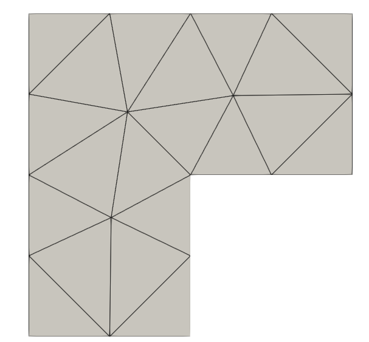
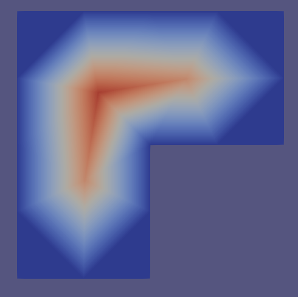
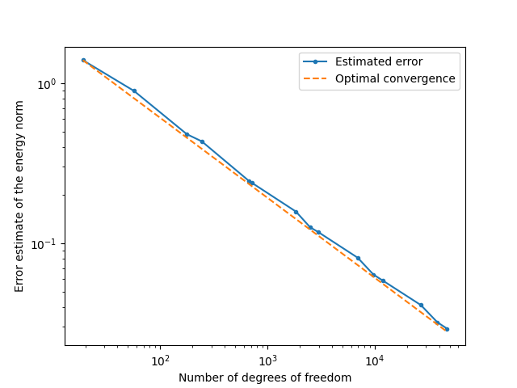

Adaptive Multigrid Methods using AdaptiveMeshHierarchy
======================================================

Contributed by Anurag Rao

The purpose of this demo is to show how to use Firedrake's multigrid solver on a hierarchy of adaptively refined Netgen meshes.
We will first have a look at how to use the :class:`.AdaptiveMeshHierarchy` to construct the mesh hierarchy with Netgen meshes, then we will consider a solution to the Poisson problem on an L-shaped domain.
Finally, we will show how to use the :class:`.AdaptiveMeshHierarchy` and :class:`.AdaptiveTransferManager` to construct a scalable solver. The :class:`.AdaptiveMeshHierarchy` contains information of the mesh hierarchy and the parent child relations between the meshes.
The :class:`.AdaptiveTransferManager` deals with the transfer operator logic across any given levels in the hierarchy.
We begin by importing the necessary libraries ::

   from firedrake import *
   from netgen.occ import *
   import numpy

Constructing the Mesh Hierarchy
-------------------------------
We first must construct the domain over which we will solve the problem. For a more comprehensive demo on how to use Open Cascade Technology (OCC) and Constructive Solid Geometry (CSG),
see `Netgen integration in Firedrake <netgen_mesh.py>`_. 
We begin with the L-shaped domain, which we build as the union of two rectangles: ::
  
   rect1 = WorkPlane(Axes((0,0,0), n=Z, h=X)).Rectangle(1,2).Face()
   rect2 = WorkPlane(Axes((0,1,0), n=Z, h=X)).Rectangle(2,1).Face()
   L = rect1 + rect2

   geo = OCCGeometry(L, dim=2)
   ngmsh = geo.GenerateMesh(maxh=0.5)
   mesh = Mesh(ngmsh)

It is important to convert the initial Netgen mesh into a Firedrake mesh before constructing the :class:`.AdaptiveMeshHierarchy`. To call the constructor to the hierarchy, we must pass the initial mesh. Our initial mesh looks like this:

We will also initialize the :class:`.AdaptiveTransferManager` here: ::
  
   amh = AdaptiveMeshHierarchy(mesh)
   atm = AdaptiveTransferManager()

Poisson Problem
---------------
Now we can define a simple Poisson problem

.. math::

   - \nabla^2 u = f \text{ in } \Omega, \quad u = 0 \text{ on } \partial \Omega.

Our approach strongly follows the similar problem in this `lecture course <https://github.com/pefarrell/icerm2024>`_. We define the function ``solve_poisson``. The first lines correspond to finding a solution in the CG1 space. The right-hand side is set to be the constant function equal to 1. Since we want Dirichlet boundary conditions, we construct the :class:`.DirichletBC` object and apply it to the entire boundary: ::

   def solve_poisson(mesh, params):
      V = FunctionSpace(mesh, "CG", 1)
      uh = Function(V, name="solution")
      v = TestFunction(V)
      bc = DirichletBC(V, 0, "on_boundary")
      f = Constant(1)
      F = inner(grad(uh), grad(v))*dx - inner(f, v)*dx

      problem = NonlinearVariationalProblem(F, uh, bc)
      solver = NonlinearVariationalSolver(problem, solver_parameters=params)
      solver.set_transfer_manager(atm)
      solver.solve()
      its = solver.snes.getLinearSolveIterations()
      return uh, its

Note the code after the construction of the :class:`.NonlinearVariationalProblem`. To use the :class:`.AdaptiveMeshHierarchy` with the existing Firedrake solver, we have to set the :class:`.AdaptiveTransferManager` as the transfer manager of the multigrid solver.
Since we are using linear Lagrange elements, we will employ Jacobi as the multigrid relaxation, which we define with ::

   solver_params = {
      "mat_type": "matfree",
      "ksp_type": "cg",
      "pc_type": "mg",
      "mg_levels": {
          "ksp_type": "chebyshev",
          "ksp_max_it": 1,
          "pc_type": "jacobi",
      },
      "mg_coarse": {
          "mat_type": "aij",
          "pc_type": "lu",
      },
   }

Alternatively for high-order CG elements, it is recommended to use patch relaxation
to achieve degree-independent multigrid convergence.
For more information
see :doc:`Using patch relaxation for multigrid <poisson_mg_patches.py>`. 
The initial solution is shown below.

Adaptive Mesh Refinement
------------------------
In this section we will discuss how to adaptively refine select elements and add the newly refined mesh into the :class:`.AdaptiveMeshHierarchy`.
For this problem, we will be using the Babuška-Rheinbolt a posteriori estimate for an element:

.. math::
   \eta_K^2 = h_K^2 \int_K \| f + \nabla^2 u_h \|^2 \mathrm{d}x + \frac{h_K}{2} \int_{\partial K \setminus \partial \Omega}  \nabla u_h \cdot n ^2 \mathrm{d}s,

where :math:`K` is the element, :math:`h_K` is the diameter of the element, :math:`n` is the normal, and :math:` \cdot ` is the jump operator. The a posteriori estimator is computed using the solution at the current level :math:`h`. Integrating over the domain and using the fact that the components of the estimator are piecewise constant on each cell, we can transform the above estimator into the variational problem 

.. math::
   \int_\Omega \eta_K^2 w \,\mathrm{d}x = \int_\Omega \sum_K h_K^2 \int_K (f + \text{div} (\text{grad} u_h) )^2 \,\mathrm{d}x w \,\mathrm{d}x + \int_\Omega \sum_K \frac{h_K}{2} \int_{\partial K \setminus \partial \Omega}  \nabla u_h \cdot n ^2 \,\mathrm{d}s w \,\mathrm{d}x

Our approach will be to compute the estimator over all elements and selectively choose to refine only those that contribute most to the error. To compute the error estimator, we use the function below to solve the variational formulation of the error estimator. Since our estimator is a constant per element, we use a DG0 function space.  ::

   def estimate_error(mesh, uh):
       Q = FunctionSpace(mesh, "DG", 0)
       eta_sq = Function(Q)
       p = TrialFunction(Q)
       q = TestFunction(Q)
       f = Constant(1)
       residual = f + div(grad(uh))

       # symbols for mesh quantities
       h = CellDiameter(mesh)
       n = FacetNormal(mesh)
       vol = CellVolume(mesh)
   
       # compute cellwise error estimator
       a = inner(p, q / vol) * dx
       L = (inner(residual**2, q * h**2) * dx
            + inner(jump(grad(uh), n)**2, avg(q * h)) * dS
       )

       sp = {"mat_type": "matfree", "ksp_type": "preonly", "pc_type": "jacobi"}
       solve(a == L, eta_sq, solver_parameters=sp)

       # compute eta from eta^2
       eta = Function(Q).interpolate(sqrt(eta_sq))

       # compute estimate for error in energy norm
       with eta.dat.vec_ro as eta_:  
           error_est = eta_.norm()
       return eta, error_est

The next step is to choose which elements to refine. For this we use a simplified variant of Dörfler marking :cite:`Dorfler1996`:

.. math::
   \eta_K \geq \theta \text{max}_L \eta_L

The logic is to select an element :math:`K` to refine if the estimator is greater than some factor :math:`\theta` of the maximum error estimate of the mesh, where :math:`\theta` ranges from 0 to 1. In our code we choose :math:`\theta=0.5`.
With these helper functions complete, we can solve the system iteratively. In the max_iterations is the number of total levels we want to perform multigrid on. We will solve for 15 levels. At every level :math:`l`, we first compute the solution using multigrid up to level :math:`l`. We then use the current approximation of the solution to estimate the error across the mesh. Finally, we adaptively refine the mesh and repeat. ::

   theta = 0.5
   refinements = 15
   est_errors = []
   sqrt_dofs = []
   mg_iterations = []
   for level in range(refinements):
      print(f"level {level}")

      mesh = amh[-1]
      uh, its = solve_poisson(mesh, solver_params)
      VTKFile(f"output/adaptive_loop_{level}.pvd").write(uh)

      (eta, error_est) = estimate_error(mesh, uh)
      VTKFile(f"output/eta_{level}.pvd").write(eta)

      est_errors.append(error_est)
      sqrt_dofs.append(uh.function_space().dim() ** 0.5)
      mg_iterations.append(its)

      print(f"  ||u - u_h|| <= C * {error_est}")
      if len(est_errors) > 1:
         rates = -numpy.diff(numpy.log(est_errors)) / numpy.diff(numpy.log(sqrt_dofs))
         print(f"  rate = {rates[-1]}")

      if i != refinements - 1:
         amh.adapt(eta, theta)

   from matplotlib import pyplot as plt

   dofs = numpy.array(sqrt_dofs) ** 2
   opt_errors = est_errors[0] * (sqrt_dofs[0] / numpy.array(sqrt_dofs))
   plt.loglog(dofs, est_errors, '-o', markersize = 3, label="Estimated error")
   plt.loglog(dofs, opt_errors, '--', markersize = 3, label="Optimal convergence")
   plt.ylabel("Error estimate of the energy norm")
   plt.xlabel("Number of degrees of freedom")
   plt.legend()
   plt.savefig("output/adaptive_convergence.png")

To perform Dörfler marking, refine the current mesh, and add the mesh to the :class:`.AdaptiveMeshHierarchy`, we use the ``amh.adapt(eta, theta)`` method. In this method the input is the recently computed error estimator ``eta`` and the Dörfler marking parameter ``theta``. The method always performs this on the current fine mesh in the hierarchy. There is another method for adding a mesh to the hierarchy: ``amh.add_mesh(mesh)``. In this method, refinement on the mesh is performed externally by some custom procedure and the resulting mesh directly gets added to the hierarchy.
The meshes now refine according to the error estimator. The error estimators at levels 3,5, and 15 are shown below. Zooming into the vertex of the L-shape at level 15 shows the error indicator remains strongest there. Further refinements will focus on that area.

+-------------------------------+-------------------------------+-------------------------------+
| .. figure:: eta_l3.png        | .. figure:: eta_l6.png        | .. figure:: eta_l15.png       |
|    :align: center             |    :align: center             |    :align: center             |
|    :height: 250px             |    :height: 250px             |    :height: 250px             |
|    :alt: Eta at level 3       |    :alt: Eta at level 6       |    :alt: Eta at level 15      |
|                               |                               |                               |
|    *Level 3*                  |    *Level 6*                  |    *Level 15*                 |
+-------------------------------+-------------------------------+-------------------------------+

The solutions at level 4 and 15 are shown below.

+------------------------------------+------------------------------------+
| .. figure:: solution_l4.png        | .. figure:: solution_l15.png       |
|    :align: center                  |    :align: center                  |
|    :height: 300px                  |    :height: 300px                  |
|    :alt: Solution, level 4         |    :alt: Solution, level 15        |
|                                    |                                    |
|    *MG solution at level 4*        |    *MG solution at level 15*       |
+------------------------------------+------------------------------------+

The convergence follows the expected optimal behavior:

Moreover, the multigrid iteration count is robust to the level of refinement ::

   print(" Level\t | Iterations")
   print("---------------------")
   for level, its in enumerate(mg_iterations):
       print(f"   {level}\t | {its}")

..

======== ================
 Level     Iterations
======== ================
  0	      2
  1	      12
  2	      13
  3	      13
  4	      13
  5	      13
  6	      13
  7	      14
  8	      15
  9	      15
  10	      15
  11	      15
  12	      16
  13	      16
  14	      16
======== ================

A runnable python version of this demo can be found :demo:`here<adaptive_multigrid.py>`.

.. rubric:: References

.. bibliography:: demo_references.bib
   :filter: docname in docnames
