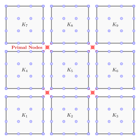

Cellwise Balancing Domain Decomposition by Constraints
======================================================

Contributed by `Pablo Brubeck <https://www.maths.ox.ac.uk/people/pablo.brubeckmartinez/>`_ and `Stefano Zampini <stefano.zampini@gmail.com>`_.

In this demo, we demonstrate how to configure and use Firedrake's Balancing Domain
Decomposition by Constraints (BDDC) preconditioners. BDDC is an 
advanced domain decomposition method suitable for massive parallelization of 
elliptic PDEs with great success for problems with
high anisotropy in the mesh or the coefficients.

Multielement subdomains in BDDC
-------------------------------

In standard substructuring and domain decomposition methods, a global mesh is 
partitioned into subdomains consisting of clusters of elements (typically via graph partitioners like METIS). 
Continuity across the subdomain edges/faces is removed and variationally enforced only at selected degrees of freedom (DOFs),
refered to as `primal`; for example, continuity can be enforced at the DOFs located at crossing points of the domain decomposition.

Applying the BDDC preconditioner involves solving three types of subproblems: 

* **Dirichlet subproblems** which solve for local interior degrees of freedom independently within each subdomain,

* **Neumann subproblems** which extend the Dirichlet subproblems by handling the local boundary/interface variables, and are constrained to have zero component on the primal dofs,

* a global **coarse subproblem** which globally couples primal degrees of freedom to preserve long-range communication and ensure scalability of the preconditioner.

To evaluate the Neumann operators, 
equations must not be coupled at the interface among subdomains beforehand, and the monolithic 
system matrix must not be assembled into a standard ``MatAIJ`` sparse format.
For BDDC to work on subdomains aligned with the parallel mesh partition, it is
mandatory to build the matrix using PETSc's native ``MatIS`` format by
specifying ``"mat_type": "is"`` in the solver parameters. By keeping the
operator explicitly in this form, each subdomain maintains a local unassembled matrix.  
The assembly is done implicitly through the local-to-global mapping index set (``IS``).

Algebraically, the ``MatIS`` format represents the global operator :math:`A_{\text{global}}`
as a sum of products involving the local subdomain matrices and the local-to-global maps:

.. math::
  A_{\text{global}} = \sum_{k=1}^{N_{\text{sub}}} \Pi_k^\top A_{\text{local}}^{(k)} \Pi_k

Where :math:`N_{\text{sub}}` is the number of subdomains, :math:`A_{\text{local}}^{(k)}` is the partially 
assembled local matrix for subdomain :math:`\Omega_k`, and :math:`\Pi_k` is the **local-to-global map** 
mapping global degrees of freedom to local ones.

Cellwise Subdomains in BDDC
---------------------------

When ``"bddc_cellwise": True`` is passed to Firedrake's BDDC configuration, the
decomposition layout shifts to an extreme limit: **every individual element in
the mesh becomes a subdomain**.

In this setting, ``BDDCPC`` constructs an internal ``MatIS`` matrix with the
cellwise subdomains from a rediscretisation using a ``BrokenElement``. So the
matrix type set in the solver parameters only defines the matrix used in the
residual update in the Krylov method and not the internal matrix in the
preconditioner.

Below is a schematic of a :math:`3 \times 3` quadrilateral mesh discretized
using cubic (:math:`Q_3`) Lagrange elements under a cellwise BDDC structure.
The degrees of freedom are decoupled along the shared edges, preserving strict
continuity exclusively at the shared primal vertices.

Problem Formulation
-------------------

We will solve the Poisson problem with Dirichlet boundary conditions:

.. math::
  -\nabla^2 u = f \quad \text{in } \Omega,

  u = 0 \quad \text{on } \partial \Omega.

where :math:`\Omega = [0, 1]^2` and :math:`f \in L^2(\Omega)` is the source term.
The weak problem statement is: find :math:`u \in V` such that

.. math::
  a(u, v) = L(v) \quad \forall v \in V,

where the bilinear form $a(\cdot, \cdot)$ and linear form $L(\cdot)$ are defined as:

.. math::
  a(u, v) = \int_{\Omega} \nabla u \cdot \nabla v \, \mathrm{d}x,

  L(v) = \int_{\Omega} f v \, \mathrm{d}x.

Setting up the problem and the solver
-------------------------------------

We wrap the problem definition and solver logic into a single reusable utility
function. We then run this problem across a sequence of progressively refined
meshes generated via a ``MeshHierarchy``, tracking how the condition number
behaves as the mesh is refined.

We begin by importing Firedrake and defining the problem as usual.  To
stress-test the solver, we prescribe a random :class:`~.Cofunction` as
right-hand side. ::

  from firedrake import *

  def run_poisson(mesh, params):
      # Build a standard high-order Lagrange space
      V = FunctionSpace(mesh, "CG", 5)

      # Define trial and test functions
      u = TrialFunction(V)
      v = TestFunction(V)

      # Bilinear and linear forms
      a = inner(grad(u), grad(v)) * dx

      rg = RandomGenerator(PCG64(seed=123456789))
      L = rg.uniform(V.dual(), -1, 1)

      # Boundary conditions
      bcs = DirichletBC(V, 0, "on_boundary")

      # Define an empty solution function
      uh = Function(V)

      # Instantiate and invoke the variational solver
      problem = LinearVariationalProblem(a, L, uh, bcs=bcs)
      solver = LinearVariationalSolver(problem, solver_parameters=params)
      solver.solve()

      # Gather execution metrics
      iterations = solver.snes.getLinearSolveIterations()
      evals = solver.snes.ksp.computeEigenvalues().real
      kappa = max(evals, key=abs) / min(evals, key=abs)

      return V.dim(), iterations, kappa

Below we specify the BDDC solver parameters with cellwise subdomains,
note that this option is only available with a matrix-free operator. By default
BDDC uses corner and edge-average primal dofs. In two dimensions, the latter
are useful if we have heterogeneous coefficients in the PDE. In this example,
we have a constant coefficient problem, and we thus disable edge averages. ::

  # Define the base direct solver configuration for the subproblems
  chol_params = {
      "pc_type": "cholesky",
      "pc_factor_mat_solver_type": "mumps",
  }

  # Solver parameters using firedrake.BDDCPC
  cellwise_bddc_params = {
      "mat_type": "matfree",
      "ksp_type": "cg",
      "ksp_norm_type": "natural",
      "ksp_converged_reason": None,
      "ksp_rtol": 1e-8,
      "ksp_atol": 0.0,

      # Enable tracking flags for condition numbers
      "ksp_view_eigenvalues": None,

      # Configure Firedrake's specialized BDDC Python Preconditioner
      "pc_type": "python",
      "pc_python_type": "firedrake.BDDCPC",
      "bddc_cellwise": True,

      # Subproblem solvers
      "bddc_pc_bddc_neumann": chol_params,
      "bddc_pc_bddc_dirichlet": chol_params,
      "bddc_pc_bddc_coarse": chol_params,
      
      # Use only corner primal dofs
      "bddc_pc_bddc_use_edges" : False,
  }

Next, we establish our mesh hierarchy loop and print out the performance metrics
at the end of the runtime::

  # --- Execution over a Mesh Hierarchy ---

  # Define a base square mesh
  base_mesh = UnitSquareMesh(4, 4)

  # Generate a hierarchy of 3 refinement levels
  n_levels = 3
  mh = MeshHierarchy(base_mesh, n_levels)

  results = []
  for level, mesh in enumerate(mh):
      dofs, iters, kappa = run_poisson(mesh, cellwise_bddc_params)
      results.append([level, dofs, iters, kappa])

  # Print a formatted table of performance statistics 
  header = ["Level", "DoFs", "Iterations", "Est. Condition Number (kappa)"]
  print(f"\n{header[0]:<7} | {header[1]:<8} | {header[2]:<10} | {header[3]}")
  print("-" * 65)
  for row in results:
      print(f"{row[0]:<7} | {row[1]:<8} | {row[2]:<10} | {row[3]:.4f}")

Expected Outputs
----------------

When executed, the script outputs a table showing the scaling behavior of the
BDDC preconditioner. BDDC typically yields condition number bounds that grow
quasi-optimally as :math:`\mathcal{O}(1 + \log^2(H/h))`, where :math:`H` is
the subdomain size and :math:`h` is the mesh size. For cellwise subdomains
the ratio :math:`H/h` is equal to one.

Below is an example of what the performance output looks like when executed:

======== ======== ============ =====================
  Level    DoFs    Iterations  Est. Condition Number
======== ======== ============ =====================
0         441        11           2.0226
1         1681       11           2.0944
2         6561       11           2.1077
3         25921      11           2.1099
======== ======== ============ =====================

A runnable python version of this demo can be found :demo:`here
<poisson_bddc.py>`.
