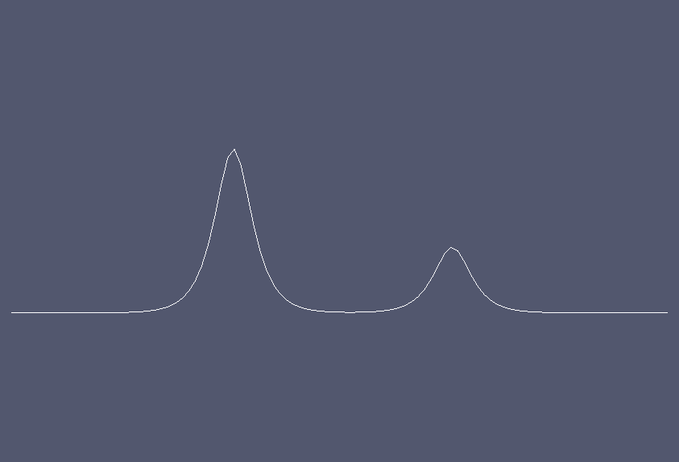
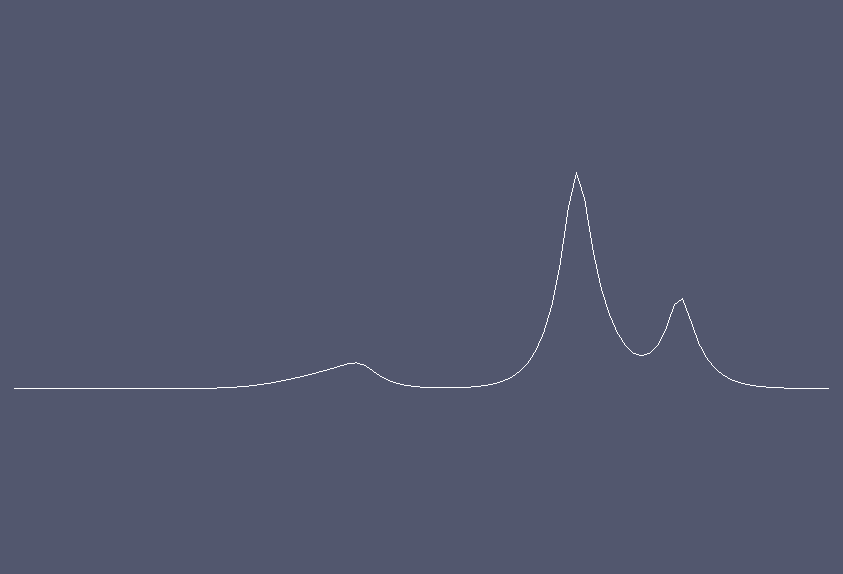
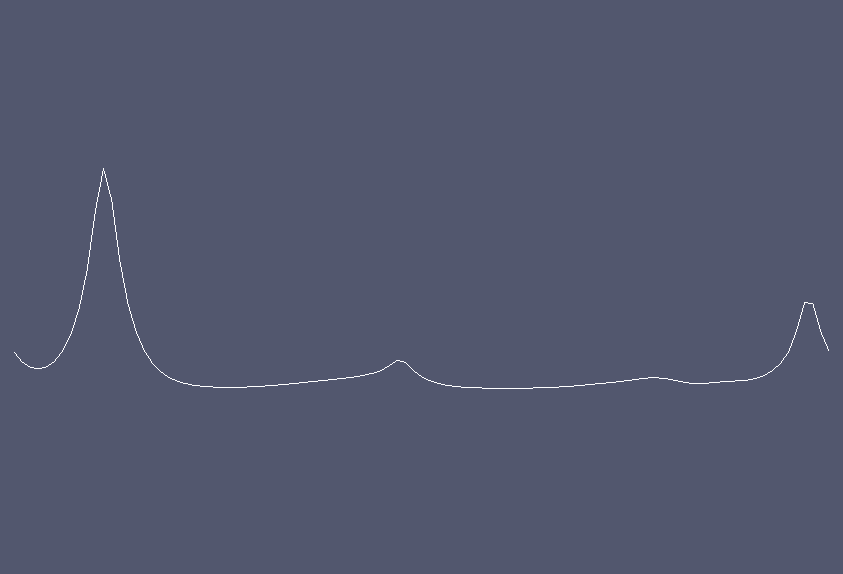

Camassa-Holm equation
=====================

.. rst-class:: emphasis

   This tutorial was contributed by `Colin Cotter
   <mailto:colin.cotter@imperial.ac.uk>`__.

The Camassa Holm equation :cite:`CH1993` is an integrable 1+1 PDE
which may be written in the form

.. math::
   m_t + mu_x + (mu)_x = 0, \quad u - \alpha^2u_{xx} = m,

solved in the interval :math:`[a,b]` either with periodic boundary
conditions or with boundary conditions `u(a)=u(b)=0`; :math:`\alpha>0`
is a constant that sets a lengthscale for the solution. The solution
is entirely composed of peaked solitons corresponding to Dirac delta
functions in :math:`m`. Further, the solution has a conserved energy,
given by

.. math::
   \int_a^b \frac{1}{2} u^2 + \frac{\alpha^2}{2} u_x^2\, \mathrm{d}x.

In this example we will concentrate on the periodic boundary
conditions case.

A weak form of these equations is given by

.. math::
   \int pm_t + pmu_x - p_xmu\, \mathrm{d}x=0, \quad \forall p,

   \int qu + \alpha^2q_xu_x - qm\, \mathrm{d}x=0, \quad \forall q.

Energy conservation then follows from substituting the second equation
into the first, and then setting :math:`p=u`,

.. math::
   \dot{E} &= \frac{\mathrm{d}}{\mathrm{d}t}\int_a^b \frac{1}{2}u^2 + \frac{\alpha^2}{2}u_x^2\, \mathrm{d}x \\
   &= \int_a^b uu_t + \alpha^2 u_xu_{xt}\, \mathrm{d}x, \\
   &= \int_a^b um_t\, \mathrm{d}x, \\
   &= \int_a^b -umu_x + u_xmu\, \mathrm{d}x = 0.

If we choose the same continuous finite element spaces for :math:`m` and :math:`u`
then this proof immediately extends to the spatial discretisation, as
noted by :cite:`Ma2010`. Further, it is a property of the implicit midpoint
rule time discretisation that any quadratic conserved quantities of an
ODE are also conserved by the time discretisation (see :cite:`Is2009`, for
example). Hence, the fully discrete scheme,

.. math::
   \int p(m^{n+1}-m^n) + \Delta t(pm^{n+1/2}u^{n+1/2}_x - p_xm^{n+1/2}u^{n+1/2})\,\mathrm{d}x=0, \quad \forall p\in V,

   \int qu^{n+1/2} + \alpha^2q_xu^{n+1/2}_x - qm^{n+1/2}\, \mathrm{d}x=0, \quad \forall q \in V,

where :math:`u^{n+1/2}=(u^{n+1}+u^n)/2`,
:math:`m^{n+1/2}=(m^{n+1}+m^n)/2`, conserves the energy exactly. This
is a useful property since the energy is the square of the :math:`H^1`
norm, which guarantees regularity of the numerical solution.

As usual, to implement this problem, we start by importing the
Firedrake namespace. ::

  from firedrake import *
  from firedrake.output import VTKFile

To visualise the output, we also need to import matplotlib.pyplot to display
the visual output ::

  try:
    import matplotlib.pyplot as plt
  except:
    warning("Matplotlib not imported")

We then set the parameters for the scheme. ::

  alpha = 1.0
  alphasq = Constant(alpha**2)
  dt = 0.1
  Dt = Constant(dt)

These are set with type :class:`~.Constant` so that the values can be
changed without needing to regenerate code.

We use a :func:`periodic mesh <.PeriodicIntervalMesh>` of width 40
with 100 cells, ::

  n = 100
  mesh = PeriodicIntervalMesh(n, 40.0)

and build a :class:`mixed function space <.MixedFunctionSpace>` for the
two variables. ::

  V = FunctionSpace(mesh, "CG", 1)
  W = MixedFunctionSpace((V, V))

We construct a :class:`~.Function` to store the two variables at time
level ``n``, and :attr:`~.Function.subfunctions` it so that we can
interpolate the initial condition into the two components. ::

  w0 = Function(W)
  m0, u0 = w0.subfunctions

Then we interpolate the initial condition,

.. math::

   u^0 = 0.2\text{sech}(x-403/15) + 0.5\text{sech}(x-203/15),

into u, ::

  x, = SpatialCoordinate(mesh)
  u0.interpolate(0.2*2/(exp(x-403./15.) + exp(-x+403./15.))
                 + 0.5*2/(exp(x-203./15.)+exp(-x+203./15.)))

before solving for the initial condition for ``m``. This is done by
setting up the linear problem and solving it (here we use a direct
solver since the problem is one dimensional). ::

  p = TestFunction(V)
  m = TrialFunction(V)

  am = p*m*dx
  Lm = (p*u0 + alphasq*p.dx(0)*u0.dx(0))*dx

  solve(am == Lm, m0, solver_parameters={
        'ksp_type': 'preonly',
        'pc_type': 'lu'
        }
     )

Next we build the weak form of the timestepping algorithm. This is expressed
as a mixed nonlinear problem, which must be written as a bilinear form
that is a function of the output :class:`~.Function` ``w1``. ::

  p, q = TestFunctions(W)

  w1 = Function(W)
  w1.assign(w0)
  m1, u1 = split(w1)
  m0, u0 = split(w0)

Note the use of :func:`split(w1) <ufl.split_functions.split>` here, which splits up a
:class:`~.Function` so that it may be inserted into a UFL
expression. ::

  mh = 0.5*(m1 + m0)
  uh = 0.5*(u1 + u0)

  L = (
  (q*u1 + alphasq*q.dx(0)*u1.dx(0) - q*m1)*dx +
  (p*(m1-m0) + Dt*(p*uh.dx(0)*mh -p.dx(0)*uh*mh))*dx
  )

Since we are in one dimension, we use a direct solver for the linear
system within the Newton algorithm. To do this, we assemble a monolithic
rather than blocked system. ::

  uprob = NonlinearVariationalProblem(L, w1)
  usolver = NonlinearVariationalSolver(uprob, solver_parameters=
     {'mat_type': 'aij',
      'ksp_type': 'preonly',
      'pc_type': 'lu'})

Next we use the other form of :attr:`~.Function.subfunctions`, ``w0.subfunctions``,
which is the way to split up a Function in order to access its data
e.g. for output. ::

  m0, u0 = w0.subfunctions
  m1, u1 = w1.subfunctions

We choose a final time, and initialise a :class:`~.VTKFile` object for
storing ``u``. as well as an array for storing the function to be visualised::

  T = 100.0
  ufile = VTKFile('u.pvd')
  t = 0.0
  ufile.write(u1, time=t)
  all_us = []

We also initialise a dump counter so we only dump every 10 timesteps. ::

  ndump = 10
  dumpn = 0

Now we enter the timeloop. ::

  while (t < T - 0.5*dt):
     t += dt

The energy can be computed and checked. ::

  #
     E = assemble((u0*u0 + alphasq*u0.dx(0)*u0.dx(0))*dx)
     print("t = ", t, "E = ", E)

To implement the timestepping algorithm, we just call the solver, and assign
``w1`` to ``w0``. ::

  #
     usolver.solve()
     w0.assign(w1)

Finally, we check if it is time to dump the data. The function will be appended
to the array of functions to be plotted later::

  #
     dumpn += 1
     if dumpn == ndump:
        dumpn -= ndump
        ufile.write(u1, time=t)
        all_us.append(Function(u1))

This solution leads to emergent peakons (peaked solitons); the left
peakon is travelling faster than the right peakon, so they collide and
momentum is transferred to the right peakon.

At last, we call the function :func:`plot <firedrake.pyplot.plot>` on the final
value to visualize it::

  try:
    from firedrake.pyplot import plot
    fig, axes = plt.subplots()
    plot(all_us[-1], axes=axes)
  except Exception as e:
    warning("Cannot plot figure. Error msg: '%s'" % e)

And finally show the figure::

  try:
    plt.show()
  except Exception as e:
    warning("Cannot show figure. Error msg: '%s'" % e)

Images of the solution at shown below.

   Solution at :math:`t = 0.`

   Solution at :math:`t = 2.5.`

   Solution at :math:`t = 5.3.`

A python script version of this demo can be found :demo:`here <camassaholm.py>`.

.. rubric:: References

.. bibliography:: demo_references.bib
   :filter: docname in docnames
