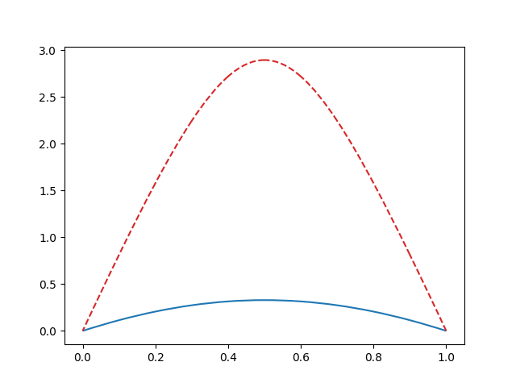

Deflation techniques for computing multiple solutions of nonlinear problems
===========================================================================

.. rst-class:: emphasis

    Nonlinear problems can have multiple solutions. Deflation is an approach
    for computing multiple solutions of nonlinear problems. In this demo we show how
    several solutions of the same nonlinear problem can be computed.

    The demo was contributed by `Patrick Farrell
    <mailto:patrick.farrell@maths.ox.ac.uk>`__.

Deflation :cite:`Farrell2015` is a numerical technique for computing multiple solutions of nonlinear problems.
Imagine we begin Newton's method from some initial guess :math:`u_0` and find a first solution :math:`u_1`. Under mild regularity
conditions we can then
*deflate* the solution :math:`u_1`, removing it from the nonlinear problem, while leaving all other solutions. We can then
initialise Newton's method from :math:`u_0` and, if it converges, find a second solution :math:`u_2`. This process can then be
repeated until no new solutions are found from the available initial guesses.

We demonstrate the use of deflation in Firedrake on the `Liouville–Bratu–Gelfand equation <https://en.wikipedia.org/wiki/Liouville%E2%80%93Bratu%E2%80%93Gelfand_equation>`_, a classical problem in numerical bifurcation analysis:

.. math::
    :name: eq:bratu

    \nabla^2 u + \lambda \exp{u} = 0 \text{ in } \Omega, \quad u = 0 \text{ on } \partial \Omega.

If :math:`\Omega = (0, 1)`, then for :math:`\lambda \in (0, \lambda^\star)` the equation has two solutions, for :math:`\lambda \in \{0, \lambda^\star\}` it has one solution, and for :math:`\lambda > \lambda^\star` it has no solutions. Here :math:`\lambda^\star \approx 3.51` is a constant with a known analytical expression. We will fix :math:`\lambda = 2` and prescribe :math:`6x(1-x)` as our initial guess.

We implement the usual weak formulation of the equation in Firedrake as standard: ::

    from firedrake import *
    mesh = UnitIntervalMesh(10)
    V = FunctionSpace(mesh, "CG", 3)
    x = SpatialCoordinate(mesh)[0]

    u = Function(V)
    guess = Function(V).interpolate(6*x*(1-x))
    v = TestFunction(V)

    # For this value of lambda we expect two solutions
    lmbda = Constant(2)

    F = - inner(grad(u), grad(v))*dx + lmbda*inner(exp(u), v)*dx
    bcs = DirichletBC(V, 0, "on_boundary")
    problem = NonlinearVariationalProblem(F, u, bcs)

Applying deflation requires two ingredients: the :class:`~.DeflatedSNES` nonlinear solver, and a :class:`~.Deflation` object. The :class:`~.Deflation` object records the solutions to be deflated, and specifies the sense of distance to use in deflation. In this example we use the metric induced by the :math:`L^2(\Omega)` inner product: ::

    sp = {"snes_type": "python",
          "snes_python_type": "firedrake.DeflatedSNES",
          "deflated_snes_type": "newtonls",
          "deflated_snes_monitor": None,
          "deflated_snes_linesearch_type": "basic",
          "deflated_ksp_type": "preonly",
          "deflated_pc_type": "lu"}

    deflation = Deflation(op=lambda x, y: inner(x-y, x-y)*dx)
    appctx = {"deflation": deflation}

    solver = NonlinearVariationalSolver(problem, solver_parameters=sp, appctx=appctx)

We now find the first solution: ::

    u.assign(guess)
    solver.solve()

The first solution has now been deflated automatically in the ``Deflation`` object. If we reset our initial guess and solve again, we find the second solution: ::

    u.assign(guess)
    solver.solve()

We can check that the two solutions are distinct: ::

    # Prints 'Norm of difference: 1.7514003250270025'
    (first, second) = deflation.roots
    print(f"Norm of difference: {norm(first - second)}")
    assert norm(first - second) > 1

We can plot the two solutions: ::

    import matplotlib.pyplot as plt
    ax = plt.gca()
    plot(first, linestyle='-', edgecolor='tab:blue', axes=ax)
    plot(second, linestyle='--', edgecolor='tab:red', axes=ax)
    plt.show()

This results in the plot below (the first in blue, the second in red):

:demo:`A Python script version of this demo can be found here
<deflation.py>`.

.. rubric:: References

.. bibliography:: demo_references.bib
   :filter: docname in docnames
