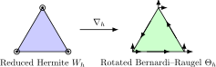

Discrete Kirchhoff Triangle
===========================

This demo solves the manufactured linear Kirchhoff plate problem using the
discrete Kirchhoff triangles from Bartels :cite:`Bartels:2015`. The method uses
the reduced cubic Hermite space for the deflection and the rotated
Bernardi--Raugel space for the discrete gradient.

Linear Kirchhoff Model
----------------------

On the unit square we seek a clamped displacement :math:`w` satisfying

.. math::

  \Delta^2 w = f \quad \text{in } \Omega, \qquad
  w = \partial_n w = 0 \quad \text{on } \partial\Omega.

The discrete Kirchhoff method avoids an :math:`H^2`-conforming space. Its
discrete problem is

.. math::

  (\nabla \nabla_h w_h, \nabla \nabla_h v_h) = (f, v_h),
  \qquad v_h \in W_{h,D},

where :math:`\nabla_h` maps the reduced cubic Hermite space :math:`W_h` into
the vector-valued rotated Bernardi--Raugel space :math:`\Theta_h`.

The discrete gradient agrees with the exact gradient at mesh vertices. On each
edge it preserves the tangential degree of freedom and determines the normal
trace by its endpoint values. Consequently, the broken Hessian
:math:`\nabla \nabla_h w_h` is the quantity controlled by the method.

Function Spaces
---------------

The reduced Hermite element has vertex values and vertex gradients as degrees
of freedom, with the cubic elementwise polynomial reduced by one constraint.
The rotated Bernardi--Raugel element is the vector :math:`P_1` space enriched
by tangential edge bubbles; its normal trace is linear on every edge.

The diagram shows the vertex value/gradient degrees of freedom in :math:`W_h`
and the vertex vectors plus tangential edge degrees of freedom in
:math:`\Theta_h`.

::

  from firedrake import *

  mesh = UnitSquareMesh(8, 8)
  W = FunctionSpace(mesh, "Reduced-Hermite", 3)
  Theta = FunctionSpace(mesh, "Rotated-Bernardi-Raugel", 1)

Discrete Gradient and Variational Problem
-----------------------------------------

Firedrake's symbolic ``interpolate`` represents the discrete gradient in the
form. This keeps the local interpolation operator visible to the form compiler
and avoids assembling a separate global gradient matrix.

::

  w = TrialFunction(W)
  v = TestFunction(W)
  discrete_gradient_w = interpolate(grad(w), Theta)
  discrete_gradient_v = interpolate(grad(v), Theta)

  a = inner(grad(discrete_gradient_w), grad(discrete_gradient_v)) * dx

For a manufactured solution we choose a smooth polynomial that satisfies the
clamped boundary conditions. Applying the biharmonic operator symbolically
provides a consistent right-hand side.

::

  x, y = SpatialCoordinate(mesh)
  w_exact = x**2 * (1 - x)**2 * y**2 * (1 - y)**2
  f = div(grad(div(grad(w_exact))))
  L = f * v * dx

  wh = Function(W)
  solve(a == L, wh, bcs=DirichletBC(W, 0, "on_boundary"),
        solver_parameters={"ksp_type": "preonly", "pc_type": "lu"})

Convergence Measurement
-----------------------

Theorem 8.2 predicts first-order convergence in the broken Hessian norm. We
measure exactly that quantity below and repeat the solve on a sequence of
uniform meshes.

::

  discrete_gradient_wh = interpolate(grad(wh), Theta)
  hessian_error = grad(discrete_gradient_wh) - grad(grad(w_exact))
  error = sqrt(assemble(inner(hessian_error, hessian_error) * dx(degree=12)))
  print(f"broken H2 error = {error:.3e}")

A python script version of this demo can be found :demo:`here <discrete_kirchhoff.py>`.

.. rubric:: References

.. bibliography:: demo_references.bib
   :filter: docname in docnames
