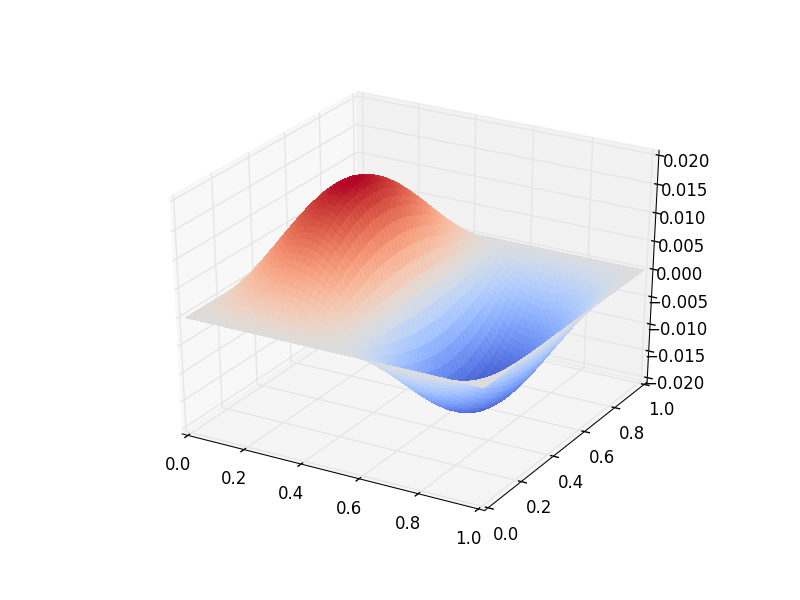

Oceanic Basin Modes: Quasi-Geostrophic approach
===============================================

.. rst-class:: emphasis

   This tutorial was contributed by Christine Kaufhold and `Francis
   Poulin <mailto:fpoulin@uwaterloo.ca>`__.

As a continuation of the Quasi-Geostrophic (QG) model described in the
other tutorial, we will now see how we can use Firedrake to compute
the spatial structure and frequencies of the freely evolving modes in this system,
what are referred to as basin modes.
Oceanic basin modes are low frequency structures that propagate
zonally in the oceans that alter the dynamics of Western Boundary Currents,
such as the Gulf Stream. In this particular tutorial we will show how to
solve the QG eigenvalue problem with no basic state and no dissipative
forces.
Unlike the other demo that integrated the equations forward in time, in this
problem it is necessary to compute the eigenvalues and eigenfunctions
for a particular differential operator. This requires using
`PETSc <http://www.mcs.anl.gov/petsc/>`__ matrices
and eigenvalue solvers in `SLEPc <http://slepc.upv.es>`__.

This demo requires SLEPc and slepc4py to be installed.  This is most easily
achieved by providing the optional `--slepc` flag to either `firedrake-install`
(for a new installation), or `firedrake-update` (to add SLEPc to an existing
installation).

Governing PDE
~~~~~~~~~~~~~

We first briefly recap the nonlinear, one-layer QG equation that we
:doc:`considered previously </demos/qg_1layer_wave.py>`.
The interested reader can find the
derivations in :cite:`QGeval-Pedlosky:1992` and :cite:`QGeval-Vallis:2006`.
This model consists of an evolution equation
for the Potential Vorticity, :math:`q`, and an elliptic problem through
which we can determine the streamfunction,

.. math::

   \partial_{t}q + \vec{\nabla}\cdot (\vec{u}q) + \beta v = 0 \\
   q = \nabla^{2} \psi - F\psi

Where :math:`\psi` is the stream-function, :math:`\vec{u}=(u, v)` is the
velocity field, :math:`q` is the Potential Vorticity (PV), :math:`\beta` is the
Coriolis parameter and :math:`F` is the rotational Froude number. The velocity
field is easily obtained using

.. math::

   \vec{u} = \vec{\nabla}^{\bot}\psi,
   \quad \mbox{ with } \quad
   \vec{\nabla}^{\bot} =  \hat{e_{z}} \times \vec{\nabla}

We assume that the amplitude of the wave motion is very small, which
allows us to linearize the equations of motion and therefore neglect the
nonlinear advection,

.. math:: \frac{\partial}{\partial t} (\nabla^{2} \psi - F\psi) = - \beta \frac{\partial \psi}{\partial x}

We look for wave-like solutions that are periodic in time, with a
frequency of :math:`\omega`

.. math:: \psi = \hat{\psi}(x, y)e^{-i\omega t}

This has the advantage of removing the time derivative from the equation
and replacing it with an eigenvalue, :math:`i \omega`. By substituting
the above solution into the QG equation, we can find a complex
eigenvalue problem of the form

.. math:: i\omega (\nabla^{2} \hat{\psi} - F\hat{\psi}) = \hat{\beta} \frac{\partial \hat{\psi}}{\partial x}

Weak Formulation
----------------

To use a finite element method it is necessary to formulate the weak
form and then we can use SLEPc in Firedrake to compute eigenvalue
problems easily.
To begin, we multiply this equation by a Test Function :math:`\phi`
and integrate over the domain :math:`A`.

.. math::

   i\omega \iint_{A} \Big(\phi\cdot\nabla^{2} \hat{\psi}\,dA - F\phi\hat{\psi}\,dA\Big) = \hat{\beta}\iint_{A} \phi \cdot \frac{\partial \hat{\psi}}{\partial x}\,dA

To remove the Laplacian operator we use integration by parts and the Divergence theorem to obtain

.. math::

   \iint_{A} \phi \cdot \nabla^{2}\hat{\psi} \,dA = - \iint_{A} \nabla\phi \cdot \nabla\hat{\psi}\,dA + \oint_{\partial A} \phi \cdot \frac{\partial \hat{\psi}}{\partial n} \,dS

No-normal flow boundary conditions are required and mathematically this
means that the streamfunction must be a constant on the boundary. Since
the test functions inherit these boundary conditions,
:math:`\hat{\phi} = 0` on the boundary, the boundary integral
vanishes and the weak form becomes,

.. math::

   i\omega \iint_{A} \Big( \nabla\phi\cdot\nabla \hat{\psi}\,dA + F\phi\hat{\psi}\Big)\,dA = \hat{\beta}\iint_{A} \phi \cdot \frac{\partial \hat{\psi}}{\partial x}\,dA

Firedrake code
--------------

Using this form, we can now implement this eigenvalue problem in
Firedrake. We import the Firedrake, PETSc, and SLEPc libraries. ::

   from firedrake import *
   from firedrake.petsc import PETSc
   try:
       from slepc4py import SLEPc
   except ImportError:
       import sys
       warning("Unable to import SLEPc, eigenvalue computation not possible (try firedrake-update --slepc)")
       sys.exit(0)

We specify the geometry to be a square geometry with :math:`50` cells
with length :math:`1`. ::

   Lx   = 1.
   Ly   = 1.
   n0   = 50
   mesh = RectangleMesh(n0, n0, Lx, Ly, reorder=None)

Next we define the function spaces within which our solution will
reside. ::

   Vcg  = FunctionSpace(mesh,'CG',3)

We impose zero Dirichlet boundary conditions, in a strong sense, which
guarantee that we have no-normal flow at the boundary walls. ::

   bc = DirichletBC(Vcg, 0.0, "on_boundary")

The two non-dimensional parameters are the :math:`\beta` parameter, set
by the sphericity of the Earth, and the Froude number, the relative
importance of rotation to stratification. ::

   beta = Constant('1.0')
   F    = Constant('1.0')

Additionally, we can create some Functions to store the eigenmodes. ::

   eigenmodes_real, eigenmodes_imag = Function(Vcg), Function(Vcg)

We define the Test Function :math:`\phi` and the Trial Function
:math:`\psi` in our function space. ::

   phi, psi = TestFunction(Vcg), TrialFunction(Vcg)

To build the weak formulation of our equation we need to build two PETSc
matrices in the form of a generalized eigenvalue problem,
:math:`A\psi = \lambda M\psi`. We impose the boundary conditions on the
mass matrix :math:`M`, since that is where we used integration by parts. ::

   a =  beta*phi*psi.dx(0)*dx
   m = -inner(grad(psi), grad(phi))*dx - F*psi*phi*dx
   petsc_a = assemble(a).M.handle
   petsc_m = assemble(m, bcs=bc).M.handle

We can declare how many eigenpairs, eigenfunctions and eigenvalues, we
want to find ::

   num_eigenvalues = 1

Next we will impose parameters onto our eigenvalue solver. The first is
specifying that we have an generalized eigenvalue problem that is
nonhermitian. The second specifies the spectral transform shift factor
to be non-zero. The third requires we use a Krylov-Schur method,
which is the default so this is not strictly necessary. Then, we ask for
the eigenvalues with the largest imaginary part. Finally, we specify the
tolerance. ::

   opts = PETSc.Options()
   opts.setValue("eps_gen_non_hermitian", None)
   opts.setValue("st_pc_factor_shift_type", "NONZERO")
   opts.setValue("eps_type", "krylovschur")
   opts.setValue("eps_largest_imaginary", None)
   opts.setValue("eps_tol", 1e-10)

Finally, we build our eigenvalue solver using SLEPc. We add our PETSc
matrices into the solver as operators and use setFromOptions() to call
the PETSc parameters we previously declared. ::

   es = SLEPc.EPS().create(comm=COMM_WORLD)
   es.setDimensions(num_eigenvalues)
   es.setOperators(petsc_a, petsc_m)
   es.setFromOptions()
   es.solve()

Additionally we can find the number of converged eigenvalues. ::

   nconv = es.getConverged()

We now get the real and imaginary parts of the eigenvalue and
eigenvector for the leading eigenpair (that with the largest in
magnitude imaginary part).  First we check if we actually managed to
converge any eigenvalues at all. ::

   if nconv == 0:
       import sys
       warning("Did not converge any eigenvalues")
       sys.exit(0)

If we did, we go ahead and extract them from the SLEPc eigenvalue
solver::

   vr, vi = petsc_a.getVecs()

   lam = es.getEigenpair(0, vr, vi)

and we gather the final eigenfunctions ::

   eigenmodes_real.vector()[:], eigenmodes_imag.vector()[:] = vr, vi

We can now list and show plots for the eigenvalues and eigenfunctions
that were found. ::

   print("Leading eigenvalue is:", lam)

   try:
       import matplotlib.pyplot as plt
       fig, axes = plt.subplots()
       colors = tripcolor(eigenmodes_real, axes=axes)
       fig.colorbar(colors)

       fig, axes = plt.subplots()
       colors = tripcolor(eigenmodes_imag, axes=axes)
       fig.colorbar(colors)
   except ImportError:
       warning("Matplotlib not available, not plotting eigemodes")

Below is a plot of the spatial structure of the real part of one of the eigenmodes computed above.

.. figure:: eigenmode_real.png
   :align: center

Below is a plot of the spatial structure of the imaginary part of one of the eigenmodes computed above.

This demo can be found as a Python script in :demo:`qgbasinmodes.py <qgbasinmodes.py>`.

.. rubric:: References

.. bibliography:: demo_references.bib
   :filter: docname in docnames
   :keyprefix: QGeval-
   :labelprefix: QGeval-
