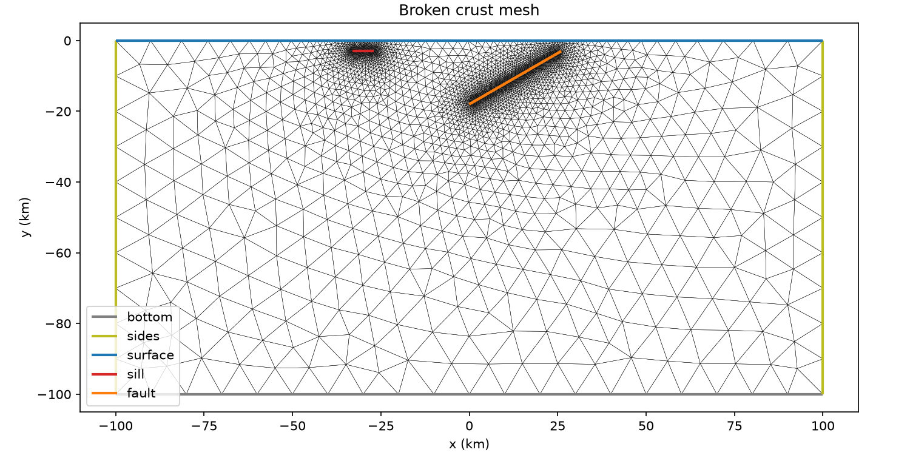
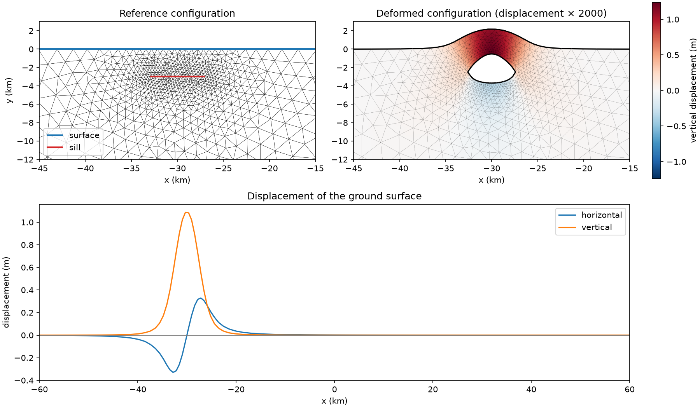
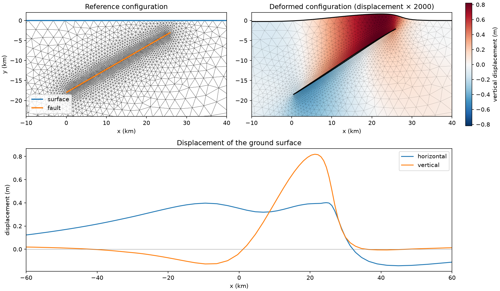

Crustal deformation from a magma sill and a blind thrust fault
==============================================================

Geodetic observations measure how the ground surface moves when magma
intrudes the crust or when a fault slips in an earthquake.  Stations of a
`Global Navigation Satellite System
<https://en.wikipedia.org/wiki/Satellite_navigation>`__ (GNSS), such as GPS,
record the displacement at a set of points.  `Interferometric Synthetic
Aperture Radar <https://en.wikipedia.org/wiki/Interferometric_synthetic-aperture_radar>`__
(InSAR) compares two satellite radar images of the same area, and it maps the
displacement over the whole area.
Elastic models relate these surface displacements to the source at depth.
This demo computes such displacements for two sources in a 2D (plane strain)
cross-section of the crust:

1. A magma sill, which is a horizontal crack that opens under the pressure of
   the magma inside it.  The faces of the sill carry a known traction, so a
   conforming displacement formulation is sufficient.
2. A blind thrust fault, which is buried and does not cut the ground surface.
   An earthquake on the fault causes a known slip, which is a jump in the
   displacement.  A Lagrange multiplier on the fault imposes this jump, and
   it gives the change of traction on the fault.

Both sources are cracks in the mesh.  The function :func:`~.BrokenMesh`
opens a labelled crack, so that a continuous Galerkin space on the opened
mesh can have a different value on each side of the crack.
The first part of this demo demonstrates :func:`~.BrokenMesh` for the inflating
magma sill.  The second demonstrates
:func:`~.BrokenMesh`--:func:`~.Submesh` coupling for the blind thrust fault.

The domain, the material, the boundary conditions and the fault geometry
follow `Step 5 of the 2D reverse fault example
<https://pylith.readthedocs.io/en/v5.0.2/user/examples/reverse-2d/step05-onefault.html>`__
in the PyLith manual :cite:`PyLithManual`.  PyLith imposes fault slip with
the same displacement and Lagrange multiplier formulation that we use in
the :func:`~.BrokenMesh`--:func:`~.Submesh` coupling :cite:`Aagaard2013`.
PyLith prescribes 2 m of uniform reverse slip on a fault that reaches the
ground surface.  Here the fault is buried, and the slip tapers to zero at its
tips.

Geometry and units
------------------

The domain is a cross-section of the crust that is 200 km wide and 100 km
deep, with the ground surface at :math:`y = 0`.  The Gmsh file
:demo:`crust.geo <crust.geo>` embeds the two cracks in the mesh and refines
the mesh near them.  The demo test generates the corresponding ``crust.msh``
file automatically.

Both cracks end inside the domain.  :func:`~.BrokenMesh` duplicates the
vertices in the interior of a crack, but not its two tips, so each crack is
closed at its tips.

Lengths are in km, displacements are in m, and elastic moduli are in GPa.
The strain has the unit m/km, which is :math:`10^{-3}`, so stresses and
tractions are in MPa.  In parallel, both cells that are incident to each crack
facet must be visible on the process that owns the facet.  Therefore the mesh
is distributed with a ``RIDGE`` overlap.

.. code-block:: python

   from firedrake import *

   dparams = {"overlap_type": (DistributedMeshOverlapType.RIDGE, 1)}
   mesh = Mesh("crust.msh", distribution_parameters=dparams)
   bottom_id, sides_id, surface_id, sill_id, fault_id = 1, 2, 3, 4, 5

To open a labelled crack, call :func:`~.BrokenMesh` with the mesh and its
facet label, for example ``BrokenMesh(mesh, sill_id)``.

The generated broken mesh is shown below.

The model
---------

The displacement :math:`u` satisfies the equations of linear elasticity

.. math::

   -\nabla\cdot\sigma(u) = 0 \quad\text{in } \Omega\setminus\Gamma,
   \qquad
   \sigma(u) = \lambda(\nabla\cdot u)I + 2\mu\,\varepsilon(u),
   \qquad
   \varepsilon(u) = \tfrac12(\nabla u + \nabla u^T),

where :math:`\Gamma` is the crack that is opened.  The elastic moduli come
from the density :math:`\rho = 2500\,\mathrm{kg/m^3}` and the seismic wave
speeds :math:`v_s = 3\,\mathrm{km/s}` and :math:`v_p = 5.29\,\mathrm{km/s}`
of the PyLith example.  As in PyLith, the sides and the bottom of the domain
are rollers: the normal component of the displacement is zero there, and the
tangential traction is zero.  The ground surface is free of traction.  These
conditions are the same for both problems.

.. code-block:: python

   mu = Constant(22.5)
   lambda_ = Constant(25.0)

   def epsilon(u):
       return sym(grad(u))

   def sigma(u):
       return lambda_ * div(u) * Identity(2) + 2 * mu * epsilon(u)

   def roller_bcs(V):
       return [
           DirichletBC(V.sub(0), 0, sides_id),
           DirichletBC(V.sub(1), 0, bottom_id),
       ]

An inflating magma sill using BrokenMesh
----------------------------------------

We open only the sill.  The thrust fault stays closed and has no effect in
this part.

.. code-block:: python

   sill_broken_mesh = BrokenMesh(mesh, sill_id)
   V = VectorFunctionSpace(sill_broken_mesh, "CG", 1)
   u = TrialFunction(V)
   v = TestFunction(V)

The magma pushes on the two faces of the sill with the overpressure
:math:`p = 5` MPa.  Each face is part of the boundary of
:math:`\Omega\setminus\Gamma`, with an outward normal :math:`n` that points
into the sill, and the traction on the face is :math:`\sigma n = -p\,n`.
This is a natural boundary condition of the conforming weak form: find
:math:`u \in V` such that

.. math::

   \int_{\Omega\setminus\Gamma} \sigma(u):\varepsilon(v)\,\mathrm{d}x
   = -\int_{\Gamma^+\cup\,\Gamma^-} p\,n\cdot v\,\mathrm{d}s
   \quad\text{for all } v \in V.

The faces :math:`\Gamma^\pm` are exterior facets of the broken mesh, and they
keep the label of the sill.  Therefore ``ds(sill_id)`` integrates over both
faces.

.. code-block:: python

   pressure = Constant(5.0)
   n = FacetNormal(sill_broken_mesh)
   a = inner(sigma(u), epsilon(v)) * dx
   L = -pressure * inner(n, v) * ds(sill_id)

The operator is symmetric and positive definite.  We solve it with the
conjugate gradient method and algebraic multigrid.  The rigid body modes give
GAMG a near null space, which is the null space of the operator without
boundary conditions.

.. code-block:: python

   x, y = SpatialCoordinate(sill_broken_mesh)
   rigid_body_modes = VectorSpaceBasis([
       Function(V).interpolate(as_vector([1, 0])),
       Function(V).interpolate(as_vector([0, 1])),
       Function(V).interpolate(as_vector([-y, x])),
   ])
   rigid_body_modes.orthonormalize()

   sill_displacement = Function(V, name="displacement")
   solve(
       a == L,
       sill_displacement,
       bcs=roller_bcs(V),
       near_nullspace=rigid_body_modes,
       solver_parameters={
           "ksp_type": "cg",
           "ksp_rtol": 1.0e-10,
           "pc_type": "gamg",
           "mg_levels_ksp_type": "chebyshev",
           "mg_levels_pc_type": "jacobi",
       },
   )

We plot the solution near the sill.

The magma opens the sill.  The sill lifts the ground above it by
approximately 1 m, and it pushes the ground outwards on both sides.

BrokenMesh--Submesh coupling: an earthquake on a blind thrust fault
--------------------------------------------------------------------

Now we open only the thrust fault :math:`\Gamma`, and we prescribe the slip
of an earthquake on it.  The displacement is in a space :math:`V` on the
broken mesh.  A Lagrange multiplier :math:`\lambda_\Gamma` imposes the slip.
The multiplier is defined only on the fault, so it is in a space :math:`M` on
a :func:`~.Submesh` of the parent mesh, which contains the fault facets.

The multiplier space must match the jumps of the functions in :math:`V`.
Such a jump is continuous and piecewise linear on :math:`\Gamma`, and it is
zero at the tips of the fault, which are not duplicated.  We take :math:`M`
to be the vector-valued continuous piecewise-linear functions on the fault
that are zero at its tips.  With this choice, the block that couples the
displacement and the multiplier is a square mass matrix, and the saddle point
problem is nonsingular.  If the multiplier had degrees of freedom at the
tips, no displacement would constrain them, and the system would be
singular.  A ``DirichletBC`` on the boundary of the fault submesh, which
consists of the two tips, removes these degrees of freedom.  PyLith
constrains the multiplier at the buried edges of a fault in the same way.

.. code-block:: python

   fault_broken_mesh = BrokenMesh(mesh, fault_id)
   fault_submesh = Submesh(mesh, mesh.topological_dimension - 1, fault_id)

   V = VectorFunctionSpace(fault_broken_mesh, "CG", 1)
   M = VectorFunctionSpace(fault_submesh, "CG", 1)
   Z = V * M
   u, multiplier = TrialFunctions(Z)
   v, eta = TestFunctions(Z)

   tip_bc = DirichletBC(Z.sub(1), 0, "on_boundary")

UFL chooses the ``'+'`` and ``'-'`` sides of each interior facet
independently, so the jump :math:`[u] = u^+ - u^-` changes its sign from one
fault facet to the next.  A continuous quantity on the fault must therefore
be paired with the jump in a frame that is attached to the fault.  We use the
rotation

.. math::

   R = \begin{pmatrix} (n^+)^T \\ (t^+)^T \end{pmatrix},
   \qquad t^+ = n^{+\perp},

where :math:`n^+` is the unit normal of the parent mesh and :math:`\perp`
turns a vector counterclockwise by 90°.  If the two sides are exchanged, both
:math:`[u]` and :math:`R` change sign.  Therefore :math:`R[u]`, which
contains the normal and the tangential jump, is independent of the side that
UFL chooses.  For this fault, a positive tangential jump means that the
hanging wall moves up the fault relative to the footwall.  This is reverse
slip.

.. code-block:: python

   n = FacetNormal(mesh)("+")
   R = as_tensor([n, perp(n)])

We prescribe no opening, and a reverse slip :math:`s` with an elliptical
profile along the fault:

.. math::

   R[u] = \begin{pmatrix} 0 \\ s \end{pmatrix},
   \qquad
   s = s_0\sqrt{1 - (\xi/a)^2}
   \quad\text{on } \Gamma,

where :math:`\xi` is the distance from the centre of the fault along the
fault, :math:`a = 15` km is the half-width of the fault, and
:math:`s_0 = 2` m.  The slip is zero at the tips of the fault, where the
displacement is continuous.

.. code-block:: python

   half_width = 15.0
   peak_slip = 2.0
   fault_centre = as_vector([7.5 * sqrt(3), -10.5])
   xi = sqrt(inner(SpatialCoordinate(mesh) - fault_centre, SpatialCoordinate(mesh) - fault_centre))
   slip = as_vector([0, peak_slip * sqrt(1 - (xi / half_width) ** 2)])

The saddle point problem is: find :math:`(u, \lambda_\Gamma) \in V\times M`
such that

.. math::

   \begin{aligned}
   \int_{\Omega\setminus\Gamma} \sigma(u):\varepsilon(v)\,\mathrm{d}x
   + \int_\Gamma \lambda_\Gamma\cdot R[v]\,\mathrm{d}s &= 0
   &&\text{for all } v \in V, \\
   \int_\Gamma R[u]\cdot\eta\,\mathrm{d}s
   &= \int_\Gamma \begin{pmatrix} 0 \\ s \end{pmatrix}\cdot\eta\,\mathrm{d}s
   &&\text{for all } \eta \in M.
   \end{aligned}

Integration by parts in the first equation gives
:math:`\lambda_\Gamma = -R\,\sigma(u)n^+`.  Thus the multiplier is the change
of traction on the fault that the earthquake causes, in the frame of the
fault.

The fault integrals couple three meshes.  The ``dS`` measure of the parent
mesh selects the fault facets.  Intersection with ``dx`` on the fault
submesh evaluates the multiplier, and intersection with ``dS`` on the broken
mesh evaluates the traces on both sides of the fault.  The slip profile is
not a polynomial, so we fix the quadrature degree of the fault integrals.

.. code-block:: python

   dS_fault = dS(
       domain=mesh,
       subdomain_id=fault_id,
       degree=4,
       intersect_measures=(dx(fault_submesh), dS(domain=fault_broken_mesh)),
   )

   a = (
       inner(sigma(u), epsilon(v)) * dx(fault_broken_mesh)
       + inner(multiplier, dot(R, jump(v))) * dS_fault
       + inner(dot(R, jump(u)), eta) * dS_fault
   )
   L = inner(slip, eta) * dS_fault
   bcs = [*roller_bcs(Z.sub(0)), tip_bc]

The saddle point system is indefinite.  This problem is small, so we solve it
with a sparse direct method.

.. code-block:: python

   solution = Function(Z)
   solve(
       a == L,
       solution,
       bcs=bcs,
       solver_parameters={
           "mat_type": "aij",
           "ksp_type": "preonly",
           "pc_type": "lu",
           "pc_factor_mat_solver_type": "mumps",
       },
   )
   fault_displacement, traction_change = solution.subfunctions

The jump of the discrete displacement is in :math:`M`, and the discrete
constraint holds for all test functions in :math:`M`.  Therefore
:math:`R[u]` is the :math:`L^2` projection of the prescribed jump onto
:math:`M`, and the residual of the constraint is zero up to rounding errors.

.. code-block:: python

   residual = assemble(inner(dot(R, jump(fault_displacement)) - slip, TestFunction(M)) * dS_fault)
   DirichletBC(M, 0, "on_boundary").zero(residual)
   with residual.dat.vec_ro as r:
       print(f"Constraint residual: {r.norm():.2e}")

The elliptical slip profile is the slip of a crack in an infinite elastic
solid on which the shear stress drops by the same amount everywhere.  The
stress drop is :math:`\Delta\tau = \mu s_0 / (2(1 - \nu)a)`, where
:math:`\nu` is the Poisson ratio.  In our model, the ground surface and the
boundaries of the domain change the traction a little, so we compare the
average of the shear component of the multiplier with this value.  The shear
component is negative, because the shear stress on the fault drops.  The
magnitude of its average is approximately 2 MPa, which is typical of
earthquakes, and it agrees with :math:`\Delta\tau`.

.. code-block:: python

   nu = lambda_ / (2 * (lambda_ + mu))
   stress_drop = float(mu * peak_slip / (2 * (1 - nu) * half_width))
   fault_length = assemble(Constant(1) * dx(fault_submesh))
   mean_shear = assemble(traction_change[1] * dx(fault_submesh)) / fault_length
   print(f"Stress drop: {-mean_shear:.2f} MPa (infinite solid: {stress_drop:.2f} MPa)")

The method of Nitsche is an alternative that imposes the jump without a
multiplier.  It adds consistency terms and a penalty term on :math:`\Gamma`
to the form, but it requires a penalty parameter that is large enough.

We plot the solution near the fault.

The vertical displacement jumps across the fault.  The earthquake lifts the
hanging wall and moves it towards the footwall, and the ground above the
footwall subsides a little.

Appendix: Plotting
------------------

GNSS stations and InSAR measure the displacement of the ground surface.  For
each example, we plot three views of the solution:

* the broken mesh near the source, in its reference configuration, with its
  facet labels.  The faces of the crack that is opened are exterior facets of
  the broken mesh, so :func:`~.pyplot.triplot` draws them with the colour of
  their label.
* the deformed broken mesh in the same window, coloured with the vertical
  displacement.  The displacement, which is in m, is converted to km and
  magnified for visualisation only.  :func:`~.pyplot.tripcolor` shows the
  jump of the vertical displacement across the crack, which is visible even
  where the crack keeps its shape.
* the horizontal and vertical displacements on the ground surface, between
  :math:`x = -60` km and :math:`x = 60` km.  A :func:`~.Submesh` extracts the
  ground surface from the broken mesh.

The following code generates the figures that are shown in the relevant
sections above.

.. code-block:: python

   import numpy as np
   import matplotlib.pyplot as plt
   from firedrake.pyplot import plot, triplot, tripcolor

   tag_names = {
       bottom_id: "bottom",
       sides_id: "sides",
       surface_id: "surface",
       sill_id: "sill",
       fault_id: "fault",
   }
   tag_colours = {
       bottom_id: "tab:gray",
       sides_id: "tab:olive",
       surface_id: "tab:blue",
       sill_id: "tab:red",
       fault_id: "tab:orange",
   }

   def plot_tags(broken_mesh, ax, window):
       """Plot a mesh, and colour and name the labels that are in the window."""
       x0, x1, y0, y1 = window
       collections = triplot(broken_mesh, axes=ax, interior_kw={"linewidths": 0.2})
       for collection in collections[1:]:
           tag = int(collection.get_label())
           collection.set_color(tag_colours[tag])
           collection.set_linewidth(2.0)
           points = np.reshape(collection.get_segments(), (-1, 2))
           inside = (
               (x0 <= points[:, 0]) & (points[:, 0] <= x1)
               & (y0 <= points[:, 1]) & (points[:, 1] <= y1)
           )
           collection.set_label(tag_names[tag] if inside.any() else "_nolegend_")
       ax.legend(loc="lower left")

   def deform(displacement, scale):
       """Return the deformed mesh and the vertical displacement on it."""
       broken_mesh = displacement.function_space().mesh()
       coordinates = Function(broken_mesh.coordinates.function_space())
       coordinates.interpolate(broken_mesh.coordinates + scale * displacement)
       deformed_mesh = Mesh(coordinates)
       # The deformed mesh has the same topology, so it can share the data.
       V = VectorFunctionSpace(deformed_mesh, "CG", 1)
       vertical = Function(FunctionSpace(deformed_mesh, "CG", 1))
       vertical.interpolate(Function(V, val=displacement.dat)[1])
       return deformed_mesh, vertical

   def plot_solution(displacement, window, filename, magnification=2000):
       """Plot the reference mesh, the deformed mesh and the surface displacement."""
       broken_mesh = displacement.function_space().mesh()
       fig, axes = plt.subplot_mosaic(
           [["reference", "deformed"], ["surface", "surface"]],
           figsize=(12, 7),
           layout="constrained",
       )

       plot_tags(broken_mesh, axes["reference"], window)
       axes["reference"].set_title("Reference configuration")

       deformed_mesh, vertical = deform(displacement, magnification * 1.0e-3)
       limit = np.abs(vertical.dat.data_ro).max()
       colours = tripcolor(vertical, axes=axes["deformed"], cmap="RdBu_r", vmin=-limit, vmax=limit)
       triplot(
           deformed_mesh,
           axes=axes["deformed"],
           interior_kw={"linewidths": 0.1, "alpha": 0.5},
           boundary_kw={"colors": ["black"] * len(tag_names)},
       )
       axes["deformed"].set_title(f"Deformed configuration (displacement × {magnification})")
       fig.colorbar(colours, ax=axes["deformed"], label="vertical displacement (m)")

       for name in ["reference", "deformed"]:
           axes[name].set_xlim(window[:2])
           axes[name].set_ylim(window[2:])
           axes[name].set_aspect("equal")
           axes[name].set_xlabel("x (km)")
       axes["reference"].set_ylabel("y (km)")

       surface_mesh = Submesh(broken_mesh, broken_mesh.topological_dimension - 1, surface_id)
       surface_space = VectorFunctionSpace(surface_mesh, "CG", 1)
       surface_displacement = Function(surface_space).interpolate(displacement)
       ax = axes["surface"]
       plot(surface_displacement.sub(0), axes=ax, label="horizontal")
       plot(surface_displacement.sub(1), axes=ax, label="vertical")
       ax.set_xlim(-60, 60)
       ax.axhline(0, color="gray", linewidth=0.5)
       ax.set_title("Displacement of the ground surface")
       ax.set_xlabel("x (km)")
       ax.set_ylabel("displacement (m)")
       ax.legend()
       fig.savefig(filename, dpi=150)

   geometry_mesh = BrokenMesh(mesh, (sill_id, fault_id))
   fig, ax = plt.subplots(figsize=(10, 5), layout="constrained")
   plot_tags(geometry_mesh, ax, (-100, 100, -100, 0))
   ax.set_aspect("equal")
   ax.set_xlabel("x (km)")
   ax.set_ylabel("y (km)")
   ax.set_title("Broken crust mesh")
   fig.savefig("fault_elasticity_geometry.png", dpi=150)

   plot_solution(sill_displacement, (-45, -15, -12, 3), "fault_elasticity_sill.png")
   plot_solution(fault_displacement, (-10, 40, -24, 2), "fault_elasticity_thrust.png")

A Python script version of this demo is available as
:demo:`fault_elasticity.py <fault_elasticity.py>`.

.. rubric:: References

.. bibliography:: demo_references.bib
   :filter: docname in docnames
