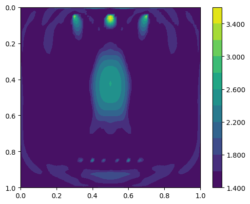
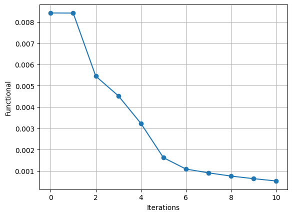

Full-waveform inversion with automated gradient and checkpointing
=================================================================

Full-waveform inversion (FWI) is a technique in general employed to
estimate the physical parameters in a subsurface region. It is
wave-equation-based seeking an optimal match between observed and
predicted data. The former is recorded by a set of receivers in a real
case. The latter consists of predicted data, which is obtained by
solving numerically a wave equation with a forcing term representing a
source of wave emission.

Cost function
-------------

FWI consists of a local optimisation, where the goal is to minimise the
misfit between observed and predicted seismogram data. Following
:cite:`Tarantola:1984`, the misfit function can be measured by the
:math:`L^2` norm, which can written as follows, in a continuous space:

.. math::

       J(u, u^{obs}) = \sum_{r=0}^{N-1} \int_\Omega \left(u(c,\mathbf{x},t)- u^{obs}(c, \mathbf{x},t)\right)^2 \delta(\mathbf{x} - \mathbf{x}_r) \, dx

where :math:`u = u(c, \mathbf{x},t)` and
:math:`u_{obs} = u_{obs}(c,\mathbf{x},t)`, are respectively the computed
and observed data, both recorded at a finite number of receivers
(:math:`N_r`), located at the point positions
:math:`\mathbf{x}_r \in \Omega`, in a time interval
:math:`\tau\equiv[t_0, t_f]\subset \mathbb{R}`, where :math:`t_0` is the
initial time and :math:`t_f` is the final time. The spatial domain of
interest is defined as :math:`\Omega`.

The predicted data is modeled here by an acoustic wave equation,

.. math::

       \frac{\partial^2 u}{\partial t^2}- c^2\frac{\partial^2 u}{\partial \mathbf{x}^2} = f(\mathbf{x}_s,t) \tag{2}

where :math:`c(\mathbf{x}):\Omega\rightarrow \mathbb{R}` is the pressure
wave velocity, which is assumed here a piecewise-constant and positive.
The external force term
:math:`f(\mathbf{x},t):\Omega\rightarrow \mathbb{R}`, models the source
of waves and is usually described by a `Ricker
Wavelet <https://wiki.seg.org/wiki/Dictionary:Ricker_wavelet>`__. The
acoustic wave equation should satisfy the initial conditions
:math:`u(\mathbf{x}, 0) = 0 = u_t(\mathbf{x}, 0) = 0`. We are employing
no-reflective absorbing boundary condition :cite:`Clayton:1977`:

.. math::  \frac{\partial u}{\partial t}- c\frac{\partial u}{\partial \mathbf{x}} = 0, \, \, \forall \mathbf{x} \, \in \partial \Omega 

To solve the wave equation, we consider the following weak form over the
domain :math:`\Omega`:

.. math::

       \int_{\Omega} \left(\frac{\partial^2 u}{\partial t^2}v + c^2\nabla u \cdot \nabla v\right) \, dx = \int_{\Omega} f v \, dx,

for an arbitrary test function :math:`v\in V`, where :math:`V` is a
function space. The weak form implementation in Firedrake is written as
follows.

.. code:: ipython3

    import finat
    import warnings
    warnings.filterwarnings("ignore")
    from firedrake import *
    
    def wave_equation_solver(c, source_function, dt, V):
        u = TrialFunction(V)
        v = TestFunction(V)
    
        u_np1 = Function(V) # timestep n+1
        u_n = Function(V) # timestep n
        u_nm1 = Function(V) # timestep n-1
    
        # Quadrature rule for lumped mass matrix.
        quad_rule = finat.quadrature.make_quadrature(V.finat_element.cell, V.ufl_element().degree(), "KMV")
        dudt2 =  (1 / (c * c)) * (u - 2.0 * u_n + u_nm1) / Constant(dt**2) * v * dx(scheme=quad_rule)
        nf =  (1 / c) * ((u_n - u_nm1) / dt) * v * ds
        a = dot(grad(u_n), grad(v)) * dx(scheme=quad_rule)
        F = dudt2 + a + nf - source_function * v * dx(scheme=quad_rule)
        lhs_ = lhs(F)
        rhs_ = rhs(F)
        lin_var = LinearVariationalProblem(lhs_, rhs_, u_np1)
        solver = LinearVariationalSolver(lin_var, solver_parameters={"mat_type": "matfree", "ksp_type": "preonly", "pc_type": "jacobi"})
        return solver, u_np1, u_n, u_nm1

The wave equation forcing :math:`f = f(\mathbf{x}_s, t)` represents a
time-dependent wave source locate at the position :math:`\mathbf{x}_s`,
and it is given by:

.. math::

       f(\mathbf{x}_s,t) = r(t) \delta(\mathbf{x} - \mathbf{x}_s)

where :math:`r(t)` is the `Ricker
wavelet <https://wiki.seg.org/wiki/Dictionary:Ricker_wavelet>`__, and
:math:`\delta(\mathbf{x} - \mathbf{x}_s)` is the Dirac delta function.

.. code:: ipython3

    from firedrake.__future__ import Interpolator
    
    def wave_source_term(mesh, delta_loc, V):
        vom_mesh = VertexOnlyMesh(mesh, delta_loc)
        vom_space = FunctionSpace(vom_mesh, "DG", 0)
        forcing_point = assemble(Constant(1.0)*TestFunction(vom_space)*dx)
        interp = Interpolator(TestFunction(V), vom_space)
        return interp, forcing_point

The implementation of `Ricker
wavelet <https://wiki.seg.org/wiki/Dictionary:Ricker_wavelet>`__ is
given by the following code:

.. code:: ipython3

    def ricker_wavelet(t, fs, amp=1000.0):
        ts = 1.5
        t0 = t - ts * np.sqrt(6.0) / (np.pi * fs)
        return (amp * (1.0 - (1.0 / 2.0) * (2.0 * np.pi * fs) * (2.0 * np.pi * fs) * t0 * t0)
                * np.exp(
                    (-1.0 / 4.0) * (2.0 * np.pi * fs) * (2.0 * np.pi * fs) * t0 * t0
                )
            )

In this example, we consider a two dimensional square domain with side
length 1.0 km. The wave sources and receivers are located on top and
bottom of the domain, respectively

We create a ``model`` dictionary containing the parameters necessary to
solve the wave equation. The ``model`` dictionary contains the basic
setup to execute the acoust wave equation, and the FWI.

.. code:: ipython3

    from firedrake.pyplot import tricontourf
    import matplotlib.pyplot as plt
    import numpy as np
    Lx, Lz = 1.0, 1.0
    num_receivers = 10
    num_sources = 3
    model = {
        "source_locations": np.linspace((0.3, 0.05), (0.7, 0.05), num_sources),
        "receiver_locations": np.linspace((0.2, 0.85), (0.8, 0.85), num_receivers),
        "mesh": UnitSquareMesh(80, 80),
        "dt": 0.002,  # time step
        "final_time": 1.0,  # final time
        "syntetic_receiver_data": None,  # The syntetic receiver data to be used in the inversion.
        "frequency_peak": 7.0,  # The dominant frequency of the source.
    }
    
    def plot_function(function, filename=None):
        # NBVAL_IGNORE_OUTPUT
        fig, axes = plt.subplots()
        contours = tricontourf(function, 10, axes=axes)
        fig.colorbar(contours, ax=axes, fraction=0.1, cmap="seismic", format="%.3f")
        plt.gca().invert_yaxis()
        axes.set_aspect("equal")
        if filename:
            plt.savefig(filename)
        

FWI seeks to estimate the pressure wave velocity based on the observed
data stored at the receivers. The observed data is subject to influences
of the subsurface medium while waves propagate from the source. In the
current example, we emulate these data by solving the wave equation with
a known pressure wave velocity model, i.e., a synthetic pressure wave
velocity referred to as the true velocity model (:math:`c_{true}`). For
the sake of simplicity, we consider :math:`c_{true}` consisting of a
circle in the centre of the domain, as shown in the coming code cell.

.. code:: ipython3

    V = FunctionSpace(model["mesh"], "KMV", 1)
    x, z = SpatialCoordinate(model["mesh"])
    c_true = Function(V).interpolate(2.5 + 1 * tanh(200 * (0.125 - sqrt((x - 0.5) ** 2 + (z - 0.5) ** 2))))
    plot_function(c_true, "c_true.png")

.. image:: c_true.png

We now get the synthetic data recorded on the receivers by executing the
acoustic wave equation.

.. code:: ipython3

    receiver_mesh =  VertexOnlyMesh(model["mesh"], model["receiver_locations"])
    P0DG = FunctionSpace(receiver_mesh, "DG", 0)
    num_sources = model["source_locations"].shape[0]
    source_function = Function(V)
    solver, u_np1, u_n, u_nm1 = wave_equation_solver(c_true, source_function, model["dt"], V)
    interpolator_receivers = Interpolator(u_np1, P0DG)
    u_sol_sources = []
    
    for sn in range(num_sources):
        print(f"Computing syntetic receiver data for source {sn+1} of {num_sources}")
        interpolator_sources, forcing_point = wave_source_term(model["mesh"], [model["source_locations"][sn]], V)
        u_sol_receivers = []
        for t in range(int(model["final_time"] / model["dt"]) + 1):
            forcing_point.dat.data_wo[:] = ricker_wavelet(t * model["dt"], model["frequency_peak"])
            source_function.assign(assemble(interpolator_sources.interpolate(forcing_point, transpose=True)).riesz_representation(riesz_map='l2'))
            solver.solve()
            u_nm1.assign(u_n)
            u_n.assign(u_np1)
            # Interpolate the solution at the receiver locations and store the result.
            # This data will be used in the inversion to compute the functional.
            u_sol_receivers.append(assemble(interpolator_receivers.interpolate()))
        u_sol_sources.append(u_sol_receivers)

.. parsed-literal::

    Computing syntetic receiver data for source 1 of 3
    Computing syntetic receiver data for source 2 of 3
    Computing syntetic receiver data for source 3 of 3

Next, we execute an FWI problem, which involves the following steps:

1. Set the initial guess for the parameter :math:`c`;

2. Solve the wave equation with the initial guess for the parameter
   :math:`c`;

3. Compute the functional :math:`J`;

4. Compute the gradient of the functional :math:`J` with respect to the
   parameter :math:`c`;

5. Update the parameter :math:`c` using a gradient-based optimization
   method;

6. Repeat steps 2-5 until the stopping criterion is satisfied.

The initial guess for the parameter :math:`c` is set as a constant field
with a value of 1.5 km/s.

.. code:: ipython3

    c_guess = Function(V).interpolate(1.5)
    plot_function(c_guess, "c_guess.png")

.. image:: c_initial.png

The function ``J`` computes the functional :math:`J` by solving the wave
equation using the guess pressure wave velocity ``c_guess``.

Checkpointing can be employed when setting ``checkpointing=True``.

.. code:: ipython3

    from checkpoint_schedules import Revolve
    from firedrake.adjoint import *
    
    def J(c_guess, true_receiver, source_location, checkpointing=False):
        continue_annotation()
        tape = get_working_tape()
        total_steps = int(model["final_time"] / model["dt"]) + 1
    
        if checkpointing:
            # Enable checkpointing using the revolve schedule.
            tape.enable_checkpointing(Revolve(total_steps, checkpoint_in_memory))
        V = FunctionSpace(model["mesh"], "KMV", 1)
        source_function = Function(V)
        solver, u_np1, u_n, u_nm1 = wave_equation_solver(c_guess, source_function, model["dt"], V)
        interpolator_sources, forcing_point = wave_source_term(model["mesh"], source_location, V)
        P0DG = FunctionSpace(receiver_mesh, "DG", 0)
        interpolator_receivers = Interpolator(u_np1, P0DG)
        J_val = 0.0
        for step in tape.timestepper(iter(range(total_steps))):
            forcing_point.dat.data_wo[:] = ricker_wavelet(model["dt"] * step, model["frequency_peak"])
            source_function.assign(assemble(interpolator_sources.interpolate(forcing_point, transpose=True)).riesz_representation(riesz_map='l2'))
            solver.solve()
            u_nm1.assign(u_n)
            u_n.assign(u_np1)
            guess_receiver = assemble(interpolator_receivers.interpolate())
            misfit = guess_receiver - true_receiver[step]
            J_val += 0.5 * assemble(inner(misfit, misfit) * dx)
        return J_val

Coming code cells show the execution of the FWI solver with automated
adjoint and checkpointing methods used to manage the memory usage.

Checkpointing approaches store only the state required to restart the
forward calculation from a limited set of steps. As the adjoint
calculation progresses, the forward computation is progressively rerun
from the latest available stored state up to the current adjoint step.
This enables less forward state to be stored, at the expense of a higher
computational cost as forward steps are run more than once.

FWI is computationally intensive in memory since computing adjoint
requires forward data storage, which is expensive in terms of memory for
more realistic computations. Therefore, checkpointing is required method
to handle the memory usage.

In the current example, we are employing the ``checkpointing``, storing
100 steps in memory.

.. code:: ipython3

    # Let us use the checkpointing in FWI!
    checkpointing = True
    # Let us choose how many steps we want to keep in memory.
    checkpoint_in_memory = 100

We now execute the ``fwi`` with the initial guess velocity model
``c_guess``. ``fwi`` returns the sum of functional associated to every
sources (``J_total``) and the adjoint-based gradient ``dJ_total``.
``J_total`` and ``dJ_total`` are required to update the parameter
``c_guess`` using the
`L-BFGS-B <https://epubs.siam.org/doi/10.1137/0916069>`__ method.

.. code:: ipython3

    from scipy.optimize import minimize as scipy_minimize
    
    
    def recompute_functional(reduced_functional):
        # Future backend implementations will have a recompute method. 
        # For now, we can use the following workaround.
        tape = reduced_functional.tape
        tape.reset_blocks()
        blocks = tape.get_blocks()
        with reduced_functional.marked_controls():
            if tape._checkpoint_manager:
                tape._checkpoint_manager.recompute(reduced_functional.functional)
            else:
                for i in tape._bar("Evaluating functional").iter(
                    range(len(blocks))
                ):
                    blocks[i].recompute()
        return reduced_functional.functional.block_variable.saved_output
    
    J_hat_sources =[]
    def run_fwi(c_guess_data):
        global checkpointing, iteration
        # This function needs to be improved.
        J_total = 0.0
        dJ_total = Function(V)
        num_sources = len(model["source_locations"])
        for sn in range(num_sources):
            if iteration == 0:
                c_guess = Function(V)
                c_guess.dat.data_wo[:] = c_guess_data
                Js = J(
                    c_guess, u_sol_sources[sn], [model["source_locations"][sn]],
                    checkpointing=checkpointing
                    )
                J_hat_sources.append(ReducedFunctional(Js, Control(c_guess)))
                set_working_tape(Tape())
            else:
                with stop_annotating():
                    J_hat_sources[sn].controls[0].update_numpy(c_guess_data, 0)
                    Js = recompute_functional(J_hat_sources[sn])
            with stop_annotating():
                J_total += Js
                dJ_total += J_hat_sources[sn].derivative()
        functional_history.append(J_total)
        iteration += 1
        return J_total, dJ_total.dat.data[:]
    
    functional_history = []
    iteration = 0
    # The bounds for the optimisation problem.
    bounds = [(1.5, 3.5)] * len(c_guess.dat.data)
    result_data = scipy_minimize(run_fwi, c_guess.dat.data[:], method='L-BFGS-B',
                                 jac=True, tol=1e-15, bounds=bounds,
                                 options={"disp": True, "eps": 1e-15,
                                          "gtol": 1e-15, "maxiter": 10})
    c_predicted = Function(V)
    c_predicted.dat.data[:] = result_data.x
    plot_function(c_predicted, "c_predicted.png")

.. parsed-literal::

    RUNNING THE L-BFGS-B CODE
    
               * * *
    
    Machine precision = 2.220D-16
     N =         6561     M =           10
    
    At X0      6561 variables are exactly at the bounds
    
    At iterate    0    f=  8.41974D-03    |proj g|=  5.59467D-04
    
    At iterate    1    f=  8.41387D-03    |proj g|=  5.58420D-04
    
    At iterate    2    f=  5.44952D-03    |proj g|=  1.70957D-04
    
    At iterate    3    f=  4.52806D-03    |proj g|=  8.86311D-05
    
    At iterate    4    f=  3.23313D-03    |proj g|=  3.05439D-05
    
    At iterate    5    f=  1.62177D-03    |proj g|=  2.75074D-05
    
    At iterate    6    f=  1.08476D-03    |proj g|=  2.12412D-05
    
    At iterate    7    f=  9.06440D-04    |proj g|=  2.67692D-05
    
    At iterate    8    f=  7.54850D-04    |proj g|=  1.39000D-05
    
    At iterate    9    f=  6.32525D-04    |proj g|=  1.22143D-05
    
    At iterate   10    f=  5.25063D-04    |proj g|=  1.26051D-05
    
               * * *
    
    Tit   = total number of iterations
    Tnf   = total number of function evaluations
    Tnint = total number of segments explored during Cauchy searches
    Skip  = number of BFGS updates skipped
    Nact  = number of active bounds at final generalized Cauchy point
    Projg = norm of the final projected gradient
    F     = final function value
    
               * * *
    
       N    Tit     Tnf  Tnint  Skip  Nact     Projg        F
     6561     10     11   1763     0  3220   1.261D-05   5.251D-04
      F =   5.2506309235864925E-004
    
    STOP: TOTAL NO. of ITERATIONS REACHED LIMIT                 

Below we have the functional values with respect to the number of
iterations.

.. code:: ipython3

    plt.plot(range(len(functional_history)), functional_history, "o-")
    plt.xlabel("Iterations")
    plt.ylabel("Functional")
    plt.grid()
    plt.show()

We are using only ten iterations. You can change the number of
iterations. You just need to change the ``max_iter`` in
``scipy minimize`` method.

.. rubric:: References

.. bibliography:: demo_references.bib
   :filter: docname in docnames
