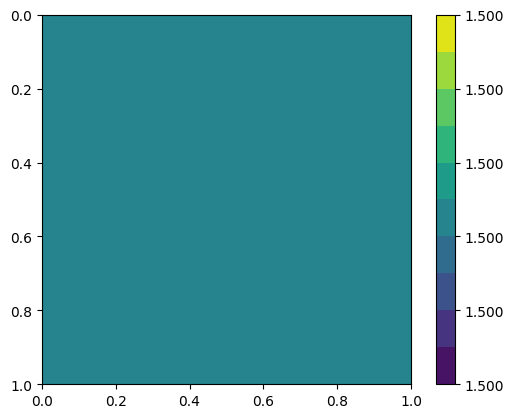

Full-waveform inversion with automated gradient and checkpointing
=================================================================

Full-waveform inversion (FWI) is a technique in general employed to
estimate the physical parameters in a subsurface region. It is
wave-equation-based seeking an optimal match between observed and
predicted data. The former is recorded by a set of receivers in a real
case. The latter consists of predicted data, which is obtained by
solving numerically a wave equation with a forcing term representing a
source of wave emission.

Cost function
-------------

FWI consists of a local optimisation, where the goal is to minimise the
misfit between observed and predicted seismogram data. Following
Tarantola (1984) [1], the misfit function can be measured by the
:math:`L^2` norm, which can written as follows, in a continuous space:

.. math::

       J(u, u^{obs}) = \sum_{r=0}^{N-1} \int_\Omega \left(u(c,\mathbf{x},t)- u^{obs}(c, \mathbf{x},t)\right)^2 \delta(\mathbf{x} - \mathbf{x}_r) \, dx

where :math:`u = u(c, \mathbf{x},t)` and
:math:`u_{obs} = u_{obs}(c,\mathbf{x},t)`, are respectively the computed
and observed data, both recorded at a finite number of receivers
(:math:`N_r`), located at the point positions
:math:`\mathbf{x}_r \in \Omega`, in a time interval
:math:`\tau\equiv[t_0, t_f]\subset \mathbb{R}`, where :math:`t_0` is the
initial time and :math:`t_f` is the final time. The spatial domain of
interest is defined as :math:`\Omega`.

The predicted data is modeled here by an acoustic wave equation,

.. math::

       \frac{\partial^2 u}{\partial t^2}- c^2\frac{\partial^2 u}{\partial \mathbf{x}^2} = f(\mathbf{x}_s,t) \tag{2}

where :math:`c(\mathbf{x}):\Omega\rightarrow \mathbb{R}` is the pressure
wave velocity, which is assumed here a piecewise-constant and positive.
The external force term
:math:`f(\mathbf{x},t):\Omega\rightarrow \mathbb{R}`, models the source
of waves and is usually described by a `Ricker
Wavelet <https://wiki.seg.org/wiki/Dictionary:Ricker_wavelet>`__. The
acoustic wave equation should satisfy the initial conditions
:math:`u(\mathbf{x}, 0) = 0 = u_t(\mathbf{x}, 0) = 0`. We are employing
no-reflective absorbing boundary condition [2]:

.. math::  \frac{\partial u}{\partial t}- c\frac{\partial u}{\partial \mathbf{x}} = 0, \, \, \forall \mathbf{x} \, \in \partial \Omega 

To solve the wave equation, we consider the following weak form over the
domain :math:`\Omega`:

.. math::

       \int_{\Omega} \left(\frac{\partial^2 u}{\partial t^2}v + c^2\nabla u \cdot \nabla v\right) \, dx = \int_{\Omega} f v \, dx,

for an arbitrary test function :math:`v\in V`, where :math:`V` is a
function space. The weak form implementation in Firedrake is written as
follows.

.. code:: ipython3

    import finat
    import warnings
    warnings.filterwarnings("ignore")
    from firedrake import *
    
    def wave_equation_solver(c, source_function, dt, V):
        """Solve the acoustic wave equation in 2D.
    
        Parameters
        ----------
        c : firedrake.Function
            The pressure wave velocity
        source_function : firedrake.Function
            A function modelling the source wave.
        dt : float
            The time step.
        V : firedrake.FunctionSpace
            The function space where the solution lives.
    
        Returns
        -------
        firedrake.LinearVariationalSolver, firedrake.Function, firedrake.Function, firedrake.Function
            Return the linear variational solver and the functions for the solution at time `n+1`, `n` and `n-1`.
            These outputs are going to be used in a time loop.
        
        Notes
        -----
        Additional details about this wave equation solver, including the discretisation and the
        linear variational problem, please refer this 
        `documentation link <https://www.firedrakeproject.org/demos/higher_order_mass_lumping.py.html>`_.
        """
        u = TrialFunction(V)
        v = TestFunction(V)
    
        u_np1 = Function(V) # timestep n+1
        u_n = Function(V) # timestep n
        u_nm1 = Function(V) # timestep n-1
    
        # quadrature rule for lumped mass matrix
        quad_rule = finat.quadrature.make_quadrature(V.finat_element.cell, V.ufl_element().degree(), "KMV")
        dudt2 =  (1 / (c * c)) * (u - 2.0 * u_n + u_nm1) / Constant(dt**2) * v * dx(scheme=quad_rule)
        nf =  (1 / c) * ((u_n - u_nm1) / dt) * v * ds
        a = dot(grad(u_n), grad(v)) * dx(scheme=quad_rule)
        F = dudt2 + a + nf - source_function * v * dx(scheme=quad_rule)
        lhs_ = lhs(F)
        rhs_ = rhs(F)
        lin_var = LinearVariationalProblem(lhs_, rhs_, u_np1)
        solver = LinearVariationalSolver(lin_var, solver_parameters={"mat_type": "matfree", "ksp_type": "preonly", "pc_type": "jacobi"})
        return solver, u_np1, u_n, u_nm1

The wave equation forcing :math:`f = f(\mathbf{x}_s, t)` represents a
time-dependent wave source locate at the position :math:`\mathbf{x}_s`,
and it is given by:

.. math::

       f(\mathbf{x}_s,t) = r(t) \delta(\mathbf{x} - \mathbf{x}_s)

where :math:`r(t)` is the `Ricker
wavelet <https://wiki.seg.org/wiki/Dictionary:Ricker_wavelet>`__, and
:math:`\delta(\mathbf{x} - \mathbf{x}_s)` is the Dirac delta function.

.. code:: ipython3

    import numpy as np
    from firedrake.__future__ import Interpolator
    
    def forcing(parent_mesh, delta_loc, V):
        """Build a forcing term for the wave equation.
    
        Parameters
        ----------
        parent_mesh : firedrake.Mesh
            The mesh where the forcing term is defined.
        delta_loc : tuple
            The location of the forcing term.
        V : firedrake.FunctionSpace
            The function space where the forcing term lives.
    
        Returns
        -------
        firedrake.Interpolator, firedrake.Function
            Return the interpolator and the source wave function.
    
        Notes
        -----
        Additional details :func:`~.VertexOnlyMesh` as feature for pointing evaluation are found in the Firedrake documentation.
        """
        vom_mesh = VertexOnlyMesh(parent_mesh, delta_loc)
        vom_space = FunctionSpace(vom_mesh, "DG", 0)
        forcing_point = assemble(Constant(1.0)*TestFunction(vom_space)*dx)
        interp = Interpolator(TestFunction(V), vom_space)
        return interp, forcing_point

The implementation of `Ricker
wavelet <https://wiki.seg.org/wiki/Dictionary:Ricker_wavelet>`__ is
given by the following code:

.. code:: ipython3

    def ricker_wavelet(t, fs, amp=1000.0):
        """Ricker wavelet.
    
        Parameters
        ----------
        t : float
            Time.
        fs : float
            Frequency peak of the wavelet.
        amp : float, optional
            Amplitude of the wavelet.
    
        Returns
        -------
        float
            The value of the wavelet at time `t`.
        """
        ts = 1.5
        t0 = t - ts * np.sqrt(6.0) / (np.pi * fs)
        return (amp * (1.0 - (1.0 / 2.0) * (2.0 * np.pi * fs) * (2.0 * np.pi * fs) * t0 * t0)
                * np.exp(
                    (-1.0 / 4.0) * (2.0 * np.pi * fs) * (2.0 * np.pi * fs) * t0 * t0
                )
            )

In this example, we consider a two dimensional square domain with side
length 1.0 km. The wave sources and receivers are located on top and
bottom of the domain, respectively

We create a ``model`` dictionary containing the parameters necessary to
solve the wave equation. The ``model`` dictionary contains the basic
setup to execute the acoust wave equation, and the FWI.

.. code:: ipython3

    %matplotlib inline
    from firedrake.pyplot import tricontourf
    import matplotlib.pyplot as plt
    Lx, Lz = 1.0, 1.0
    num_receivers = 10
    num_sources = 3
    model = {
        "source_locations": np.linspace((0.3, 0.15), (0.7, 0.15), num_sources),
        "receiver_locations": np.linspace((0.2, 0.8), (0.8, 0.8), num_receivers),
        "mesh": UnitSquareMesh(80, 80),
        "dt": 0.002,  # time step
        "final_time": 1.0,  # final time
        "syntetic_receiver_data": None,  # The syntetic receiver data to be used in the inversion.
        "frequency_peak": 7.0,  # The dominant frequency of the source.
    }
    
    def plot_function(function, filename=None):
        # NBVAL_IGNORE_OUTPUT
        fig, axes = plt.subplots()
        contours = tricontourf(function, 10, axes=axes)
        fig.colorbar(contours, ax=axes, fraction=0.1, cmap="seismic", format="%.3f")
        plt.gca().invert_yaxis()
        axes.set_aspect("equal")
        if filename:
            plt.savefig(filename)
        

A synthetic pressure wave velocity is used here to emulate a true
pressure velocity model, :math:`c_{true}`. For the sake of simplicity,
we consider :math:`c_{true}` consisting of a circle in the center of the
domain as shown in the next code cell.

.. code:: ipython3

    V = FunctionSpace(model["mesh"], "KMV", 1)
    x, z = SpatialCoordinate(model["mesh"])
    c_true = Function(V).interpolate(2.5 + 1 * tanh(200 * (0.125 - sqrt((x - 0.5) ** 2 + (z - 0.5) ** 2))))
    plot_function(c_true, "c_true.png")

.. image:: 13-full-waveform-inversion_10_0.png

We now get the synthetic data recorded on the receivers by executing the
acoustic wave equation.

.. code:: ipython3

    receiver_mesh =  VertexOnlyMesh(model["mesh"], model["receiver_locations"])
    P0DG = FunctionSpace(receiver_mesh, "DG", 0)
    num_sources = model["source_locations"].shape[0]
    source_function = Function(V)
    solver, u_np1, u_n, u_nm1 = wave_equation_solver(c_true, source_function, model["dt"], V)
    interpolator_receivers = Interpolator(u_np1, P0DG)
    u_sol_sources = []
    
    for sn in range(num_sources):
        print(f"Computing syntetic receiver data for source {sn+1} of {num_sources}")
        interpolator_sources, forcing_point = forcing(model["mesh"], [model["source_locations"][sn]], V)
        u_sol_receivers = []
        for t in range(int(model["final_time"] / model["dt"]) + 1):
            forcing_point.dat.data_wo[:] = ricker_wavelet(t * model["dt"], model["frequency_peak"])
            source_function.assign(assemble(interpolator_sources.interpolate(forcing_point, transpose=True)).riesz_representation(riesz_map='l2'))
            solver.solve()
            u_nm1.assign(u_n)
            u_n.assign(u_np1)
    
            # Interpolate the solution at the receiver locations and store the result.
            # This data will be used in the inversion to compute the functional.
            u_sol_receivers.append(assemble(interpolator_receivers.interpolate()))
        u_sol_sources.append(u_sol_receivers)

.. parsed-literal::

    Computing syntetic receiver data for source 1 of 3
    Computing syntetic receiver data for source 2 of 3
    Computing syntetic receiver data for source 3 of 3

Next, we execute an FWI problem, which involves the following steps: 1.
Set the initial guess for the parameter :math:`c`; 2. Solve the wave
equation with the initial guess for the parameter :math:`c`; 3. Compute
the functional :math:`J`; 4. Compute the gradient of the functional
:math:`J` with respect to the parameter :math:`c`; 5. Update the
parameter :math:`c` using a gradient-based optimization method; 6.
Repeat steps 2-5 until the stopping criterion is satisfied.

The initial guess for the parameter :math:`c` is set as a constant field
with a value of 1.5 km/s.

.. code:: ipython3

    c_guess = Function(V).assign(1.5)
    plot_function(c_guess, "c_guess.png")

The function ``J`` computes the functional :math:`J` by solving the wave
equation using the guess pressure wave velocity ``c_guess``.

Checkpointing can be employed when setting ``checkpointing=True``.

.. code:: ipython3

    from checkpoint_schedules import Revolve
    from firedrake.adjoint import *
    
    def J(c_guess, true_receiver, source_location, checkpointing=False):
        """Functional to be minimised.
    
        Parameters
        ----------
        c_guess : firedrake.Function
            The guess of the wave velocity.
        true_receiver : list
            The true receiver data.
        source_location : list
            The source location.
        checkpointing : bool, optional
            If True, enable checkpointing.
    
        Returns
        -------
        float, numpy.ndarray
            The value of the functional and the gradient of the functional with
            respect to the wave velocity `c_guess`.
        """
        continue_annotation()
        tape = get_working_tape()
        total_steps = int(model["final_time"] / model["dt"]) + 1
    
        if checkpointing:
            # Enable checkpointing using the revolve schedule.
            tape.enable_checkpointing(Revolve(total_steps, checkpoint_in_memory))
        V = FunctionSpace(model["mesh"], "KMV", 1)
        source_function = Function(V)
        solver, u_np1, u_n, u_nm1 = wave_equation_solver(c_guess, source_function, model["dt"], V)
        interpolator_sources, forcing_point = forcing(model["mesh"], source_location, V)
        P0DG = FunctionSpace(receiver_mesh, "DG", 0)
        interpolator_receivers = Interpolator(u_np1, P0DG)
        J_val = 0.0
        for step in tape.timestepper(iter(range(total_steps))):
            forcing_point.dat.data_wo[:] = ricker_wavelet(model["dt"] * step, model["frequency_peak"])
            source_function.assign(assemble(interpolator_sources.interpolate(forcing_point, transpose=True)).riesz_representation(riesz_map='l2'))
            solver.solve()
            u_nm1.assign(u_n)
            u_n.assign(u_np1)
            guess_receiver = assemble(interpolator_receivers.interpolate())
            misfit = guess_receiver - true_receiver[step]
            J_val += 0.5 * assemble(inner(misfit, misfit) * dx)
        return J_val

Coming code cells show the execution of the FWI solver with automated
adjoint and checkpointing. The input for ``fwi`` is the initial guess
``c_guess``. ``fwi`` returns the function ``J_total`` and the
adjoint-based gradient ``dJ_total`` for the optimisation process. The
optimisation method employed here is the
`L-BFGS-B <https://epubs.siam.org/doi/10.1137/0916069>`__ method.

So, let us execute an FWI with automated adjoint and checkpointing!

.. code:: ipython3

    # Let us use the checkpointing in FWI!
    checkpointing = True
    # Let us choose how many steps we want to keep in memory.
    checkpoint_in_memory = 100

.. container:: alert alert-block alert-info

   Note: Checkpointing approaches store only the state required to
   restart the forward calculation from a limited set of steps, which is
   ``checkpoint_in_memory=10`` in this example. As the adjoint
   calculation progresses, the forward computation is progressively
   rerun from the latest available stored state up to the current
   adjoint step. This enables less forward state to be stored, at the
   expense of a higher computational cost as forward steps are run more
   than once.

.. code:: ipython3

    from scipy.optimize import minimize as scipy_minimize
    
    
    def recompute_functional(reduced_functional):
        # Future backend implementations will have a recompute method. 
        # For now, we can use the following workaround.
        tape = reduced_functional.tape
        tape.reset_blocks()
        blocks = tape.get_blocks()
        with reduced_functional.marked_controls():
            if tape._checkpoint_manager:
                tape._checkpoint_manager.recompute(reduced_functional.functional)
            else:
                for i in tape._bar("Evaluating functional").iter(
                    range(len(blocks))
                ):
                    blocks[i].recompute()
        return reduced_functional.functional.block_variable.saved_output
    
    J_hat_sources =[]
    def run_fwi(c_guess_data):
        global checkpointing, iteration
        # This function needs to be improved.
        J_total = 0.0
        dJ_total = Function(V)
        num_sources = len(model["source_locations"])
        for sn in range(num_sources):
            print(f"Running source {sn + 1} of {len(model['source_locations'])}")
            if iteration == 0:
                c_guess = Function(V)
                c_guess.dat.data_wo[:] = c_guess_data
                Js = J(
                    c_guess, u_sol_sources[sn], [model["source_locations"][sn]],
                    checkpointing=checkpointing
                    )
                J_hat_sources.append(ReducedFunctional(Js, Control(c_guess)))
                set_working_tape(Tape())
            else:
                with stop_annotating():
                    J_hat_sources[sn].controls[0].update_numpy(c_guess_data, 0)
                    Js = recompute_functional(J_hat_sources[sn])
            with stop_annotating():
                J_total += Js
                dJ_total += J_hat_sources[sn].derivative()
        functional_history.append(J_total)
        iteration += 1
        return J_total, dJ_total.dat.data[:]
    
    functional_history = []
    iteration = 0
    # The bounds for the optimisation problem.
    bounds = [(1.5, 3.5)] * len(c_guess.dat.data)
    result_data = scipy_minimize(run_fwi, c_guess.dat.data[:], method='L-BFGS-B',
                                 jac=True, tol=1e-15, bounds=bounds,
                                 options={"disp": True, "eps": 1e-15,
                                          "gtol": 1e-15, "maxiter": 20})
    c_predicted = Function(V)
    c_predicted.dat.data[:] = result_data.x
    plot_function(c_predicted, "c_predicted.png")

.. parsed-literal::

    Running source 1 of 3
    Running source 2 of 3
    Running source 3 of 3
    RUNNING THE L-BFGS-B CODE
    
               * * *
    
    Running source 1 of 3
    Machine precision = 2.220D-16
     N =         6561     M =           10
    
    At X0      6561 variables are exactly at the bounds
    
    At iterate    0    f=  1.07349D-02    |proj g|=  7.03718D-04
    Running source 2 of 3
    Running source 3 of 3
    
    At iterate    1    f=  1.07270D-02    |proj g|=  7.02162D-04
    Running source 1 of 3
    Running source 2 of 3
    Running source 3 of 3
    
    At iterate    2    f=  7.14668D-03    |proj g|=  2.25360D-04
    Running source 1 of 3
    Running source 2 of 3
    Running source 3 of 3
    
    At iterate    3    f=  6.08188D-03    |proj g|=  1.21729D-04
    Running source 1 of 3
    Running source 2 of 3
    Running source 3 of 3
    
    At iterate    4    f=  4.56590D-03    |proj g|=  4.37679D-05
    Running source 1 of 3
    Running source 2 of 3
    Running source 3 of 3
    
    At iterate    5    f=  2.10365D-03    |proj g|=  4.15568D-05
    Running source 1 of 3
    Running source 2 of 3
    Running source 3 of 3
    
    Running source 1 of 3
    At iterate    6    f=  1.36813D-03    |proj g|=  2.75833D-05
    Running source 2 of 3
    Running source 3 of 3
    
    Running source 1 of 3
    At iterate    7    f=  1.01685D-03    |proj g|=  2.64483D-05
    Running source 2 of 3
    Running source 3 of 3
    
    At iterate    8    f=  7.76458D-04    |proj g|=  2.47595D-05
    Running source 1 of 3
    Running source 2 of 3
    Running source 3 of 3
    
    Running source 1 of 3
    At iterate    9    f=  6.95994D-04    |proj g|=  2.00217D-05
    Running source 2 of 3
    Running source 3 of 3
    
    At iterate   10    f=  5.91586D-04    |proj g|=  1.10091D-05
    Running source 1 of 3
    Running source 2 of 3
    Running source 3 of 3
    
    At iterate   11    f=  4.79457D-04    |proj g|=  6.40314D-06
    Running source 1 of 3
    Running source 2 of 3
    Running source 3 of 3
    
    At iterate   12    f=  4.11523D-04    |proj g|=  4.90067D-06
    Running source 1 of 3
    Running source 2 of 3
    Running source 3 of 3
    
    Running source 1 of 3
    At iterate   13    f=  3.72089D-04    |proj g|=  5.32565D-06

Below we have the functional values with respect to the number of
iterations.

.. code:: ipython3

    plt.plot(range(len(functional_history)), functional_history, "o-")
    plt.xlabel("Iterations")
    plt.ylabel("Functional")
    plt.grid()
    plt.show()

.. image:: 13-full-waveform-inversion_23_0.png

We are using twenty iterations. You can change the number of iterations.
You just need to change the ``max_iter`` in ``scipy minimize`` method.

References
----------

[1] Tarantola, Albert. Inversion of seismic reflection data in the
acoustic approximation. Geophysics 49.8: 1259-1266.
https://doi.org/10.1190/1.1441754, 1984.

[2] Clayton, R. and Engquist, B.: Absorbing boundary conditions for
acoustic and elastic wave equations, B. Seismol. Soc. Am., 67,
1529-1540, https://doi.org/10.1785/BSSA0670061529, 1977.
