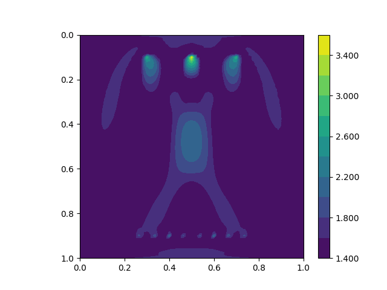

Full-waveform inversion: automated gradient, ensemble parallelism and checkpointing
===============================================================================================

*This short tutorial was prepared by `Daiane I. Dolci <mailto:d.dolci@imperial.ac.uk>`__*

Full-waveform inversion (FWI) consists of a local optimisation, where the goal is to minimise
the misfit between observed and predicted seismogram data. The misfit is quantified by a functional,
which in general is a summation of the cost functions for multiple sources:

.. math::

       J = \sum_{s=1}^{N_s} J_s(u, u^{obs}),

where :math:`N_s` is the number of sources, and :math:`J_s(u, u^{obs})` is the cost function
for a single source. Following :cite:`Tarantola:1984`, the cost function for a single
source can be measured by the :math:`L^2` norm:

.. math::
    
    J_s(u, u^{obs}) = \sum_{r=0}^{N-1} \int_\Omega \left(
        u(c,\mathbf{x},t) - u^{obs}(c, \mathbf{x},t)\right)^2 \delta(\mathbf{x} - \mathbf{x}_r
        ) \, dx

where :math:`u = u(c, \mathbf{x},t)` and :math:`u_{obs} = u_{obs}(c,\mathbf{x},t)`,
are respectively the computed and observed data, both recorded at a finite number
of receivers (:math:`N_r`), located at the point positions :math:`\mathbf{x}_r \in \Omega`,
in a time interval :math:`\tau\equiv[t_0, t_f]\subset \mathbb{R}`, where :math:`t_0` is the
initial time and :math:`t_f` is the final time. The spatial domain of interest is defined
as :math:`\Omega`.

The predicted data is here modeled here by an acoustic wave equation,

.. math::

    \frac{\partial^2 u}{\partial t^2}- c^2\frac{\partial^2 u}{\partial \mathbf{x}^2} = f(\mathbf{x}_s,t) \tag{2}

where :math:`c(\mathbf{x}):\Omega\rightarrow \mathbb{R}` is the pressure wave velocity,
which is assumed here a piecewise-constant and positive. The force term
:math:`f(\mathbf{x},t):\Omega\rightarrow \mathbb{R}` models the source
of waves and is usually described by a `Ricker Wavelet
<https://wiki.seg.org/wiki/Dictionary:Ricker_wavelet>`__. The acoustic wave equation
should satisfy the initial conditions :math:`u(\mathbf{x}, 0) = 0 = u_t(\mathbf{x}, 0) = 0`.
We are employing no-reflective absorbing boundary condition :cite:`Clayton:1977`:

.. math::  \frac{\partial u}{\partial t}- c\frac{\partial u}{\partial \mathbf{x}} = 0, \, \, 
           \forall \mathbf{x} \, \in \partial \Omega 

To solve the wave equation, we consider the following weak form over the domain :math:`\Omega`:

.. math:: \int_{\Omega} \left(
    \frac{\partial^2 u}{\partial t^2}v + c^2\nabla u \cdot \nabla v\right
    ) \, dx = \int_{\Omega} f v \, dx,

for an arbitrary test function :math:`v\in V`, where :math:`V` is a function space. The weak form
implementation in Firedrake is written as follows::

    import finat
    from firedrake import *
    from firedrake.__future__ import Interpolator, interpolate
    
    def wave_equation_solver(c, source_function, dt, V):
        u = TrialFunction(V)
        v = TestFunction(V)
        u_np1 = Function(V) # timestep n+1
        u_n = Function(V) # timestep n
        u_nm1 = Function(V) # timestep n-1
        # Quadrature rule for lumped mass matrix.
        quad_rule = finat.quadrature.make_quadrature(V.finat_element.cell, V.ufl_element().degree(), "KMV")
        time_term = (1 / (c * c)) * (u - 2.0 * u_n + u_nm1) / Constant(dt**2) * v * dx(scheme=quad_rule)
        nf = (1 / c) * ((u_n - u_nm1) / dt) * v * ds
        a = dot(grad(u_n), grad(v)) * dx(scheme=quad_rule)
        F = time_term + a + nf
        lin_var = LinearVariationalProblem(lhs(F), rhs(F) + source_function, u_np1)
        solver_parameters = {"mat_type": "matfree", "ksp_type": "preonly", "pc_type": "jacobi"}
        solver = LinearVariationalSolver(lin_var,solver_parameters=solver_parameters)
        return solver, u_np1, u_n, u_nm1

You can find more details about the wave equation with mass lumping on this
`Firedrake demos <https://www.firedrakeproject.org/demos/higher_order_mass_lumping.py.html>`_.

The wave equation forcing :math:`f = f(\mathbf{x}_s, t)` represents a time-dependent wave source
locate at the position :math:`\mathbf{x}_s`, and it is given by:

.. math::

    f(\mathbf{x}_s,t) = r(t) \delta(\mathbf{x} - \mathbf{x}_s)

where :math:`r(t)` is the `Ricker wavelet <https://wiki.seg.org/wiki/Dictionary:Ricker_wavelet>`__, and
:math:`\delta(\mathbf{x} - \mathbf{x}_s)` is the Dirac delta function. The implementation of `Ricker
wavelet <https://wiki.seg.org/wiki/Dictionary:Ricker_wavelet>`__ is given by the following code::

    def ricker_wavelet(t, fs, amp=1.0):
        ts = 1.5
        t0 = t - ts * np.sqrt(6.0) / (np.pi * fs)
        return (amp * (1.0 - (1.0 / 2.0) * (2.0 * np.pi * fs) * (2.0 * np.pi * fs) * t0 * t0)
                * np.exp((-1.0 / 4.0) * (2.0 * np.pi * fs) * (2.0 * np.pi * fs) * t0 * t0))

In Firedrake, we can compute in parralell the functional values and their gradients
for multiple sources. That is achieved by using the :class:`~.ensemble.Ensemble`,
which allows the spatial and source parallelism. This example demonstrates how to make  use of the
:class:`~.ensemble.Ensemble` in this optimisation problem using autotmated gradient. At this point, we have
to define an ensemble object::

    from firedrake import Ensemble, COMM_WORLD
    M = 1
    my_ensemble = Ensemble(COMM_WORLD, M)

``my_ensemble`` requires a communicator (``COMM_WORLD``) and a value ``M`` used to configurate the ensemble
parallelism. Based on the value of ``M`` and the number of MPI processes, :class:`~.ensemble.Ensemble` will
split the number of MPI processes into two ensemble members: ``Ensemble.comm`` and ``Ensemble.ensemble_comm``.
The ``Ensemble.comm`` will be the mesh communicator, and the ``Ensemble.ensemble_comm`` will be the communicator
used to parallelise the sources. In this example, we are going to simulate an FWI problem with two sources and 4
MPI processes. Hence, the ``Ensemble.ensemble_comm`` will have two members, and the ``Ensemble.comm`` will have
four members, i. e, the mesh will be parallelised in 2 parts. To have a better understanding of the ensemble
parallelism, please refer to the `Firedrake manual
<hhttps://www.firedrakeproject.org/parallelism.html#id8>`__.

The number of sources are set according the source ensemble communicator ``my_ensemble.ensemble_comm`` size, and
the source number in based on the ensemble communicator rank.::

    num_sources = my_ensemble.ensemble_comm.size
    source_number = my_ensemble.ensemble_comm.rank

We consider a two dimensional square domain with side length 1.0 km. The mesh is generated over
the `my_ensemble.comm` communicator::
    
    Lx, Lz = 1.0, 1.0
    mesh = UnitSquareMesh(80, 80, comm=my_ensemble.comm)

We create a ``setting_parameters`` dictionary containing the parameters necessary to solve the wave
equation and the FWI problem.::

    import numpy as np
    num_receivers = 10
    setting_parameters = {
        "source_locations": np.linspace((0.3, 0.05), (0.7, 0.05), num_sources),
        "receiver_locations": np.linspace((0.2, 0.85), (0.8, 0.85), num_receivers),
        "mesh": mesh,
        "FunctionSpace": FunctionSpace(mesh, "KMV", 1),
        "dt": 0.002,  # time step
        "final_time": 0.8,  # final time
        "syntetic_receiver_data": None,  # The syntetic receiver data to be used in the inversion.
        "frequency_peak": 7.0,  # The dominant frequency of the source.
    }

The firedrake functions will be displayed using the following function::

    import matplotlib.pyplot as plt
    from firedrake.pyplot import tricontourf
    def plot_function(function, file_name="function.png"):
        fig, axes = plt.subplots()
        contours = tricontourf(function, 10, axes=axes)
        fig.colorbar(contours, ax=axes, fraction=0.1, cmap="seismic", format="%.3f")
        plt.gca().invert_yaxis()
        axes.set_aspect("equal")
        plt.savefig(file_name + ".png")

        
FWI seeks to estimate the pressure wave velocity based on the observed data stored at the receivers.
The observed data is subject to influences a known pressure wave velocity model, i.e., a synthetic
pressure wave velocity referred to as the true velocity model (``c_true``). For the sake of simplicity,
we consider ``c_true`` consisting of a circle in the centre of the domain, as shown in the coming code
cell.::

    x, z = SpatialCoordinate(setting_parameters["mesh"])
    c_true = Function(setting_parameters["FunctionSpace"]).interpolate(
        2.5 + 1 * tanh(200 * (0.125 - sqrt((x - 0.5) ** 2 + (z - 0.5) ** 2)))
        )
    plot_function(c_true, "c_true")

.. image:: c_true.png

Let us now define the function space to solve the wave equation and the function space associated with the
receiver mesh in order to interpolate the wave equation solution at the receiver locations::

    V = setting_parameters["FunctionSpace"]
    receiver_mesh = VertexOnlyMesh(mesh, setting_parameters["receiver_locations"])
    P0DG = FunctionSpace(receiver_mesh, "DG", 0)

We also want to model the source term in the wave equation.  To this end, we create a source mesh based on the
source locations::

    source_mesh = VertexOnlyMesh(mesh, [setting_parameters["source_locations"][source_number]])
    source_space = FunctionSpace(source_mesh, "DG", 0)

Next, we define the forcing point at the source location and interpolate it onto the dual space (``V.dual()``)::

    forcing_point = assemble(Constant(1.0)*TestFunction(source_space)*dx)
    source_cofunction = Cofunction(V.dual()).interpolate(forcing_point)

That is a correct mathematical operation once the inner product between the forcing term and a test function
is a mapping from the primal space ``V`` to the dual space ``V.dual()``.

We get the synthetic data recorded on the receivers by executing the acoustic wave equation with the
true velocity model ``c_true``.::

    true_data_receivers = []
    total_steps = int(setting_parameters["final_time"] / setting_parameters["dt"]) + 1
    f = Cofunction(V.dual()) # Wave equation forcing term.
    solver, u_np1, u_n, u_nm1 = wave_equation_solver(c_true, f, setting_parameters["dt"], V)
    interpolate_receivers = Interpolator(u_np1, P0DG).interpolate()

    for t in range(total_steps):
        r = ricker_wavelet(t * setting_parameters["dt"], setting_parameters["frequency_peak"])
        f.assign(r * source_cofunction)
        solver.solve()
        u_nm1.assign(u_n)
        u_n.assign(u_np1)
        # Interpolate the solution at the receiver locations and store the result.
        # This data will be used in the inversion to compute the functional.
        true_data_receivers.append(assemble(interpolate_receivers))

Next, we execute an FWI problem, which involves the following steps:

1. Set the initial guess for the parameter ``c_guess``;

2. Solve the wave equation with the initial guess for the parameter ``c_guess``;

3. Compute the functional :math:`J`;

4. Compute the adjoint-based gradient of the functional :math:`J` witt respect to the parameter ``c_guess``;

5. Update the parameter ``c_guess`` using a gradient-based optimization method;

6. Repeat steps 2-5 until the stopping criterion is satisfied.

The initial guess is set (step 1) as a constant field with a value of 1.5 km/s::

    c_guess = Function(setting_parameters["FunctionSpace"]).assign(1.5)
    plot_function(c_guess, "c_initial")

.. image:: c_initial.png

Steps 2-3 are implemented in the following code cells. To have the step 4, we need to tape the forward problem.
That is done by calling the ``continue_annotation()`` function::

    from firedrake.adjoint import *
    continue_annotation()

We also enable checkpointing to save the memory usage inherent from the adjoint computation::
    
    from checkpoint_schedules import Revolve
    tape = get_working_tape()
    tape.enable_checkpointing(Revolve(total_steps, 100))

The checkpoint schedules are generated from the
`checkpoint_schedules <https://www.firedrakeproject.org/checkpoint_schedules/>`__ package.

We then write the code to solve the wave equation and compute the functional::

    f = Cofunction(V.dual())  # Wave equation forcing term.
    solver, u_np1, u_n, u_nm1 = wave_equation_solver(c_guess, f, setting_parameters["dt"], V)
    interpolate_receivers = Interpolator(u_np1, P0DG).interpolate()
    J_val = 0.0
    for step in tape.timestepper(iter(range(total_steps))):
        r = ricker_wavelet(setting_parameters["dt"] * step, setting_parameters["frequency_peak"])
        f.assign(r * source_cofunction)
        solver.solve()
        u_nm1.assign(u_n)
        u_n.assign(u_np1)
        guess_receiver = assemble(interpolate_receivers)
        misfit = guess_receiver - true_data_receivers[step]
        J_val += 0.5 * assemble(inner(misfit, misfit) * dx)

We use the :class:`~.EnsembleReducedFunctional` class to recompute in parallel the functional and
its gradient associated with the multiple sources (2 in this case)::

    J_hat = EnsembleReducedFunctional(J_val, Control(c_guess), my_ensemble)

Finally, we use the ``minimize`` pyadjoiny function to solve the FWI problem. ``minimize`` requires
the reduced functional ``J_hat`` and the optimisation options. The optimisation options are passed
as a dictionary. In summary, the `minimize` function will execute  steps 2-5 of the FWI problem::

    c_optimised = minimize(J_hat, method="L-BFGS-B", options={"disp": True, "maxiter": 5}, bounds=(1.5, 3.5))

The optimised parameter ``c_optimised`` is then plotted::

    plot_function(c_optimised, "c_opt_parallel")

.. note::

    Notice we are employing only 5 iterations in the optimisation process. To achieve a better result, we
    should increase the number of iterations. Fell free to explore more this problem, e.g., change the number of
    iterations, the optimisation method, ``my_ensemble`` configuration, number of sources. FWI is not a trivial problem,
    and there are many ways to solve it. This tutorial is just a starting point to help you.

.. rubric:: References

.. bibliography:: demo_references.bib
   :filter: docname in docnames

