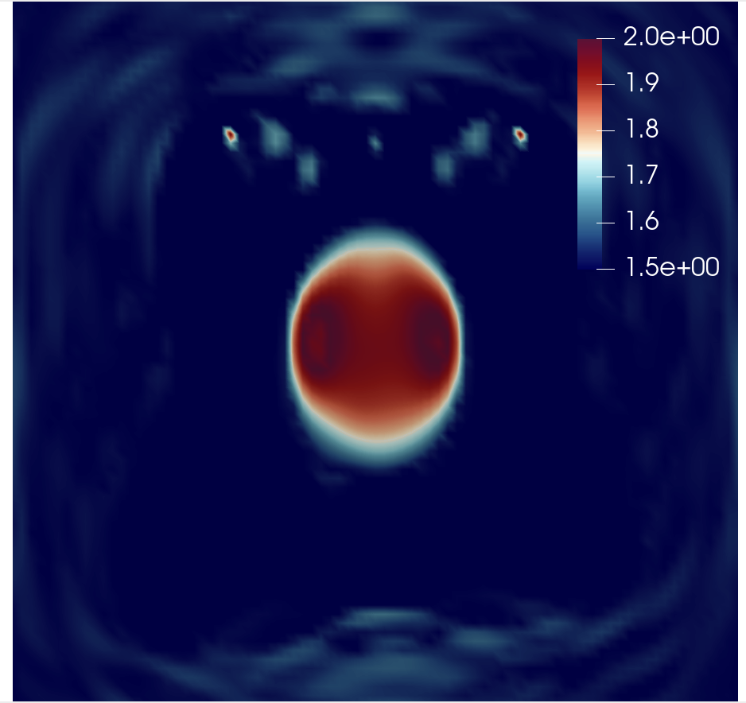

Full-waveform inversion: spatial and wave sources parallelism
=================================================================
This tutorial demonstrates a Full-Waveform Inversion (FWI) solver in Firedrake,
computing the gradient via algorithmic differentiation. Additionally, we illustrate
how to configure spatial and wave source parallelism to efficiently compute the
cost functions and their gradients for this optimisation problem.

.. rst-class:: emphasis

    This tutorial was prepared by `Daiane I. Dolci <mailto:d.dolci@imperial.ac.uk>`__ 
    and Jack Betteridge.

FWI consists of a local optimisation, where the goal is to minimise the misfit between
observed and predicted seismogram data. The misfit is quantified by a functional,
which in general is a summation of the cost functions for multiple wave sources:

.. math::

       J = \sum_{s=1}^{N_s} J_s(u, u^{obs}),  \quad \quad (1)

where :math:`N_s` is the number of sources, and :math:`J_s(u, u^{obs})` is the cost function
for a single source. Following :cite:`Tarantola:1984`, the cost function for a single
source can be measured by:

.. math::
    
    J_s(u, u^{obs}) = \sum_{r=0}^{N_r} \sum_{t=0}^{T} \left(
        u(c,\mathbf{x}_r,t) - u^{obs}(c, \mathbf{x}_r,t)\right)^2,   \quad \quad (2)

where :math:`u = u(c, \mathbf{x}_r,t)` and :math:`u_{obs} = u_{obs}(c,\mathbf{x}_r,t)`,
are respectively the computed and observed data, both recorded at a finite number
of receivers :math:`N_r` located at the point positions :math:`\mathbf{x}_r \in \Omega`,
in a time-step interval :math:`[0, T]`, where :math:`T` is the total time-step.

The computed data, :math:`u = u(c, \mathbf{x}_r,t)`, is given on simulating a source
wave propagating through an inhomogeneous medium. Here, the wave propagation from a source
is modelled by an acoustic wave equation:

.. math::

    m \frac{\partial^2 u}{\partial t^2}-\frac{\partial^2 u}{\partial \mathbf{x}^2} = f_s(\mathbf{x},t),  \quad \quad (3)

where :math:`m = 1/c^2`, :math:`c = c(\mathbf{x})` is the pressure wave velocity, which is
assumed here a piecewise-constant and positive. The function :math:`f_s(\mathbf{x},t)`
models a point source function, were the time-dependency is given by the Ricker wavelet :cite:`Ricker:1953`.

The acoustic wave equation should satisfy the initial conditions 
:math:`u(\mathbf{x}, 0) = 0 = u_t(\mathbf{x}, 0) = 0`. We employ a no-reflective absorbing
boundary condition :cite:`Clayton:1977`:

.. math::  \frac{1}{c} \frac{\partial u}{\partial t} - \frac{\partial u}{\partial \mathbf{x}} = 0, \, \, 
           \forall \mathbf{x} \, \in \partial \Omega  \quad \quad (4)

To solve the wave equation, we consider the following weak form:

.. math:: \int_{\Omega} \left(
    m \frac{\partial^2 u}{\partial t^2}v + \nabla u \cdot \nabla v\right
    ) \, dx  + \int_{\partial \Omega} \frac{1}{c} \frac{\partial u}{\partial t} v \, ds
    = \int_{\Omega} f(\mathbf{x},t) v \, dx, 
    \quad \quad (5)

for an arbitrary test function :math:`v\in V`, where :math:`V` is a function space. 

As shown in (1), the functional :math:`J` is a summation of :math:`J_s`. These functionals :math:`J_s`
are independent of each other. In Firedrake, it is possible to compute :math:`J_s` in parallel.
To achieve this, we use ensemble parallelism, which involves solving simultaneous copies of the wave
equation (3) with different forcing terms :math:`f_s(\mathbf{x}, t)`, different :math:`J_s` and their
gradients (which we will discuss later).

Instantiating an ensemble requires a communicator (usually MPI_COMM_WORLD) plus the number of MPI
processes to be used in each member of the ensemble (2, in this case)::

    from firedrake import *
    M = 2
    my_ensemble = Ensemble(COMM_WORLD, M)

Each ensemble member will have the same spatial parallelism with the number of ensemble members given
by dividing the size of the original communicator by the number processes in each ensemble member.
In this example, we want to distribute each mesh over 2 ranks and compute the functional and its gradient
for 3 wave sources. Therefore, we will have 3 emsemble members, each with 2 ranks. The total number of
processes launched by mpiexec must therefore be equal to the product of number of ensemble members
(3, in this case) with the number of processes to be used for each ensemble member (``M=2``, in this case).
Additional details about the ensemble parallelism can be found in the
`Firedrake documentation <https://www.firedrakeproject.org/parallelism.html#ensemble-parallelism>`_.

The subcommunicators in each ensemble member are: ``Ensemble.comm`` and ``Ensemble.ensemble_comm``.
``Ensemble.comm`` is the spatial communicator. ``Ensemble.ensemble_comm`` allows communication between
the ensemble members. In this example, ``Ensemble.ensemble_comm`` benefits the communication of the
functionals :math:`J_s` and their gradients for the distinct the wave sources.

The number of sources is defined with ``my_ensemble.ensemble_comm.size`` (3 in this case)::

    num_sources = my_ensemble.ensemble_comm.size

The source number is defined with the ``Ensemble.ensemble_comm`` rank::

    source_number = my_ensemble.ensemble_comm.rank

In this example, we consider a two-dimensional square domain with a side length of 1.0 km. The mesh is
built over the ``my_ensemble.comm`` (spatial) communicator.

::

    import os
    if os.getenv("FIREDRAKE_CI_TESTS") == "1": 
        # Setup for a faster test execution.
        dt = 0.03  # time step in seconds
        final_time = 0.6  # final time in seconds
        nx, ny = 15, 15
    else:
        dt = 0.002  # time step in seconds
        final_time = 1.0  # final time in seconds
        nx, ny = 80, 80

    mesh = UnitSquareMesh(nx, ny, comm=my_ensemble.comm)

The frequency of the Ricker wavelet, the source and receiver locations are defined as follows::

    import numpy as np
    frequency_peak = 7.0  # The dominant frequency of the Ricker wavelet in Hz.
    source_locations = np.linspace((0.3, 0.1), (0.7, 0.1), num_sources)
    receiver_locations = np.linspace((0.2, 0.9), (0.8, 0.9), 20)

Sources and receivers locations are illustrated in the following figure:

.. image:: sources_receivers.png
    :scale: 70 %
    :alt: sources and receivers locations
    :align: center

        
FWI seeks to estimate the pressure wave velocity based on the observed data stored at the receivers.
These data are subject to influences of the subsurface medium while waves propagate from the sources.
In this example, we emulate observed data by executing the acoustic wave equation with a synthetic
pressure wave velocity model. The synthetic pressure wave velocity model is referred to here as the
true velocity model (``c_true``). For the sake of simplicity, we consider ``c_true`` consisting of a
circle in the centre of the domain, as shown in the following code cell::

    V = FunctionSpace(mesh, "KMV", 1)
    x, z = SpatialCoordinate(mesh)
    c_true = Function(V).interpolate(1.75 + 0.25 * tanh(200 * (0.125 - sqrt((x - 0.5) ** 2 + (z - 0.5) ** 2))))

.. image:: c_true.png
    :scale: 30 %
    :alt: true velocity model
    :align: center

To model the point source function in weak form, which is the term on the right side of Eq. (5) rewritten
as:

.. math:: \int_{\Omega} f_s(\mathbf{x},t) v \, dx = r(t) q_s(\mathbf{x}),  \quad q_s(\mathbf{x}) \in V^{\ast} \quad \quad (6)

where :math:`r(t)` is the Ricker wavelet coded as follows::

    def ricker_wavelet(t, fs, amp=1.0):
        ts = 1.5
        t0 = t - ts * np.sqrt(6.0) / (np.pi * fs)
        return (amp * (1.0 - (1.0 / 2.0) * (2.0 * np.pi * fs) * (2.0 * np.pi * fs) * t0 * t0)
                * np.exp((-1.0 / 4.0) * (2.0 * np.pi * fs) * (2.0 * np.pi * fs) * t0 * t0))

To compute the cofunction :math:`q_s(\mathbf{x})\in V^{\ast}`, we first construct the source mesh over the
source location :math:`\mathbf{x}_s`, for the source number ``source_number``::

    source_mesh = VertexOnlyMesh(mesh, [source_locations[source_number]])

Next, we define a function space :math:`V_s` accordingly::

    V_s = FunctionSpace(source_mesh, "DG", 0)

The point source value :math:`d_s(\mathbf{x}_s) = 1.0` is coded as::

    d_s = Function(V_s)
    d_s.interpolate(1.0)

We then interpolate a cofunction in :math:`V_s^{\ast}` onto :math:`V^{\ast}` to then have :math:`q_s \in V^{\ast}`::

    source_cofunction = assemble(d_s * TestFunction(V_s) * dx)
    q_s = Cofunction(V.dual()).interpolate(source_cofunction)

The forward wave equation solver is written as follows::

    import finat
    
    def wave_equation_solver(c, source_function, dt, V):
        u = TrialFunction(V)
        v = TestFunction(V)
        u_np1 = Function(V) # timestep n+1
        u_n = Function(V) # timestep n
        u_nm1 = Function(V) # timestep n-1
        # Quadrature rule for lumped mass matrix.
        quad_rule = finat.quadrature.make_quadrature(V.finat_element.cell, V.ufl_element().degree(), "KMV")
        m = (1 / (c * c))
        time_term =  m * (u - 2.0 * u_n + u_nm1) / Constant(dt**2) * v * dx(scheme=quad_rule)
        nf = (1 / c) * ((u_n - u_nm1) / dt) * v * ds
        a = dot(grad(u_n), grad(v)) * dx(scheme=quad_rule)
        F = time_term + a + nf
        lin_var = LinearVariationalProblem(lhs(F), rhs(F) + source_function, u_np1)
        # Since the linear system matrix is diagonal, the solver parameters are set to construct a solver,
        # which applies a single step of Jacobi preconditioning.
        solver_parameters = {"mat_type": "matfree", "ksp_type": "preonly", "pc_type": "jacobi"}
        solver = LinearVariationalSolver(lin_var,solver_parameters=solver_parameters)
        return solver, u_np1, u_n, u_nm1

You can find more details about the wave equation with mass lumping on this
`Firedrake demos <https://www.firedrakeproject.org/demos/higher_order_mass_lumping.py.html>`_.

The receivers mesh and its function space :math:`V_r`::

    receiver_mesh = VertexOnlyMesh(mesh, receiver_locations)
    V_r = FunctionSpace(receiver_mesh, "DG", 0)

The receiver mesh is required in order to interpolate the wave equation solution at the receivers.

We are now able to proceed with the synthetic data computations and record them on the receivers::

    from firedrake.__future__ import interpolate

    true_data_receivers = []
    total_steps = int(final_time / dt) + 1
    f = Cofunction(V.dual())  # Wave equation forcing term.
    solver, u_np1, u_n, u_nm1 = wave_equation_solver(c_true, f, dt, V)
    interpolate_receivers = interpolate(u_np1, V_r)

    for step in range(total_steps):
        f.assign(ricker_wavelet(step * dt, frequency_peak) * q_s)
        solver.solve()
        u_nm1.assign(u_n)
        u_n.assign(u_np1)
        true_data_receivers.append(assemble(interpolate_receivers))

Next, the FWI problem is executed with the following steps:

1. Set the initial guess for the parameter ``c_guess``;

2. Solve the wave equation with the initial guess velocity model (``c_guess``);

3. Compute the functional :math:`J`;

4. Compute the adjoint-based gradient of :math:`J` with respect to the control parameter ``c_guess``;

5. Update the parameter ``c_guess`` using a gradient-based optimisation method, on this case the L-BFGS-B method;

6. Repeat steps 2-5 until the optimisation stopping criterion is satisfied.

**Step 1**: The initial guess is set as a constant field with a value of 1.5 km/s::

    c_guess = Function(V).interpolate(1.5)

.. image:: c_initial.png
    :scale: 30 %
    :alt: initial velocity model
    :align: center

To have the step 4, we need first to tape the forward problem. That is done by calling::

    from firedrake.adjoint import *
    continue_annotation()
    get_working_tape().progress_bar = ProgressBar

**Steps 2-3**: Solve the wave equation and compute the functional::

    f = Cofunction(V.dual())  # Wave equation forcing term.
    solver, u_np1, u_n, u_nm1 = wave_equation_solver(c_guess, f, dt, V)
    interpolate_receivers = interpolate(u_np1, V_r)
    J_val = 0.0
    for step in range(total_steps):
        f.assign(ricker_wavelet(step * dt, frequency_peak) * q_s)
        solver.solve()
        u_nm1.assign(u_n)
        u_n.assign(u_np1)
        guess_receiver = assemble(interpolate_receivers)
        misfit = guess_receiver - true_data_receivers[step]
        J_val += 0.5 * assemble(inner(misfit, misfit) * dx)

We now instantiate :class:`~.EnsembleReducedFunctional`::

    J_hat = EnsembleReducedFunctional(J_val, Control(c_guess), my_ensemble)

which enables us to recompute :math:`J` and its gradient :math:`\nabla_{\mathtt{c\_guess}} J`,
where the :math:`J_s` and its gradients :math:`\nabla_{\mathtt{c\_guess}} J_s` are computed in parallel
based on the ``my_ensemble`` configuration.

**Steps 4-6**: The instance of the :class:`~.EnsembleReducedFunctional`, named ``J_hat``,
is then passed as an argument to the ``minimize`` function::

    c_optimised = minimize(J_hat, method="L-BFGS-B", options={"disp": True, "maxiter": 1},
                            bounds=(1.5, 2.0), derivative_options={"riesz_representation": 'l2'}
                            )

The ``minimize`` function executes the optimisation algorithm until the stopping criterion (``maxiter``) is met.
For 20 iterations, the predicted velocity model is shown in the following figure.

.. warning::

    The ``minimize`` function uses the SciPy library for optimisation. However, for scenarios that require higher
    levels of spatial parallelism, you should assess whether SciPy is the most suitable option for your problem.
    SciPy's optimisation algorithm is not inner-product-aware. Therefore, we configure the options with
    ``derivative_options={"riesz_representation": 'l2'}`` to account for this requirement.

.. note::

    This example is only a starting point to help you to tackle more intricate FWI problems.

.. rubric:: References

.. bibliography:: demo_references.bib
   :filter: docname in docnames
