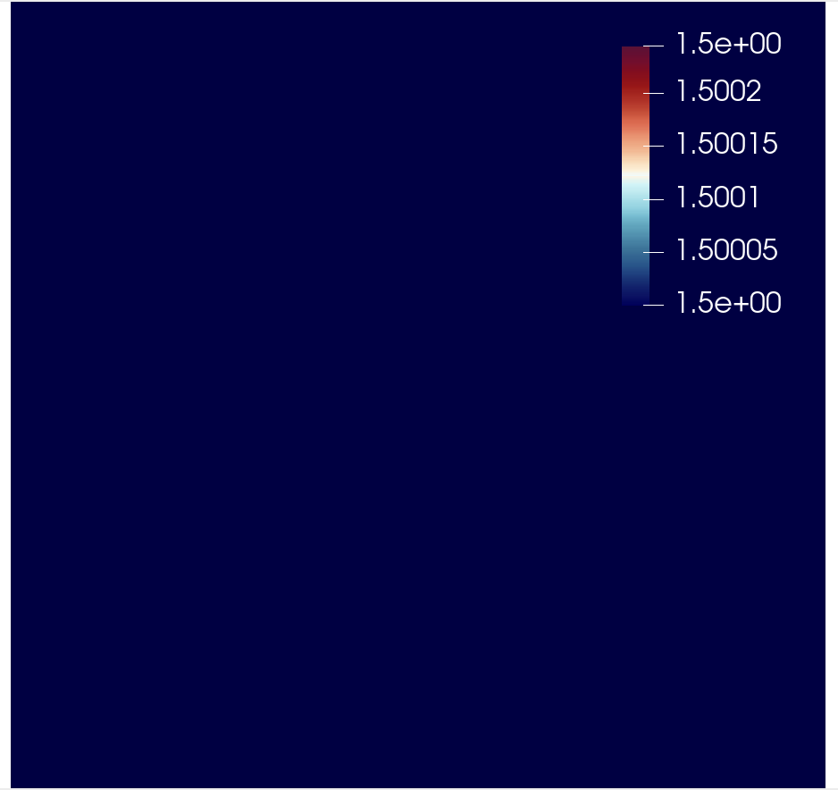

Full-waveform inversion with automated gradient and checkpointing
=================================================================

Full-waveform inversion (FWI) is a technique in general employed to estimate the physical
parameters in a subsurface region. It is wave-equation-based seeking an optimal match
between observed and predicted data. The former is recorded by a set of receivers in a real
case. The latter consists of predicted data, which is obtained by solving numerically a
wave equation with a forcing term representing a source of wave emission.

*This short tutorial was prepared by `Daiane I. Dolci <mailto:d.dolci@imperial.ac.uk>`__*

Cost function
-------------

FWI consists of a local optimisation, where the goal is to minimise the misfit between
observed and predicted seismogram data. The misfit is quantified by a cost function, which
in general is a summation of the misfit functions for multiple sources as follows:

.. math::

       J = \sum_{s=1}^{N_s} J_s(u, u^{obs}),

where :math:`N_s` is the number of sources, and :math:`J_s(u, u^{obs})` is the cost function
for a single source. Following :cite:`Tarantola:1984`, the misfit function for a single
source can be measured by the :math:`L^2` norm:

.. math::
    
    J_s(u, u^{obs}) = \sum_{r=0}^{N-1} \int_\Omega \left(
        u(c,\mathbf{x},t) - u^{obs}(c, \mathbf{x},t)\right)^2 \delta(\mathbf{x} - \mathbf{x}_r
        ) \, dx

where :math:`u = u(c, \mathbf{x},t)` and :math:`u_{obs} = u_{obs}(c,\mathbf{x},t)`,
are respectively the computed and observed data, both recorded at a finite number
of receivers (:math:`N_r`), located at the point positions :math:`\mathbf{x}_r \in \Omega`,
in a time interval :math:`\tau\equiv[t_0, t_f]\subset \mathbb{R}`, where :math:`t_0` is the
initial time and :math:`t_f` is the final time. The spatial domain of interest is defined
as :math:`\Omega`.

The predicted data is modeled here by an acoustic wave equation,

.. math::

    \frac{\partial^2 u}{\partial t^2}- c^2\frac{\partial^2 u}{\partial \mathbf{x}^2} = f(\mathbf{x}_s,t) \tag{2}

where :math:`c(\mathbf{x}):\Omega\rightarrow \mathbb{R}` is the pressure wave velocity,
which is assumed here a piecewise-constant and positive. The external force term
:math:`f(\mathbf{x},t):\Omega\rightarrow \mathbb{R}`, models the source
of waves and is usually described by a `Ricker Wavelet
<https://wiki.seg.org/wiki/Dictionary:Ricker_wavelet>`__. The acoustic wave equation
should satisfy the initial conditions :math:`u(\mathbf{x}, 0) = 0 = u_t(\mathbf{x}, 0) = 0`.
We are employing no-reflective absorbing boundary condition :cite:`Clayton:1977`:

.. math::  \frac{\partial u}{\partial t}- c\frac{\partial u}{\partial \mathbf{x}} = 0, \, \, 
           \forall \mathbf{x} \, \in \partial \Omega 

To solve the wave equation, we consider the following weak form over the domain :math:`\Omega`:

.. math:: \int_{\Omega} \left(
    \frac{\partial^2 u}{\partial t^2}v + c^2\nabla u \cdot \nabla v\right
    ) \, dx = \int_{\Omega} f v \, dx,

for an arbitrary test function :math:`v\in V`, where :math:`V` is a function space. The weak form
implementation in Firedrake is written as follows.

    import finat
    from firedrake import *
    from firedrake.__future__ import Interpolator, interpolate
    
    def wave_equation_solver(c, source_function, dt, V):
        u = TrialFunction(V)
        v = TestFunction(V)
        u_np1 = Function(V) # timestep n+1
        u_n = Function(V) # timestep n
        u_nm1 = Function(V) # timestep n-1
        # Quadrature rule for lumped mass matrix.
        quad_rule = finat.quadrature.make_quadrature(V.finat_element.cell, V.ufl_element().degree(), "KMV")
        time_term = (1 / (c * c)) * (u - 2.0 * u_n + u_nm1) / Constant(dt**2) * v * dx(scheme=quad_rule)
        nf = (1 / c) * ((u_n - u_nm1) / dt) * v * ds
        a = dot(grad(u_n), grad(v)) * dx(scheme=quad_rule)
        F = time_term + a + nf
        lin_var = LinearVariationalProblem(lhs(F), rhs(F) + source_function, u_np1)
        solver = LinearVariationalSolver(lin_var, solver_parameters={"mat_type": "matfree", "ksp_type": "preonly", "pc_type": "jacobi"})
        return solver, u_np1, u_n, u_nm1

You can find more details about the wave equation with mass lumping on this
`Firedrake demos <https://www.firedrakeproject.org/demos/higher_order_mass_lumping.py.html>`_.

The wave equation forcing :math:`f = f(\mathbf{x}_s, t)` represents a time-dependent wave source
locate at the position :math:`\mathbf{x}_s`, and it is given by:

.. math::

    f(\mathbf{x}_s,t) = r(t) \delta(\mathbf{x} - \mathbf{x}_s)

where :math:`r(t)` is the `Ricker wavelet <https://wiki.seg.org/wiki/Dictionary:Ricker_wavelet>`__, and
:math:`\delta(\mathbf{x} - \mathbf{x}_s)` is the Dirac delta function. The implementation of `Ricker
wavelet <https://wiki.seg.org/wiki/Dictionary:Ricker_wavelet>`__ is given by the following code::

    def ricker_wavelet(t, fs, amp=1.0):
        ts = 1.5
        t0 = t - ts * np.sqrt(6.0) / (np.pi * fs)
        return (amp * (1.0 - (1.0 / 2.0) * (2.0 * np.pi * fs) * (2.0 * np.pi * fs) * t0 * t0)
                * np.exp((-1.0 / 4.0) * (2.0 * np.pi * fs) * (2.0 * np.pi * fs) * t0 * t0))

In Firedrake, we can execute simultaneouslly compute the functional values and their gradients
for multiple sources in parallel. That is achieved by using the :class:`~.ensemble.Ensemble`,
which allows the spatial and source parallelism. This example demonstrates how to make  use of the
:class:`~.ensemble.Ensemble`. Hence, at this tutorial point, we create an ensemble object
``my_ensemble`` that requires a communicator (COMM_WORLD) and a value ``M`` that represents the number
how will be the configuration used to parallelize the problem. For instance, if we  execute the code
with 4 MPI processes, the :class:`~.ensemble.Ensemble` will split the 4 MPI processes into 2 ensemble
communicators: ``my_ensemble.comm`` and ``my_ensemble.ensemble_comm``. The ``my_ensemble.comm`` will 
be the mesh communicator, and the ``my_ensemble.ensemble_comm`` will be the communicator used to
parallelise the sources. The value of ``M`` is used to dividing the size of the original communicator
(4 in this case). Therefore, when we set ``M=2``, we will have 2 ensemble members, each with 2 MPI
processes.::

    from firedrake import Ensemble, COMM_WORLD
    M = 2
    my_ensemble = Ensemble(COMM_WORLD, M)

Here, the number of sources are defined based on the source ensemble communicator
(``my_ensemble.ensemble_comm``) size and the source number in based on the ensemble communicator rank.
To exemplify, suppose that we are executing the code with 4 MPI processes. The ensemble communicator
``my_ensemble.ensemble_comm`` size will be 2, and the source number will be 0, 1, respectively.::

    num_sources = my_ensemble.ensemble_comm.size
    source_number = my_ensemble.ensemble_comm.rank

We consider a two dimensional square domain with side length 1.0 km. The mesh is generated over
the `my_ensemble.comm` communicator, which is the spatial parallelism communicator of the
:class:`~.ensemble.Ensemble` object.::
    
    Lx, Lz = 1.0, 1.0
    mesh = UnitSquareMesh(80, 80, comm=my_ensemble.comm)

We create a ``setting_parameters`` dictionary containing the parameters necessary to solve the wave
equation and the FWI problem.::

    import numpy as np
    num_receivers = 10
    setting_parameters = {
        "source_locations": np.linspace((0.3, 0.05), (0.7, 0.05), num_sources),
        "receiver_locations": np.linspace((0.2, 0.85), (0.8, 0.85), num_receivers),
        "mesh": mesh,
        "FunctionSpace": FunctionSpace(mesh, "KMV", 1),
        "dt": 0.002,  # time step
        "final_time": 1.0,  # final time
        "syntetic_receiver_data": None,  # The syntetic receiver data to be used in the inversion.
        "frequency_peak": 7.0,  # The dominant frequency of the source.
    }

The firedrake functions will be displayed using the following function::

    import matplotlib.pyplot as plt
    from firedrake.pyplot import tricontourf
    
    def plot_function(function):
        fig, axes = plt.subplots()
        contours = tricontourf(function, 10, axes=axes)
        fig.colorbar(contours, ax=axes, fraction=0.1, cmap="seismic", format="%.3f")
        plt.gca().invert_yaxis()
        axes.set_aspect("equal")
        

FWI seeks to estimate the pressure wave velocity based on the observed data stored at the receivers.
The observed data is subject to influences a known pressure wave velocity model, i.e., a synthetic
pressure wave velocity referred to as the true velocity model (``c_true``). For the sake of simplicity,
we consider ``c_true`` consisting of a circle in the centre of the domain, as shown in the coming code
cell.::

    x, z = SpatialCoordinate(setting_parameters["mesh"])
    c_true = Function(setting_parameters["FunctionSpace"]).interpolate(
        2.5 + 1 * tanh(200 * (0.125 - sqrt((x - 0.5) ** 2 + (z - 0.5) ** 2)))
        )
    plot_function(c_true)

.. image:: c_true.png

Before to advance on this tutorial, let us define the receivers and source meshes. In addition, the
function space where the wave equation solution will be computed, and the function space for the
receiver data interpolation.::

    V = setting_parameters["FunctionSpace"]
    receiver_mesh = VertexOnlyMesh(mesh, setting_parameters["receiver_locations"])
    P0DG = FunctionSpace(receiver_mesh, "DG", 0)

We also define the point source and interpolate it onto the two dimensional `mesh`.
To achieve this, we create a source mesh based on the source locations and its function space.
Next, we define the forcing point at the source location and interpolate it onto the dual space (``V.dual()``).
That is a correct mathematical operation once the inner product between the forcing term and a test function
is a mapping from the primal space ``V`` to the dual space ``V.dual()``.::

    source_mesh = VertexOnlyMesh(mesh, [setting_parameters["source_locations"][source_number]])
    source_space = FunctionSpace(source_mesh, "DG", 0)
    forcing_point = assemble(Constant(1.0)*TestFunction(source_space)*dx)
    source_cofunction = Cofunction(V.dual()).interpolate(forcing_point)

We get the synthetic data recorded on the receivers by executing the acoustic wave equation with the
true velocity model ``c_true``.::

    true_data_receivers = []
    total_steps = int(setting_parameters["final_time"] / setting_parameters["dt"]) + 1
    f = Cofunction(V.dual()) # Wave equation forcing term.
    solver, u_np1, u_n, u_nm1 = wave_equation_solver(c_true, f, setting_parameters["dt"], V)
    interpolate_receivers = Interpolator(u_np1, P0DG).interpolate()

    for t in range(total_steps):
        r = ricker_wavelet(t * setting_parameters["dt"], setting_parameters["frequency_peak"])
        f.assign(r * source_cofunction)
        solver.solve()
        u_nm1.assign(u_n)
        u_n.assign(u_np1)
        # Interpolate the solution at the receiver locations and store the result.
        # This data will be used in the inversion to compute the functional.
        true_data_receivers.append(assemble(interpolate_receivers))

Next, we execute an FWI problem, which involves the following steps:

1. Set the initial guess for the parameter ``c_guess``;

2. Solve the wave equation with the initial guess for the parameter ``c_guess``;

3. Compute the functional :math:`J`;

4. Compute the adjoint-based gradient of the functional :math:`J` witt respect to the parameter
``c_guess``;

5. Update the parameter ``c_guess`` using a gradient-based optimization method;

6. Repeat steps 2-5 until the stopping criterion is satisfied.

The initial guess is set as a constant field with a value of 1.5 km/s.::

    c_guess = Function(setting_parameters["FunctionSpace"]).assign(1.5)
    plot_function(c_guess)

Steps 2-4 are implemented in the following code cell. We use an automated adjoint-based gradient,
which requires taping the forward problem with the command ``continue_annotation()``. We also employ
checkpointing to handle the memory requirements of the adjoint computation. The checkpointing is
enabled by setting ``tape.enable_checkpointing(schedule)``. Firedrake can execute adjoint
and checkpointing automatically, with the checkpoint schedules from the
`checkpoint_schedules <https://www.firedrakeproject.org/checkpoint_schedules/>`__ package.::

    from checkpoint_schedules import Revolve
    from firedrake.adjoint import *
    continue_annotation()
    tape = get_working_tape()
    # Enable checkpointing with a Revolve schedule.
    tape.enable_checkpointing(Revolve(total_steps, 100))

We then write the code to solve the wave equation and compute the functional.::

    solver, u_np1, u_n, u_nm1 = wave_equation_solver(c_guess, f, setting_parameters["dt"], V)

    interpolate_receivers = Interpolator(u_np1, P0DG).interpolate()
    J_val = 0.0
    for step in tape.timestepper(iter(range(total_steps))):  # Loop over the timesteps.
        r = ricker_wavelet(setting_parameters["dt"] * step, setting_parameters["frequency_peak"])
        f.assign(r * source_cofunction)
        solver.solve()
        u_nm1.assign(u_n)
        u_n.assign(u_np1)
        guess_receiver = assemble(interpolate_receivers)
        misfit = guess_receiver - true_data_receivers[step]
        J_val += 0.5 * assemble(inner(misfit, misfit) * dx)

We use the :class:`~.EnsembleReducedFunctional` class to recompute the functional and its gradient
in parallel. The :class:`~.EnsembleReducedFunctional` class requires the functional value, the control
parameter, and the ensemble object (``my_ensemble``).::

    J_hat = EnsembleReducedFunctional(J_val, Control(c_guess), my_ensemble)

Finally, we use the :func:`pyadjoint.minimize` function to solve the FWI problem. The function
``minimize`` requires the reducent functional ``J_hat`` and the optimisation options. The optimisation
options are passed as a dictionary. In summary, the :func:`pyadjoint.minimize` function will execute the
following steps:

1. Recompute the functional value and its gradient $\nabla_c J$ in parallel with :class:`~.EnsembleReducedFunctional`;

2. Update the control parameter $c$ using the gradient-based optimisation method LBFGS, which is the default;

3. Repeat steps 1 (with the updated control parameter $c$) and 2 until the stopping criterion is satisfied.::

    c = minimize(J_hat, method="L-BFGS-B", options={"disp": True, "maxiter": 1}, bounds=(1.5, 3.5))
    plot_function(c)

.. image:: c_opt_parallel.png

Notice we are employing only 5 iterations in the optimisation process. To achieve a better result, we
should increase the number of iterations. Fell free to explore more this problem, e.g., change the number of
iterations, the optimisation method, ``my_ensemble`` configuration, etc. FWI is a complex problem, and there
are many ways to solve it. This tutorial is just a starting point to help you.

.. rubric:: References

.. bibliography:: demo_references.bib
   :filter: docname in docnames

