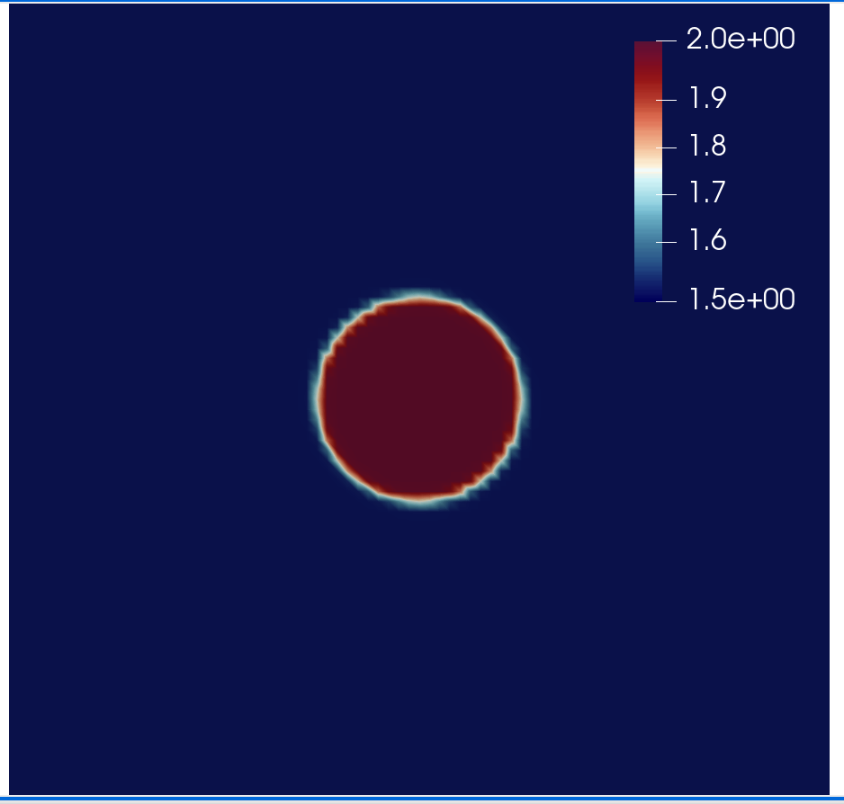

Full-waveform inversion: automated gradient, ensemble parallelism and checkpointing
===================================================================================
This tutorial demonstrates how to use Firedrdrake to solve a full-waveform inversion problem
employing checkpointing, wave sources and mesh parallelism, and gradient computation with the
algorithmic differentiation.

.. rst-class:: emphasis

    This tutorial was prepared by `Daiane I. Dolci <mailto:d.dolci@imperial.ac.uk>`__ 
    with contributions from Jack Betteridge.

Full-waveform inversion (FWI) consists of a local optimisation, where the goal is to minimise
the misfit between observed and predicted seismogram data. The misfit is quantified by a functional,
which in general is a summation of the cost functions for multiple sources:

.. math::

       J = \sum_{s=1}^{N_s} J_s(u, u^{obs}),

where :math:`N_s` is the number of sources, and :math:`J_s(u, u^{obs})` is the cost function
for a single source. Following :cite:`Tarantola:1984`, the cost function for a single
source can be measured by the :math:`L^2` norm:

.. math::
    
    J_s(u, u^{obs}) = \sum_{r=0}^{N-1} \int_\Omega \left(
        u(c,\mathbf{x},t) - u^{obs}(c, \mathbf{x},t)\right)^2 \delta(\mathbf{x} - \mathbf{x}_r
        ) \, dx

where :math:`u = u(c, \mathbf{x},t)` and :math:`u_{obs} = u_{obs}(c,\mathbf{x},t)`,
are respectively the computed and observed data, both recorded at a finite number
of receivers (:math:`N_r`), located at the point positions :math:`\mathbf{x}_r \in \Omega`,
in a time interval :math:`\tau\equiv[t_0, t_f]\subset \mathbb{R}`, where :math:`t_0` is the
initial time and :math:`t_f` is the final time. The spatial domain of interest is defined
as :math:`\Omega`.

The predicted data is here modeled here by an acoustic wave equation,

.. math::

    \frac{\partial^2 u}{\partial t^2}- c^2\frac{\partial^2 u}{\partial \mathbf{x}^2} = f(\mathbf{x}_s,t),

where :math:`c(\mathbf{x}):\Omega\rightarrow \mathbb{R}` is the pressure wave velocity,
which is assumed here a piecewise-constant and positive. The force term
:math:`f(\mathbf{x},t):\Omega\rightarrow \mathbb{R}` models the source
of waves and is usually described by a `Ricker Wavelet
<https://wiki.seg.org/wiki/Dictionary:Ricker_wavelet>`__. The acoustic wave equation
should satisfy the initial conditions :math:`u(\mathbf{x}, 0) = 0 = u_t(\mathbf{x}, 0) = 0`.
We are employing no-reflective absorbing boundary condition :cite:`Clayton:1977`:

.. math::  \frac{\partial u}{\partial t}- c\frac{\partial u}{\partial \mathbf{x}} = 0, \, \, 
           \forall \mathbf{x} \, \in \partial \Omega 

To solve the wave equation, we consider the following weak form over the domain :math:`\Omega`:

.. math:: \int_{\Omega} \left(
    \frac{\partial^2 u}{\partial t^2}v + c^2\nabla u \cdot \nabla v\right
    ) \, dx = \int_{\Omega} f v \, dx,

for an arbitrary test function :math:`v\in V`, where :math:`V` is a function space. The weak form
implementation in Firedrake is written as follows::

    import finat
    from firedrake import *
    from firedrake.__future__ import Interpolator, interpolate
    
    def wave_equation_solver(c, source_function, dt, V):
        u = TrialFunction(V)
        v = TestFunction(V)
        u_np1 = Function(V) # timestep n+1
        u_n = Function(V) # timestep n
        u_nm1 = Function(V) # timestep n-1
        # Quadrature rule for lumped mass matrix.
        quad_rule = finat.quadrature.make_quadrature(V.finat_element.cell, V.ufl_element().degree(), "KMV")
        time_term = (1 / (c * c)) * (u - 2.0 * u_n + u_nm1) / Constant(dt**2) * v * dx(scheme=quad_rule)
        nf = (1 / c) * ((u_n - u_nm1) / dt) * v * ds
        a = dot(grad(u_n), grad(v)) * dx(scheme=quad_rule)
        F = time_term + a + nf
        lin_var = LinearVariationalProblem(lhs(F), rhs(F) + source_function, u_np1)
        solver_parameters = {"mat_type": "matfree", "ksp_type": "preonly", "pc_type": "jacobi"}
        solver = LinearVariationalSolver(lin_var,solver_parameters=solver_parameters)
        return solver, u_np1, u_n, u_nm1

You can find more details about the wave equation with mass lumping on this
`Firedrake demos <https://www.firedrakeproject.org/demos/higher_order_mass_lumping.py.html>`_.

The wave equation forcing :math:`f = f(\mathbf{x}_s, t)` represents a time-dependent wave source
locate at the position :math:`\mathbf{x}_s`, and it is given by:

.. math::

    f(\mathbf{x}_s,t) = r(t) \delta(\mathbf{x} - \mathbf{x}_s)  \quad  \quad (1)

where :math:`r(t)` is the `Ricker wavelet <https://wiki.seg.org/wiki/Dictionary:Ricker_wavelet>`__, and
:math:`\delta(\mathbf{x} - \mathbf{x}_s)` is the Dirac delta function. The implementation of `Ricker
wavelet <https://wiki.seg.org/wiki/Dictionary:Ricker_wavelet>`__ is given by the following code::

    def ricker_wavelet(t, fs, amp=1.0):
        ts = 1.5
        t0 = t - ts * np.sqrt(6.0) / (np.pi * fs)
        return (amp * (1.0 - (1.0 / 2.0) * (2.0 * np.pi * fs) * (2.0 * np.pi * fs) * t0 * t0)
                * np.exp((-1.0 / 4.0) * (2.0 * np.pi * fs) * (2.0 * np.pi * fs) * t0 * t0))

In Firedrake, we can simultaneously compute functional values and their gradients for multiple sources.
This is made possible through the ``Ensemble`` class, which allows both spatial and wave source parallelism. 
This tutorial demonstrates how the ``Ensemble`` class is employed on the current inversion problem.
First, we will need to define an ensemble object::

    from firedrake import Ensemble, COMM_WORLD
    M = 1
    my_ensemble = Ensemble(COMM_WORLD, M)

``my_ensemble`` requires a communicator (which by default is ``COMM_WORLD``) and a value ``M``, the "team" size,
used to configure the ensemble parallelism. Based on the value of ``M`` and the number of MPI processes,
:class:`~.ensemble.Ensemble` will split the total number of MPI processes in ``COMM_WORLD`` into two
sub-communicators: ``Ensemble.comm`` the spatial communicator having a unique source that each mesh is
distributed over and ``Ensemble.ensemble_comm``. ``Ensemble.ensemble_comm`` is used to communicate information
about the functionals and their gradients computation between different wave sources.

Here, we want to distribute each mesh over 2 ranks and compute the functional and its gradient
for 3 wave sources. So we set ``M=2`` and execute this code with 6 MPI ranks. That is: 3 (number of sources) x 2 (M).
To have a better understanding of the ensemble parallelism, please refer to the
`Firedrake manual <hhttps://www.firedrakeproject.org/parallelism.html#id8>`__.

The number of sources are set according the source ``my_ensemble.ensemble_comm.size`` (3 in this case)::

    num_sources = my_ensemble.ensemble_comm.size

The source number is defined according to the rank of the ``Ensemble.ensemble_comm``::

    source_number = my_ensemble.ensemble_comm.rank

We consider a two dimensional square domain with side length 1.0 km. The mesh is created over the
``my_ensemble.comm`` communicator::
    
    Lx, Lz = 1.0, 1.0
    mesh = UnitSquareMesh(80, 80, comm=my_ensemble.comm)

The basic input for the FWI problem are defined as follows::

    import numpy as np
    source_locations = np.linspace((0.3, 0.05), (0.7, 0.05), num_sources)
    receiver_locations = np.linspace((0.2, 0.85), (0.8, 0.85), 10)
    dt = 0.002  # time step
    final_time = 0.8  # final time
    frequency_peak = 7.0  # The dominant frequency of the Ricker wavelet.

The firedrake functions will be displayed using the following function::

    import matplotlib.pyplot as plt
    from firedrake.pyplot import tricontourf
    def plot_function(function, file_name="function.png"):
        fig, axes = plt.subplots()
        contours = tricontourf(function, 10, axes=axes)
        fig.colorbar(contours, ax=axes, fraction=0.1, cmap="seismic", format="%.3f")
        plt.gca().invert_yaxis()
        axes.set_aspect("equal")
        plt.savefig(file_name + ".png")

        
FWI seeks to estimate the pressure wave velocity based on the observed data stored at the receivers.
The observed data at the receivers is subject to influences of the subsurface medium while waves
propagate from the sources. In this example, we emulate observed data by executing the acoustic wave
equation with a synthetic pressure wave velocity model. The synthetic pressure wave velocity model is
referred to here as the true velocity model (``c_true``). For the sake of simplicity, we consider ``c_true``
consisting of a circle in the centre of the domain, as shown in the coming code cell::

    V = FunctionSpace(mesh, "KMV", 1)
    x, z = SpatialCoordinate(mesh)
    c_true = Function(V).interpolate(2.5 + 1 * tanh(200 * (0.125 - sqrt((x - 0.5) ** 2 + (z - 0.5) ** 2))))
    plot_function(c_true, "c_true")

We define the receivers mesh and its function space :math:`V_r`::

    V = FunctionSpace(mesh, "KMV", 1)
    receiver_mesh = VertexOnlyMesh(mesh, receiver_locations)
    V_r = FunctionSpace(receiver_mesh, "DG", 0)

The receiver mesh are required in order to interpolate the wave equation solution at the receivers.

To model a point source represented by the Dirac delta function in Eq. (1), our first step is to
construct the source mesh and define a function space (:math:`V_s`) accordingly::

    source_mesh = VertexOnlyMesh(mesh, [source_locations[source_number]])
    V_s = FunctionSpace(source_mesh, "DG", 0)

As recommended in the `Firedrake manual <https://www.firedrakeproject.org/point-evaluation.html#id13>`__,
we define the external point source value (equal to 1.0) via the :attr:`~.VertexOnlyMeshTopology.input_ordering`
property::

    P1DG = FunctionSpace(source_mesh.input_ordering, "DG", 0)
    f_p1DG = Function(P1DG)
    f_p1DG.assign(1.0)

We then interpolate the point source onto the source function space :math:`V_s`::

    d_s = assemble(interpolate(f_p1DG, V_s))

which result in a function :math:`f_s \in V_s` such that :math:`d_s(\mathbf{x}_s) = 1.0`. We finally interpolate
the point source onto :math:`V` (function space to solve wave equation solver)::

    cofunction_s = assemble(d_s * TestFunction(V_s) * dx)
    source_cofunction = Cofunction(V.dual()).interpolate(cofunction_s)

After defining the point source term that models the Dirac delta function, we can proceed to compute the
synthetic data and record them on the receivers::

    true_data_receivers = []
    total_steps = int(final_time / dt) + 1
    f = Cofunction(V.dual())  # Wave equation forcing term.
    solver, u_np1, u_n, u_nm1 = wave_equation_solver(c_true, f, dt, V)
    interpolate_receivers = Interpolator(u_np1, V_r).interpolate()

    for step in range(total_steps):
        f.assign(ricker_wavelet(step * dt, frequency_peak) * source_cofunction)
        solver.solve()
        u_nm1.assign(u_n)
        u_n.assign(u_np1)
        true_data_receivers.append(assemble(interpolate_receivers))

Next, the FWI problem is executed with the following steps:

1. Set the initial guess for the parameter ``c_guess``;

2. Solve the wave equation with the initial guess velocity model (``c_guess``);

3. Compute the functional :math:`J`;

4. Compute the adjoint-based gradient of :math:`J` with respect to the control parameter ``c_guess``;

5. Update the parameter ``c_guess`` using a gradient-based optimisation method, on this case the L-BFGS-B method;

6. Repeat steps 2-5 until the optimisation stopping criterion is satisfied.

**Step 1**: The initial guess is set as a constant field with a value of 1.5 km/s::

    c_guess = Function(V).assign(1.5)
    plot_function(c_guess, "c_initial")

.. image:: c_initial.png

To have the step 4, we need first to tape the forward problem. That is done by calling::

    from firedrake.adjoint import *
    continue_annotation()

We also enable checkpointing in order to reduce the memory usage inherent to the adjoint-based gradient::
    
    from checkpoint_schedules import Revolve
    tape = get_working_tape()
    tape.enable_checkpointing(Revolve(total_steps, 100))

The schedules for checkpointing are generated from the
`checkpoint_schedules <https://www.firedrakeproject.org/checkpoint_schedules/>`__ package.

**Steps 2-3**: Solve the wave equation and compute the functional::

    f = Cofunction(V.dual())  # Wave equation forcing term.
    solver, u_np1, u_n, u_nm1 = wave_equation_solver(c_guess, f, dt, V)
    interpolate_receivers = Interpolator(u_np1, V_r).interpolate()
    J_val = 0.0
    for step in tape.timestepper(iter(range(total_steps))):
        f.assign(ricker_wavelet(step * dt, frequency_peak) * source_cofunction)
        solver.solve()
        u_nm1.assign(u_n)
        u_n.assign(u_np1)
        guess_receiver = assemble(interpolate_receivers)
        misfit = guess_receiver - true_data_receivers[step]
        J_val += 0.5 * assemble(inner(misfit, misfit) * dx)

:class:`~.EnsembleReducedFunctional` is employed to recompute in parallel the functional and
its gradient associated with the multiple sources (3 in this case)::

    J_hat = EnsembleReducedFunctional(J_val, Control(c_guess), my_ensemble)

The ``J_hat`` object is passed as an argument to the ``minimize`` function (see the Python code below).
In the backend, ``J_hat`` executes simultaneously the computation of the cost function
(or functional) and its gradient for each source based on the ``my_ensemble`` configuration. Subsequently,
it returns the sum of these computations, which are input to the optimisation method.

**Steps 4-6**: We can now to obtain the predicted velocity model using the L-BFGS-B method::

    c_optimised = minimize(J_hat, method="L-BFGS-B", options={"disp": True, "maxiter": 5}, bounds=(1.5, 3.5))

The ``minimize`` function executes the optimisation algorithm until the stopping criterion (``maxiter``) is met.

The optimised parameter ``c_optimised`` for 5 iterations is shown below::

    plot_function(c_optimised, "c_opt_parallel")

.. image:: c_opt_parallel.png

.. note::

    In this tutorial, we have employed an acoustic wave equation and an  FWI problem, limiting the iterations to just 5.
    It is worth noting that enhancing the result may be achievable by increasing the number of iterations. This example
    is only a starting point for tackling more intricate FWI problems.

.. rubric:: References

.. bibliography:: demo_references.bib
   :filter: docname in docnames

