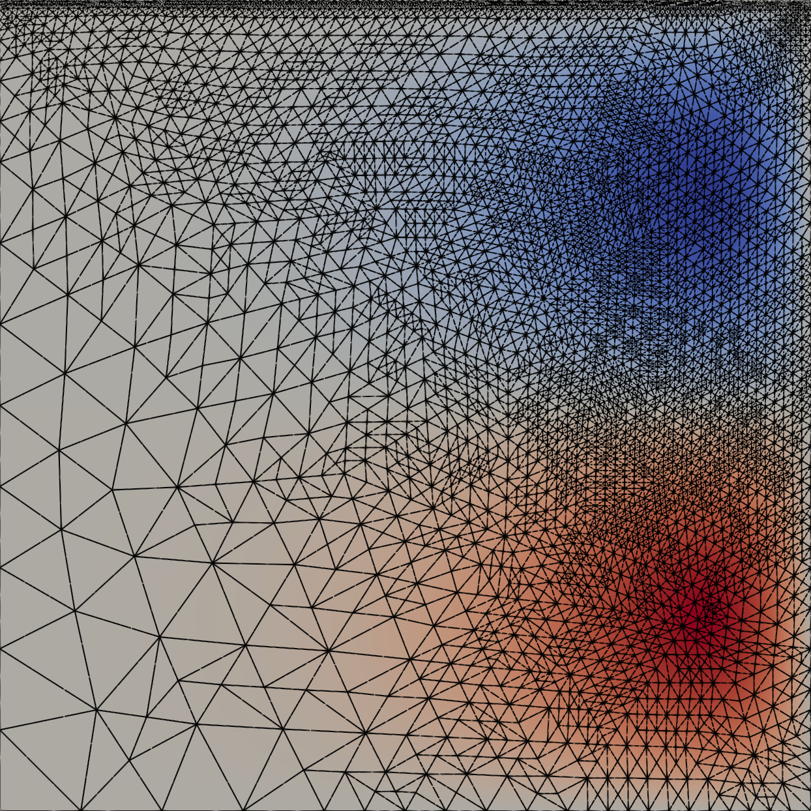

Goal-based adaptivity for stationary boundary value problems
============================================================

.. rst-class:: emphasis

    The dual-weighted residual (DWR) method is a technique for designing global and local
    error estimators for the error in a goal functional :math:`J(u)`, where :math:`u`
    is the solution of a partial differential equation. Deriving the DWR method for
    a specific problem usually involves substantial expertise, in deriving the appropriate
    adjoint equation, residual formulation, etc. In this demo we show how the DWR method
    can be automatically implemented in Firedrake for stationary boundary value problems.

    The demo was contributed by `Patrick Farrell <mailto:patrick.farrell@maths.ox.ac.uk>`__, based on the MSc project of
    `Joseph Flood <mailto:josephdflood01@gmail.com>`__.

The dual-weighted residual (DWR) method :cite:`Becker2001` is a technique for designing global and local error estimators for the error in a goal functional :math:`J(u)`. While implementing DWR by hand involves substantial expertise, the high-level symbolic UFL representation of the problem to solve permits the *automation* of DWR :cite:`Rognes2010`.

In this demo we demonstrate how to automatically apply DWR to a nonlinear stationary boundary-value problem, the :math:`p`-Laplacian:

.. math::
    -\nabla \cdot \left( |\nabla u|^{p-2} \nabla u \right) = f \text{ in } \Omega, \quad u = 0 \text{ on } \partial \Omega.

We solve the problem on a unit square with known analytical solution, so that we can compute effectivity indices of our error estimates.
Since we will be adapting the mesh, :doc:`we must build the domain with Netgen <netgen_mesh.py>`: ::

    from firedrake import *
    from netgen.occ import *
    square = WorkPlane().Rectangle(1, 1).Face().bc("all")
    square.edges.Max(Y).name = "top"
    geo = OCCGeometry(square, dim=2)
    ngmesh = geo.GenerateMesh(maxh=0.1)
    mesh = Mesh(ngmesh)

    degree = 3
    V = FunctionSpace(mesh, "CG", degree)
    (x, y) = SpatialCoordinate(mesh)

    p = Constant(5)
    u_exact = x*(1-x)*y*(1-y)*exp(2*pi*x)*cos(pi*y)
    f = -div(inner(grad(u_exact), grad(u_exact))**((p-2)/2) * grad(u_exact))

    # Since the problem is highly nonlinear, for the purposes of this demo we will
    # cheat and pick our initial guess really close to the exact solution.
    u = Function(V, name="Solution")
    u.interpolate(0.99*u_exact)

    v = TestFunction(V)
    F = (inner(inner(grad(u), grad(u))**((p-2)/2) * grad(u), grad(v)) * dx
         - inner(f, v) * dx(degree=degree+10)
    )
    bcs = DirichletBC(V, u_exact, "on_boundary")
    solver_parameters = {
                 "snes_monitor": None,
                 "snes_atol": 1e-6,
                 "snes_rtol": 1e-12,
                 "snes_linesearch_monitor": None,
                 "snes_linesearch_type": "l2",
                 "snes_linesearch_maxlambda": 1}

To apply goal-based adaptivity, we need a goal functional. For this we will employ the integral of the normal derivative of the solution on the top boundary: ::

    top = tuple(i + 1 for (i, name) in enumerate(ngmesh.GetRegionNames(codim=1)) if name == "top")
    n = FacetNormal(mesh)
    J = inner(grad(u), n)*ds(top)

We now specify options for how the goal-based adaptivity should proceed. We choose to use an expensive/robust approach,
where the adjoint solution is approximated in a higher-degree function space, and where both the adjoint and primal residuals
are employed for the error estimate. This requires four solves on every grid (primal and adjoint solutions with degree :math:`p`
and :math:`p+1`), and gives a provably efficient and reliable error estimator under a saturation assumption up to a term that is cubic in the error :cite:`Endtmayer2024`.
It is possible to employ cheaper approximations by setting the parameters for the :code:`GoalAdaptiveNonlinearVariationalSolver`
appropriately. ::

    dwr_parameters = {
        "max_iterations": 40,
        "use_adjoint_residual": True,
        "dual_low_method": "solve",
        "primal_low_method": "solve",
        "dorfler_alpha": 0.5,
        "dual_extra_degree": 1,
        "run_name": "p-laplace",
        "output_dir": "output/p-laplace",
    }

We then solve the problem, passing the goal functional :math:`J` and our specified tolerance. We also pass the exact solution, so that
the DWR automation can compute effectivity indices, but this is not generally required: ::

    tolerance = 1e-4
    problem = NonlinearVariationalProblem(F, u, bcs)

    adaptive_solver = GoalAdaptiveNonlinearVariationalSolver(problem, J, tolerance, dwr_parameters,
                                                             exact_solution=u_exact,
                                                             primal_solver_parameters=solver_parameters)
    adaptive_solver.solve()

The solver terminates with the goal functional computed to :math:`10^{-4}` after 7 refinements. The error estimates :math:`\eta` are very accurate: their effectivity indices

.. math::

    I = \frac{\eta}{J(u) - J(u_h)}

are very close to one throughout:

+-----------------------+-------------------------------+
| Number of refinements | Effectivity index :math:`I`   |
+=======================+===============================+
| 0                     | 0.9682                        |
+-----------------------+-------------------------------+
| 1                     | 1.0262                        |
+-----------------------+-------------------------------+
| 2                     | 1.0837                        |
+-----------------------+-------------------------------+
| 3                     | 1.0210                        |
+-----------------------+-------------------------------+
| 4                     | 1.0805                        |
+-----------------------+-------------------------------+
| 5                     | 1.0247                        |
+-----------------------+-------------------------------+
| 6                     | 1.0207                        |
+-----------------------+-------------------------------+
| 7                     | 1.2108                        |
+-----------------------+-------------------------------+

Changing the tolerance to :math:`10^{-8}` takes 38 refinements. The resulting mesh is plotted below. The mesh resolution is adaptively concentrated at the top boundary, since the goal functional is localised there.

:demo:`A Python script version of this demo can be found here
<goal_based_adaptivity_bvp.py>`.

.. rubric:: References

.. bibliography:: demo_references.bib
   :filter: docname in docnames
