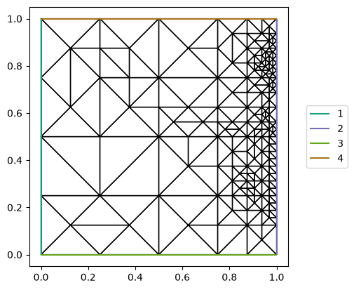

Goal-oriented mesh adaptivity for mixed linear elasticity
=========================================================

This demo uses a dual-weighted residual (DWR) estimator to adapt a mesh for
one particular quantity of interest.  The example is the weakly symmetric
Hellinger--Reissner elasticity problem studied by Rognes and Logg
:cite:`Rognes:2013`.  It is a useful test because its mixed space contains
both :math:`H(\mathrm{div})`- and :math:`L^2`-conforming fields.  It is also
linear, unlike the :doc:`p-Laplacian <goal_oriented_nonlinear_p_laplacian.py>`
that the same machinery handles.

The unknowns are the two rows of the stress :math:`\sigma`, the displacement
:math:`u`, and a scalar rotation :math:`\gamma`.  We use first-order BDM
elements for each stress row, piecewise constants for the displacement, and
continuous linears for the rotation. ::

  from firedrake import *

  mesh = UnitSquareMesh(2, 2)
  stress_row = FunctionSpace(mesh, "BDM", 1)
  displacement = VectorFunctionSpace(mesh, "DG", 0)
  rotation = FunctionSpace(mesh, "CG", 1)
  W = stress_row * stress_row * displacement * rotation

  w = Function(W, name="elasticity solution")
  sigma0, sigma1, u, gamma = split(w)
  tau0, tau1, v, eta = TestFunctions(W)
  sigma = as_tensor((sigma0, sigma1))
  tau = as_tensor((tau0, tau1))

For shear modulus :math:`\mu` and Lamé parameter :math:`\lambda`, the
compliance tensor is

.. math::

   A\sigma = \frac{1}{2\mu}\left(\sigma
   - \frac{\lambda}{2(\mu + \lambda)}\operatorname{tr}(\sigma)I\right).

We manufacture the displacement
:math:`u_0=(xy\sin(\pi y),0)` and use the corresponding body force from the
paper.  Prescribed displacement is a natural boundary condition in this
mixed formulation. ::

  x, y = SpatialCoordinate(mesh)
  mu = Constant(1.0)
  lmbda = Constant(100.0)
  compliance = (
      sigma - lmbda/(2*(mu + lmbda))*tr(sigma)*Identity(2)
  )/(2*mu)

  body_force = as_vector((
      pi*mu*(2*x*cos(pi*y) - pi*x*y*sin(pi*y)),
      (mu + lmbda)*(pi*y*cos(pi*y) + sin(pi*y)),
  ))
  u0 = as_vector((x*y*sin(pi*y), 0))
  n = FacetNormal(mesh)

  F = (
      inner(compliance, tau)
      + inner(div(sigma), v)
      + inner(u, div(tau))
      + inner(sigma[0, 1] - sigma[1, 0], eta)
      + inner(gamma, tau[0, 1] - tau[1, 0])
  )*dx - inner(body_force, v)*dx - inner(u0, dot(tau, n))*ds

Our goal is the weighted average shear traction on the right boundary.  Its
exact value is approximately :math:`-0.06029761071`.  The DWR callback
linearises this functional and solves the low- and enriched-order dual
problems.  It then localises the weak residual with bubble and cone functions,
and marks the cells by the global Dörfler criterion. ::

  psi = y*(y - 1)
  tangent = as_vector((0, 1))
  goal = psi*dot(dot(n, sigma), tangent)*ds(2)

The Hellinger--Reissner system is indefinite.  We therefore ask MUMPS to detect
null pivots (``icntl_24``) rather than give up on the first one it meets.  We
also give it room to grow its working space (``icntl_14``). ::

  solver_parameters = {
      "ksp_type": "preonly",
      "pc_type": "lu",
      "pc_factor_mat_solver_type": "mumps",
      "mat_mumps_icntl_14": 200,
      "mat_mumps_icntl_24": 1,
  }

Each auxiliary solve the estimator performs has its own options prefix, so
none of them is silently configured by the outer solver's options.
``dwr_cell_`` and ``dwr_facet_`` localise the residual onto cells and facets;
both mass-like operators are well conditioned, so a diagonally preconditioned
solve suffices.  ``dwr_enriched_`` is the enriched-order primal solve, whose
Jacobian is reused transposed for the enriched dual.  Left unset, a prefix
inherits the outer solver's options, which for the enriched solve is what we
want here. ::

  solver_parameters.update({
      "dwr_cell_ksp_type": "cg",
      "dwr_cell_pc_type": "jacobi",
      "dwr_facet_ksp_type": "cg",
      "dwr_facet_pc_type": "jacobi",
  })

``snes_adapt_sequence`` bounds the number of SOLVE--ESTIMATE--MARK--REFINE
cycles.  ``dwr_rtol`` stops the loop early once the estimated error in the goal
falls below that fraction of :math:`|J(w_h)|`, and ``dwr_atol`` sets an absolute
tolerance instead.  ``dwr_monitor`` reports the estimate once per cycle, split
into the discretisation part and the algebraic-solve part. ::

  solver_parameters.update({
      "snes_adapt_sequence": 5,
      "dwr_marking_fraction": 0.5,
      "dwr_rtol": 1.0e-3,
      "dwr_monitor": None,
  })

  initial_dofs = W.dim()
  problem = NonlinearVariationalProblem(F, w)
  solver = NonlinearVariationalSolver(
      problem,
      solver_parameters=solver_parameters,
      marking_callback=DWRMarkingCallback(goal),
  )
  w_adapt = solver.solve()

``solver.solve()`` returns the solution on the final adapted mesh.
``solver.get_goal_functional()`` gives the goal functional on that same mesh,
and ``solver.get_error_estimate()`` gives the estimate :math:`\eta` of
:math:`J(w) - J(w_h)` from the last cycle. ::

  adapted_goal = solver.get_goal_functional()

  print(f"degrees of freedom: {initial_dofs} -> {w_adapt.function_space().dim()}")
  print(f"weighted shear traction: {assemble(adapted_goal):.8f}")
  print(f"error estimate: {solver.get_error_estimate():.3e}")

The refinement is driven by the error in this boundary traction, rather than
by a global energy norm.  Cells near the right boundary, where the goal
functional is defined, are refined preferentially over the rest of the
domain. ::

  import matplotlib.pyplot as plt
  from firedrake.pyplot import triplot

  fig, axes = plt.subplots()
  triplot(w_adapt.function_space().mesh().unique(), axes=axes)
  axes.set_aspect("equal")
  axes.legend(loc="center left", bbox_to_anchor=(1.05, 0.5))
  fig.savefig("goal_oriented_linear_elasticity_mesh.png", bbox_inches="tight")

More refinement steps can be requested by increasing ``snes_adapt_sequence``
without writing an explicit solve--estimate--refine loop.  The deliberately
small initial mesh keeps this demo quick.  Five cycles is far from enough to
resolve the traction; reaching the value quoted above takes the longer
sequences of the original study :cite:`Rognes:2013`.

.. rubric:: References

.. bibliography:: demo_references.bib
   :filter: docname in docnames
