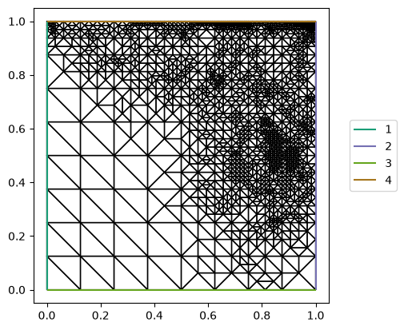

Goal-based adaptivity for stationary boundary value problems
============================================================

.. rst-class:: emphasis

    The dual-weighted residual (DWR) method designs global and local error
    estimators for a goal functional :math:`J(u)`, where :math:`u` solves a
    partial differential equation. Deriving DWR for a
    specific problem usually takes substantial expertise: the appropriate
    adjoint equation, the residual formulation, and so on. This demo shows
    how Firedrake implements DWR automatically for stationary boundary value
    problems.

    The demo was contributed by `Patrick Farrell
    <mailto:patrick.farrell@maths.ox.ac.uk>`__, based on the MSc project of
    `Joseph Flood <mailto:josephdflood01@gmail.com>`__.

The dual-weighted residual method :cite:`Becker:2001` designs global and local
error estimators for the error in a goal functional :math:`J(u)`. While
implementing DWR by hand involves substantial expertise, the high-level
symbolic UFL representation of the problem permits the *automation* of DWR
:cite:`Rognes:2013`.

Here we apply DWR to a nonlinear stationary boundary value problem, the
:math:`p`-Laplacian:

.. math::
    -\nabla \cdot \left( |\nabla u|^{p-2} \nabla u \right) = f \text{ in } \Omega, \quad u = 0 \text{ on } \partial \Omega.

We solve it on the unit square with a known analytical solution, so that we can
compute effectivity indices for our error estimates. Adaptive refinement needs
no special mesh: any Firedrake mesh can be refined in place. ::

  from firedrake import *

  mesh = UnitSquareMesh(8, 8)

  degree = 2
  V = FunctionSpace(mesh, "CG", degree)
  x, y = SpatialCoordinate(mesh)

  p = Constant(5)
  u_exact = x*(1-x)*y*(1-y)*exp(2*pi*x)*cos(pi*y)
  f = -div(inner(grad(u_exact), grad(u_exact))**((p-2)/2) * grad(u_exact))

The manufactured solution vanishes on all four edges, so the boundary condition
is homogeneous. The problem is strongly nonlinear, so for the purposes of this
demo we cheat and start from an initial guess close to the exact solution. The
integrand is not polynomial, so we ask for a richer quadrature rule than the
degree of the space alone would suggest. ::

  u = Function(V, name="Solution")
  u.interpolate(0.99*u_exact)

  v = TestFunction(V)
  quadrature = {"degree": degree + 4}
  F = (inner(inner(grad(u), grad(u))**((p-2)/2) * grad(u), grad(v))*dx(**quadrature)
       - inner(f, v)*dx(**quadrature))
  bcs = DirichletBC(V, 0, "on_boundary")

To apply goal-based adaptivity we need a goal functional. Here we use the
integral of the normal derivative of the solution over the top boundary, which
`UnitSquareMesh` numbers ``4``. ::

  n = FacetNormal(mesh)
  J = inner(grad(u), n)*ds(4)

The estimate splits in two: the error committed by discretising, and the error
committed by not solving the algebraic system exactly. Because DWR measures
that algebraic error too, a very coarse tolerance on the nonlinear solver
costs us nothing. ::

  solver_parameters = {
      "snes_atol": 1.0e-6,
      "snes_rtol": 1.0e-1,
      "snes_linesearch_type": "l2",
      "ksp_type": "preonly",
      "pc_type": "lu",
  }

The DWR machinery localises the residual by projecting it onto cell-bubble and
facet-bubble spaces. Those two auxiliary solves take their own options under
the ``dwr_cell_`` and ``dwr_facet_`` prefixes. Both operators are well
conditioned, so a diagonally preconditioned solve is enough. ::

  solver_parameters.update({
      "dwr_cell_ksp_type": "cg",
      "dwr_cell_pc_type": "jacobi",
      "dwr_facet_ksp_type": "cg",
      "dwr_facet_pc_type": "jacobi",
  })

Now the adaptive loop itself. ``snes_adapt_sequence`` is the *maximum* number
of SOLVE--ESTIMATE--MARK--REFINE cycles. ``dwr_atol`` stops it early once the
estimated error in the goal is small enough, and ``dwr_rtol`` gives a tolerance
relative to :math:`|J(u_h)|` instead. ``dwr_marking_fraction`` is the fraction
of the total estimated error that Dörfler marking must capture, and
``dwr_monitor`` reports the estimate at each cycle. ::

  solver_parameters.update({
      "adaptor_criterion": "refine",
      "snes_adapt_sequence": 10,
      "dwr_atol": 5.0e-3,
      "dwr_marking_fraction": 0.5,
      "dwr_monitor": None,
  })

There is no loop to write here, unlike in the ad hoc implementations such a
method usually needs. PETSc composes the solver, the estimator, the marker and
the refiner, exactly as ``-snes_grid_sequence`` composes a solver with uniform
refinement. All we supply is a marking callback. We also pass the exact
solution, which lets the monitor report the true error and an effectivity
index. That is a diagnostic, and is not needed in general. ::

  initial_dofs = V.dim()
  problem = NonlinearVariationalProblem(F, u, bcs)
  solver = NonlinearVariationalSolver(
      problem,
      solver_parameters=solver_parameters,
      marking_callback=DWRMarkingCallback(J, exact_solution=u_exact),
  )
  uh = solver.solve()

``solver.solve()`` returns the solution on the final adapted mesh, and
``solver.get_error_estimate()`` gives the estimate :math:`\eta` that stopped
the loop. ::

  print(f"degrees of freedom: {initial_dofs} -> {uh.function_space().dim()}")
  print(f"error estimate: {solver.get_error_estimate():.6e}")

The loop terminates after eight refinements, short of the ten it was allowed,
because the estimate fell below ``dwr_atol``. The effectivity indices

.. math::

    I = \frac{\eta}{J(u) - J(u_h)}

printed by ``dwr_monitor`` stay close to one throughout, between roughly
:math:`0.83` and :math:`1.30`. The estimate is therefore a faithful measure of
the error it steers by. Tightening ``dwr_atol`` refines further and drives the
estimate down accordingly.

Because the two parts of the estimate are reported separately, it is easy to see
which one is limiting. On the last cycle this run prints

.. code-block:: text

    DWR: the solver error estimate exceeds the discretisation error estimate,
    so the estimate is dominated by how loosely the algebraic system was
    solved. Tighten the solver tolerances.

By then the mesh is fine enough that the discretisation error falls below the
algebraic error left by a ``snes_rtol`` of :math:`10^{-1}`. Further refinement
is of no use: the algebraic error limits the accuracy of the goal, not the
mesh. Tightening ``snes_rtol`` and ``snes_atol`` is what helps. Here the
estimate already sits within ``dwr_atol``, so the warning is safe to ignore.

Finally we plot the adapted mesh. The refinement concentrates near the top
boundary, where the goal functional lives. Refinement driven by a global energy
norm would instead spread evenly over the domain. ::

  import matplotlib.pyplot as plt
  from firedrake.pyplot import triplot

  fig, axes = plt.subplots()
  triplot(uh.function_space().mesh().unique(), axes=axes)
  axes.set_aspect("equal")
  axes.legend(loc="center left", bbox_to_anchor=(1.05, 0.5))
  fig.savefig("goal_oriented_nonlinear_p_laplacian_mesh.png", bbox_inches="tight")

The estimator used here weights the primal residual by the dual error. Richer
variants exist. Symmetrising the estimate with the adjoint residual leaves a
remainder cubic in the errors rather than quadratic :cite:`Endtmayer:2024`.
That costs two further solves per cycle.

A python script version of this demo can be found :demo:`here
<goal_oriented_nonlinear_p_laplacian.py>`.

.. rubric:: References

.. bibliography:: demo_references.bib
   :filter: docname in docnames
