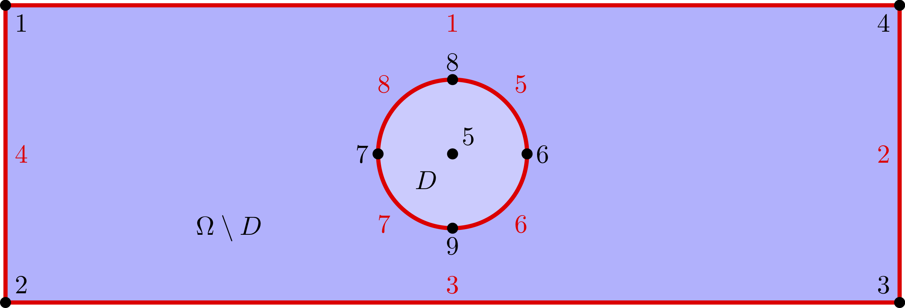
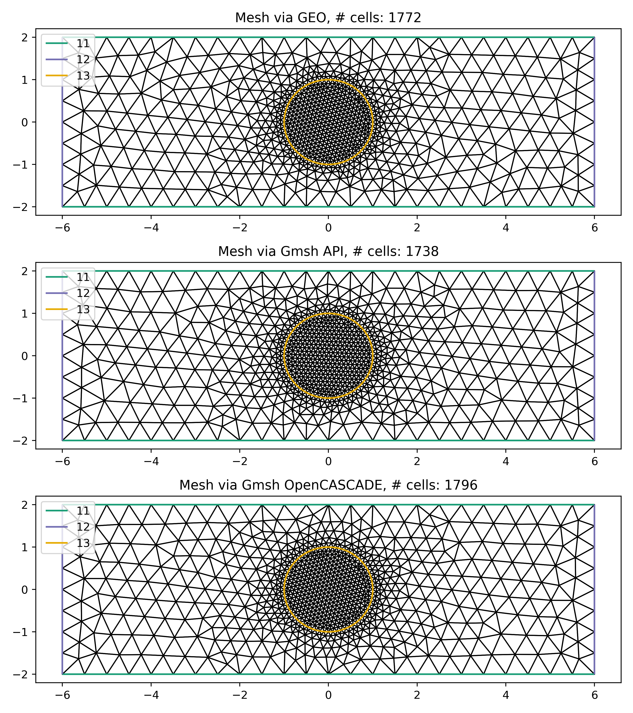

Creating Firedrake-compatible meshes in Gmsh
============================================

The purpose of this demo is to demonstrate methods available
through Gmsh to create meshes compatible with Firedrake. It overviews
the creation the same mesh, three different ways:

* Constructing a GEO file
* Using the Gmsh API
* Using OpenCASCADE through Gmsh
  
For more details about Gmsh, please
refer to the `Gmsh documentation <http://gmsh.info/#Documentation>`_.
The Gmsh syntax used in this document is for Gmsh version 4.4.1. ::

   import matplotlib.pyplot as plt
   from firedrake import *
   import gmsh

As example, we will construct and mesh the following geometry:
a rectangle with a disc in the middle. In the picture,
numbers in black refer to Gmsh point tags, whereas numbers in
red refer to Gmsh curve tags (see below).

Relative to a central origin, ``(x0, y0, z0)``, the rectangle is parameterised by its length ``L``,
and width, ``W``. Likewise, the disc is parameterised its radius, ``R``. The target element size is
set to ``dx_rec=0.5`` and ``dx_disc=0.1`` to generate finer triangles around the disc. ::

   x0, y0, z0 = 0., 0., 0.
   L = 12.
   W = 4.
   R = 1.
   dx_rec  = 0.5
   dx_disc = 0.1 

Constructing a GEO file
-----------------------

The first thing we need to do is to create a Gmsh ``gmsh.geo``,
which is the geometry recipe for Gmsh.

We begin by defining the four corners of a bounding rectangle. We specify the x,y,
and z(=0) coordinates, as well as the target element size at these 
corners.

.. code-block:: none

   Point(1) = {-6,  2, 0, 0.5};
   Point(2) = {-6, -2, 0, 0.5};
   Point(3) = { 6, -2, 0, 0.5};
   Point(4) = { 6,  2, 0, 0.5};

.. note::
   Gmsh tracks most objects through a combination of its dimension, ``dim``
   and an integer tag, ``tag``, which must be unique to the object. For example,
   ``Point(1)`` has dimension 0 and a unique tag 1, while ``Line(1)`` has
   dimension 1 and a unique tag 1.

Then, we define 5 points to describe a circle.

.. code-block:: none

   Point(5) = { 0,  0, 0, 0.1};
   Point(6) = { 1,  0, 0, 0.1};
   Point(7) = {-1,  0, 0, 0.1};
   Point(8) = { 0,  1, 0, 0.1};
   Point(9) = { 0, -1, 0, 0.1};

Then, we create 8 edges: 4 for the rectangle and 4 for the circle.
Note that the Gmsh command ``Circle`` requires the arc to be
strictly smaller than :math:`\pi`.

.. code-block:: none

  Line(1) = {1, 4};
  Line(2) = {4, 3};
  Line(3) = {3, 2};
  Line(4) = {2, 1};
  Circle(5) = {8, 5, 6};
  Circle(6) = {6, 5, 9};
  Circle(7) = {9, 5, 7};
  Circle(8) = {7, 5, 8};

Then, we glue together the rectangle edges and, separately, the circle edges.
Note that ``Line``, ``Circle``, and ``Curve Loop`` (as well as ``Physical Curve`` below)
are all curves in Gmsh and must possess a unique tag.

.. code-block:: none

  Curve Loop( 9) = {1, 2, 3, 4};
  Curve Loop(10) = {8, 5, 6, 7};

Then, we define two plane surfaces: the rectangle without the disc first, and the disc itself then.

.. code-block:: none

  Plane Surface(1) = {9, 10};
  Plane Surface(2) = {10};

Finally, we group together some edges and define ``Physical`` entities.
Firedrake uses the ``tag`` of each physical entity to distinguish
between parts of the mesh (see the concrete example at the end of this page).

.. code-block:: none

  Physical Curve("HorEdges", 11) = {1, 3};
  Physical Curve("VerEdges", 12) = {2, 4};
  Physical Curve("Circle", 13) = {8, 7, 6, 5};
  Physical Surface("PunchedDom", 3) = {1};
  Physical Surface("Disc", 4) = {2};

For simplicity, we have gathered all this commands in the file
:demo:`immersed_domain.geo <immersed_domain.geo>`. To generate a mesh using this file,
you can type the following command in the terminal

.. code-block:: none

   gmsh -2 immersed_domain.geo -format msh2

.. note::

   The ``-2`` flag indicates whether the mesh will be 2 or 3 dimensions. Depending on your 
   version of Gmsh and DMPlex, the Gmsh option ``-format msh2`` may be omitted.

Using the Gmsh API
------------------

We can alternatively use python commands enabled through the Gmsh API to build, save, and
read the mesh into Firedrake from within a python script. This allows for parameter flexibility
and improved readibility of the mesh generation code.

We first need to ``initialize`` the Gmsh API and create a new empty mesh model. ::

   gmsh.initialize()
   model = gmsh.model
   model.add("gmsh_api_demo")

As before, we define the four rectangle corner points and target element size. ::

   rectangle_points = [
   model.geo.addPoint(x0 - L/2, y0 + W/2, z0, dx_rec, tag = 1), # top left
   model.geo.addPoint(x0 - L/2, y0 - W/2, z0, dx_rec, tag = 2), # bottom left
   model.geo.addPoint(x0 + L/2, y0 - W/2, z0, dx_rec, tag = 3), # bottom right
   model.geo.addPoint(x0 + L/2, y0 + W/2, z0, dx_rec, tag = 4)  # top right
   ]

Then, we define 5 points to describe a circle. ::

   center = model.geo.addPoint(x0, y0, z0, tag = 5)
   circle_points = [
   model.geo.addPoint(x0 - R, y0, z0, dx_disc, tag = 6),
   model.geo.addPoint(x0, y0 + R, z0, dx_disc, tag = 7),
   model.geo.addPoint(x0 + R, y0, z0, dx_disc, tag = 8),
   model.geo.addPoint(x0, y0 - R, z0, dx_disc, tag = 9)
   ]

Then, we create 8 edges: 4 for the rectangle and 4 for the circle. ::

   rectangle_lines = [
   model.geo.addLine(rectangle_points[0], rectangle_points[1], tag = 1), # left
   model.geo.addLine(rectangle_points[1], rectangle_points[2], tag = 2), # bottom
   model.geo.addLine(rectangle_points[2], rectangle_points[3], tag = 3), # right
   model.geo.addLine(rectangle_points[3], rectangle_points[0], tag = 4)  # top
   ]

   circle_arcs =[
   model.geo.addCircleArc(circle_points[0], center, circle_points[1], tag = 5),
   model.geo.addCircleArc(circle_points[1], center, circle_points[2], tag = 6),
   model.geo.addCircleArc(circle_points[2], center, circle_points[3], tag = 7),
   model.geo.addCircleArc(circle_points[3], center, circle_points[0], tag = 8)
   ]

We then combine the edges into a closed loop for both the rectangle and
the circle used to define a surface for the area outside and inside the 
inscribed circle, respectively. In the ``addPlaneSurface`` function by 
convention, the first ``Curve Loop`` defines the outer boundary and
anything after in the list is treated as the boundary of a hole (or holes)
in the domain. The integerThese need to be registered to the model with ``syncronize`` 
before we can use them. ::

   rectangle_loop = model.geo.addCurveLoop(rectangle_lines, tag = 9)
   circle_loop = model.geo.addCurveLoop(circle_arcs, tag = 10)

   punched_surface = model.geo.addPlaneSurface([rectangle_loop,circle_loop], tag = 1)
   circle_surface = model.geo.addPlaneSurface([circle_loop], tag = 2)
   model.geo.synchronize()
   
Finally, we group together some edges and define ``Physical`` entities. ::

   model.addPhysicalGroup(dim = 1, tags = [rectangle_lines[1], rectangle_lines[3]], tag = 11, name="HorEdges")
   model.addPhysicalGroup(dim = 1, tags = [rectangle_lines[0], rectangle_lines[2]], tag = 12, name="VerEdges")
   model.addPhysicalGroup(dim = 1, tags = circle_arcs, tag = 13, name="Circle")
   model.addPhysicalGroup(dim = 2, tags = [punched_surface], tag = 3, name="PunchedDom")
   model.addPhysicalGroup(dim = 2, tags = [circle_surface], tag = 4, name="Disc")

A number of meshing options are available. In particular, the algorithm for mesh generation
and can be set globally or for individual surfaces.

* 2D: 1: MeshAdapt, 2: Automatic, 3: Initial mesh only, 5: Delaunay, 6: Frontal-Delaunay (default),\
  7: BAMG, 8: Frontal-Delaunay for Quads, 9: Packing of Parallelograms, 11: Quasi-structured Quad
* 3D: Delaunay (default) 3: Initial mesh only 4: Frontal 7: MMG3D 9: R-tree 10: HXT

For more information see the `Gmsh algorithm overview <https://gmsh.info/doc/texinfo/gmsh.html#Choosing-the-right-unstructured-algorithm>`_.

When writing the mesh to file, the format is determined by the file extension. For example,
`.msh2` for Gmsh 2.x, `.msh` for GMSH 4.x. ::

   gmsh.option.setNumber("Mesh.Algorithm", 6)
   gmsh.option.setNumber("Mesh.MshFileVersion", 4.1)
   gmsh.model.mesh.generate(2)
   gmsh.write('gmsh_api_demo.msh')
   
We close the Gmsh API kernel after finalising the mesh. ::

   gmsh.finalize()

Using OpenCASCADE through Gmsh
------------------------------

Using OpenCASCADE through Gmsh, we define higher level geometries such as rectangles 
and discs directly. It also has additional 3D capability, and integration not illustrated
here. Please see the  `OpenCASCADE documentation <https://gmsh.info/doc/texinfo/gmsh.html#Namespace-gmsh_002fmodel_002focc>`_
in Gmsh for more details.

As with the Gmsh API, we ``initialize`` and start constructing a new mesh model. ::

   gmsh.initialize()
   model = gmsh.model
   gmsh.model.add("gmsh_occ_demo")

We first use OpenCASCADE to create a rectangle and a cylinder object. This automates
the create of points, lines, and surfaces. Both objects need to be registered to the 
model with ``synchronize`` before we can use them. ::

   rectangle_obj_tag = model.occ.addRectangle(x0 - L/2, y0 - W/2, z0, L, W, tag = 1)
   disc_obj_tag = model.occ.addDisk(x0, y0, z0, rx = R, ry = R, tag = 2)
   model.occ.synchronize()

To create the whole, we use the method ``occ.cut`` with the option ``removeTool=False`` to 
retain the disc interior (which would be otherwise deleted by default). The ``occ.cut`` method
takes and returns a list of tuples ``(dimension, tag)`` as do other functions such as 
``getBoundary`` used below. We save the tag of the combined object for later use 
and register the new object to the model with ``syncronize``. ::

   punched_surface = model.occ.cut([(2, rectangle_obj_tag)], [(2, disc_obj_tag)], removeTool=False)
   punched_surface_tag = punched_surface[0][0][1]
   model.occ.synchronize()

We then extact the boundary from the objects.  We extract the the punched surface
lines along with disc points to define the ``Physical`` groups. It returns boundaries
per entity (``combined = false``) or as a single shape (``combined = true``), and 
adjust the signs to reflect orientation if ``oriented = true``. The boundary operator 
is applied down to point-level, or dimension 0, when ``recursive = True``. ::

   punched_lines = model.getBoundary([(2, punched_surface_tag)],
                                        combined = True, oriented = True, recursive = False)
   disc_points = model.getBoundary([(2, disc_obj_tag)],
                                        combined = True, oriented = True, recursive = True)

We set the mesh resolution using ``setSize``. The choice here is to first set all the
zero-dimensional points to the background size, and then override the mesh size for the 
points on the circle boundary. Another strategy documented in the Gmsh manual is to
identify the desired points by a bounding box search. ::

   model.mesh.setSize(gmsh.model.occ.getEntities(0), dx_rec)
   model.mesh.setSize(disc_points, dx_disc)

We parse just the line tags to create a list of physical group tags. In this case the
assignment of the lines was done manually through trial and inspection. 
TODO: add a function to automatically assign the lines to the physical groups. ::

   punched_line_tags = [abs(line) for dim,line in punched_lines]
   model.addPhysicalGroup(dim = 1, tags = [punched_line_tags[1], punched_line_tags[4]], tag = 11, name="HorEdges")
   model.addPhysicalGroup(dim = 1, tags = [punched_line_tags[2], punched_line_tags[3]], tag = 12, name="VertEdges")
   model.addPhysicalGroup(dim = 1, tags = [punched_line_tags[0]], tag = 13, name="CircleEdge")
   model.addPhysicalGroup(dim = 2, tags = [punched_surface_tag], tag = 3, name="PunchedDom")
   model.addPhysicalGroup(dim = 2, tags = [disc_obj_tag], tag = 4, name="Disc")

   gmsh.option.setNumber("Mesh.Algorithm", 6)
   gmsh.model.mesh.generate(2)
   gmsh.write('gmsh_occ_demo.msh')
   gmsh.finalize()

Compare Meshes
--------------
We can load and check the generated meshes in Firedrake. ::

   meshes = [Mesh('gmsh_occ_demo.msh', name = "Gmsh API"),
             Mesh('gmsh_api_demo.msh', name = "Gmsh OpenCASCADE")]
   fig, ax = plt.subplots(len(meshes), 1, figsize = (8, len(meshes)*3), tight_layout=True)
   for m, ax in zip(meshes, ax):
      triplot(m, axes=ax)
      ax.set_title(f'Mesh via {m.name}, # cells: {m.num_cells()}')
      ax.legend(loc='upper left')   

   fig.savefig("gmsh_demo.png", dpi = 400)

Illustrate Features
-------------------

To illustrate how to access all these features within Firedrake,
we consider the following interface problem. Denoting by
:math:`\Omega` the filled rectangle and by :math:`D` the disc,
we seek a function :math:`u\in H^1_0(\Omega)` such that

.. math::

   -\nabla \cdot (\sigma \nabla  u) + u = 5 \quad \textrm{in } \Omega

where :math:`\sigma = 1` in :math:`\Omega \setminus D` and :math:`\sigma = 2`
in :math:`D`. Since :math:`\sigma` attains different values across :math:`\partial D`,
we need to prescribe the behavior of :math:`u` across this interface. This is
implicitly done by imposing :math:`u\in H^1_0(\Omega)`: the function :math:`u` must be continuous
across :math:`\partial \Omega`. This allows us to employ Lagrangian finite elements
to approximate :math:`u`. However, we also need to specify the the jump
of :math:`\sigma \nabla u \cdot \vec{n}` on :math:`\partial D`. This term arises
naturally in the weak formulation of the problem under consideration. In this demo
we simply set

.. math::

   [\![\sigma \nabla u \cdot \vec{n}]\!]= 3 \quad \textrm{on}\ \partial D

The resulting weak formulation reads as follows:

.. math::

   \int_\Omega \sigma \nabla u \cdot \nabla v + uv \,\mathrm{d}\mathbf{x} - \int_{\partial D} 3v \,\mathrm{d}S = \int_{\Omega} 5v \,\mathrm{d}\mathbf{x} \quad \text{for every } v\in H^1_0(\Omega)\,.

The following Firedrake code shows how to solve this variational problem
using linear Lagrangian finite elements. ::

   # load the mesh generated with Gmsh
   mesh = Mesh('gmsh_occ_demo.msh')

   # define the space of linear Lagrangian finite elements
   V = FunctionSpace(mesh, "CG", 1)

   # define the trial function u and the test function v
   u = TrialFunction(V)
   v = TestFunction(V)

   # define the bilinear form of the problem under consideration
   # to specify the domain of integration, the surface tag is specified in brackets after dx
   # in this example, 3 is the tag of the rectangle without the disc, and 4 is the disc tag
   a = 2*dot(grad(v), grad(u))*dx(4) + dot(grad(v), grad(u))*dx(3) + v*u*dx

   # define the linear form of the problem under consideration
   # to specify the boundary of the boundary integral, the boundary tag is specified after dS
   # note the use of dS due to 13 not being an external boundary
   # Since the dS integral is an interior one, we must restrict the
   # test function: since the space is continuous, we arbitrarily pick
   # the '+' side.
   L = Constant(5.) * v * dx + Constant(3.)*v('+')*dS(13)

   # set homogeneous Dirichlet boundary conditions on the rectangle boundaries
   # the tag  11 referes to the horizontal edges, the tag 12 refers to the vertical edges
   DirBC = DirichletBC(V, 0, [11, 12])

   # define u to contain the solution to the problem under consideration
   u = Function(V)

   # solve the variational problem
   solve(a == L, u, bcs=DirBC, solver_parameters={'ksp_type': 'cg'})

A python script version of this demo can be found :demo:`here <immersed_fem.py>`.
