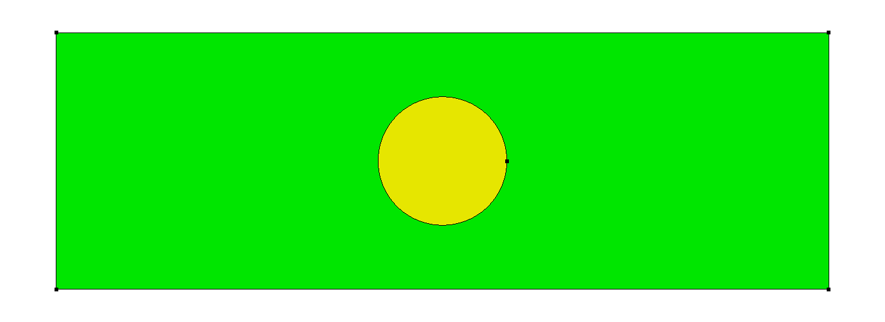

Creating Firedrake-compatible meshes in Cubit
=============================================

The purpose of this demo is to summarize the use of Coreform Cubit 
--- the commercial distribution of the CUBIT software that is developed by 
Sandia National Laboratories (see `Sandia's CUBIT webpage <cubit.sandia.gov>`_ for more information) 
--- for creating a Firedrake-compatible mesh using the Exodus format. 
For more details about Coreform Cubit, please refer to the 
`Coreform Cubit documentation documentation <https://coreform.com/products/coreform-cubit/documentation/>`_.
For more details about the open-source Exodus mesh format,
please refer to the documentation on the 
Sandia Engineering Analysis Code Access System (SEACAS) project's
`homepage <https://gsjaardema.github.io/seacas-docs/sphinx/html/index.html>`_ or
`their GitHub page <https://github.com/gsjaardema/seacas>`_.
While this demo focuses on using CUBIT and/or Coreform Cubit for constructing
Exodus meshes, the SEACAS page provides utilities and detailed information
for creating Exodus meshes programmatically.  For example, the user could
use any mesh-generation library available in Matlab, Python, Julia, C++, Fortran, etc., 
construct the proper datatype in said language, and then export directly to 
the Exodus format.  This excercise is left to the reader.

As example, we will construct and mesh a rectangle with a disc
in the middle as shown in the below image

The first thing we define are the two primitive geometries
We create a rectangular surface and a circle, both centered at the origin.

.. code-block:: none

  create surface rectangle width 12 height 4 zplane
  create surface circle radius 1 zplane 
  
Then we subtract the circle from the rectangle, 
but keep the circle, thus resulting in two surfaces: 
(1) a rectangle with a circular hole, and
(2) a circle

.. code-block:: none

  subtract volume 2 from volume 1 keep_tool

These two surfaces do not share their boundaries with eachother,
and meshing at this state would result in a non-conforming interface.
By applying Cubit's "merge" operation to these two surface entities, 
their boundary curves (which are effectively duplicates) will be merged
into a single curve, resulting in a conforming mesh interface.

.. code-block:: none

  merge all

We then assign Exodus set entities (block, sideset, nodeset)
as relevant to our model.  The reader is referred to the Exodus
documentation for more information regarding these set entities.

.. code-block:: none

  sideset 11 add curve 1 3
  sideset 11 name "HorEdges"
  sideset 12 add curve 2 4
  sideset 12 name "VerEdges"
  sideset 13 add curve 5
  sideset 13 name "Interface"
  block 3 add surface 1
  block 3 name "PunchedDom"
  block 4 add surface 2
  block 4 name "Disc"

Next we build a triangle mesh on these surfaces

.. code-block:: none

  Trimesher surface gradation 1.3
  Trimesher geometry sizing on
  surface all  scheme trimesh geometry approximation angle 5
  surface 3 size 0.3
  surface 2 size 0.1
  mesh surface all

Alternatively, we could have built a quadrilateral mesh on these surfaces
instead of the triangle mesh

.. code-block:: none

  paver cleanup extend
  surface 2 scheme circle
  surface 3 scheme pave
  surface 3 size 0.3
  surface 2 size 0.1
  mesh surface all

We then specify the base element type for the mesh we've created
For the triangle mesh we would set the element type to `tri3` 
which is an Exodus triangular element embedded in 2D-space 
-- the XY-plane to be specific. 

.. code-block:: none

  block 3 4 element type tri3

For the quadrilateral mesh we would set the element type to `quad4`
which is an Exodus quadrilateral element embedded in 2D-space 
-- again the XY-plane to be specific. 

.. code-block:: none

  block 3 4 element type quad4

Finally, we export the mesh as an Exodus file

.. code-block:: none

  set exodus netcdf4 off
  set large exodus file on
  export mesh "immersed_domain_quad.e"  overwrite

For simplicity, we have gathered these commands into the two journal files
`immersed_domain_tri.jou <immersed_domain_tri.jou>`__ and
`immersed_domain_quad.jou <immersed_domain_quad.jou>`__. 

To generate a mesh using either file,
you can type either of the following commands in the terminal

.. code-block:: bash

  coreform_cubit -nog -batch immersed_domain_tri.jou
  coreform_cubit -nog -batch immersed_domain_quad.jou

or if using a Windows version of Coreform Cubit:

.. code-block:: bash

  coreform_cubit.com -nog -batch immersed_domain_tri.jou
  coreform_cubit.com -nog -batch immersed_domain_quad.jou

Note that the above commands are specific to Coreform Cubit.  If using the Sandia
distribution of CUBIT one would instead use:

.. code-block:: bash

  cubit -nog -batch immersed_domain_tri.jou
  cubit -nog -batch immersed_domain_quad.jou

To illustrate how to access all these features within Firedrake,
we consider the following interface problem. Denoting by
:math:`\Omega` the filled rectangle and by :math:`D` the disc,
we seek a function :math:`u\in H^1_0(\Omega)` such that

.. math::

   -\nabla \cdot (\sigma \nabla  u) + u = 5 \quad \textrm{in } \Omega

where :math:`\sigma = 1` in :math:`\Omega \setminus D` and :math:`\sigma = 2`
in :math:`D`. Since :math:`\sigma` attains different values across :math:`\partial D`,
we need to prescribe the behavior of :math:`u` across this interface. This is
implicitly done by imposing :math:`u\in H^1_0(\Omega)`: the function :math:`u` must be continuous
across :math:`\partial \Omega`. This allows us to employ Lagrangian finite elements
to approximate :math:`u`. However, we also need to specify the the jump
of :math:`\sigma \nabla u \cdot \vec{n}` on :math:`\partial D`. This term arises
naturally in the weak formulation of the problem under consideration. In this demo
we simply set

.. math::

   [\![\sigma \nabla u \cdot \vec{n}]\!]= 3 \quad \textrm{on}\ \partial D

The resulting weak formulation reads as follows:

.. math::

   \int_\Omega \sigma \nabla u \cdot \nabla v + uv \,\mathrm{d}\mathbf{x} - \int_{\partial D} 3v \,\mathrm{d}S = \int_{\Omega} 5v \,\mathrm{d}\mathbf{x} \quad \text{for every } v\in H^1_0(\Omega)\,.

The following Firedrake code shows how to solve this variational problem
using linear Lagrangian finite elements. ::

   from firedrake import *

   # load the mesh generated with Cubit
   mesh = Mesh('immersed_domain_quad.e')
   # to use a trimesh instead, comment the above line and uncomment the following line
   #mesh = Mesh('immersed_domain_tri.e')

   # define the space of linear Lagrangian finite elements
   V = FunctionSpace(mesh, "CG", 1)

   # define the trial function u and the test function v
   u = TrialFunction(V)
   v = TestFunction(V)

   # define the bilinear form of the problem under consideration
   # to specify the domain of integration, the surface tag is specified in brackets after dx
   # in this example, 3 is the tag of the rectangle without the disc, and 4 is the disc tag
   a = 2*dot(grad(v), grad(u))*dx(4) + dot(grad(v), grad(u))*dx(3) + v*u*dx

   # define the linear form of the problem under consideration
   # to specify the boundary of the boundary integral, the boundary tag is specified after dS
   # note the use of dS due to 13 not being an external boundary
   # Since the dS integral is an interior one, we must restrict the
   # test function: since the space is continuous, we arbitrarily pick
   # the '+' side.
   L = Constant(5.) * v * dx + Constant(3.)*v('+')*dS(13)

   # set homogeneous Dirichlet boundary conditions on the rectangle boundaries
   # the tag  11 referes to the horizontal edges, the tag 12 refers to the vertical edges
   DirBC = DirichletBC(V, 0, [11, 12])

   # define u to contain the solution to the problem under consideration
   u = Function(V)

   # solve the variational problem
   solve(a == L, u, bcs=DirBC, solver_parameters={'ksp_type': 'cg'})

A python script version of this demo can be found `here <immersed_fem.py>`__.
