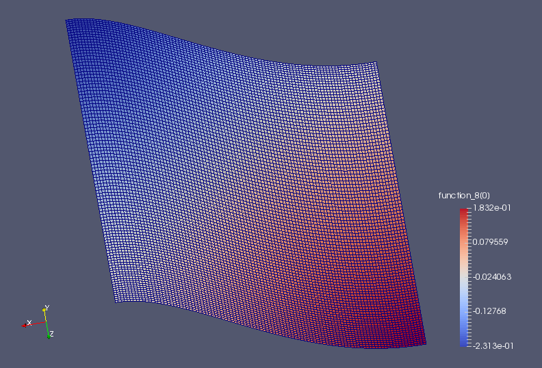

..  # -*- coding=utf-8 -*-

The Monge-Ampère equation
=========================

.. rst-class:: emphasis

   This tutorial was contributed by `Colin Cotter
   <mailto:colin.cotter@imperial.ac.uk>`__, based on code from `Andrew
   McRae <mailto:A.T.T.McRae@bath.ac.uk>`__ and `Lawrence Mitchell
   <mailto:lawrence.mitchell@imperial.ac.uk>`__.

The Monge-Ampère equation provides the solution to the optimal
transportation problem between two measures. Here, we consider the
case where the target measure is the usual Lebesgue measure, and the
template measure is :math:`f(x)d^nx`, both defined on the same
domain. Then, in two dimensions, the optimal transportation plan is
given by

.. math::
   (x,y) \mapsto (x,y) + \nabla u,

where :math:`u` satisfies the the Monge-Ampère equation

.. math::

   \det\left(I + D^2 u\right) = f,

where :math:`I` is the identity matrix, and :math:`D^2` is
the Hessian matrix of second derivatives, subject to the boundary
conditions :math:`\frac{\partial u}{\partial n}=0`.

Here we follow the approach of :cite:`lakkis2013finite`, namely
to use the mixed formulation

.. math::
   \sigma = D^2 u,

   \det(I + \sigma) = f,

where :math:`\sigma` is a :math:`2\times 2` tensor.

Written in weak form, our problem is to find :math:`(u, \sigma) \in
V\times \Sigma = W` such that

.. math::
   \int_\Omega \tau:(\sigma + D^2u)\,\mathrm{d}x
   - \int_{\partial\Omega} \tau_{12}n_2u_x + \tau_{21}n_1u_y\,\mathrm{d}s
     &=0, \quad \forall \tau \in \Sigma

   \int_\Omega v\det(I + \sigma)\,\mathrm{d}x = \int_\Omega
   fv\,\mathrm{d}x \quad \forall v \in V.

This is called a nonvariational discretisation since the PDE is not in
a divergence form. Note that we have dropped the boundary terms that
vanish due to the boundary condition. To proceed in the
discretisation, we simply choose :math:`V` to be a continuous
degree-k finite element space, and :math:`\Sigma` to be the :math:`2 \times 2`
tensor continuous finite element space of the same degree. Since we have
Neumann boundary conditions, this variational problem has a null space
consisting of the constant functions in :math:`V`.

For Dirichlet boundary conditions, :cite:`awanou2014quadratic` proved
that this algorithm converges when :math:`k>1`. Note that
the Jacobian system arising from Newton is only elliptic when
:math:`I + \sigma` is positive-definite; it is observed that
positive-definiteness is preserved by Newton iteration and hence we
must be careful to choose an appropriate initial guess. This is one of
the reasons why we have set things up with :math:`I + \sigma` here
instead of :math:`\sigma` as is more conventional for these equations,
since then :math:`u=0` is an appropriate initial guess. This setup
also makes the application of the weak boundary conditions easier.

We now proceed to set up the problem in Firedrake using a square
mesh of quadrilaterals. ::

  from firedrake import *
  n = 100
  mesh = UnitSquareMesh(n, n, quadrilateral=True)

We construct the quadratic function space for :math:`u`, ::

  V = FunctionSpace(mesh, "CG", 2)

and the function space for :math:`\sigma`. ::

  Sigma = TensorFunctionSpace(mesh, "CG", 2)

We then combine them together in a mixed function space. ::

  W = V*Sigma

Next, we set up the source function, which must integrate to the area
of the domain.  Note how in the integration of the :class:`~.Constant`
one, we must explicitly specify the domain we wish to integrate over. ::

  x, y = SpatialCoordinate(mesh)
  fexpr = exp(-(cos(x)**2 + cos(y)**2))
  f = Function(V).interpolate(fexpr)
  scaling = assemble(Constant(1, domain=mesh)*dx)/assemble(f*dx)
  f *= scaling
  assert abs(assemble(f*dx)-assemble(Constant(1, domain=mesh)*dx)) < 1.0e-8

Now we build the UFL expression for the variational form. We will use
the nonlinear solve, so the form needs to be a 1-form that depends on
a Function, w. ::

  v, tau = TestFunctions(W)
  w = Function(W)
  u, sigma = split(w)

  n = FacetNormal(mesh)

  I = Identity(mesh.geometric_dimension())

  L = inner(sigma, tau)*dx
  L += (inner(div(tau), grad(u))*dx
        - (tau[0, 1]*n[1]*u.dx(0) + tau[1, 0]*n[0]*u.dx(1))*ds)
  L -= (det(I + sigma) - f)*v*dx

We must specify the nullspace for the operator. First we define a constant
nullspace, ::

  V_basis = VectorSpaceBasis(constant=True)

then we use it to build a nullspace of the mixed function space :math:`W`. ::

  nullspace = MixedVectorSpaceBasis(W, [V_basis, W.sub(1)])

Then we set up the variational problem. ::

  u_prob = NonlinearVariationalProblem(L, w)

We need to set quite a few solver options, so we'll put them into a
dictionary. ::

  sp_it = {

We'll only use stationary preconditioners in the Schur complement, so
we can get away with GMRES applied to the whole mixed system ::

  #
     "ksp_type": "gmres",

We set up a Schur preconditioner, which is of type "fieldsplit". We also
need to tell the preconditioner that we want to eliminate :math:`\sigma`,
which is field "1", to get an equation for :math:`u`, which is field "0". ::

  #
     "pc_type": "fieldsplit",
     "pc_fieldsplit_type": "schur",
     "pc_fieldsplit_0_fields": "1",
     "pc_fieldsplit_1_fields": "0",

The "selfp" option selects a diagonal approximation of the A00 block. ::

  #
     "pc_fieldsplit_schur_precondition": "selfp",

We just use ILU to approximate the inverse of A00, without a KSP solver, ::

  #
     "fieldsplit_0_pc_type": "ilu",
     "fieldsplit_0_ksp_type": "preonly",

and use GAMG to approximate the inverse of the Schur complement matrix. ::

  #
     "fieldsplit_1_ksp_type": "preonly",
     "fieldsplit_1_pc_type": "gamg",
     "fieldsplit_1_mg_levels_pc_type": "sor",

Finally, we'd like to see some output to check things are working, and
to limit the KSP solver to 20 iterations. ::

  #
     "ksp_monitor": None,
     "ksp_max_it": 20,
     "snes_monitor": None
     }

We then put all of these options into the iterative solver, ::

  u_solv = NonlinearVariationalSolver(u_prob, nullspace=nullspace,
                                      solver_parameters=sp_it)

and output the solution to a file. ::

  u, sigma = w.subfunctions
  u_solv.solve()
  VTKFile("u.pvd").write(u)

An image of the solution is shown below.

A python script version of this demo can be found :demo:`here
<ma-demo.py>`.

.. rubric:: References

.. bibliography:: demo_references.bib
   :filter: docname in docnames
