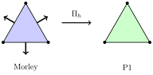

Modified Morley Element for a Fourth-Order Singular Perturbation Problem
========================================================================

This demo solves a fourth-order elliptic singular perturbation problem with the
modified Morley element of Wang, Xu and Hu (*Modified Morley element method for
a fourth order elliptic singular perturbation problem*, J. Comput. Math. 24
(2006), 113-120). Like the :doc:`MITC plate bending demo <plate_bending_mitc.py>`,
it writes a reduction operator as a symbolic ``interpolate`` inside the
variational form; here the operator sits in the *lower* order term, and it is
what makes the method converge uniformly as the perturbation parameter vanishes.

Background and Formulation
--------------------------

On a polygonal domain :math:`\Omega \subset \mathbb{R}^2` we seek :math:`u` with

.. math::

  \varepsilon^2 \Delta^2 u - \Delta u = f \quad \text{in } \Omega, \qquad
  u = \frac{\partial u}{\partial \nu} = 0 \quad \text{on } \partial\Omega,

for a small parameter :math:`0 < \varepsilon \le 1`. As :math:`\varepsilon \to 0`
the equation formally degenerates to the Poisson problem
:math:`-\Delta u^0 = f`, and a method for the fourth-order problem is only
useful here if it degenerates the same way.

The Morley element is the cheapest triangular element for fourth-order
problems, but it is not a :math:`C^0` element: the plain Morley discretisation
of the equation above is divergent as :math:`\varepsilon \to 0`. The modified
method keeps the Morley element for the fourth-order term and replaces the
second-order term by its linear conforming interpolant. Writing
:math:`\Pi_h : V_h \to P_h` for interpolation into the linear Lagrange space,
the discrete problem is

.. math::

  \varepsilon^2 a_h(u_h, v_h) + b_h(\Pi_h u_h, \Pi_h v_h)
  = (f, \Pi_h v_h) \qquad \forall v_h \in V_h,

with the broken forms

.. math::

  a_h(v, w) = \sum_{T} \int_T \nabla^2 v : \nabla^2 w \, \mathrm{d}x, \qquad
  b_h(v, w) = \sum_{T} \int_T \nabla v \cdot \nabla w \, \mathrm{d}x.

At :math:`\varepsilon = 0` this collapses to :math:`b_h(\Pi_h u_h, \Pi_h v_h) =
(f, \Pi_h v_h)`, which is the linear conforming discretisation of the Poisson
problem -- so :math:`\Pi_h u_h` is exactly the :math:`P_1` solution of the
degenerate equation. We reproduce that limit numerically at the end.

Element Spaces
--------------

The following diagram shows the two elements and the operator between them:

* **Morley**: the quadratic nonconforming element for fourth-order problems.
  Its degrees of freedom are the values at the vertices and the averaged
  outward normal derivatives on the edges, drawn as arrows.
* **P1**: the linear Lagrange element, whose degrees of freedom are the vertex
  values alone. The reduction operator :math:`\Pi_h` keeps those vertex values
  and discards the normal derivatives.

We begin by importing the Firedrake namespace.

::

  from firedrake import *

Mesh and Function Spaces
------------------------

We take a uniform triangulation of the unit square. :math:`V` carries the
Morley element and :math:`P` the linear conforming space that the reduction
operator maps into.

::

  n = 16
  mesh = UnitSquareMesh(n, n)

  V = FunctionSpace(mesh, "Morley", 2)
  P = FunctionSpace(mesh, "CG", 1)

Variational Formulation
-----------------------

We declare the trial and test functions on the Morley space, along with the
perturbation parameter.

::

  u = TrialFunction(V)
  v = TestFunction(V)

  epsilon = Constant(1E-2)

The reduction operator is written directly as a symbolic ``interpolate`` of an
argument. Because the interpolation is onto the same mesh, the form compiler
fuses it into the surrounding integral rather than assembling a separate
operator, so ``grad(Pi_u)`` differentiates the interpolant in place.

::

  Pi_u = interpolate(u, P)
  Pi_v = interpolate(v, P)

  a_bending = inner(grad(grad(u)), grad(grad(v))) * dx
  a_membrane = inner(grad(Pi_u), grad(Pi_v)) * dx

Boundary Conditions
-------------------

The clamped conditions ask for both :math:`u` and its normal derivative to
vanish. Firedrake does not implement strong boundary conditions on the Morley
element, whose degrees of freedom are not all point values, so we impose both
weakly with a penalty. The deflection is penalised through the conforming
interpolant, which is the trace the second-order term sees, and the normal
derivative is penalised on the Morley function itself.

::

  normal = FacetNormal(mesh)
  h = CellDiameter(mesh)
  alpha = Constant(20.0)

  a_penalty = (alpha / h * inner(Pi_u, Pi_v) * ds
               + epsilon**2 * alpha / h
               * inner(dot(grad(u), normal), dot(grad(v), normal)) * ds)

  a = epsilon**2 * a_bending + a_membrane + a_penalty

The load is applied through the same reduction operator as the second-order
term, matching the right-hand side of the discrete problem.

::

  f = Constant(1.0)
  L = inner(f, Pi_v) * dx

Computation
-----------

We solve the problem in the usual way.

::

  uh = Function(V)
  solve(a == L, uh)

The Degenerate Limit
--------------------

To see that the method degenerates correctly, we solve the Poisson problem that
the equation approaches, discretised with the same linear conforming space and
the same weak boundary condition.

::

  p = TrialFunction(P)
  q = TestFunction(P)

  a_poisson = inner(grad(p), grad(q)) * dx + alpha / h * inner(p, q) * ds
  L_poisson = inner(f, q) * dx

  u_poisson = Function(P)
  solve(a_poisson == L_poisson, u_poisson)

The reduced solution :math:`\Pi_h u_h` should agree with it to
:math:`O(\varepsilon^2)`.

::

  Pi_uh = assemble(interpolate(uh, P))
  difference = errornorm(u_poisson, Pi_uh)
  print(f"epsilon = {float(epsilon):.1e}, "
        f"relative difference = {difference / norm(u_poisson):.4f}")

  assert difference < 0.05 * norm(u_poisson)

Repeating the solve over a range of :math:`\varepsilon` shows the difference
falling quadratically, so the discretisation is uniform in the perturbation
parameter rather than degenerating with it.

Finally, we output the reduced deflection for visualisation in ParaView.

::

  VTKFile("modified_morley.pvd").write(Pi_uh)
