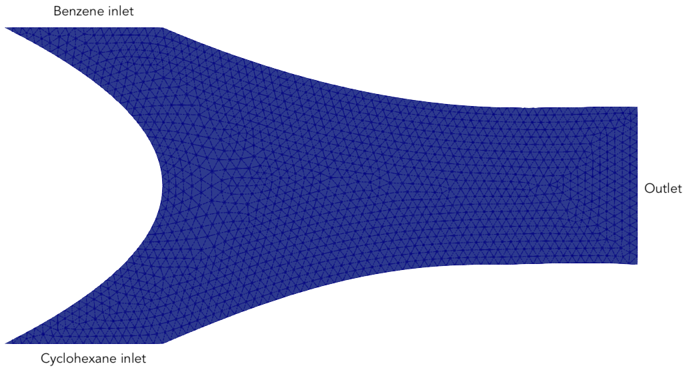

Multicomponent flow -- microfluidic non-ideal mixing of hydrocarbons
===================================================

.. rst-class:: emphasis

    We show how Firedrake can be used to simulate multicomponent flow,
    specifically the microfluidic non-ideal mixing of benzene and cyclohexane.

    The demo was contributed by `Aaron Baier-Reinio
    <mailto:baierreinio@maths.ox.ac.uk>`__ and `Kars Knook
    <mailto:knook@maths.ox.ac.uk>`__.

Multicomponent fluids are those composed of two or more species. Solving the equations
describing such fluids is challenging, because there are many variables to solve for, the
equations are nonlinear, and because the system possesses subtle properties like the
mass-average constraint and the mole fraction sum.

We consider a steady, isothermal, nonreacting mixture of benzene and cyclohexane in
a two-dimensional microfluidic container :math:`\Omega \subset \mathbb{R}^2`.
Pure benzene and cyclohexane flow in through opposing inlets on the left side of the container. 
The chemicals then mix in the center of the container and exit through an outlet on the right.
We use :doc:`netgen <netgen_mesh.py>` to build a curved mesh of order :math:`k=3`::

    from firedrake import *
    import netgen.occ as ngocc

    # The polynomial order we will use for our curved mesh and finite element spaces
    k = 3

    # Specify the domain Omega (i.e. the microfluidic container's geometry)
    wp = ngocc.WorkPlane()
    wp.MoveTo(0, 1)
    wp.Spline([ngocc.Pnt(1, 0), ngocc.Pnt(0, -1)])
    wp.LineTo(1, -1)
    wp.Spline([ngocc.Pnt(3, -0.5), ngocc.Pnt(4, -0.5)], tangents={ 1 : ngocc.gp_Vec2d(1, 0) })
    wp.LineTo(4, 0.5)
    wp.Spline([ngocc.Pnt(3, 0.5), ngocc.Pnt(1, 1)], tangents={ 0 : ngocc.gp_Vec2d(-1, 0) })
    wp.LineTo(0, 1)

    Omega = wp.Face()
    
    # Label the inlets and outlet; the other walls are unlabelled
    Omega.edges.Max(ngocc.Y).name = "inlet_1"
    Omega.edges.Min(ngocc.Y).name = "inlet_2"
    Omega.edges.Max(ngocc.X).name = "outlet"

    # Construct the mesh
    ngmesh = ngocc.OCCGeometry(Omega, dim=2).GenerateMesh(maxh=0.055)
    mesh = Mesh(Mesh(ngmesh).curve_field(k))

    # Get the IDs of the inlets, outlet and walls
    inlet_1_id = [i+1 for i, name in enumerate(ngmesh.GetRegionNames(dim=1)) if name == "inlet_1"]
    inlet_2_id = [i+1 for i, name in enumerate(ngmesh.GetRegionNames(dim=1)) if name == "inlet_2"]
    outlet_id = [i+1 for i, name in enumerate(ngmesh.GetRegionNames(dim=1)) if name == "outlet"]
    walls_ids = [i+1 for i, name in enumerate(ngmesh.GetRegionNames(dim=1)) if name == ""]

    # Define the surface and volume measures using a fixed quadrature degree
    deg_max = 15
    ds = ds(mesh, degree=deg_max)
    dx = dx(mesh, degree=deg_max)

    # Define the spatial coordinates on the mesh
    x_sc, y_sc = SpatialCoordinate(mesh)

The domain and mesh are visualised below.

To model the mixture we employ the Stokes--Onsager--Stefan--Maxwell (SOSM) 
partial differential equations and discretise with the method of :cite:`BaierReinio:2025`.
In what follows species 1 refers to benzene and species 2 to cyclohexane.
We shall discretise the following unknowns:

    * :math:`J_1, J_2 \in \textrm{BDM}_k` - species mass fluxes,
    * :math:`v \in [\textrm{CG}_k]^2` - barycentric velocity,
    * :math:`\mu_1, \mu_2 \in \textrm{DG}_{k-1}` - species chemical potentials,
    * :math:`p \in \textrm{CG}_{k-1}` - pressure,
    * :math:`x_1, x_2 \in \textrm{DG}_{k-1}` - species mole fractions,
    * :math:`\rho^{-1} \in \textrm{CG}_{k-1}` - density reciprocal (i.e. specific volume).
    
The equations governing these unknowns are presented below.
We first define the finite element spaces and trial/test functions::

    # The finite element spaces
    J_h = FunctionSpace(mesh, "BDM", k)             # Species mass-flux space
    V_h = VectorFunctionSpace(mesh, "CG", k)        # Velocity space
    U_h = FunctionSpace(mesh, "DG", k - 1)          # Species chemical potential space
    P_h = FunctionSpace(mesh, "CG", k - 1)          # Pressure space
    X_h = FunctionSpace(mesh, "DG", k - 1)          # Species mole fraction space
    R_h = FunctionSpace(mesh, "CG", k - 1)          # Density reciprocal space
    L_h = FunctionSpace(mesh, "R", 0)               # Lagrange multiplier space

    # The mixed space
    Z_h = J_h * J_h * V_h * U_h * U_h * P_h * X_h * X_h * R_h * L_h * L_h
    PETSc.Sys.Print("Mesh has %d cells, with %d finite element DOFs" % (mesh.num_cells(), Z_h.dim()))

    # The trial functions
    sln = Function(Z_h)
    J_1, J_2, v, mu_aux_1, mu_aux_2, p, x_1, x_2, rho_inv, l_1, l_2 = split(sln)

    # Lagrange multiplier trick for enforcing integral constraints
    mu_1 = mu_aux_1 + l_1
    mu_2 = mu_aux_2 + l_2

    # The test functions
    W_1, W_2, u, w_1, w_2, q, y_1, y_2, r, s_1, s_2 = TestFunctions(Z_h)

Note that we decompose the chemical potentials as :math:`\mu_i = \mu_{i, \textrm{aux}} + l_i`
where :math:`l_i` are Lagrange multipliers.
This will aid in enforcing integral constraints on the solution; see
:doc:`the steady Boussinesq demo <boussinesq.py>` for an explanation of the process.

Governing PDEs: SOSM Equations
~~~~~~~~~~~~~~~~~~~~~~~~~~~~~~

Momentum transport is modelled using the steady compressible 
Stokes momentum equation for a Newtonian fluid,

.. math::
    :name: eq:stokes

    -\nabla \cdot \big\{
        2 \eta \epsilon(v) + (\zeta - 2\eta / d) (\nabla \cdot v) \mathbb{I}
    \big\} + \nabla p = 0 \quad \textrm{in}\ \Omega.

Recall that :math:`v` is the barycentric velocity and :math:`p` the pressure.
Moreover :math:`\epsilon (v)` denotes the symmetric gradient of :math:`v`
while :math:`\eta, \zeta > 0` are the shear and bulk viscosities respectively,
:math:`d=2` is the spatial dimension and
:math:`\mathbb{I}` the :math:`d \times d` identity matrix.

We shall non-dimensionalise all of the unknowns in our discretisation.
Hence we introduce a reference velocity :math:`v^{\textrm{ref}}` whose value
will be specified later on when we introduce boundary conditions.
We also choose a reference length of :math:`L^{\textrm{ref}} = 2 \cdot 10^{-3}` m.
It is then natural to define the reference pressure as
:math:`p^{\textrm{ref}} = \eta \cdot v^{\textrm{ref}} / L^{\textrm{ref}}`. ::

    # The (dimensional) Stokes viscosities
    eta = Constant(6e-4)            # Shear viscosity, Pa s
    zeta = Constant(1e-7)           # Bulk viscosity, Pa s

    # Non-dimensionalised Lamé parameter, dimensionless
    lame_ND = (zeta / eta) - 1.0

    # Reference quantities used for non-dimensionalisation
    v_ref = Constant(0.0)           # Reference velocity (to be specified later), m / s
    L_ref = Constant(2e-3)          # Reference length, m
    p_ref = eta * v_ref / L_ref     # Reference pressure, Pa

The non-dimensionalised variational formulation of :ref:`eq. 1 <eq:stokes>` is then::

    # The Stokes viscous terms
    stokes_terms = 2.0 * inner(sym(grad(v)), sym(grad(u))) * dx
    stokes_terms += lame_ND * inner(div(v), div(u)) * dx

    # The Stokes pressure term
    stokes_terms -= inner(p, div(u)) * dx

Let :math:`n \geq 2` denote the number of chemical species.
Hence :math:`n=2` throughout this demo (benzene and cyclohexane).
The continuity equation for the molar concentration :math:`c_i`
of species :math:`i \in \{1:n\}` in the absence of chemical reactions is

.. math::

    \partial_t c_i + \frac{1}{M_i} \nabla \cdot J_i = 0
    \quad \textrm{in}\ \Omega \quad \forall i \in \{1 : n \},

where :math:`M_i > 0` is the molar mass of species :math:`i` and
:math:`J_i` its mass flux.
As we are considering steady flow, the continuity equations simplify to

.. math::
    :name: eq:cty

    \nabla \cdot J_i = 0
    \quad \textrm{in}\ \Omega \quad \forall i \in \{1 : n \},

which are discretised as follows::

    continuity_terms = (inner(w_1, div(J_1)) + inner(w_2, div(J_2))) * dx

Next, we incorporate the volumetric equation of state, which models
how the concentration of the mixture depends on temperature, pressure and composition.
Composition of the mixture is described using mole fractions :math:`x_i := c_i / c_T` where
:math:`c_T = \sum_{j=1}^n c_j` is the total concentration.
Note that by definition :math:`\sum_{j=1}^n x_j = 1`, although at the discrete
level this relation will only hold approximately.
We assume that the mixture is quasi-incompressible in the sense that
its partial molar volumes are constant; this is often a reasonable assumption for liquids.
It follows that the volumetric equation of state is

.. math::
    :name: eq:eos

    \frac{1}{c_T} = \sum_{j=1}^n \frac{x_j}{c_j^{\textrm{pure}}} \quad \textrm{in}\ \Omega,

where :math:`c_j^{\textrm{pure}}` is the concentration of pure species `j`. We use values 
for :math:`c_j^{\textrm{pure}}` that are measured at room temperature :math:`T=298.15` K
and ambient pressure :math:`10^5` Pa (note that we allow the pressure :math:`p` to vary
in this model but we assume that these variations do not alter :math:`c_j^{\textrm{pure}}`).
We will also make use of the total density of the mixture which is given by :math:`\rho = \sum_{j=1}^n M_j c_j`.
To non-dimensionalise the concentrations and total density, we employ as reference values for these quantities
their values when the mixture is equimolar::

    # Constants for the pure species (at the ambient temperature and pressure)
    M_1 = Constant(0.078)               # Molar mass of benzene, kg / mol
    M_2 = Constant(0.084)               # Molar mass of cyclohexane, kg / mol
    rho_pure_1 = Constant(876)          # Density of pure benzene, kg / m^3
    rho_pure_2 = Constant(773)          # Density of pure cyclohexane, kg / m^3
    c_pure_1 = rho_pure_1 / M_1         # Concentration of pure benzene, mol / m^3
    c_pure_2 = rho_pure_2 / M_2         # Concentration of pure cyclohexane, mol / m^3

    # Constants for the equimolar mixture
    c_equi_tot = 1.0 / ((0.5 / c_pure_2) + (0.5 / c_pure_1))  # Total equimolar concentration, mol / m^3
    c_equi_1 = 0.5 * c_equi_tot                     # Equimolar concentration of benzene, mol / m^3
    c_equi_2 = 0.5 * c_equi_tot                     # Equimolar concentration of cyclohexane, mol / m^3
    rho_equi = (M_1 * c_equi_1) + (M_2 * c_equi_2)  # Equimolar density, kg / m^3

    # Reference concentration, density and molar mass
    rho_ref = rho_equi                              # Reference density, kg / m^3
    c_ref = c_equi_tot                              # Reference concentration, mol / m^3
    M_ref = rho_ref / c_ref                         # Reference molar mass, kg / mol

    # Non-dimensionalised molar masses
    M_1_ND = M_1 / M_ref
    M_2_ND = M_2 / M_ref

Our implementation of the non-dimensionalised volumetric equation of state
:ref:`eq. 3 <eq:eos>` is therefore::

    # Volumetric equation of state, assuming constant partial molar volumes
    def conc_relation(x_1, x_2):

        # Normalise the mole fractions before computing c_tot,
        # since they will only sum to one up to discretisation error
        x_1_nm = x_1 / (x_1 + x_2)
        x_2_nm = x_2 / (x_1 + x_2)

        # Compute c_tot and the species concentrations
        c_tot = 1.0 / ((x_1_nm * (c_ref / c_pure_1)) + (x_2_nm * (c_ref / c_pure_2)))
        c_1 = x_1_nm * c_tot
        c_2 = x_2_nm * c_tot

        return (c_tot, c_1, c_2)

    c_tot, c_1, c_2 = conc_relation(x_1, x_2)

Moreover, to express that :math:`1 / \rho^{-1} = \sum_{j=1}^n M_j c_j`, we simply take the
:math:`L^2`-projection of this expression (in non-dimensionalised form)::

    rho_inv_terms = inner(1.0 / rho_inv, r) * dx
    rho_inv_terms -= inner((M_1_ND * c_1) + (M_2_ND * c_2), r) * dx

Next, we must model how the free energy of the mixture depends on
temperature, pressure and composition.
This is accomplished by introducing the species chemical potentials
:math:`\mu_i, \ i \in \{1 : n\}`, which are unknown scalar fields that describe
the local chemical potential energy of the mixture.
Thermodynamics requires that these satisfy

.. math::
    :name: eq:gibbs

    \mu_i = g_i(T, p, x_1, \ldots, x_n)
    \quad \textrm{in}\ \Omega
    \quad \forall i \in \{1 : n \},

where :math:`g_i: \mathbb{R}^{n+2} \rightarrow \mathbb{R}` are partial molar Gibbs functions.
These functions are derived from partial derivatives of the Gibbs free energy of the mixture.
It is natural to non-dimensionalise the chemical potentials using a reference value of 
:math:`\mu^{\textrm{ref}} = RT` where :math:`R` the is ideal gas constant
and :math:`T` the ambient temperature.
In this demo we employ a Margules model :cite:`Perry:2007`
for the :math:`g_i`'s, which in non-dimensionalised form, is implemented as follows::

    RT = Constant(8.314 * 298.15)   # Ideal gas constant times temperature, J / mol

    mu_ref = RT                     # Reference chemical potential, J / mol

    Me_1 = p_ref / (RT * c_pure_1)  # Non-dimensionalised partial molar volume of benzene, dimensionless
    Me_2 = p_ref / (RT * c_pure_2)  # Non-dimensionalised partial molar volume of cyclohexane, dimensionless

    # Margules model parameters
    A_12 = Constant(0.4498)         # Dimensionless
    A_21 = Constant(0.4952)         # Dimensionless

    # Margules model for chemical potentials, assuming constant partial molar volumes
    def mu_relation(x_1, x_2, p):
        mu_1 = (Me_1 * p) + ln(x_1) \
            + (x_2 ** 2) * (A_12 + (2.0 * (A_21 - A_12) * x_1))
        mu_2 = (Me_2 * p) + ln(x_2) \
            + (x_1 ** 2) * (A_21 + (2.0 * (A_12 - A_21) * x_2))

        return (mu_1, mu_2)

We discretise :ref:`eq. 4 <eq:gibbs>` through a simple :math:`L^2`-projection::

    g_1, g_2 = mu_relation(x_1, x_2, p)
    gibbs_terms = (inner(mu_1 - g_1, y_1) + inner(mu_2 - g_2, y_2)) * dx

It remains to model the mass fluxes (recall the continuity equations in :ref:`eq. 2 <eq:cty>`);
this must be done with a constitutive relation.
A basic Fickian constitutive relation may use :math:`J_i = M_i (c_i v - D_i \nabla c_i)`
where :math:`c_i v` represents advection and :math:`-D_i \nabla c_i` Fickian diffusion.
The Fickian approach is appropriate for dilute mixtures 
(i.e. mixtures where all of the species but one are present in trace amounts),
but typically is not thermodynamically consistent in the non-dilute regime, 
and fails to account for cross-diffusion and thermodynamic non-idealities.
These drawbacks are remedied by employing the Onsager--Stefan--Maxwell (OSM) equations
(also called the Maxwell--Stefan equations :cite:`Krishna:1997`),
which in the present isothermal setting implicitly determine the mass fluxes through the relations

.. math::

    -\frac{1}{M_i} \nabla \mu_i + \frac{1}{\rho} \nabla p &= 
    \sum_{\substack{j=1 \\ j \neq i}}^n \frac{RT c_j}{\mathscr{D}_{ij} M_i c_T}
    \Bigg( \frac{J_i}{M_i c_i} - \frac{J_j}{M_j c_j} \Bigg)
    \quad \textrm{in}\ \Omega
    \quad \forall i \in \{1 : n \}.

Here :math:`\mathscr{D}_{ij} \ \forall i \neq j` are Stefan--Maxwell diffusion
coefficients (note that :math:`\mathscr{D}_{jj}` is undefined).
Onsager reciprocal relations imply that :math:`\mathscr{D}` is symmetric, i.e.
:math:`\mathscr{D}_{ij} = \mathscr{D}_{ji} \ \forall i \neq j`.
Since :math:`n=2` in this demo, we only have one Stefan--Maxwell diffusion coefficient
:math:`\mathscr{D}_{\textrm{sm}} := \mathscr{D}_{12} = \mathscr{D}_{21}`.

Only :math:`n-1` of the OSM equations are linearly independent.
To uniquely determine the :math:`J_i`'s
one must utilise a mass-average constraint:

.. math::
    v = \frac{1}{\rho} \sum_{j=1}^n J_j.

This constraint ensures that the continuity equations in :ref:`eq. 2 <eq:cty>`
are consistent with total mass conservation
:math:`\partial_t \rho + \nabla \cdot (\rho v) = 0`
(note that we do not explicitly discretise this equation).
We incorporate the mass-average constraint numerically by 
introducing an augmentation parameter
:math:`\gamma > 0` and reformulating the OSM equations as

.. math::
    :name: eq:osm

    -\frac{1}{M_i} \nabla \mu_i + \frac{1}{\rho} \nabla p
    + \frac{\gamma}{\rho} v &= 
    \sum_{\substack{j=1 \\ j \neq i}}^n
    \frac{\gamma}{\rho^2} J_j + 
    \frac{RT c_j}{\mathscr{D}_{ij} M_i c_T}
    \Bigg( \frac{J_i}{M_i c_i} - \frac{J_j}{M_j c_j} \Bigg)
    \quad \textrm{in}\ \Omega
    \quad \forall i \in \{1 : n \}.

One can non-dimensionalise :ref:`eq 5. <eq:osm>` by introducing a dimensionless Péclet number
:math:`\mathrm{Pe} = v^{\textrm{ref}} L^{\textrm{ref}} / \mathscr{D}_{\textrm{sm}}`
and pressure diffusion number :math:`\mathrm{Me} = p^{\textrm{ref}} / RT c^{\textrm{ref}}`.
Moreover, :ref:`eq 5. <eq:osm>` can be cast into a variational form by
testing against functions :math:`K_i` and integrating by parts the two gradient terms
on the left-hand side (the boundary terms drop out owing to our BCs below).
This leads to the following implementation::

    D_sm = Constant(2.1e-9)                         # Stefan--Maxwell diffusivity, m^2 / s
    Pe = v_ref * L_ref / D_sm                       # Péclet number, dimensionless
    Me = p_ref / (RT * c_ref)                       # Pressure diffusion number, dimensionless

    gamma = Constant(1e-1)                          # Augmentation parameter, dimensionless

    # The Stefan--Maxwell diffusion terms
    osm_terms = Pe * (1.0 / c_tot) * ((c_2 / (M_1_ND * M_1_ND * c_1)) * inner(J_1, W_1) \
            + (c_1 / (M_2_ND * M_2_ND * c_2)) * inner(J_2, W_2) \
            - (1.0 / (M_1_ND * M_2_ND)) * (inner(J_1, W_2) + inner(J_2, W_1))) * dx

    # The augmentation terms (for symmetry we also test these terms against u)
    osm_terms += Pe * gamma * inner(v - (rho_inv * (J_1 + J_2)), u - (rho_inv * (W_1 + W_2))) * dx

    # The pressure diffusion terms
    osm_terms += ((Me * inner(p, div(rho_inv * (W_1 + W_2))))) * dx

    # The chemical potential terms
    osm_terms -= ((1.0 / M_1_ND) * inner(mu_1, div(W_1)) + (1.0 / M_2_ND) * inner(mu_2, div(W_2))) * dx

Lastly, we weakly enforce that
:math:`\nabla \cdot v = \nabla \cdot (\frac{1}{\rho} \sum_{j=1}^n J_j )`,
using special density consistency terms to handle inhomogeneous BCs::

    div_mass_avg_terms = inner(q, div(v - (rho_inv * (J_1 + J_2)))) * dx

    # The density consistency terms
    N = FacetNormal(mesh)
    div_mass_avg_terms -= q * inner(v - (rho_inv * (J_1 + J_2)), N) * ds

This concludes our discussion of the PDE model and its discretisation.
Altogether, our total residual is the sum of forms built above::

    tot_res = stokes_terms \
            + continuity_terms \
            + rho_inv_terms \
            + gibbs_terms \
            + osm_terms \
            + div_mass_avg_terms

Boundary conditions
~~~~~~~~~~~~~~~~~~~~~~~~~~~~~~

Let :math:`N` denote the outward unit normal on :math:`\partial \Omega`.
We enforce parabolic profiles on :math:`J_i \cdot N` at inflow :math:`i` and on the outflow.
The magnitudes of the parabolic profiles are :math:`M_i c_i^\text{ref} v_i^\text{ref}` where
:math:`v_i^\text{ref}` are reference velocities that we are free to choose.
Elsewhere on the boundary we enforce :math:`J_i \cdot N = 0`. Finally, instead of specifying
the value of the barycentric velocity :math:`v` on the inflows and outflow, we enforce :math:`\rho v \cdot N = (J_1 + J_2 )\cdot N`
and :math:`\rho v \times N = 0` in these regions. To enforce that :math:`v` is equal to an unknown quantity,
we must use :class:`~.EquationBC` instead of :class:`~.DirichletBC`. ::

    # Reference species velocities, which we choose to symmetrize so that the molar fluxes agree
    v_ref_1 = Constant(0.4e-6)                      # Reference inflow velocity of benzene, m / s
    v_ref_2 = (c_pure_1 / c_pure_2) * v_ref_1       # Reference inflow velocity of cyclohexane, m / s

    parabola_inflow_1 = 2.0 * x_sc * (x_sc - 1.0) * as_vector([2.0, -1.0])
    parabola_inflow_2 = 2.0 * x_sc * (x_sc - 1.0) * as_vector([2.0, 1.0])
    J_1_inflow_bc_func = -M_1_ND * (v_ref_1 / v_ref) * (c_pure_1 / c_ref) * parabola_inflow_1
    J_2_inflow_bc_func = -M_2_ND * (v_ref_2 / v_ref) * (c_pure_2 / c_ref) * parabola_inflow_2
    rho_v_inflow_1_bc_func = J_1_inflow_bc_func
    rho_v_inflow_2_bc_func = J_2_inflow_bc_func

    parabola_outflow = 2.0 * (y_sc + 0.5) * (y_sc - 0.5) * as_vector([1.0, 0.0])
    J_1_outflow_bc_func = -M_1_ND * (v_ref_1 / v_ref) * (c_pure_1 / c_ref) * parabola_outflow
    J_2_outflow_bc_func = -M_2_ND * (v_ref_2 / v_ref) * (c_pure_2 / c_ref) * parabola_outflow
    rho_v_outflow_bc_func = J_1_outflow_bc_func + J_2_outflow_bc_func

    # Boundary conditions on the barycentric velocity are enforced via EquationBC
    v_inflow_1_bc = EquationBC(inner(v - rho_inv * rho_v_inflow_1_bc_func, u) * ds(*inlet_1_id) == 0,
                               sln, inlet_1_id, V=Z_h.sub(2))
    v_inflow_2_bc = EquationBC(inner(v - rho_inv * rho_v_inflow_2_bc_func, u) * ds(*inlet_2_id) == 0,
                               sln, inlet_2_id, V=Z_h.sub(2))
    v_outflow_bc = EquationBC(inner(v - rho_inv * rho_v_outflow_bc_func, u) * ds(*outlet_id) == 0, sln,
                              outlet_id, V=Z_h.sub(2))

    # The boundary conditions on the fluxes and barycentric velocity
    # Note that BCs on H(div) spaces only apply to the normal component
    flux_bcs = [DirichletBC(Z_h.sub(0), J_1_inflow_bc_func, inlet_1_id),
                DirichletBC(Z_h.sub(0), J_1_outflow_bc_func, outlet_id),
                DirichletBC(Z_h.sub(0), as_vector([0.0, 0.0]), inlet_2_id),
                DirichletBC(Z_h.sub(0), as_vector([0.0, 0.0]), walls_ids),
                DirichletBC(Z_h.sub(1), J_2_inflow_bc_func, inlet_2_id),
                DirichletBC(Z_h.sub(1), J_2_outflow_bc_func, outlet_id),
                DirichletBC(Z_h.sub(1), as_vector([0.0, 0.0]), inlet_1_id),
                DirichletBC(Z_h.sub(1), as_vector([0.0, 0.0]), walls_ids),
                v_inflow_1_bc,
                v_inflow_2_bc,
                v_outflow_bc,
                DirichletBC(Z_h.sub(2), as_vector([0.0, 0.0]), walls_ids)]

It is now natural to assign :math:`v^\textrm{ref}`
to be the average of the species reference velocities::

    v_ref.assign(0.5 * (v_ref_1 + v_ref_2))

Integral constraints
~~~~~~~~~~~~~~~~~~~~~~~~~~~~~~

At the continuous level the OSM equations imply that

.. math::

    \nabla (x_1 + \ldots + x_n) = 0 \quad \textrm{in}\ \Omega.

Hence, at the discrete level, we expect :math:`x_1 + \ldots + x_n` to approximately be a constant.
However, we have not yet incorporated any equations to make this constant be one.
We accomplish this by enforcing that :math:`\int_{\Omega} (x_1 + \ldots + x_n - 1) \ {\rm d} x = 0`::

    tot_res += inner(x_1 + x_2 - 1, s_1) * dx

Moreover, the steady SOSM problem still does not have a unique solution
since we have not specified how much mass of fluid is present in :math:`\Omega`.
For uniqueness we must pin this down by imposing one more constraint.
Instead of directly imposing the value of :math:`\int_{\Omega} \rho \ {\rm d} x`,
to demonstrate the flexibility of our approach we enforce that, on the outflow,
the species have equal average densities::

    tot_res += inner((M_1_ND * c_1) - (M_2_ND * c_2), s_2) * ds(*outlet_id)

Analogously to :doc:`the steady Boussinesq demo <boussinesq.py>` we use
:code:`FixAtPointBC` to remove the pressure nullspace and pin the
:math:`\mu_{i, \textrm{aux}}` at a DOF (by carefully studying which rows in the
discretised Jacobian are linearly dependent, one checks that it is
mathematically valid to do this)::

    import firedrake.utils as firedrake_utils

    class FixAtPointBC(firedrake.DirichletBC):
        r'''A special BC object for pinning a function at a point.

        :arg V: the :class:`.FunctionSpace` on which the boundary condition should be applied.
        :arg g: the boundary condition value.
        :arg bc_point: the point at which to pin the function.
            The location of the finite element DOF nearest to bc_point is actually used.
        '''
        def __init__(self, V, g, bc_point):
            super(FixAtPointBC, self).__init__(V, g, bc_point)
            if isinstance(bc_point, tuple):
                bc_point = as_vector(bc_point)
            self.bc_point = bc_point

        @firedrake_utils.cached_property
        def nodes(self):
            V = self.function_space()
            x = firedrake.SpatialCoordinate(V.mesh())
            xdist = x - self.bc_point

            test = firedrake.TestFunction(V)
            trial = firedrake.TrialFunction(V)
            xphi = firedrake.assemble(ufl.inner(xdist * test, xdist * trial) * ufl.dx, diagonal=True)
            phi = firedrake.assemble(ufl.inner(test, trial) * ufl.dx, diagonal=True)
            with xphi.dat.vec as xu, phi.dat.vec as u:
                xu.pointwiseDivide(xu, u)
                min_index, min_value = xu.min()     # Find the index of the DOF closest to bc_point

            nodes = V.dof_dset.lgmap.applyInverse([min_index])
            nodes = nodes[nodes >= 0]
            return nodes

    # Fix the auxiliary chemical potentials and pressure at a point
    aux_point = as_vector([4, 0])   # A point on the middle of the outlet
    aux_point_bcs = [FixAtPointBC(Z_h.sub(3), Constant(0.0), aux_point),
                    FixAtPointBC(Z_h.sub(4), Constant(0.0), aux_point),
                    FixAtPointBC(Z_h.sub(5), Constant(0.0), aux_point)]

Solving the system using Newton's method
~~~~~~~~~~~~~~~~~~~~~~~~~~~~~~

We provide a naive initial guess based on an equimolar spatially uniform distribution of benzene and cyclohexane::

    J_1, J_2, v, mu_aux_1, mu_aux_2, p, x_1, x_2, rho_inv, l_1, l_2 = sln.subfunctions
    x_1.interpolate(Constant(0.5))
    x_2.interpolate(Constant(0.5))
    rho_inv.interpolate(1.0 / ((M_1_ND * c_1) + (M_2_ND * c_2)))

and define the nonlinear variational solver object, which by default uses Newton's method::

    NLVP = NonlinearVariationalProblem(tot_res, sln, bcs=flux_bcs+aux_point_bcs)
    NLVS = NonlinearVariationalSolver(NLVP)

Newton's method applied directly to the problem with :math:`v_1^\text{ref}=0.4\times 10^{-5}`
with the naive initial guess does not converge. Hence, we apply parameter continuation to :math:`v_1^\text{ref}`
to find a better initial guess. We start by solving the problem for :math:`v_1^\text{ref}=0.4\times 10^{-6}` 
with the naive initial guess and use its solution as initial guess for the problem with 
:math:`v_1^\text{ref}=0.1\times 10^{-5}`. We repeat this trick with :math:`v_1^\text{ref}=0.2\times 10^{-5}`
and :math:`v_1^\text{ref}=0.3\times 10^{-5}` before solving for :math:`v_1^\text{ref}=0.4\times 10^{-5}`. 
We can reuse the nonlinear variational solver object each iteration, but have to reassign :code:`v_ref_1`
and :code:`v_ref` before calling the :code:`solve()` method. Finally, we write each solution to the same 
VTK file using the :code:`time` keyword argument. ::

    from firedrake.output import VTKFile
    outfile = VTKFile("out/sln.pvd")
    cont_vals = [1.0, 2.5, 5, 7.5, 10.0]
    n_cont = len(cont_vals)

    for i in range(n_cont):
        print(f"Solving for v_ref_1 = {0.4e-6*cont_vals[i]}")
        v_ref_1.assign(Constant(0.4e-6*cont_vals[i]))
        v_ref.assign(0.5 * (v_ref_1 + v_ref_2))
        NLVS.solve()

        p += assemble(-p * dx) / assemble(1 * dx(mesh))     # Normalise p to have 0 mean

        mu_1_out = Function(U_h)
        mu_2_out = Function(U_h)
        rho_out = Function(R_h)
        c_tot_out = Function(R_h)
        c_1_out = Function(R_h)
        c_2_out = Function(R_h)
        
        mu_1_out.interpolate(mu_1)
        mu_2_out.interpolate(mu_2)
        rho_out.interpolate(1.0 / rho_inv)
        c_tot_out.interpolate(c_tot)
        c_1_out.interpolate(c_1)
        c_2_out.interpolate(c_2)

        J_1.rename("J_1")
        J_2.rename("J_2")
        v.rename("v")
        mu_1_out.rename("mu_1")
        mu_2_out.rename("mu_2")
        p.rename("p")
        x_1.rename("x_1")
        x_2.rename("x_2")
        rho_inv.rename("rho_inv")
        rho_out.rename("rho")
        c_tot_out.rename("c_tot")
        c_1_out.rename("c_1")
        c_2_out.rename("c_2")

        outfile.write(J_1, J_2, v, mu_1_out, mu_2_out, p, x_1, x_2, rho_inv, \
                        rho_out, c_tot_out, c_1_out, c_2_out, time=i)

The mole fraction and streamlines of benzene for :math:`v_1^\text{ref}=0.4\times 10^{-6}` 
and :math:`v_1^\text{ref}=0.4\times 10^{-5}` are displayed below on the left and right respectively.
Owing to parameter continuation and the high-order discretisation, we can robustly solve the problem
even in the presence of low species concentrations and sharp solution gradients.

+---------------------------+---------------------------+
| .. image:: benzene_0.png  | .. image:: benzene_4.png  |
|    :width: 100%           |    :width: 100%           |
+---------------------------+---------------------------+

.. rubric:: References

.. bibliography:: demo_references.bib
   :filter: docname in docnames
