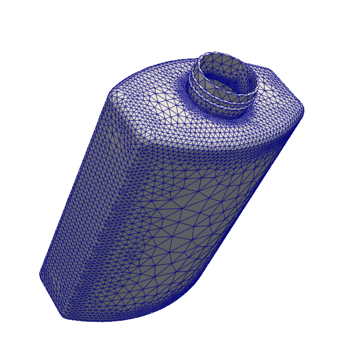
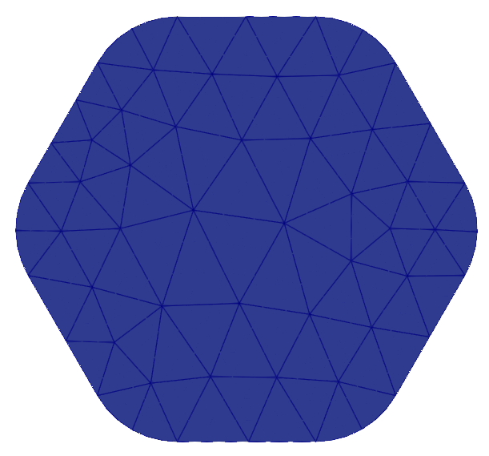
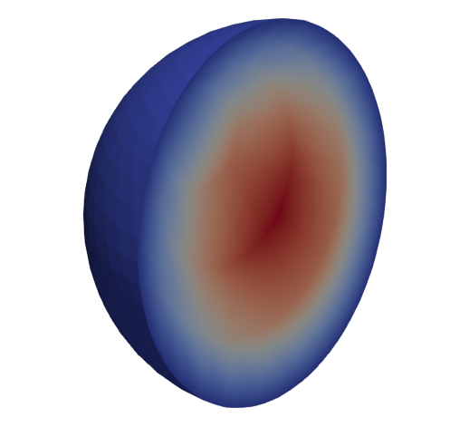
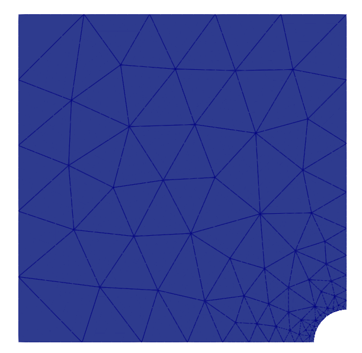

Netgen integration in Firedrake
===============================

This tutorial was contributed by `Umberto Zerbinati <mailto:umberto.zerbinati@oriel.ox.ac.uk>`__ and `Patrick E. Farrell <mailto:patrick.farrell@maths.ox.ac.uk>`__. This tutorial is based on the documentation for Netgen in the `NGSolve Docs <https://docu.ngsolve.org/latest/>`__.

The purpose of this demo is to summarise how to construct and use a Netgen mesh in Firedrake.
Netgen is an automated 2D/3D open-source mesher developed by Joachim Schöberl, which is capable of dealing both with simplicial and quadrilateral dominated mesh.
We will first have a look at how different geometries can be implemented using Netgen, then we will consider as an example the Poisson problem and discuss boundary conditions.
Finally we will show how to use mesh refinement features included in Netgen to construct an adaptive scheme.

Installing Netgen
------------------
This demo requires the NGSolve/Netgen suite to be installed. This can be done by running ``pip install ngsPETSc``. ::

   from firedrake import *
   try:
       import netgen
   except ImportError:
       import sys
       warning("Unable to import NetGen.")
       sys.exit(0)

Constructive Solid Geometry
---------------------------
Using the Constructive Solid Geometry (CSG) features implemented in Netgen, we can construct a geometry starting from basic sets such as rectangles and disks. Let's have a look at an example.
First we need to import the Netgen library required in order to construct a ``SplineGeometry``::

   from netgen.geom2d import SplineGeometry
   geo = SplineGeometry()

Now using the two of the predefined CSG geometries included in Netgen, a rectangle and a circle, we construct a square with an inscribed disk that we will later flag for refinement, using the ``SetMaterial`` and ``SetDomainMaxH`` methods: ::

   geo = SplineGeometry()
   geo.AddRectangle(p1=(-1, -1),
                    p2=(1, 1),
                    bc="rectangle",
                    leftdomain=1,
                    rightdomain=0)
   geo.AddCircle(c=(0, 0),
                 r=0.5,
                 bc="circle",
                 leftdomain=2,
                 rightdomain=1)

   # Flagging for the inside of the disk with a different material IDs
   geo.SetMaterial(1, "outer")
   geo.SetMaterial(2, "inner")
   geo.SetDomainMaxH(2, 0.02)

Notice that the ``leftdomain`` and ``rightdomain`` attribute in the ``AddRectangle`` and ``AddCircle`` methods are used to set a domain index for the domain on the left and right side respectively of the rectangle and circle perimeter. It is worth mentioning that the perimeters are parametrised in a counterclockwise direction.
We can now construct a mesh for the geometry we have defined and save it to a PVD file for visualisation. We will do so using the ``GenerateMesh`` method inside of the ``SplineGeometry`` class: ::

   ngmsh = geo.GenerateMesh(maxh=0.1)
   # Generating a Firedrake mesh from the NetGen mesh
   msh = Mesh(ngmsh)
   VTKFile("output/MeshExample1.pvd").write(msh)

.. figure:: Example1.png
   :align: center
   :alt: Example of Constructive Solid Geometry (CSG), with a finer mesh on a portion of the domain.

We can also "hardwire" a geometry in Netgen, specifying the points and the splines making the boundary of the domain.
In particular we add points to an instance of the ``SplineGeometry`` class using the method ``AppendPoint``, while a spline can be added using the ``Append`` method.
When using the ``Append`` method we can specify the type of Spline and its boundary label (in this particular case we use the "bnd" tag for all the curves making up the boundary).
Here is showed how to construct a "Pacman"-like domain::

   geo = SplineGeometry()
   pnts = [(0, 0), (1, 0), (1, 1),
           (0, 1), (-1, 1), (-1, 0),
           (-1, -1), (0, -1)]
   p1, p2, p3, p4, p5, p6, p7, p8 = [geo.AppendPoint(*pnt) for pnt in pnts]
   curves = [[["line", p1, p2], "line"],
             [["spline3", p2, p3, p4], "curve"],
             [["spline3", p4, p5, p6], "curve"],
             [["spline3", p6, p7, p8], "curve"],
             [["line", p8, p1], "line"]]
   [geo.Append(c, bc=bc) for c, bc in curves]
   ngmsh = geo.GenerateMesh(maxh=0.4)
   msh = Mesh(ngmsh)
   VTKFile("output/MeshExample2.pvd").write(msh)

.. figure:: Example2.png
   :align: center
   :alt: Example of the mesh generated for a Pacman like geometry.

Example: Poisson Problem
-------------------------
Let's now have a look at some features that can be useful when solving a variational problem using a Netgen mesh.
We will consider as example the Poisson problem with constant source data and homogeneous boundary conditions on the boundary of the PacMan.
The only method new to the reader should be the ``GetRegionNames`` which allows to find the IDs of the boundary we have labeled in Netgen. As usual we begin defining the ``FunctionSpace`` that will be used in our discretisation, defining trial and test functions and the source data::

   V = FunctionSpace(msh, "CG", 1)
   u = TrialFunction(V)
   v = TestFunction(V)

   f = Function(V)
   x, y = SpatialCoordinate(msh)
   f.assign(1)

Now we can define the bilinear form and linear function that characterize the weak formulation of the Poisson problem in abstract form, i.e.

.. math::

   \text{find } u\in H^1_0(\Omega) \text{ s.t. } a(u,v) := \int_{\Omega} \nabla u\cdot \nabla v \; d\vec{x} = L(v) := \int_{\Omega} fv\; d\vec{x}\qquad v\in H^1_0(\Omega).

In code this becomes: ::

   a = inner(grad(u), grad(v))*dx
   L = inner(f, v) * dx

Now we are ready to assemble the stiffness matrix for the problem. Since we want to enforce Dirichlet boundary conditions we construct a ``DirichletBC`` object and we use the ``GetRegionNames`` method from the Netgen mesh in order to map the label we have given when describing the geometry to the PETSc ``DMPLEX`` IDs. In particular if we look for the IDs of boundary element labeled either "line" or "curve" we would get::

   labels = [i+1 for i, name in enumerate(ngmsh.GetRegionNames(codim=1)) if name in ["line", "curve"]]
   bc = DirichletBC(V, 0, labels)
   print(labels)

We then proceed to solve the problem::

   sol = Function(V)
   solve(a == L, sol, bcs=bc)
   VTKFile("output/Poisson.pvd").write(sol)

Mesh Refinement
----------------
In this section we will discuss how to use the mesh refinement methods wrapped from Netgen C++ interface.
In particular we will be considering a Laplace eigenvalue problem on the same PacMan domain presented above, i.e.:

.. math::

   \text{Find } u \in H^1_0(\Omega) \text{ and } \lambda \in \mathbb{R} \text{ s.t. } \int_{\Omega} \nabla u\cdot\nabla v\;d\vec{x} = \lambda \int_{\Omega}uv\;d\vec{x}\qquad \forall v\in H^1_0(\Omega).

This script is based on a code developed by Professor Daniele Boffi and based on a code from Professor Douglas Arnold for the source problem.
We begin by defining some quantities of interest such as the desired tolerance, the maximum number of iterations and the exact eigenvalue::

   from firedrake.petsc import PETSc
   from slepc4py import SLEPc
   import numpy as np

   tolerance = 1e-16
   max_iterations = 10
   exact = 3.375610652693620492628**2

We create a function to solve the eigenvalue problem using SLEPc. We begin initialising the ``FunctionSpace``, the bilinear forms and linear functionals needed in the variational problem.
Then a SLEPc Eigenvalue Problem Solver (``EPS``) is initialised and set up to use a shift and invert (``SINVERT``) spectral transformation where the preconditioner factorisation is computed using MUMPS::

   def Solve(msh, labels):
        V = FunctionSpace(msh, "CG", 2)
        u = TrialFunction(V)
        v = TestFunction(V)
        a = inner(grad(u), grad(v))*dx
        m = inner(u, v)*dx
        uh = Function(V)
        bc = DirichletBC(V, 0, labels)
        A = assemble(a, bcs=bc)
        M = assemble(m, bcs=bc, weight=0.)
        Asc = A.petscmat
        Msc = M.petscmat
        E = SLEPc.EPS().create()
        E.setType(SLEPc.EPS.Type.ARNOLDI)
        E.setProblemType(SLEPc.EPS.ProblemType.GHEP)
        E.setDimensions(1, SLEPc.DECIDE)
        E.setOperators(Asc, Msc)
        ST = E.getST()
        ST.setType(SLEPc.ST.Type.SINVERT)
        PC = ST.getKSP().getPC()
        PC.setType("lu")
        PC.setFactorSolverType("mumps")
        E.setST(ST)
        E.solve()
        vr, vi = Asc.getVecs()
        with uh.dat.vec_wo as vr:
            lam = E.getEigenpair(0, vr, vi)
        return (lam, uh, V)

We will also need a function that mark the elements that need to be marked according to an error indicator, i.e.

.. math::
   \eta = \sum_{K\in \mathcal{T}_h(\Omega)} h^2\int_K|\lambda u_h + \Delta u_h|^2\;d\vec{x}+\frac{h}{2}\int_{E\subset \partial K} | [\![ \nabla u\cdot n_E]\!] | ^2\; ds

In order to do so we begin by computing the value of the indicator using a piecewise constant function space::

   def Mark(msh, uh, lam):
        W = FunctionSpace(msh, "DG", 0)
        # Both the error indicator and the marked element vector will be DG0 field.
        w = TestFunction(W)
        R_T = lam.real*uh + div(grad(uh))
        n = FacetNormal(V.mesh())
        h = CellDiameter(msh)
        R_dT = dot(grad(uh), n)
        # Assembling the error indicator.
        eta = assemble(h**2*R_T**2*w*dx +
              (h("+")+h("-"))*(R_dT("+")-R_dT("-"))**2*(w("+")+w("-"))*dS)
        frac = .95
        delfrac = .05
        part = .2
        mark = Function(W)
        # Filling in the marked element vector using eta.
        with mark.dat.vec as markedVec:
            with eta.dat.vec as etaVec:
                sum_eta = etaVec.sum()
                if sum_eta < tolerance:
                    return markedVec
                eta_max = etaVec.max()[1]
                sct, etaVec0 = PETSc.Scatter.toZero(etaVec)
                markedVec0 = etaVec0.duplicate()
                sct(etaVec, etaVec0)
                if etaVec.getComm().getRank() == 0:
                    eta = etaVec0.getArray()
                    marked = np.zeros(eta.size, dtype='bool')
                    sum_marked_eta = 0.
                    #Marking strategy
                    while sum_marked_eta < part*sum_eta:
                        new_marked = (~marked) & (eta > frac*eta_max)
                        sum_marked_eta += sum(eta[new_marked])
                        marked += new_marked
                        frac -= delfrac
                    markedVec0.getArray()[:] = marked[:]
                sct(markedVec0, markedVec, mode=PETSc.Scatter.Mode.REVERSE)
        return mark

It is now time to define the solve, mark and refine loop that is at the heart of the adaptive method described here::

   for i in range(max_iterations):
        print(f"level {i}")
        lam, uh, V = Solve(msh, labels)
        mark = Mark(msh, uh, lam)
        msh = msh.refine_marked_elements(mark)
        VTKFile("output/AdaptiveMeshRefinement.pvd").write(uh)

Note that the mesh conforms to the CAD geometry as it is adaptively refined.

.. figure:: Adaptive.png
   :align: center
   :alt: Outcome of the adaptive mesh refinement process.

Constructive Solid Geometry in 3D
---------------------------------
In this section we will focus our attention on three dimensional constructive solid geometry. In particular we will look at the operators `+,-,*~`, which have been overridden to have a special meaning when applied to two instances of the class ``CSGeometry``.
It is important to notice that the same operators can be used also when working with a ``SplineGeometry`` and their action will have the same meaning that is presented here.
The `+,-,*` operators have respectively the meaning of union, set difference, and intersection. We will build a cube using the planes intersection and remove from it a portion of sphere::

   from netgen.csg import *
   left = Plane(Pnt(0, 0, 0), Vec(-1, 0, 0))
   right = Plane(Pnt(1, 1, 1), Vec(1, 0, 0))
   front = Plane(Pnt(0, 0, 0), Vec(0, -1, 0))
   back = Plane(Pnt(1, 1, 1), Vec(0, 1, 0))
   bot = Plane(Pnt(0, 0, 0), Vec(0, 0, -1))
   top = Plane(Pnt(1, 1, 1), Vec(0, 0, 1))
   cube = left * right * front * back * bot * top
   cube.bc("cube")
   sphere = Sphere(Pnt(0.6, 0.6, 0.6), 0.5)
   geo = CSGeometry()
   geo.Add(cube-sphere)
   ngmsh = geo.GenerateMesh(maxh=0.1)
   msh = Mesh(ngmsh)
   VTKFile("output/MeshExample3.pvd").write(msh)

Open Cascade Technology
-----------------------
Last we will have a look at the Netgen Open Cascade Technology interface, which has been recently included. We will follow the tutorial presented in the `NetGen docs <https://docu.ngsolve.org/nightly/i-tutorials/unit-4.4-occ/bottle.html>`__, which itself comes from the OCCT tutorial `here <https://dev.opencascade.org/doc/overview/html/occt__tutorial.html>`__.
The idea is to draw a "flask" using the OCCT interface and solve the linear elasticity equations to compute the stress tensor on the flask subject to gravity.
We begin importing the Netgen Open Cascade interface and constructing the bottom of the flask using many different method such as ``Axes, Face, Pnt, Segment, ...`` (all the details this methods can be found in `NetGen docs <https://docu.ngsolve.org/nightly/i-tutorials/unit-4.4-occ/bottle.html>`__

::

   from netgen.occ import *
   myHeight = 70
   myWidth = 50
   myThickness = 30
   pnt1 = Pnt(-myWidth / 2., 0, 0)
   pnt2 = Pnt(-myWidth / 2., -myThickness / 4., 0)
   pnt3 = Pnt(0, -myThickness / 2., 0)
   pnt4 = Pnt(myWidth / 2., -myThickness / 4., 0)
   pnt5 = Pnt(myWidth / 2., 0, 0)
   seg1 = Segment(pnt1, pnt2)
   arc = ArcOfCircle(pnt2, pnt3, pnt4)
   seg2 = Segment(pnt4, pnt5)
   wire = Wire([seg1, arc, seg2])
   mirrored_wire = wire.Mirror(Axis((0, 0, 0), X))
   w = Wire([wire, mirrored_wire])
   f = Face(w)
   f.bc("bottom")

Once the bottom part of the flask has been constructed we then extrude it to create the main body. We now construct the neck of the flask and fuse it with the main body::

   body = f.Extrude(myHeight*Z)
   body = body.MakeFillet(body.edges, myThickness / 12.0)
   neckax = Axes(body.faces.Max(Z).center, Z)
   myNeckRadius = myThickness / 4.0
   myNeckHeight = myHeight / 10
   neck = Cylinder(neckax, myNeckRadius, myNeckHeight)
   body = body + neck
   fmax = body.faces.Max(Z)
   thickbody = body.MakeThickSolid([fmax], -myThickness / 50, 1.e-3)

Last we are left to construct the threading of the flask neck and fuse it to the rest of the flask body. In order to do this we are going to need the value of pi, which we grab from the Python math package::

   import math
   cyl1 = Cylinder(neckax, myNeckRadius * 0.99, 1).faces[0]
   cyl2 = Cylinder(neckax, myNeckRadius * 1.05, 1).faces[0]
   aPnt = Pnt(2 * math.pi, myNeckHeight / 2.0)
   aDir = Dir(2 * math.pi, myNeckHeight / 4.0)
   anAx2d = gp_Ax2d(aPnt, aDir)
   aMajor = 2 * math.pi
   aMinor = myNeckHeight / 10
   arc1 = Ellipse(anAx2d, aMajor, aMinor).Trim(0, math.pi)
   arc2 = Ellipse(anAx2d, aMajor, aMinor/4).Trim(0, math.pi)
   seg = Segment(arc1.start, arc1.end)
   wire1 = Wire([Edge(arc1, cyl1), Edge(seg, cyl1)])
   wire2 = Wire([Edge(arc2, cyl2), Edge(seg, cyl2)])
   threading = ThruSections([wire1, wire2])
   bottle = thickbody + threading
   geo = OCCGeometry(bottle)

As usual, we generate a mesh for the described geometry and use the Firedrake-Netgen interface to import as a PETSc DMPLEX::

   ngmsh = geo.GenerateMesh(maxh=5)
   msh = Mesh(ngmsh)
   VTKFile("output/MeshExample4.pvd").write(msh)

High-order Meshes
------------------
It is possible to construct high-order meshes for a geometry constructed in Netgen.
We can set the degree of the geometry via the ``netgen_flags`` keyword argument of the ``Mesh`` constructor. ::

   from netgen.occ import WorkPlane, OCCGeometry
   import netgen
   from mpi4py import MPI

   wp = WorkPlane()
   if COMM_WORLD.rank == 0:
       for i in range(6):
           wp.Line(0.6).Arc(0.4, 60)
       shape = wp.Face()
       ngmesh = OCCGeometry(shape, dim=2).GenerateMesh(maxh=1.)
   else:
       ngmesh = netgen.libngpy._meshing.Mesh(2)
   mesh = Mesh(ngmesh, comm=COMM_WORLD, netgen_flags={"degree": 4})
   VTKFile("output/MeshExample5.pvd").write(mesh)

High-order meshes are also supported in three dimensions; we just need to specify the correct dimension when constructing the OCCGeometry object.
We will now show how to solve the Poisson problem on a high-order mesh, of order 3, for the unit sphere. ::

   from netgen.occ import Sphere, Pnt
   import netgen
   from mpi4py import MPI

   if COMM_WORLD.rank == 0:
       shape = Sphere(Pnt(0,0,0), 1)
       ngmesh = OCCGeometry(shape, dim=3).GenerateMesh(maxh=1.)
   else:
       ngmesh = netgen.libngpy._meshing.Mesh(3)
   mesh = Mesh(ngmesh, netgen_flags={"degree": 3})

   # Solving the Poisson problem
   VTKFile("output/MeshExample6.pvd").write(mesh)
   x, y, z = SpatialCoordinate(mesh)
   V = FunctionSpace(mesh, "CG", 3)
   f = Constant(1)
   u = TrialFunction(V)
   v = TestFunction(V)
   a = inner(grad(u), grad(v)) * dx
   l = inner(f, v) * dx

   sol = Function(V)

   bc = DirichletBC(V, 0.0, [1])
   A = assemble(a, bcs=bc)
   b = assemble(l, bcs=bc)
   solve(A, sol, b, solver_parameters={"ksp_type": "cg", "pc_type": "lu"})

   VTKFile("output/Sphere.pvd").write(sol)

It is also possible to construct high-order meshes using the ``SplineGeometry``, ``CSG2d`` and ``CSG`` classes. ::

   from netgen.geom2d import CSG2d, Circle, Rectangle
   import netgen
   from mpi4py import MPI

   if COMM_WORLD.rank == 0:
       geo = CSG2d()
       circle = Circle(center=(1,1), radius=0.1, bc="curve").Maxh(0.01)
       rect = Rectangle(pmin=(0,1), pmax=(1,2),
                        bottom="b", left="l", top="t", right="r")
       geo.Add(rect-circle)
       ngmesh = geo.GenerateMesh(maxh=0.2)
   else:
       ngmesh = netgen.libngpy._meshing.Mesh(2)
   mesh = Mesh(ngmesh, comm=COMM_WORLD, netgen_flags={"degree": 2})
   VTKFile("output/MeshExample7.pvd").write(mesh)

Periodic Meshes
---------------
Netgen can identify pairs of vertices lying on opposite boundaries of a geometry as being *the same* point.
When such a mesh is imported into Firedrake, the identified vertices are merged in the mesh topology, so that
a continuous (CG) function space automatically shares its degrees of freedom across the seam: the mesh is
genuinely **periodic**. This is exactly the representation Firedrake uses for its built-in
``PeriodicRectangleMesh``/``PeriodicBoxMesh``, and it is now available for any Netgen geometry carrying
periodic identifications.

Identifications are declared on the geometry, before meshing, with the OCC ``Identify`` method::

   shape_a.Identify(shape_b, name, IdentificationType.PERIODIC, transformation)

where ``transformation`` is the rigid motion (typically a translation) that maps ``shape_a`` onto ``shape_b``.
Netgen then meshes the two boundaries compatibly and records the vertex pairs; Firedrake consumes them
automatically -- no extra flag on the ``Mesh`` constructor is required.

As a physically motivated example we build the *periodic cylinder*, the classic reduced ("screw pinch") model
of a tokamak plasma column. A tokamak is a torus, so the plasma is periodic in the toroidal direction; in the
large-aspect-ratio limit one straightens a toroidal section into a cylinder and identifies its two circular
ends, recovering periodicity along the axis. We take the axial (toroidal) coordinate to run over :math:`[0, 2\pi)`
and identify the two end caps by a translation of :math:`2\pi` along ``Z``::

   from netgen.occ import Cylinder, OCCGeometry, Pnt, Z, gp_Trsf, gp_Vec
   from netgen.meshing import IdentificationType
   from math import pi as PI

   cyl = Cylinder(Pnt(0, 0, 0), Z, r=1.0, h=2 * PI)
   # Label the lateral wall, then the two end caps that we will identify.
   for face in cyl.faces:
       face.name = "wall"
   cyl.faces.Min(Z).name = "bottom"
   cyl.faces.Max(Z).name = "top"
   # Identify the bottom cap with the top cap: a translation of 2*pi along Z
   # maps one onto the other, making the axial direction periodic.
   cyl.faces.Min(Z).Identify(cyl.faces.Max(Z), "toroidal",
                             IdentificationType.PERIODIC,
                             gp_Trsf.Translation(gp_Vec(0, 0, 2 * PI)))
   ngmsh = OCCGeometry(cyl).GenerateMesh(maxh=0.4)
   msh = Mesh(ngmsh)
   VTKFile("output/Tokamak.pvd").write(msh)

.. warning::

   The mesh must contain at least a handful of cells along each periodic direction. If a single cell spans a
   whole period, its two ends are identified and the cell collapses; Firedrake then raises a ``ValueError``
   asking you to refine along the periodic direction. Here the axis has length :math:`2\pi` and ``maxh=0.4``
   gives roughly sixteen cells along it, which is ample. Only ``degree == 1`` periodic meshes are supported
   for now.

Because the two end caps have been identified, no boundary markers survive on them: the seam has become an
*interior* set of facets, and the only labelled boundary that remains is the lateral wall. This is what makes
a continuous field wrap around continuously in the axial direction. We can verify the geometry survived the
merge intact -- the volume of the cylinder is :math:`\pi r^2 h = 2\pi^2` -- while the ends carry no exterior
facets::

   volume = assemble(Constant(1.0) * dx(domain=msh))
   PETSc.Sys.Print(f"cylinder volume: {volume:.4f}  (exact 2*pi**2 = {2 * PI**2:.4f})")

To show that the periodicity is doing real work, we solve a Helmholtz problem whose exact solution is periodic
in the axial coordinate and vanishes on the lateral wall,

.. math::

   u_{\text{ex}}(x, y, z) = \cos(z)\,\bigl(1 - x^2 - y^2\bigr),

so that we can impose a homogeneous Dirichlet condition on the wall while relying on the identified ends for
continuity along the axis. We look up the id of the ``"wall"`` boundary with ``GetRegionNames`` (as in the
Poisson example above) and manufacture the right-hand side :math:`f = u_{\text{ex}} - \Delta u_{\text{ex}}` for
:math:`(I - \Delta)u = f`::

   V = FunctionSpace(msh, "CG", 2)
   x, y, z = SpatialCoordinate(msh)
   uex = cos(z) * (1 - x**2 - y**2)
   f = uex - div(grad(uex))

   u = TrialFunction(V)
   v = TestFunction(V)
   a = (inner(u, v) + inner(grad(u), grad(v))) * dx
   L = inner(f, v) * dx

   labels = [i + 1 for i, name in enumerate(ngmsh.GetRegionNames(codim=1)) if name == "wall"]
   bc = DirichletBC(V, 0, labels)

   sol = Function(V)
   solve(a == L, sol, bcs=bc)
   VTKFile("output/TokamakSolution.pvd").write(sol)

   error = sqrt(assemble(inner(sol - uex, sol - uex) * dx))
   PETSc.Sys.Print(f"L2 error: {error:.2e}")

The recovered solution is continuous across the identified ends: opening ``output/TokamakSolution.pvd`` in
ParaView, the field wraps seamlessly from the top cap back to the bottom, exactly as a toroidal mode should.
Had the ends *not* been identified, the same computation would leave an artificial jump at the seam and the
manufactured solution would not be recovered.
