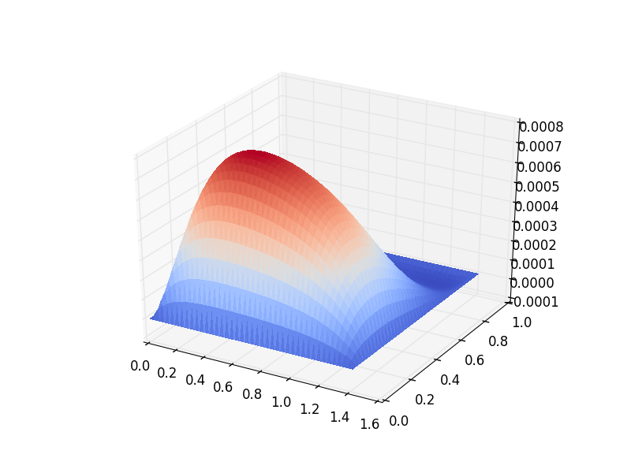
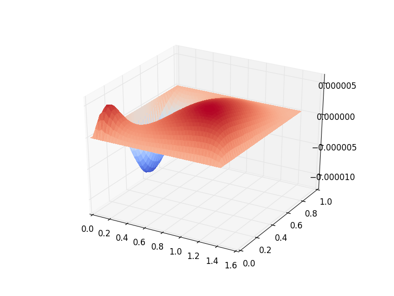

Wind-Driven Gyres: Quasi-Geostrophic Limit
==========================================

Contributed by Christine Kaufhold and `Francis Poulin <https://uwaterloo.ca/applied-mathematics/people-profiles/francis-poulin>`_.

Building on the previous two demos that used the Quasi-Geostrophic
(QG) model for the :doc:`time-stepping </demos/qg_1layer_wave.py>` and
:doc:`eigenvalue problem </demos/qgbasinmodes.py>`,
we now consider how to determine a
wind-driven gyre solution that includes bottom drag and
nonlinear advection. This is referred to as the Nonlinear Stommel
Problem.

This is a classical problem going back to :cite:`Stommel:1948`. Even
though it is far too simple to describe the dynamics of the real
oceans quantitatively, it does explain qualitatively why we have
western intensification in the world's gyres. The curl of the wind
stress adds vorticity into the gyres and the latitudinal variation in
the Coriolis parameter causes a weak equatorward flow away from the
boundaries (Sverdrup flow). It is because of the dissipation that
arises near the boundaries that we must have western intensification.
This was first shown by :cite:`Stommel:1948` using simple bottom drag but it
was only years later after :cite:`Munk:1950` did a similar calculation using
lateral viscosity that people took the idea seriously.

After three quarters of a century we are still unable to parametrise
the dissipative effects of the small scales so it is very difficult to
get a good quantitative predictions as to the mean structure of the
gyre that is generated. However, this demo aims to compute the
structure of the oceanic gyre given particular parameters. The
interested reader can read more about this in
:cite:`Pedlosky:1992` and :cite:`Vallis:2006`.
In this tutorial we will consider the nonlinear Stommel problem.

Governing PDE: Stommel Problem
~~~~~~~~~~~~~~~~~~~~~~~~~~~~~~

The nonlinear, one-layer, QG model equation that is driven by the winds
above (say :math:`Q_{\textrm{winds}})`, which is the vorticity of the winds that
drive the ocean from above) is,

.. math:: \partial_{t}q + \vec{u} \cdot \vec{\nabla} q + \beta v = -rq + Q_{\textrm{winds}}

with the Potential Vorticity (PV) and geostrophic velocities defined as

.. math::

   \begin{aligned}
   q = \nabla^2 \psi - F \psi,
   \quad \mbox{ and } \quad
   \vec u = \hat z \times \vec\nabla \psi\end{aligned}

where :math:`\psi` is the stream-function, :math:`\vec{u}=(u, v)` is the
velocity field, :math:`q` is the PV, :math:`\beta`
is the latitudinal gradient of Coriolis parameter, and :math:`F` is the
rotational Froude number.

The non-conservative aspects of this model
occur because of :math:`r`, the strength of the bottom drag, and
:math:`Q_{\textrm{winds}}`, the vorticity of the winds. We pick the wind forcing
as to generate a single gyre,

.. math:: Q_{\textrm{winds}} = \tau \cos\left( \pi \left[\frac{y}{L_y} - \frac{1}{2} \right] \right)

where :math:`L_y` is the length of our domain and :math:`\tau` is the strength of our wind forcing. By putting a :math:`2` in front of the :math:`\pi` we
get a double gyre :cite:`Vallis:2006`.

If we only look for steady solutions
in time, we can ignore the time derivative term, and we get

.. math::

   \begin{gathered}
   (\vec{u} \cdot \vec\nabla)\left( \nabla^2 \psi - F \psi\right)
   + \beta \frac{\partial \psi}{\partial x} = - rq + Q_{\textrm{winds}}
   \end{gathered}

We can write this out in one equation, which is the nonlinear Stommel
problem:

.. math::

   \begin{gathered}
   \vec u \cdot \vec\nabla \left( \nabla^2 \psi \right) + r(\nabla^{2} \psi - F\psi) + \beta \frac{\partial \psi}{\partial x} =  Q_{\textrm{winds}}
   \end{gathered}

Note that we dropped the :math:`-F \psi` term in the nonlinear advection
because the streamfunction does not change following the flow, and
therefore, we can neglect that term entirely.

Weak Formulation
~~~~~~~~~~~~~~~~

To build the weak form of the problem in Firedrake we must find the weak
form of this equation. We begin by multiplying this equation by a test
function, :math:`\phi`, which is in the same space as the
streamfunction, and then integrate over the domain :math:`\Omega`,

.. math:: \int_{\Omega} \phi (\vec u \cdot \vec\nabla) \nabla^2 \psi \,\mathrm{d}x  +  r\phi (\nabla^{2} \psi - F\psi)\,\mathrm{d}x + \beta\phi\frac{\partial \psi}{\partial x} \,\mathrm{d}x =  \int_{\Omega} \phi \cdot Q_{\textrm{winds}} \,\mathrm{d}x

The nonlinear term can be rewritten using the fact that the velocity is
divergent free and then integrating by parts,

.. math::

   \begin{aligned}
   \int_{\Omega} \phi (\vec u \cdot \vec\nabla) \nabla^2 \psi
   =  \int_{\Omega} \phi \vec\nabla \cdot \left(\vec u (\nabla^2 \psi)\right)
   = - \int_{\Omega}( \vec\nabla \phi \cdot \vec u){\nabla}^{2}\psi \, \mathrm{d}x.\end{aligned}

Note that because we have no normal flow boundary conditions the
boundary contribution is zero. For the term with bottom drag we
integrate by parts and use the fact that the streamfunction is zero on
the walls

.. math::

   \begin{aligned}
   \int_{\Omega} r \phi \left( \vec{\nabla}^2 \psi - F \psi \right) \, \mathrm{d}x &
   = -r \int_{\Omega}  \Big(\vec{\nabla}\phi \cdot \vec{\nabla}\psi
   + F \phi \psi \Big)\, \mathrm{d}x
   + r \int_{\partial\Omega} \phi \cdot \frac{\partial \psi}{\partial n} \,\mathrm{d}s
  \end{aligned}

The boundary integral above vanishes because we are setting the streamfunction to be zero on the boundary.

Finally we can put the equation back together again to produce the weak form of our problem.

.. math:: \int_{\Omega} \Bigg( - (\vec\nabla \phi \cdot \vec u) \vec{\nabla}^{2}\psi  -r \Big(\vec{\nabla}\phi \cdot \vec{\nabla}\psi + F \phi \psi \Big) + \beta\phi\frac{\partial \psi}{\partial x} \Bigg) \,\mathrm{d}x =  \int_{\Omega} \phi \cdot Q_{\textrm{winds}} \,\mathrm{d}x

The above problem is the weak form of the nonlinear Stommel problem.  The linear term arises from neglecting the nonlinear advection, and can easily be obtained by neglecting the first term on the left hand side.

Defining the Problem
~~~~~~~~~~~~~~~~~~~~

Now that we know the weak form we are now ready to solve this using Firedrake!

First, we import the Firedrake, PETSc, NumPy and UFL packages, ::

  from firedrake import *
  from firedrake.petsc import PETSc
  import numpy as np
  import ufl

Next, we can define the geometry of our domain. In this example, we
will be using a square of length one with 50 cells. ::

  n0 = 50           # Spatial resolution
  Ly = 1.0          # Meridonal length
  Lx = 1.0          # Zonal length
  mesh = RectangleMesh(n0, n0, Lx, Ly, reorder = None)

We can then define the Function Space within which the
solution of the streamfunction will reside. ::

  Vcg = FunctionSpace(mesh, 'CG', 3) # CG elements for Streamfunction

We will also impose no-normal flow strongly to ensure that the
boundary condition :math:`\psi = 0` will be met, ::

  bc = DirichletBC(Vcg, 0.0, 'on_boundary')

Now we will define all the parameters we are using in this tutorial. ::

  beta = Constant('1.0')      # Beta parameter
  F = Constant('1.0')         # Burger number
  r = Constant('0.2')         # Bottom drag
  tau = Constant('0.001')     # Wind Forcing
  x = SpatialCoordinate(mesh)
  Qwinds = Function(Vcg).interpolate(-tau * cos(pi * (x[1]/Ly - 0.5)))

We can now define the Test Function and the Trial Function of this problem, both must be in the same function space::

  phi, psi = TestFunction(Vcg), TrialFunction(Vcg)

We must define functions that will store our linear and nonlinear solutions.
In order to solve the nonlinear problem, we use the linear
solution as a guess for the nonlinear problem. ::

  psi_lin = Function(Vcg, name='Linear Streamfunction')
  psi_non = Function(Vcg, name='Nonlinear Streamfunction')

We can finally write down the linear Stommel equation in its weak
form. We will use the solution to this as the input for the nonlinear
Stommel equation. ::

  a = - r * inner(grad(psi), grad(phi)) * dx - F * psi * phi * dx + beta * psi.dx(0) * phi * dx
  L = Qwinds * phi * dx

We set-up an elliptic solver for this problem, and solve for the
linear streamfunction, ::

  linear_problem = LinearVariationalProblem(a, L, psi_lin, bcs=bc)
  linear_solver = LinearVariationalSolver(linear_problem,
                                          solver_parameters= {'ksp_type': 'preonly',
                                                              'pc_type': 'lu'})
  linear_solver.solve()

We will employ the solution to the linear problem as the initial guess for the nonlinear one::

  psi_non.assign(psi_lin)

And now we can define the weak form of the nonlinear problem. Note
that the problem is stated in residual form so there is no trial function. ::

  G = - inner(grad(phi), perp(grad(psi_non))) * div(grad(psi_non)) * dx \
      -r * inner(grad(psi_non), grad(phi)) * dx - F * psi_non * phi * dx \
      + beta * psi_non.dx(0) * phi * dx \
      - Qwinds * phi * dx

We solve for the nonlinear streamfunction now by setting up another
elliptic solver, ::

  nonlinear_problem = NonlinearVariationalProblem(G, psi_non, bcs=bc)
  nonlinear_solver = NonlinearVariationalSolver(nonlinear_problem,
                                                solver_parameters= {'snes_type': 'newtonls',
                                                                    'ksp_type': 'preonly',
                                                                    'pc_type': 'lu'})
  nonlinear_solver.solve()

Now that we have the full solution to the nonlinear Stommel problem,
we can plot it using the :func:`tripcolor <firedrake.pyplot.tripcolor>` function ::

  try:
      import matplotlib.pyplot as plt
  except:
      warning("Matplotlib not imported")

  try:
      from firedrake.pyplot import tripcolor
      fig, axes = plt.subplots()
      colors = tripcolor(psi_non, axes=axes)
      fig.colorbar(colors)
  except Exception as e:
      warning("Cannot plot figure. Error msg '%s'" % e)

  try:
      plt.show()
  except Exception as e:
      warning("Cannot show figure. Error msg '%s'" % e)

  file = VTKFile('Nonlinear Streamfunction.pvd')
  file.write(psi_non)

We can also see the difference between the linear solution and the
nonlinear solution. We do this by defining a weak form.  (Note: other approaches may be possible.) ::

  tf, difference = TestFunction(Vcg), TrialFunction(Vcg)

  difference = assemble(psi_lin - psi_non)

  try:
      fig, axes = plt.subplots()
      colors = tripcolor(difference, axes=axes)
      fig.colorbar(colors)
  except Exception as e:
      warning("Cannot plot figure. Error msg '%s'" % e)

  try:
      plt.show()
  except Exception as e:
      warning("Cannot show figure. Error msg '%s'" % e)

  file = VTKFile('Difference between Linear and Nonlinear Streamfunction.pvd')
  file.write(difference)

Below is a plot of the linear solution to the QG wind-driven Stommel gyre.

Below is a plot of the difference between the linear and nonlinear solutions to the QG wind-driven Stommel gyre.

This demo can be found as a Python script in :demo:`qg_winddrivengyre.py <qg_winddrivengyre.py>`.

.. rubric:: References

.. bibliography:: demo_references.bib
   :filter: docname in docnames
