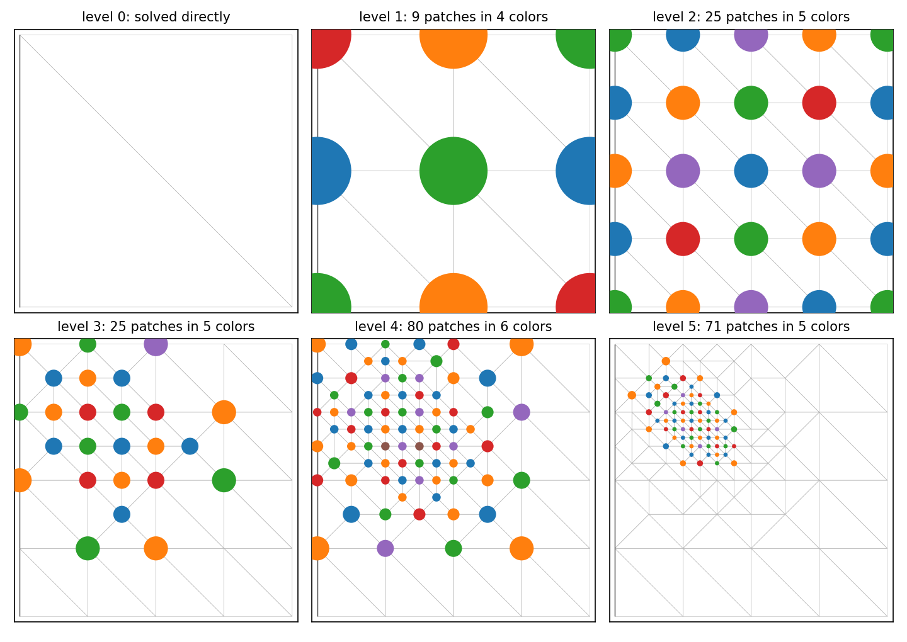

Patch relaxation on an adaptively refined hierarchy
===================================================

Contributed by `Pablo Brubeck <https://www.maths.ox.ac.uk/people/pablo.brubeckmartinez/>`_.

The demo :doc:`Using patch relaxation for multigrid <poisson_mg_patches.py>` builds a
vertex star patch around every vertex of every level. That is the right thing to do when
a level is a uniform refinement of the one below it, because then every cell of the level
is new and the whole level needs relaxing.

An adaptively refined level is different. Only the cells near the marked region were
split; everywhere else the level is a copy of its parent, already resolved by the coarser
levels, and relaxing there costs work without improving the error. This demo restricts
the patches to the region that was genuinely refined, and groups them by a coloring so
that each level performs a handful of large block solves rather than thousands of tiny
ones.

We begin with the usual imports. The patches need an overlapping parallel decomposition
that reaches a whole vertex star, which is what the ``distribution_parameters`` request. ::

  import numpy
  from scipy.spatial import cKDTree
  from matplotlib import pyplot as plt
  from matplotlib.collections import EllipseCollection

  from firedrake import *
  from firedrake.adapt import mark_refined_entities
  from firedrake.mg.utils import get_level

  dparams = {"overlap_type": (DistributedMeshOverlapType.VERTEX, 1)}

Adaptivity composes with uniform refinement
-------------------------------------------

A :func:`~.MeshHierarchy` records parent child relations however its levels were made, so
uniform and adaptive levels stack in the same object. We start from a single square cut
into two triangles and refine it uniformly twice, which gives a 4x4 hierarchy of three
levels, and the adaptive levels will grow on top of those: ::

  base = UnitSquareMesh(1, 1, distribution_parameters=dparams)
  mh = MeshHierarchy(base, 2)
  mesh = mh[-1]

This composition is worth doing. Uniform levels are cheap to build and cheap to apply, and
they carry the low frequency error that a coarse grid must resolve; adaptive levels then
add resolution only where the solution needs it. Starting straight from the coarsest mesh
with adaptivity alone would leave the coarse region under-resolved for many refinements.

The same relaxation option is correct on both kinds of level, and this is the point to
take away. On a uniformly refined level every cell was split, so "the refined region" is
the whole mesh and the restriction does nothing. On an adaptive level it is a small part
of the mesh, and the restriction bites. Nothing in the solver parameters has to know which
kind of level it is looking at.

A high order Poisson problem
----------------------------

We solve :math:`-\nabla^2 u = f` with cubic Lagrange elements and a forcing concentrated
in a narrow bump, so that the error is concentrated too and there is something for the
adaptivity to find: ::

  degree = 3

  def forcing(m):
      x, y = SpatialCoordinate(m)
      return exp(-200*((x - 0.3)**2 + (y - 0.7)**2))

  V = FunctionSpace(mesh, "CG", degree)
  uh = Function(V, name="solution")
  u = TrialFunction(V)
  v = TestFunction(V)

  a = inner(grad(u), grad(v))*dx
  L = inner(forcing(mesh), v)*dx
  bcs = DirichletBC(V, 0, "on_boundary")

Estimating the error and marking cells
--------------------------------------

The adaptation needs to be told which cells to refine. We use the standard residual based
estimator, whose cellwise contribution combines the interior residual with the jump in the
normal derivative across facets: ::

  def estimate_error(uh):
      m = uh.function_space().mesh()
      Q = FunctionSpace(m, "DG", 0)
      eta_sq = Function(Q)
      p = TrialFunction(Q)
      q = TestFunction(Q)
      residual = forcing(m) + div(grad(uh))
      h = CellDiameter(m)
      n = FacetNormal(m)
      vol = CellVolume(m)

      a = inner(p, q/vol)*dx
      L = (inner(residual**2, q*h**2)*dx
           + inner(jump(grad(uh), n)**2, avg(q*h))*dS)
      sp = {"mat_type": "matfree", "ksp_type": "preonly", "pc_type": "jacobi"}
      solve(a == L, eta_sq, solver_parameters=sp)
      return Function(Q).interpolate(sqrt(eta_sq))

The ``marking_callback`` of a :class:`~.NonlinearVariationalSolver` returns a DG0 function
whose positive entries mark the cells to refine. We take every cell whose estimator
exceeds three tenths of the largest one: ::

  def mark_cells(ctx, current_solution):
      eta = estimate_error(current_solution)
      with eta.dat.vec_ro as eta_vec:
          _, eta_max = eta_vec.max()
      markers = Function(eta.function_space())
      markers.interpolate(conditional(gt(eta, 0.3*eta_max), 1, 0))
      return markers

The solver
----------

``snes_adapt_sequence`` asks for three rounds of solve, estimate, mark and refine, each
adding a level to the hierarchy. Multigrid then runs over every level, uniform and
adaptive alike.

The relaxation is :class:`~.PatchPC`. Two options do the work discussed above:
``patch_pc_patch_adaptive`` restricts the patches to the entities whose star meets the
refined region, and ``patch_pc_patch_use_coloring`` groups patches with disjoint stars so
each color is solved in one go. Adding ``-dm_plex_coloring_local`` on the command line
colors each process's own vertices without communicating, which usually needs fewer
colors.

Level 0 is prescribed separately through ``mg_levels_0``, which is the coarsest level
whatever the hierarchy grows to, and is solved directly: ::

  params = {
      "mat_type": "aij",
      "snes_adapt_sequence": 3,
      "ksp_type": "cg",
      "pc_type": "mg",
      "mg_levels": {
          "ksp_type": "chebyshev",
          "ksp_max_it": 1,
          "pc_type": "python",
          "pc_python_type": "firedrake.PatchPC",
          "patch_pc_patch_construct_type": "star",
          "patch_pc_patch_construct_dim": 0,
          "patch_pc_patch_adaptive": True,
          "patch_pc_patch_use_coloring": True,
          "patch_pc_patch_save_operators": True,
          "patch_pc_patch_sub_mat_type": "seqdense",
          "patch_sub_ksp_type": "preonly",
          "patch_sub_pc_type": "lu",
      },
      "mg_levels_0": {
          "mat_type": "aij",
          "ksp_type": "preonly",
          "pc_type": "lu",
      },
  }

  problem = LinearVariationalProblem(a, L, uh, bcs=bcs)
  solver = LinearVariationalSolver(problem, solver_parameters=params,
                                   marking_callback=mark_cells)
  solution = solver.solve()

  hierarchy, level = get_level(solution.function_space().mesh())
  print(f"Solved on {len(hierarchy)} levels, {solution.function_space().dim()} degrees of freedom")

:class:`~.ASMStarPC` offers the same thing under ``pc_star_adaptive``, building the index
sets itself rather than going through PCPatch.

Looking at the patches
----------------------

The restriction and the coloring are both visible from Python. ``mark_refined_entities``
returns the label that ``patch_pc_patch_adaptive`` passes to PCPatch, and returns `None`
for a level with no adaptive parent, which is how a uniformly refined level ends up
relaxing everywhere. ``createColoringLabel`` then colors the marked vertices, under the
finite element adjacency for which two vertices are adjacent exactly when they share a
cell: ::

  def patch_colors(m):
      plex = m.topology_dm
      label = mark_refined_entities(m)
      useCone, useClosure = plex.getBasicAdjacency()
      plex.setBasicAdjacency(False, True)
      colors = plex.createColoringLabel(depth=0, distance=1, label=label, value=1)
      plex.setBasicAdjacency(useCone, useClosure)

      vstart, _ = plex.getDepthStratum(0)
      xy = plex.getCoordinatesLocal().array_r.reshape(-1, m.geometric_dimension)
      seeds = numpy.concatenate([c.indices for c in colors])
      which = numpy.concatenate([numpy.full(len(c.indices), k)
                                 for k, c in enumerate(colors)])
      return xy[seeds - vstart], which, len(colors)

Each patch reaches over the whole star of its vertex, so drawing the stars themselves
would cover the mesh several times over and hide the colors. We draw instead a disc
around each vertex, half the way to the nearest other patch, which never touches its
neighbour however finely the region around it was refined.

The coarsest mesh comes first, followed by the two uniform refinements and then the three
adaptive levels: ::

  fig, axes = plt.subplots(2, 3, figsize=(9.6, 6.8))
  for ax, m in zip(axes.flat, hierarchy):
      triplot(m, axes=ax,
              interior_kw={"linewidths": 0.25, "edgecolors": "0.7", "facecolors": "none"},
              boundary_kw={"linewidths": 0.7, "colors": "0.35"})
      ax.set_aspect("equal")
      ax.set_xlim(-0.02, 1.02)
      ax.set_ylim(-0.02, 1.02)
      ax.set_xticks([])
      ax.set_yticks([])

The coarsest level is solved directly, so it is the one level that carries no patches at
all. Every level above it is relaxed, and gets its seeds drawn: ::

  axes.flat[0].set_title("level 0: solved directly", fontsize=10)
  for ax, m in zip(axes.flat[1:], hierarchy[1:]):
      pts, which, ncolors = patch_colors(m)
      spacing, _ = cKDTree(pts).query(pts, k=2)
      diameter = spacing[:, 1]/2
      ax.add_collection(EllipseCollection(
          diameter, diameter, numpy.zeros_like(diameter), units="xy", offsets=pts,
          offset_transform=ax.transData, array=which.astype(float),
          cmap="tab10", norm=plt.Normalize(0, 10), zorder=3))

      _, lvl = get_level(m)
      ax.set_title(f"level {lvl}: {len(pts)} patches in {ncolors} colors", fontsize=10)

  fig.tight_layout()
  fig.savefig("adaptive_patch_colors.png", dpi=150)

Level 0 is the mesh the hierarchy grew from, and is solved directly rather than relaxed,
so it carries no patches. Levels 1 and 2 are uniform refinements, so every vertex carries
a patch and the colors cover the mesh. From level 3 on the patches sit only
where the mesh was refined, and the count stops following the size of the mesh and starts
following the size of the refined region. Within a level no two discs of the same color are adjacent, which
is what makes the grouped patch operator block diagonal and the grouped solve equivalent
to the individual ones.

A python script version of this demo can be found `here
<adaptive_patches.py>`__.
