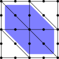

Using patch relaxation for multigrid
====================================

Contributed by `Robert Kirby <https://sites.baylor.edu/robert_kirby/>`_
and `Pablo Brubeck <https://www.maths.ox.ac.uk/people/pablo.brubeckmartinez/>`_.

Simple relaxation like point Jacobi are not optimal or even suitable
smoothers for all applications.  Firedrake supports additive Schwarz methods
based on local patch-based decompositions through two different paths.

This demonstration illustrates basic usage of these methods for the Poisson
problem.  Here, multigrid with point Jacobi relaxation works, but the iteration
count degrades with polynomial degree, while vertex star patches give
degree-independent iteration counts.  Here, all the degrees of freedom in the cells
(but not on the boundary) around each vertex are included in a patch

For many problems, point Jacobi is even worse, and patches are required even to
get a convergent method.  We refer the reader to other demos.

We start by importing firedrake and setting up a mesh hierarchy and the
exact solution and forcing data.::

  from firedrake import *

  base = UnitSquareMesh(4, 4)
  mh = MeshHierarchy(base, 1)
  mesh = mh[-1]

Next, this function solves the Poisson equation discretized with
a user-provided degree of Lagrange elements and set of solver
parameters and returns the iteration count required for convergence.
To stress-test the solver, the forcing function is taken as a randomly
generated cofunction.::

  def run_solve(deg, params):
      V = FunctionSpace(mesh, "CG", deg)
      u = TrialFunction(V)
      v = TestFunction(V)
      uh = Function(V)
      a = inner(grad(u), grad(v)) * dx
      rg = RandomGenerator(PCG64(seed=123456789))
      L = rg.uniform(V.dual(), -1, 1)
      bcs = DirichletBC(V, 0, "on_boundary")

      problem = LinearVariationalProblem(a, L, uh, bcs)
      solver = LinearVariationalSolver(problem, solver_parameters=params)

      solver.solve()

      return solver.snes.getLinearSolveIterations()

These two dictionaries specify parameters for sparse direct method, to be used
on the coarsest level of the multigrid hierarchy.::

  lu = {
      "ksp_type": "preonly",
      "pc_type": "lu"
  }

When we use a matrix-free method, there will not be an assembled matrix to factor
on the coarse level. This forces the matrix to be assembled.::

  assembled_lu = {
      "ksp_type": "preonly",
      "pc_type": "python",
      "pc_python_type": "firedrake.AssembledPC",
      "assembled": lu
  }

This function creates multigrid parameters using a given set of
relaxation options and matrix assembled type.::

  def mg_params(relax, mat_type="aij"):
      if mat_type == "aij":
          coarse = lu
      else:
          coarse = assembled_lu

      return {
          "mat_type": mat_type,
          "ksp_type": "cg",
          "pc_type": "mg",
          "mg_levels": {
              "ksp_type": "chebyshev",
              "ksp_max_it": 1,
              **relax
          },
          "mg_coarse": coarse
      }

The simplest parameter case will use point Jacobi smoothing on each level.
Here, a matrix-free implementation is appropriate, and Firedrake will
automatically assemble the diagonal for us.
Point Jacobi, however, will require more multigrid iterations as the polynomial
degree increases.::

  jacobi_relax = mg_params({"pc_type": "jacobi"}, mat_type="matfree")

These options specify an additive Schwarz relaxation through :class:`~.PatchPC`.
:class:`~.PatchPC` builds the patch operators by assembling the bilinear form over
each subdomain.  Hence, it does not require the global stiffness
matrix to be assembled.
These options tell the patch mechanism to use vertex star patches, storing
the element matrices in a dense format.  The patch problems are solved by
LU factorizations without a Krylov iteration.  As an optimization,
patch is told to precompute all the element matrices and store the inverses
in dense format.::

  patch_relax = mg_params({
      "pc_type": "python",
      "pc_python_type": "firedrake.PatchPC",
      "patch": {
          "pc_patch": {
	      "construct_type": "star",
              "construct_dim": 0,
              "sub_mat_type": "seqdense",
	      "dense_inverse": True,
	      "save_operators": True,
	      "precompute_element_tensors": True},
          "sub_ksp_type": "preonly",
          "sub_pc_type": "lu"}},
      mat_type="matfree")

:class:`~.ASMStarPC`, on the other hand, does no re-discretization, but extracts the
submatrices for each patch from the already-assembled global stiffness matrix.

The tinyasm backend uses LAPACK to invert all the patch operators.  If this option
is not specified, PETSc's ASM framework will set up a small KSP for each patch.
This can be useful when the patches become larger and one wants to use a sparse
direct solver or a Krylov iteration on each one.::

  asm_relax = mg_params({
      "pc_type": "python",
      "pc_python_type": "firedrake.ASMStarPC",
      "pc_star_backend": "tinyasm"})

Now, for each parameter choice, we report the iteration count for the Poisson problem
over a range of polynomial degrees.  We see that the Jacobi relaxation leads to growth
in iteration count, while both :class:`~.PatchPC` and :class:`~.ASMStarPC` do not.  Mathematically, the two
latter options do the same operations, just via different code paths.::

  names = {"Jacobi": jacobi_relax,
           "Patch": patch_relax,
           "ASM Star": asm_relax}

  for name, method in names.items():
      print(name)
      print("Degree | Iterations")
      print("-------------------")
      for deg in range(1, 8):
          its = run_solve(deg, method)
          print(f"     {deg} |    {its}")

For Jacobi, we expect output such as

======== ================
 Degree    Iterations
======== ================
   1         8
   2         8
   3         10
   4         11
   5         14
   6         16
   7         19
======== ================

While for either :class:`~.PatchPC` or :class:`~.ASMStarPC`, we expect

======== ================
 Degree    Iterations
======== ================
   1         8
   2         8
   3         8
   4         8
   5         8
   6         8
   7         8
======== ================

A runnable python version of this demo can be found :demo:`here<poisson_mg_patches.py>`.
