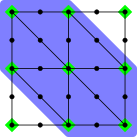

Using Vanka relaxation for Stokes flow
======================================

Contributed by `Robert Kirby <https://sites.baylor.edu/robert_kirby/>`_
and `Pablo Brubeck <https://www.maths.ox.ac.uk/people/pablo.brubeckmartinez/>`_.

Vanka relaxation enables monolithic multigrid algorithms for Stokes flow and
other coupled problems.  Here, specially chosen patches are used to define
additive Schwarz methods.  For a Stokes discretization with continuous pressure
spaces, we orient those patches around vertices, taking velocity values on the boundary
of the patch but not pressures.

In practice, we arrive at mesh-independent multigrid convergence using these relaxation.
We can construct Vanka patches either through :class:`~.PatchPC`, in which the bilinear form
is assembled on each vertex patch, or through :class:`~.ASMVankaPC`, in which the patch
operators are extracted from the globally assembled stiffness matrix.::

  from firedrake import *

  base = UnitSquareMesh(4, 4)
  mh = MeshHierarchy(base, 3)
  mesh = mh[-1]

Next, this function solves the Stokes equation discretized with Taylor-Hood
elements and user-provided solver parameters and returns the iteration count
required for convergence.  Here, we use a driven cavity problem::

  def run_solve(mesh, params):
      V = VectorFunctionSpace(mesh, "CG", 2)
      Q = FunctionSpace(mesh, "CG", 1)
      Z = V * Q
      u, p = TrialFunctions(Z)
      v, q = TestFunctions(Z)
      up = Function(Z)
      a = inner(grad(u), grad(v)) * dx - inner(p, div(v)) * dx - inner(div(u), q) * dx
      L = 0
      bcs = [DirichletBC(Z.sub(0), Constant((1, 0)), (4, )),
             DirichletBC(Z.sub(0), 0, (1, 2, 3))]
      nsp = MixedVectorSpaceBasis(
          Z, [Z.sub(0), VectorSpaceBasis(constant=True, comm=Z.comm)]
      )

      problem = LinearVariationalProblem(a, L, up, bcs)
      solver = LinearVariationalSolver(problem, solver_parameters=params, nullspace=nsp)

      solver.solve()

      return solver.snes.getLinearSolveIterations()

These two dictionaries specify parameters for sparse direct method, to be used
on the coarsest level of the multigrid hierarchy.::

  ldlt = {
      "ksp_type": "preonly",
      "pc_type": "cholesky",
      "pc_factor_shift_type": "nonzero"
  }

When we use a matrix-free method, there will not be an assembled matrix to factor
on the coarse level. This forces the matrix to be assembled.::

  assembled_ldlt = {
      "ksp_type": "preonly",
      "pc_type": "python",
      "pc_python_type": "firedrake.AssembledPC",
      "assembled": ldlt
  }

This function creates multigrid parameters using a given set of
relaxation options and matrix assembled type.::

  def mg_params(relax, mat_type="aij"):
      if mat_type == "aij":
          coarse = ldlt
      else:
          coarse = assembled_ldlt

      return {
          "mat_type": mat_type,
          "ksp_type": "gmres",
          "pc_type": "mg",
          "mg_levels": {
              "ksp_type": "chebyshev",
              "ksp_max_it": 2,
              **relax
          },
          "mg_coarse": coarse
      }

These options specify an additive Schwarz relaxation through :class:`~.PatchPC`.
:class:`~.PatchPC` builds the patch operators by assembling the bilineary form over
each subdomain.  Hence, it does not require the global stiffness
matrix to be assembled.  These are quite similar to the options used in
<poisson_mg_patches.py>::

  patch_relax = mg_params(
      {"pc_type": "python",
       "pc_python_type": "firedrake.PatchPC",
       "patch": {
           "pc_patch_construct_type": "vanka",
           "pc_patch_construct_dim": 0,
           "pc_patch_exclude_subspaces": 1,
           "pc_patch_sub_mat_type": "seqdense",
           "sub_ksp_type": "preonly",
           "sub_pc_type": "lu",
           "pc_patch_dense_inverse": True,
           "pc_patch_save_operators": True,
           "pc_patch_precompute_element_tensors": None}},
      mat_type="matfree")

:class:`~.ASMStarPC`, on the other hand, does no re-discretization, but extracts the
patch operators for each patch from the already-assembled global stiffness matrix.::

  asm_relax = mg_params(
      {"pc_type": "python",
       "pc_python_type": "firedrake.ASMVankaPC",
       "pc_vanka_construct_dim": 0,
       "pc_vanka_exclude_subspaces": 1,
       "pc_vanka_backend_type": "tinyasm"
       })

The `tinyasm` backend uses LAPACK to invert all the patch operators.  If this option
is not specified, PETSc's ASM framework will set up a small KSP for each patch.
This can be useful when the patches become larger and one wants to use a sparse
direct or Krylov method on each one.

Now, for each parameter choice, we report the iteration count for the Poisson problem
over a range of polynomial degrees.  We see that the Jacobi relaxation leads to growth
in iteration count, while both :class:`~.PatchPC` and :class:`~.ASMStarPC` do not.  Mathematically, the two
latter options do the same operations, just via different code paths.::

  names = {"ASM Vanka": asm_relax,
           "Patch Vanka": patch_relax}

  for name, params in names.items():
      print(f"{name}")
      print("Level | Iterations")
      for lvl, msh in enumerate(mh[1:], start=1):
          its = run_solve(msh, params)
          print(f"{lvl}     | {its}")

For either set of options, we expect 10 iterations to convergence for each mesh level.

A runnable python version of this demo can be found :demo:`here<stokes.py>`.
