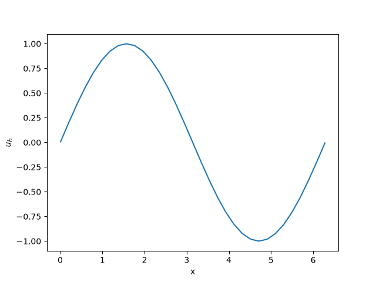
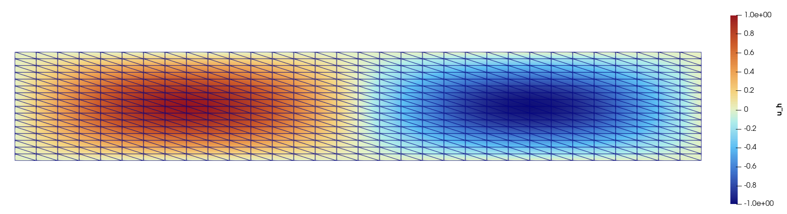
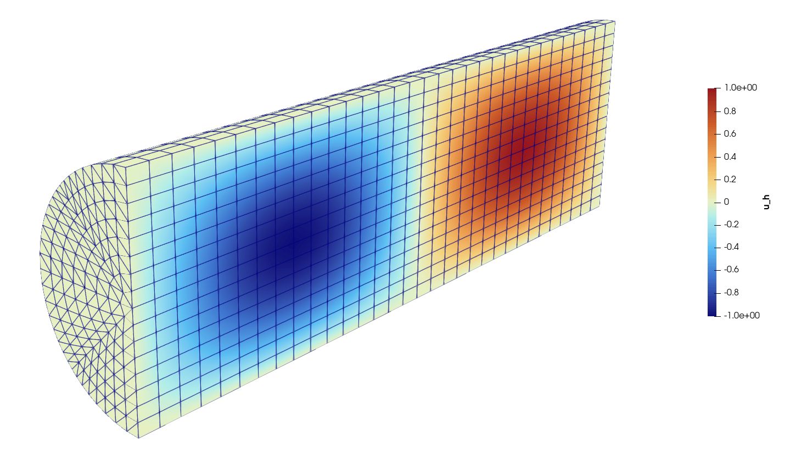
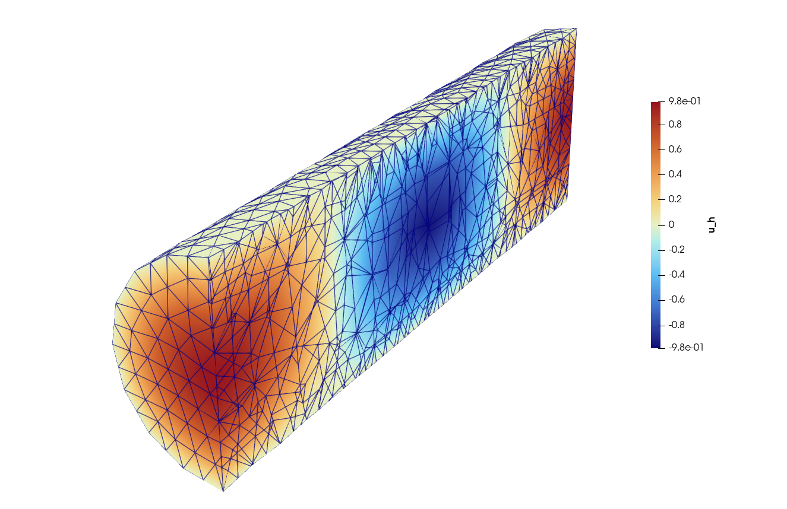
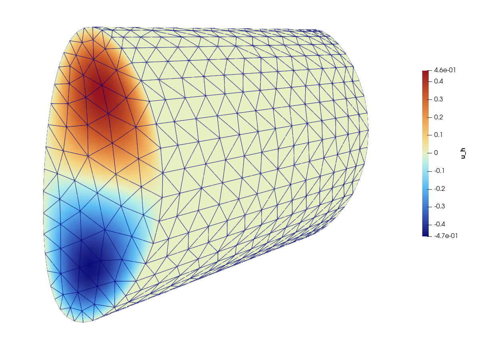
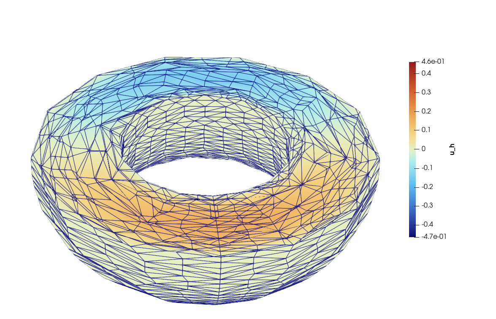

Periodic meshes in Firedrake
============================

This tutorial was contributed by `Thomas Higham <mailto:Thomas.Higham@maths.ox.ac.uk>`__ and `Umberto Zerbinati <mailto:umberto.zerbinati@oriel.ox.ac.uk>`__.

The purpose of this demo is to summarise the support for periodic meshes in Firedrake.
Firedrake can build periodic meshes for simple one- and two-dimensional geometries and can also periodically extrude two-dimensional meshes into three-dimensional prism meshes.
Firedrake also has support for periodic tetrahedral meshes generated in Netgen.

1D Periodic Poisson Problem
---------------------------
We solve the 1D periodic Poisson problem

.. math::

    - \Delta u = \sin(x), \quad u(0) = u(2 \pi),

on :math:`\Omega = [0, 2 \pi]`. This problem has a trivial nullspace of constants; if we fix the constant to be zero then this problem has an analytical solution of :math:`u(x) = \sin(x)`.
We use the Firedrake function ``PeriodicIntervalMesh`` to build the mesh and implement the usual weak formulation of the Poisson equation: ::

    from firedrake import *
    from firedrake.petsc import PETSc
    from math import pi

    mesh = PeriodicIntervalMesh(32, 2*pi)
    x, = SpatialCoordinate(mesh)

    V = FunctionSpace(mesh, "CG", 1)
    u = TrialFunction(V); v = TestFunction(V)

    uh = Function(V, name="Numerical"); uex = Function(V, name="Exact")
    uex.interpolate(sin(x))

    a = dot(grad(u), grad(v)) * dx
    L = sin(x) * v * dx

    problem = LinearVariationalProblem(a, L, uh)

We use the ``VectorSpaceBasis`` function to tell PETSc that the problem has a
constant nullspace::

    nullspace = VectorSpaceBasis(constant=True)

    solver = LinearVariationalSolver(
        problem,
        nullspace=nullspace,
        transpose_nullspace=nullspace,
    )

    solver.solve()

    l2 = errornorm(uex, uh, norm_type="L2")
    PETSc.Sys.Print(f"L2 error = {l2:.16e}")

We plot the solution below.

   Finite element solution to 1D periodic Poisson problem.

2D Periodic Poisson Problem
---------------------------

Now we solve the 2D :math:`x`-periodic Poisson problem

.. math::

    - \Delta u = (1 + \pi^2) \sin(x) \sin(\pi y), \quad u(0,y) = u(2 \pi, y), \quad u(x, 0) = u(x, 1) = 0,

on :math:`\Omega = [0, 2 \pi] \times [0,1]`. The nullspace is fixed for this problem. The exact solution is :math:`u(x,y) = \sin(x)\sin(\pi y)`.
We use the Firedrake function ``PeriodicRectangleMesh`` to build the mesh: if you call this function without calling the argument ``PeriodicRectangleMesh`` then the rectangle will be periodic in both :math:`x` and :math:`y`.
In our case we only want periodicity in :math:`x`. ::

    from firedrake import *
    from firedrake.petsc import PETSc
    from math import pi

    nx = 32
    ny = 16

    mesh = PeriodicRectangleMesh(nx, ny, 2*pi, 1.0, direction="x")
    x, y = SpatialCoordinate(mesh)

    V = FunctionSpace(mesh, "CG", 1)
    u = TrialFunction(V); v = TestFunction(V)
    uh = Function(V, name="Numerical"); u_exact = Function(V, name="Exact")
    u_exact.interpolate(sin(x)*sin(pi*y))

    f = (1 + pi**2)*sin(x)*sin(pi*y)
    a = inner(grad(u), grad(v))*dx
    L = f*v*dx

    # Homogeneous Dirichlet BCs on y = 0 and y = 1.
    bcs = [
        DirichletBC(V, 0.0, 3),
        DirichletBC(V, 0.0, 4),
    ]

    solve(a == L, uh, bcs=bcs)

    l2 = errornorm(u_exact, uh, norm_type="L2")
    PETSc.Sys.Print(f"L2 error = {l2:.3e}")

We plot the solution below.

   Finite element solution to 2D periodic Poisson problem.

3D Periodic Poisson Problem
---------------------------

Now we solve the 3D :math:`z`-periodic Poisson problem

.. math::

    - \Delta u = (5 - x^2 - y^2)\sin(z), \quad u(x,y,0) = u(x, y, 2 \pi), \quad u\vert_{\text{walls}} = 0,

on the domain

.. math::

    \Omega =
    \left\{
    (x,y,z)\in\mathbb{R}^3 :
    x^2+y^2\le 1,\;
    0\le z\le 2\pi
    \right\}.

The exact solution is
:math:`u(x,y,z) = (1-x^2-y^2)\sin(z)`.
In the case of cube or cuboid 3D periodic domains, Firedrake is able to make tetrahedral periodic meshes using the commands ``PeriodicUnitCubeMesh`` and ``PeriodicBoxMesh`` respectively.
For this problem we need a periodic cylinder: we first build a 2D mesh for the desired cross section of the cylinder and then we use the command ``ExtrudedMesh`` with flag ``periodic=True`` to generate a mesh of prisms. ::

    from firedrake import *
    from firedrake.petsc import PETSc
    from math import pi

    Refinement = 3
    base = UnitDiskMesh(Refinement)

    mesh = ExtrudedMesh(
        base,
        layers=32,
        layer_height=2*pi/32,
        periodic=True,
    )

The two important arguments are ``layers`` and ``layer_height``, which tell Firedrake how far to extrude the mesh. By default ``layer_height`` is 1/``layers``. ::

    x, y, z = SpatialCoordinate(mesh)

    V = FunctionSpace(mesh, "CG", 1)

    u = TrialFunction(V); v = TestFunction(V)

    uh = Function(V, name="Numerical"); u_exact = Function(V, name="Exact")
    u_exact.interpolate((1 - x*x - y*y)*sin(z))

    f = (5 - x*x - y*y)*sin(z)

    a = inner(grad(u), grad(v))*dx
    L = f*v*dx

    bc = DirichletBC(V, 0.0, "on_boundary")

    solve(
        a == L,
        uh,
        bcs=bc,
    )

    PETSc.Sys.Print(f"L2 error = {errornorm(u_exact, uh, norm_type='L2'):.3e}")

We plot the solution below.

   Cross-section of the finite element solution to a 3D periodic Poisson problem using prismatic elements.

Periodic Meshes From Netgen
---------------------------

Netgen can identify pairs of vertices lying on opposite boundaries of a geometry as being *the same* point.
When such a mesh is imported into Firedrake, the identified vertices are merged in the mesh topology, so that
a continuous (CG) function space automatically shares its degrees of freedom across the seam: the mesh is
genuinely **periodic**. This is exactly the representation Firedrake uses for its built-in ``PeriodicBoxMesh``, and it is now available for any Netgen geometry carrying
periodic identifications.

Identifications are declared on the geometry, before meshing, with the OCC
``Identify`` method::

    shape_a.Identify(
        shape_b,
        name,
        IdentificationType.PERIODIC,
        transformation,
    )

where ``transformation`` is the rigid motion (typically a translation) that maps ``shape_a`` onto ``shape_b``.
Netgen then meshes the two boundaries compatibly and records the vertex pairs; Firedrake consumes them
automatically -- no extra flag on the ``Mesh`` constructor is required.

As a physically motivated example we build the *periodic cylinder*, the classic reduced ("screw pinch") model
of a tokamak plasma column. A tokamak is a torus, so the plasma is periodic in the toroidal direction; in the
large-aspect-ratio limit one straightens a toroidal section into a cylinder and identifies its two circular
ends, recovering periodicity along the axis. We take the axial (toroidal) coordinate to run over :math:`[0, 2\pi)`
and identify the two end caps by a translation of :math:`2\pi` along ``Z``::

    from netgen.occ import Cylinder, OCCGeometry, Pnt, Z, gp_Trsf, gp_Vec
    from netgen.meshing import IdentificationType
    from math import pi as PI

    cyl = Cylinder(Pnt(0, 0, 0), Z, r=1.0, h=2 * PI)
    # Label the lateral wall, then the two end caps that we will identify.
    for face in cyl.faces:
        face.name = "wall"
    cyl.faces.Min(Z).name = "bottom"
    cyl.faces.Max(Z).name = "top"
    # Identify the bottom cap with the top cap: a translation of 2*pi along Z
    # maps one onto the other, making the axial direction periodic.
    cyl.faces.Min(Z).Identify(cyl.faces.Max(Z), "toroidal",
                              IdentificationType.PERIODIC,
                              gp_Trsf.Translation(gp_Vec(0, 0, 2 * PI)))
    ngmsh = OCCGeometry(cyl).GenerateMesh(maxh=0.4)
    msh = Mesh(ngmsh)

.. warning::

   The mesh must contain at least a handful of cells along each periodic direction. If a single cell spans a
   whole period, its two ends are identified and the cell collapses; Firedrake then raises a ``ValueError``
   asking you to refine along the periodic direction. Here the axis has length :math:`2\pi` and ``maxh=0.4``
   gives roughly sixteen cells along it, which is ample. Only ``degree == 1`` periodic meshes are supported
   for now.

Because the two end caps have been identified, no boundary markers survive on them: the seam has become an
*interior* set of facets, and the only labelled boundary that remains is the lateral wall. This is what makes
a continuous field wrap around continuously in the axial direction. We can verify the geometry survived the
merge intact -- the volume of the cylinder is :math:`\pi r^2 h = 2\pi^2` -- while the ends carry no exterior
facets::

    volume = assemble(Constant(1.0) * dx(domain=msh))
    PETSc.Sys.Print(f"cylinder volume: {volume:.4f}  (exact 2*pi**2 = {2 * PI**2:.4f})")

To show that the periodicity is doing real work, we solve a Helmholtz problem whose exact solution is periodic
in the axial coordinate and vanishes on the lateral wall,

.. math::

   u_{\text{ex}}(x, y, z) = \cos(z)\,\bigl(1 - x^2 - y^2\bigr),

so that we can impose a homogeneous Dirichlet condition on the wall while relying on the identified ends for
continuity along the axis. We look up the id of the ``"wall"`` boundary with ``GetRegionNames`` (as in the
Poisson example above) and manufacture the right-hand side :math:`f = u_{\text{ex}} - \Delta u_{\text{ex}}` for
:math:`(I - \Delta)u = f`::

    V = FunctionSpace(msh, "CG", 2)
    x, y, z = SpatialCoordinate(msh)
    uex = cos(z) * (1 - x**2 - y**2)
    f = uex - div(grad(uex))

    u = TrialFunction(V); v = TestFunction(V)
    a = (inner(u, v) + inner(grad(u), grad(v))) * dx
    L = inner(f, v) * dx

    labels = [i + 1 for i, name in enumerate(ngmsh.GetRegionNames(codim=1)) if name == "wall"]
    bc = DirichletBC(V, 0, labels)

    sol = Function(V)
    solve(a == L, sol, bcs=bc)

    error = sqrt(assemble(inner(sol - uex, sol - uex) * dx))
    PETSc.Sys.Print(f"L2 error: {error:.2e}")

We plot the solution below.

   Finite element solution to 3D periodic Helmholtz problem.

We can also solve a Helmholtz problem on a realistic tokamak geometry, although we no longer have an analytical solution to test against.
We now work with the physical cylindrical coordinates :math:`(R,\phi,Z)`.
The cross-section is constructed in the :math:`(R,Z)` plane and extruded
through one period in :math:`\phi`::

    from firedrake import *
    from netgen.occ import (
        OCCGeometry, WorkPlane, Axes, Pnt, Z, X,
        gp_Trsf, gp_Vec
    )
    from netgen.meshing import IdentificationType
    from math import pi as PI
    import math

    # Geometry parameters - large aspect ratio tokamak
    R0 = 3.0
    a = 1.0
    kappa = 2.0
    delta = 0.3

    n_boundary = 40
    mesh_size = 0.5

    # Build a tokamak cross section and extrude periodically

    alpha = math.asin(delta)

    boundary_points = []
    for i in range(n_boundary):
        theta = 2.0 * math.pi * i / n_boundary
        R = R0 + a * math.cos(theta + alpha * math.sin(theta))
        Zc = kappa * a * math.sin(theta)
        boundary_points.append((R, Zc))

    wp = WorkPlane(Axes((0, 0, 0), n=Z, h=X))

    # Start at the first boundary point, then draw a closed polyline
    R0p, Z0p = boundary_points[0]
    wp.MoveTo(R0p, Z0p)
    for R, Zc in boundary_points[1:]:
        wp.LineTo(R, Zc)
    wp.Close()

    face = wp.Face()

    # Extrude in periodic phi direction and identify end caps.

    phi_length = 2 * PI
    solid = face.Extrude(phi_length * Z)

    # Side wall(s)
    for f in solid.faces:
        f.name = "wall"

    bottom = solid.faces.Min(Z)
    top = solid.faces.Max(Z)
    bottom.name = "bottom"
    top.name = "top"

    # Periodic identification of the end caps
    bottom.Identify(
        top,
        "periodic_phi",
        IdentificationType.PERIODIC,
        gp_Trsf.Translation(gp_Vec(0, 0, phi_length)),
    )

    # Mesh and convert to Firedrake
    ngmsh = OCCGeometry(solid).GenerateMesh(maxh=mesh_size)
    msh = Mesh(ngmsh, name="TokamakPeriodic")

The physical cylindrical coordinate convention is :math:`(R,\phi,Z)`.
However, the Netgen mesh stores its coordinate components in the order
:math:`(R,Z,\phi)`: the first two components are the coordinates of the
cross-section and the third is the extrusion coordinate. We therefore unpack
``SpatialCoordinate`` as ``R, Zc, phi``.

We solve the Helmholtz problem :math:`(I-\Delta)u=f` with source term
:math:`f(R,\phi,Z)=RZ\cos(\phi)`::

    V = FunctionSpace(msh, "CG", 2)
    R, Zc, phi = SpatialCoordinate(msh)

    f = R*Zc*cos(phi)

    u = TrialFunction(V)
    v = TestFunction(V)
    a_form = (inner(u, v) + inner(grad(u), grad(v))) * dx
    L = inner(f, v) * dx

    labels = [
        i + 1
        for i, name in enumerate(ngmsh.GetRegionNames(codim=1))
        if name == "wall"
    ]
    bc = DirichletBC(V, 0, labels)

    sol = Function(V, name="Solution")
    solve(a_form == L, sol, bcs=bc)

We plot the output in :math:`(R, \phi, Z)` cylindrical coordinates:

   Finite element solution to 3D periodic Helmholtz problem in cylindrical tokamak geometry.

Since the solution is represented as a function on the mesh, we can obtain a
Cartesian visualisation by interpolating the cylindrical-to-Cartesian map

.. math::

    (R,\phi,Z) \longmapsto
    \bigl(R\cos(\phi),R\sin(\phi),Z\bigr)

into the mesh coordinate field. The mesh components must again be unpacked in
their stored order, :math:`(R,Z,\phi)`::

    R, Zc, phi = SpatialCoordinate(msh)
    msh.coordinates.interpolate(as_vector((
        R*cos(phi),
        R*sin(phi),
        Zc,
    )))
    VTKFile("output/TokamakCartesianSolution.pvd").write(sol)

We plot a cross-section of the solution in Cartesian coordinates:

   Finite element solution to 3D periodic Helmholtz problem in Cartesian tokamak geometry with tetrahedral elements.

