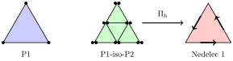
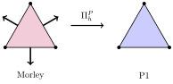
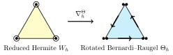
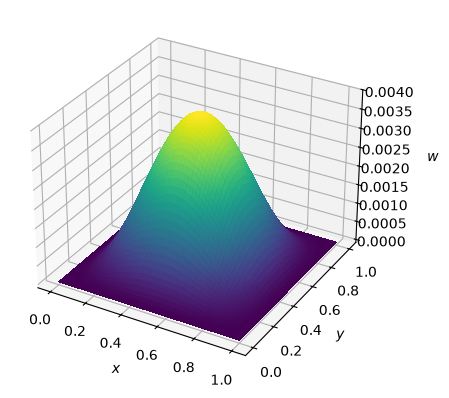

Plate Bending with Nonconforming Elements and Reduction Operators
=================================================================

This demo solves the problem of a thin elastic plate with three finite element
methods. None of them use an :math:`H^2`-conforming element such as Argyris.
Each method instead uses cheaper, nonconforming spaces, and a *reduction
operator* :math:`\Pi_h` connects them. The operator interpolates one field into
a second finite element space before it enters a term of the energy.

Firedrake writes a reduction operator as a :doc:`symbolic interpolation
<../interpolation>` with :py:func:`~.interpolate` inside the
variational form. The interpolation is onto the same mesh, so the form compiler
applies it inside each element kernel. It does not assemble a separate global
interpolation matrix. The three methods combine ``interpolate`` and ``grad``
in three different orders:

We write :math:`\Pi_h^P`, :math:`\Pi_h^N`, and :math:`\Pi_h^\Theta` for
interpolation into the linear Lagrange space :math:`P_h`, the Nédélec space
:math:`\boldsymbol{N}_h`, and the rotated Bernardi--Raugel space
:math:`\boldsymbol{\Theta}_h`, respectively.

The scalar and Nédélec interpolants commute with the gradient:

.. math::

  \Pi_h^N \nabla q = \nabla \Pi_h^P q.

1. **MITC** for the Reissner--Mindlin plate uses ``interpolate(grad(...))``.
   :math:`\Pi_h^N` maps the shear strain into a Nédélec space.
2. **The modified Morley element** for a Kirchhoff plate under in-plane
   tension uses ``grad(interpolate(...))``. :math:`\Pi_h^P` maps the deflection
   into the linear Lagrange space in the membrane term.
3. **Discrete Kirchhoff triangles** for the Kirchhoff plate use
   ``grad(interpolate(grad(...)))`` for bending and
   ``grad(interpolate(...))`` for membrane energy. The first reduction maps the
   gradient of the deflection into a rotated Bernardi--Raugel space with
   :math:`\Pi_h^\Theta`, and the second maps the deflection into the linear
   Lagrange space with :math:`\Pi_h^P`.

At the end, we compare the convergence rates of the three methods.

The Clamped Plate
-----------------

All three methods solve for the transverse deflection :math:`w` of the
mid-surface :math:`\Omega = (0, 1)^2` of a plate that is clamped on its
boundary and carries a transverse load :math:`f`. The bending energy of a
rotation field :math:`\boldsymbol{\beta}` is

.. math::

  \frac{1}{2} \int_\Omega \boldsymbol{\sigma}(\boldsymbol{\beta}) :
  \boldsymbol{\varepsilon}(\boldsymbol{\beta}) \, \mathrm{d}x, \qquad
  \boldsymbol{\sigma}(\boldsymbol{\beta}) = D \left( (1 - \nu)
  \boldsymbol{\varepsilon}(\boldsymbol{\beta}) + \nu \, \nabla \cdot \boldsymbol{\beta}
  \, \mathbf{I} \right),

where :math:`\boldsymbol{\varepsilon}(\boldsymbol{\beta})` is the symmetric
gradient and :math:`D = E t^3 / (12 (1 - \nu^2))` is the bending stiffness of a
plate of thickness :math:`t`, with Young's modulus :math:`E` and Poisson's ratio
:math:`\nu`. The Kirchhoff model sets
:math:`\boldsymbol{\beta} = \nabla w`, which gives the equilibrium equation
:math:`D \Delta^2 w = f`. The Reissner--Mindlin model keeps
:math:`\boldsymbol{\beta}` as an independent unknown.

We begin by importing the Firedrake namespace and setting the material
parameters of a thin plate.

.. code-block:: python

  from firedrake import *

  t = Constant(0.01)
  E = Constant(1e3)
  nu = Constant(0.3)
  D = E * t**3 / (12 * (1 - nu**2))

The bending term is common to all three methods, so we write it once.

.. code-block:: python

  def sigma(beta):
      return D * ((1 - nu) * sym(grad(beta)) + nu * div(beta) * Identity(2))

  def bending(beta, theta):
      return inner(sigma(beta), sym(grad(theta))) * dx

To measure the convergence of each method, we use a manufactured Kirchhoff
solution :math:`w_K` that satisfies the clamped boundary conditions, and we
calculate the load :math:`f = D \Delta^2 w_K` symbolically.

.. code-block:: python

  def kirchhoff_solution(mesh):
      x, y = SpatialCoordinate(mesh)
      return x**2 * (1 - x)**2 * y**2 * (1 - y)**2

Each method approximates the curvature :math:`\nabla \boldsymbol{\beta}`, so we
measure its :math:`L^2` error in all three methods. The error is a polynomial of
high degree, so we integrate it with a quadrature rule of high degree.

.. code-block:: python

  def l2_error(error):
      return sqrt(assemble(inner(error, error) * dx(degree=12)))

Reissner--Mindlin Plate with MITC
---------------------------------

The Reissner--Mindlin model has the total potential energy

.. math::

  \mathcal{E}(w, \boldsymbol{\beta}) =
  \frac{1}{2} \int_\Omega \left(
  \boldsymbol{\sigma}(\boldsymbol{\beta}) :
  \boldsymbol{\varepsilon}(\boldsymbol{\beta})
  + k_s G t \, | \nabla w - \boldsymbol{\beta} |^2 \right) \, \mathrm{d}x
  - \int_\Omega f w \, \mathrm{d}x.

where :math:`G = E / (2 (1 + \nu))` is the shear modulus and :math:`k_s` is
the shear correction factor. As :math:`t \to 0`, the shear term becomes a
penalty that enforces :math:`\boldsymbol{\beta} = \nabla w`. Low-order spaces
cannot satisfy this constraint exactly, so a standard discretisation *locks*:
the deflection tends to zero instead of to the Kirchhoff solution.

The Mixed Interpolation of Tensorial Components (MITC) method
:cite:`Bathe:1985,Brezzi:1989` replaces the
shear strain by its interpolant into an :math:`H(\mathrm{curl})`-conforming
Nédélec space :math:`\boldsymbol{N}_h`:

.. math::

  \bar{\boldsymbol{\gamma}}_h = \Pi_h^N (\nabla w_h - \boldsymbol{\beta}_h)
  = \nabla w_h - \Pi_h^N \boldsymbol{\beta}_h.

In particular, if :math:`w_h \in P_h`, then :math:`\Pi_h^P w_h = w_h`, so the
commuting property gives :math:`\Pi_h^N \nabla w_h = \nabla w_h`. Thus the
second form follows, and the reduced constraint
:math:`\nabla w_h = \Pi_h^N \boldsymbol{\beta}_h` does not over-constrain the
discrete solution.

The following diagram shows the element spaces:

* `P1 <https://defelement.org/elements/lagrange.html>`__: the linear
  Lagrange element for the deflection :math:`w`.
* `P1-iso-P2 <https://defelement.org/elements/p1-iso-p2.html>`__: a
  macroelement that divides each triangle into four smaller triangles, with
  linear Lagrange elements on each one. We use it for the rotation
  :math:`\boldsymbol{\beta}`. The double dots denote degrees of freedom that
  evaluate a vector-valued function at a point.
* `Nédélec 1 <https://defelement.org/elements/nedelec1.html>`__: the
  :math:`H(\mathrm{curl})`-conforming space :math:`\boldsymbol{N}_h` for the
  reduction operator. The arrows show the tangential degrees of freedom on the
  edges.

The P1-iso-P2 macroelement divides each edge in two. Thus the edge moments of
the Nédélec space must use a composite quadrature rule on the divided edges,
which we select with ``quad_scheme="iso"``.

The Reissner--Mindlin solution for the load :math:`D \Delta^2 w_K` is not
:math:`w_K`. The rotation :math:`\boldsymbol{\beta} = \nabla w_K` and the shear
strain :math:`\nabla w - \boldsymbol{\beta} = -D \nabla \Delta w_K / (k_s G t)`
balance the load, so the deflection is
:math:`w = w_K - D \Delta w_K / (k_s G t)`. This deflection is not zero on the
boundary, so we apply it as boundary data.

.. code-block:: python

  k_s = Constant(5 / 6)
  G = E / (2 * (1 + nu))

  def mitc(mesh):
      W = FunctionSpace(mesh, "Lagrange", 1)
      B = VectorFunctionSpace(mesh, "Lagrange", 1, variant="iso")
      R = FunctionSpace(mesh, "N1curl", 1, quad_scheme="iso")
      Z = W * B

      w, beta = TrialFunctions(Z)
      v, theta = TestFunctions(Z)

      a_bending = bending(beta, theta)
      a_shear = k_s * G * t * inner(interpolate(grad(w) - beta, R),
                                    interpolate(grad(v) - theta, R)) * dx
      a = a_bending + a_shear

      w_K = kirchhoff_solution(mesh)
      f = D * div(grad(div(grad(w_K))))
      L = inner(f, v) * dx

      w_exact = w_K - D * div(grad(w_K)) / (k_s * G * t)
      bcs = [DirichletBC(Z.sub(0), w_exact, "on_boundary"),
             DirichletBC(Z.sub(1), 0, "on_boundary")]

      z = Function(Z)
      solve(a == L, z, bcs=bcs)
      w_h, beta_h = z.subfunctions
      return w_h, l2_error(grad(beta_h) - grad(grad(w_K)))

Kirchhoff Plate with the Modified Morley Element
------------------------------------------------

Next, we apply an in-plane tension :math:`T` to a Kirchhoff plate. Its total
potential energy is

.. math::

  \mathcal{E}(w) =
  \frac{1}{2} \int_\Omega \left(
  \boldsymbol{\sigma}(\nabla w) : \boldsymbol{\varepsilon}(\nabla w)
  + T |\nabla w|^2 \right) \, \mathrm{d}x
  - \int_\Omega f w \, \mathrm{d}x.

The corresponding equilibrium equation is:

.. math::

  D \Delta^2 w - T \Delta w = f.

We divide by :math:`T` and write :math:`\varepsilon^2 = D / T`. This gives
:math:`\varepsilon^2 \Delta^2 w - \Delta w = f / T`, which is a singular
perturbation problem. As :math:`\varepsilon \to 0`, the plate behaves as a
membrane that obeys :math:`-T \Delta w^0 = f`. A method for the plate is only
useful when it gives this limit.

The Morley element :cite:`Morley:1968` is the smallest triangular element for
the bending term. It is not a :math:`C^0` element, and the Morley
discretisation of the membrane term does not converge as
:math:`\varepsilon \to 0`. The modified Morley method of Wang, Xu and Hu
:cite:`Wang:2006` keeps the Morley element in the bending term. In the membrane
term and in the load, it replaces :math:`w_h` by its interpolant
:math:`\Pi_h^P w_h` into the linear Lagrange space :math:`P_h`:

.. math::

  \int_\Omega \boldsymbol{\sigma}(\nabla w_h) : \boldsymbol{\varepsilon}(\nabla v_h)
  \, \mathrm{d}x
  + \int_\Omega T \, \nabla \Pi_h^P w_h \cdot \nabla \Pi_h^P v_h \, \mathrm{d}x
  = \int_\Omega f \, \Pi_h^P v_h \, \mathrm{d}x \qquad \forall v_h \in V_h,

where the gradients are evaluated on each cell. At :math:`D = 0`, this is the
linear Lagrange discretisation of the membrane problem. Thus
:math:`\Pi_h^P w_h` tends to the discrete membrane solution as
:math:`\varepsilon \to 0`.

* `Morley <https://defelement.org/elements/morley.html>`__: the quadratic
  nonconforming element for fourth-order problems. Its degrees of freedom are
  the values at the vertices and the mean normal derivatives on the edges,
  which the arrows show.
* `P1 <https://defelement.org/elements/lagrange.html>`__: the linear
  Lagrange element. The reduction operator keeps the values at the vertices
  and ignores the normal derivatives.

Firedrake does not apply strong boundary conditions to the Morley element,
because not all of its degrees of freedom are point values. Thus we apply both
clamped conditions weakly. For the normal derivative
:math:`\partial_n w`, we use Nitsche's method with the normal bending moment
:math:`M_{nn}(w) = \boldsymbol{n} \cdot \boldsymbol{\sigma}(\nabla w)
\boldsymbol{n}`. For the deflection, we apply a penalty to the interpolant
:math:`\Pi_h^P w`. The penalty is scaled for the membrane term and for the
bending term.

.. code-block:: python

  def modified_morley(mesh, T, f):
      V = FunctionSpace(mesh, "Morley", 2)
      P = FunctionSpace(mesh, "Lagrange", 1)

      w = TrialFunction(V)
      v = TestFunction(V)
      Pi_w = interpolate(w, P)
      Pi_v = interpolate(v, P)

      n = FacetNormal(mesh)
      h = CellDiameter(mesh)
      alpha = Constant(20.0)

      def M_nn(u):
          return dot(dot(sigma(grad(u)), n), n)

      def d_n(u):
          return dot(grad(u), n)

      a_bending = bending(grad(w), grad(v))
      a_membrane = T * inner(grad(Pi_w), grad(Pi_v)) * dx
      a_boundary = (- inner(M_nn(w), d_n(v)) * ds
                    - inner(d_n(w), M_nn(v)) * ds
                    + alpha * D / h * inner(d_n(w), d_n(v)) * ds
                    + alpha * (T / h + D / h**3) * inner(Pi_w, Pi_v) * ds)
      a = a_bending + a_membrane + a_boundary
      L = inner(f, Pi_v) * dx

      w_h = Function(V)
      solve(a == L, w_h)
      return w_h

We check the membrane limit with a uniform load. We compare
:math:`\Pi_h^P w_h` with the linear Lagrange solution of the membrane problem,
which has the same weak boundary condition, and we decrease
:math:`\varepsilon`.

.. code-block:: python

  mesh = UnitSquareMesh(16, 16)
  P = FunctionSpace(mesh, "Lagrange", 1)
  p = TrialFunction(P)
  q = TestFunction(P)
  h = CellDiameter(mesh)
  alpha = Constant(20.0)
  f = Constant(1.0)

  w_membrane = Function(P)
  for epsilon in [1e-1, 1e-2, 1e-3]:
      T = D / Constant(epsilon)**2
      w_h = modified_morley(mesh, T, f)

      a = T * inner(grad(p), grad(q)) * dx + T * alpha / h * inner(p, q) * ds
      L = inner(f, q) * dx
      solve(a == L, w_membrane)

      Pi_w_h = assemble(interpolate(w_h, P))
      difference = errornorm(w_membrane, Pi_w_h) / norm(w_membrane)
      print(f"Modified Morley: epsilon = {epsilon:.0e}, "
            f"relative difference from the membrane = {difference:.2e}")

The difference decreases as :math:`O(\varepsilon^2)`. Thus the method gives the
correct limit.

.. code-block:: python

  assert difference < 1e-3

For the convergence study, we use a tension that gives
:math:`\varepsilon = 10^{-2}` and the load
:math:`f = D \Delta^2 w_K - T \Delta w_K`, so the exact solution is
:math:`w_K`.

.. code-block:: python

  def plate_under_tension(mesh):
      T = D / Constant(1e-2)**2
      w_K = kirchhoff_solution(mesh)
      f = D * div(grad(div(grad(w_K)))) - T * div(grad(w_K))
      w_h = modified_morley(mesh, T, f)
      return w_h, l2_error(grad(grad(w_h)) - grad(grad(w_K)))

Kirchhoff Plate with Discrete Kirchhoff Triangles
-------------------------------------------------

The Kirchhoff model uses :math:`\boldsymbol{\beta} = \nabla w` in the bending
energy, and it has no shear term. The bending term then contains second
derivatives of :math:`w`, and a conforming method needs an
:math:`H^2`-conforming space. The discrete Kirchhoff triangle of Batoz, Bathe,
and Ho :cite:`Batoz:1980` replaces :math:`\nabla w` by a discrete gradient
:math:`\nabla_h^\Theta w_h = \Pi_h^\Theta \nabla w_h`. This operator interpolates the
gradient into the rotated Bernardi--Raugel space :math:`\Theta_h`. To include
the membrane energy, we use a second reduction
:math:`\Pi_h^P w_h` into the linear Lagrange space :math:`P_h`. The full DKT
energy is

.. math::

  \mathcal{E}_h(w_h) =
  \frac{1}{2} \int_\Omega \boldsymbol{\sigma}(\nabla_h^\Theta w_h) :
  \boldsymbol{\varepsilon}(\nabla_h^\Theta w_h) \, \mathrm{d}x
  + \frac{1}{2} \int_\Omega T |\nabla \Pi_h^P w_h|^2 \, \mathrm{d}x
  - \int_\Omega f \Pi_h^P w_h \, \mathrm{d}x.

The equilibrium equation for this energy is:

.. math::

  \int_\Omega \boldsymbol{\sigma}(\nabla_h^\Theta w_h) :
  \boldsymbol{\varepsilon}(\nabla_h^\Theta v_h) \, \mathrm{d}x
  + \int_\Omega T \, \nabla \Pi_h^P w_h \cdot \nabla \Pi_h^P v_h \, \mathrm{d}x
  = \int_\Omega f \Pi_h^P v_h \, \mathrm{d}x
  \qquad \forall v_h \in W_h.

The P1 reduction is essential for the membrane term. The DKT discrete gradient
is designed to approximate the rotation in the bending term; it is not the
conforming gradient of the reduced deflection space. Using it in the membrane
term would therefore define a different second-order operator and would lose
the uniform membrane limit. The DKT method combines the two gradient
reductions in UFL as
``grad(interpolate(grad(w), Theta))`` for bending and
``grad(interpolate(w, P))`` for membrane energy.

* **Reduced Hermite**: the deflection space :math:`W_h`. Its degrees of freedom
  are the values and the gradients at the vertices. It is the cubic
  `Hermite <https://defelement.org/elements/hermite.html>`__ element with one
  constraint that removes the interior degree of freedom.
* **Rotated Bernardi--Raugel**: the vector-valued space :math:`\Theta_h`. It is
  the vector linear Lagrange space with a tangential bubble on each edge, and
  it rotates the normal bubbles of the
  `Bernardi--Raugel <https://defelement.org/elements/bernardi-raugel.html>`__
  element. The discrete gradient keeps the gradient at the vertices and the
  tangential component on each edge.

The boundary condition on :math:`W_h` sets the values and the gradients at the
boundary vertices to zero. The discrete gradient of the solution is then zero
on the boundary, and this clamps the plate.

.. code-block:: python

  def discrete_kirchhoff(mesh):
      W = FunctionSpace(mesh, "Reduced-Hermite", 3)
      Theta = FunctionSpace(mesh, "Rotated-Bernardi-Raugel", 1)
      P = FunctionSpace(mesh, "Lagrange", 1)

      w = TrialFunction(W)
      v = TestFunction(W)
      discrete_grad_w = interpolate(grad(w), Theta)
      discrete_grad_v = interpolate(grad(v), Theta)
      Pi_w = interpolate(w, P)
      Pi_v = interpolate(v, P)

      T = D / Constant(1e-2)**2
      a_bending = bending(discrete_grad_w, discrete_grad_v)
      a_membrane = T * inner(grad(Pi_w), grad(Pi_v)) * dx
      a = a_bending + a_membrane

      w_K = kirchhoff_solution(mesh)
      f = D * div(grad(div(grad(w_K)))) - T * div(grad(w_K))
      L = inner(f, Pi_v) * dx

      w_h = Function(W)
      solve(a == L, w_h, bcs=DirichletBC(W, 0, "on_boundary"))
      beta_h = interpolate(grad(w_h), Theta)
      return w_h, l2_error(grad(beta_h) - grad(grad(w_K)))

Convergence Rates
-----------------

We solve the three problems on a sequence of uniformly refined meshes, and we
print the curvature errors and the rates of convergence between successive
meshes.

.. code-block:: python

  import numpy as np

  methods = {"MITC": mitc,
             "Modified Morley": plate_under_tension,
             "Discrete Kirchhoff": discrete_kirchhoff}
  sizes = [4, 8, 16, 32]
  errors = {name: [] for name in methods}
  solutions = {}
  for size in sizes:
      mesh = UnitSquareMesh(size, size)
      for name, method in methods.items():
          solutions[name], error = method(mesh)
          errors[name].append(error)

  print(f"{'n':>4}" + "".join(f"{name:>20}{'rate':>6}" for name in methods))
  for i, size in enumerate(sizes):
      row = f"{size:4d}"
      for name in methods:
          rate = f"{np.log2(errors[name][i - 1] / errors[name][i]):.2f}" if i else "--"
          row += f"{errors[name][i]:20.3e}{rate:>6}"
      print(row)

The demo prints the following errors and rates:

.. table:: Curvature errors and convergence rates
   :align: center
   :class: column-pairs
   :widths: 1 3 2 3 2 3 2

   +----+------------------+------------------+--------------------+
   |    | MITC             | Modified Morley  | Discrete Kirchhoff |
   +    +-----------+------+-----------+------+-----------+--------+
   | n  | error     | rate | error     | rate | error     | rate   |
   +====+===========+======+===========+======+===========+========+
   | 4  | 4.260e-02 | --   | 4.344e-02 | --   | 2.564e-02 | --     |
   +----+-----------+------+-----------+------+-----------+--------+
   | 8  | 3.002e-02 | 0.50 | 3.003e-02 | 0.53 | 1.292e-02 | 0.99   |
   +----+-----------+------+-----------+------+-----------+--------+
   | 16 | 1.711e-02 | 0.81 | 1.756e-02 | 0.77 | 6.485e-03 | 0.99   |
   +----+-----------+------+-----------+------+-----------+--------+
   | 32 | 8.992e-03 | 0.93 | 9.434e-03 | 0.90 | 3.253e-03 | 1.00   |
   +----+-----------+------+-----------+------+-----------+--------+

All three methods converge at first order in the curvature. MITC reaches this
rate only after the mesh resolves the thickness. The rate of the modified
Morley method does not depend on :math:`\varepsilon`.

.. code-block:: python

  for name in methods:
      rate = np.log2(errors[name][-2] / errors[name][-1])
      assert rate > 0.85, (name, rate)

Finally, we draw a surface plot of the discrete Kirchhoff deflection on the
finest mesh with :func:`trisurf <firedrake.pyplot.trisurf>`.

.. code-block:: python

  import matplotlib.pyplot as plt
  from firedrake.pyplot import trisurf

  fig = plt.figure()
  axes = fig.add_subplot(projection="3d")
  trisurf(solutions["Discrete Kirchhoff"], axes=axes)
  axes.set_xlabel("$x$")
  axes.set_ylabel("$y$")
  axes.set_zlabel("$w$", labelpad=12)
  fig.savefig("plate_bending.png", bbox_inches="tight")

A python script version of this demo can be found :demo:`here <plate_bending.py>`.

.. rubric:: References

.. bibliography:: demo_references.bib
   :filter: docname in docnames
