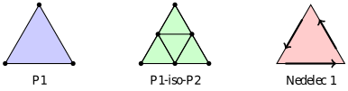

Plate Bending Using Mixed Interpolation of Tensorial Components (MITC)
======================================================================

This demo illustrates how to solve a Reissner-Mindlin plate problem using the
Mixed Interpolation of Tensorial Components (MITC) formulation. The main goal of
the MITC method is to prevent shear locking in the thin-plate limit (:math:`t \to 0`)
by projecting the rotation field into an edge-conforming Nédélec space.

Background and Formulation
--------------------------

We model the plate using the Reissner-Mindlin equations. Given a domain
:math:`\Omega` representing the plate's mid-surface, we seek the transverse deflection
:math:`w` and the rotations :math:`\boldsymbol{\beta}` of the mid-surface normal.

To avoid shear locking, the standard shear strain term :math:`(\nabla w - \boldsymbol{\beta})`
is modified. We project the rotation field :math:`\boldsymbol{\beta}` onto an
:math:`H(\text{curl})`-conforming space :math:`\boldsymbol{R}_h` (a Nédélec space) using a reduction
operator :math:`\Pi_h`. The shear strain term is then evaluated as:

.. math::

  \bar{\boldsymbol{\gamma}}_h = \nabla w - \Pi_h \boldsymbol{\beta}

Element Spaces
--------------

The following diagram illustrates the element spaces used:

* **P1**: Standard linear Lagrange element for the deflection :math:`w`.
* **P1-iso-P2**: Constructed as macroelement, where the master triangle is divided into four smaller sub-triangles. This structure is utilized for the rotation field :math:`\boldsymbol{\beta}`.
* **Nédélec 1**: An :math:`H(\text{curl})`-conforming space used for the MITC projection. The blue arrows represent the edge-based degrees of freedom.

Implementation
--------------

Thanks to native compilation support for symbolic interpolation nodes inside
variational forms, we can define the reduction operator directly using
Firedrake's symbolic ``interpolate`` function within the UFL expression. Under the
hood, this bypasses ``BaseFormAssembler`` specifically for the case where
we have a ``Form`` with an ``Interpolate`` node onto the same mesh.

We begin by importing the Firedrake namespace.

::

  from firedrake import *

Mesh and Geometry
-----------------

First, we set up a simple mesh of a unit square representing our plate.

::

  n = 16
  mesh = UnitSquareMesh(n, n)

Material and Physical Parameters
--------------------------------

We set up standard parameters for a thin plate. Here, we define the thickness
:math:`t`, Young's modulus :math:`E`, Poisson's ratio :math:`\nu`, and the shear correction factor
:math:`k_s`.

::

  t = Constant(0.01)
  E = Constant(1e3)
  nu = Constant(0.3)
  k_s = Constant(5.0/6.0)

The bending stiffness :math:`D` and shear stiffness :math:`G` are derived below.

::

  D = E * t**3 / (12 * (1 - nu**2))
  G = E / (2 * (1 + nu))
  G_shear = k_s * G * t

Function Spaces
---------------

We construct a mixed function space for the deflection and the rotation. We use
linear Lagrange elements for the deflection and P1-iso-P2 elements for the rotation.
Crucially, we also define a Nédélec space :math:`R` of degree 1 to serve as our
target edge-conforming space for the MITC projection. Because the facets are
split by the P1-iso-P2 macro-triangulation, the Nédélec integral moments must
employ a composite quadrature scheme (``quad_scheme="iso"``).

::

  W = FunctionSpace(mesh, "Lagrange", 1)
  B = VectorFunctionSpace(mesh, "Lagrange", 1, variant="iso")
  R = FunctionSpace(mesh, "N1curl", 1, quad_scheme="iso")

  V = MixedFunctionSpace([W, B])

Variational Formulation
-----------------------

Next, we declare the trial and test functions. We write the isotropic bending
stress tensor :math:`\boldsymbol{\sigma}(\boldsymbol{\beta})` and establish our bilinear forms.

::

  u = Function(V)
  w, beta = TrialFunctions(V)
  v, theta = TestFunctions(V)

  def sigma(phi):
    return D * ((1 - nu) * sym(grad(phi)) + nu * div(phi) * Identity(2))

  a_bending = inner(sigma(beta), sym(grad(theta))) * dx

We implement the MITC projection using Firedrake's symbolic ``interpolate()``
function. This acts as a true symbolic UFL operator embedded
directly within the form definition. TSFC handles the assembly
pipeline seamlessly by evaluating the node on the same mesh.

::

  Pi_beta = interpolate(beta, R)
  Pi_theta = interpolate(theta, R)
  
  a_shear = G_shear * inner(grad(w) - Pi_beta, grad(v) - Pi_theta) * dx

  a = a_bending + a_shear

We impose a uniform transverse downward load :math:`f` acting on the plate.

::

  f = Constant(1.0)
  L = inner(f, v) * dx

Boundary Conditions
-------------------

We apply fully clamped boundary conditions on all boundaries, meaning both the
deflection :math:`w` and the rotation :math:`\boldsymbol{\beta}` vanish.

::

  bcs = [DirichletBC(V.sub(0), 0, "on_boundary"),
         DirichletBC(V.sub(1), 0, "on_boundary")]

Computation
-----------

We solve the problem in the usual way.

::

  solve(a == L, u, bcs=bcs)

We recover the split deflection and rotation solutions for analysis.

::

  w_sol, beta_sol = u.subfunctions
  max_w = w_sol.dat.data.max()
  print(f"Max deflection: {max_w:.6e}")

Finally, we output the deflection to a PVD file for visualization in ParaView.

::

  VTKFile("mitc_plate.pvd").write(w_sol)
