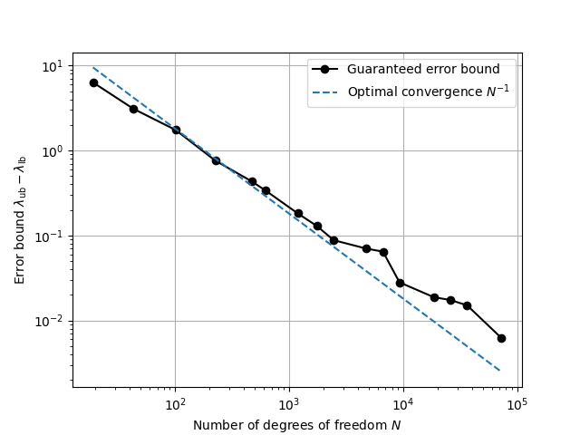
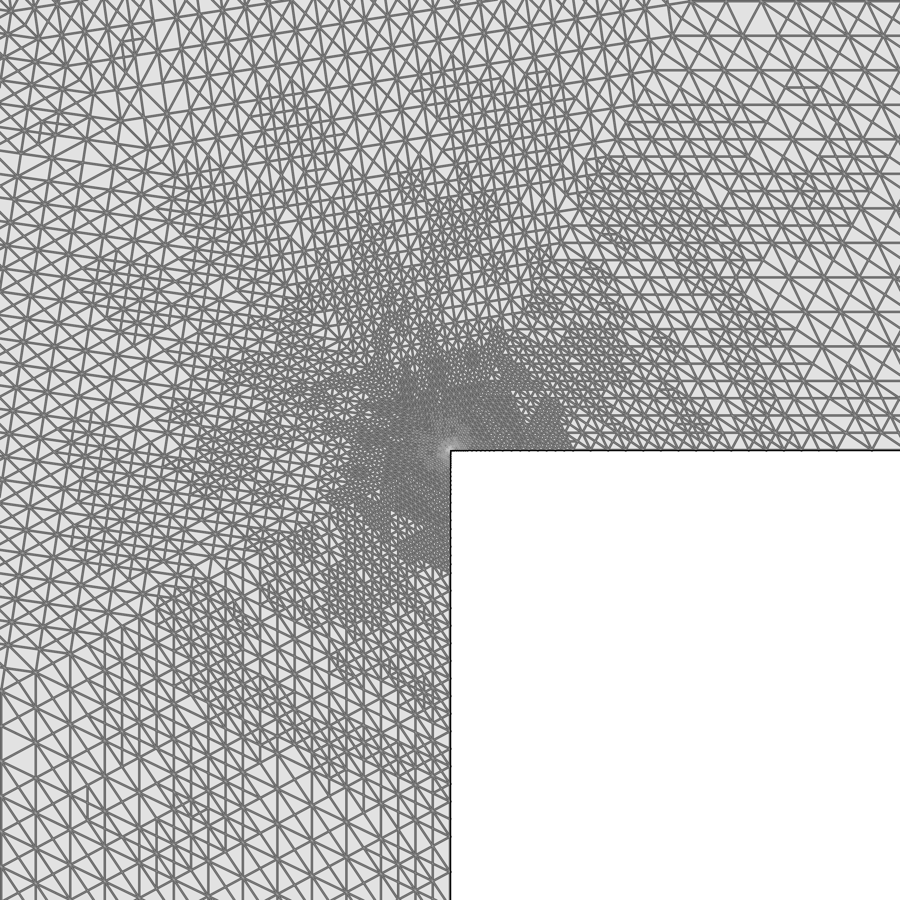
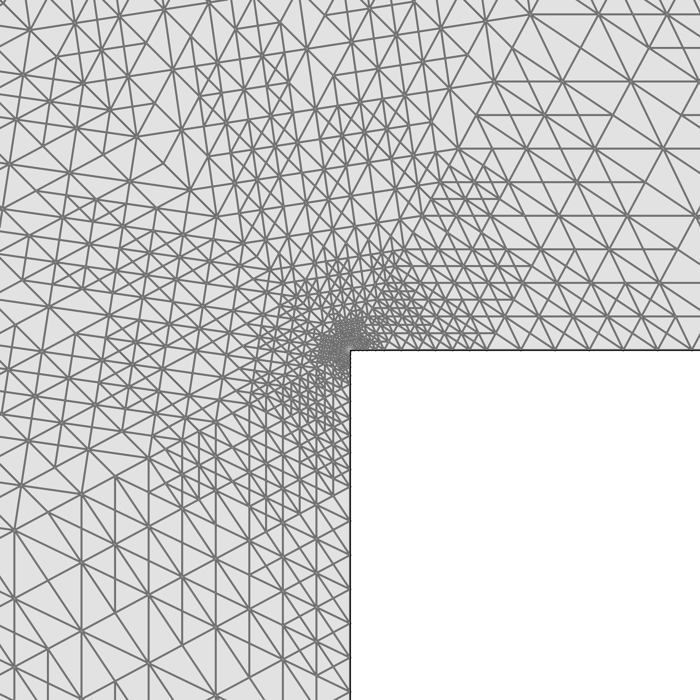
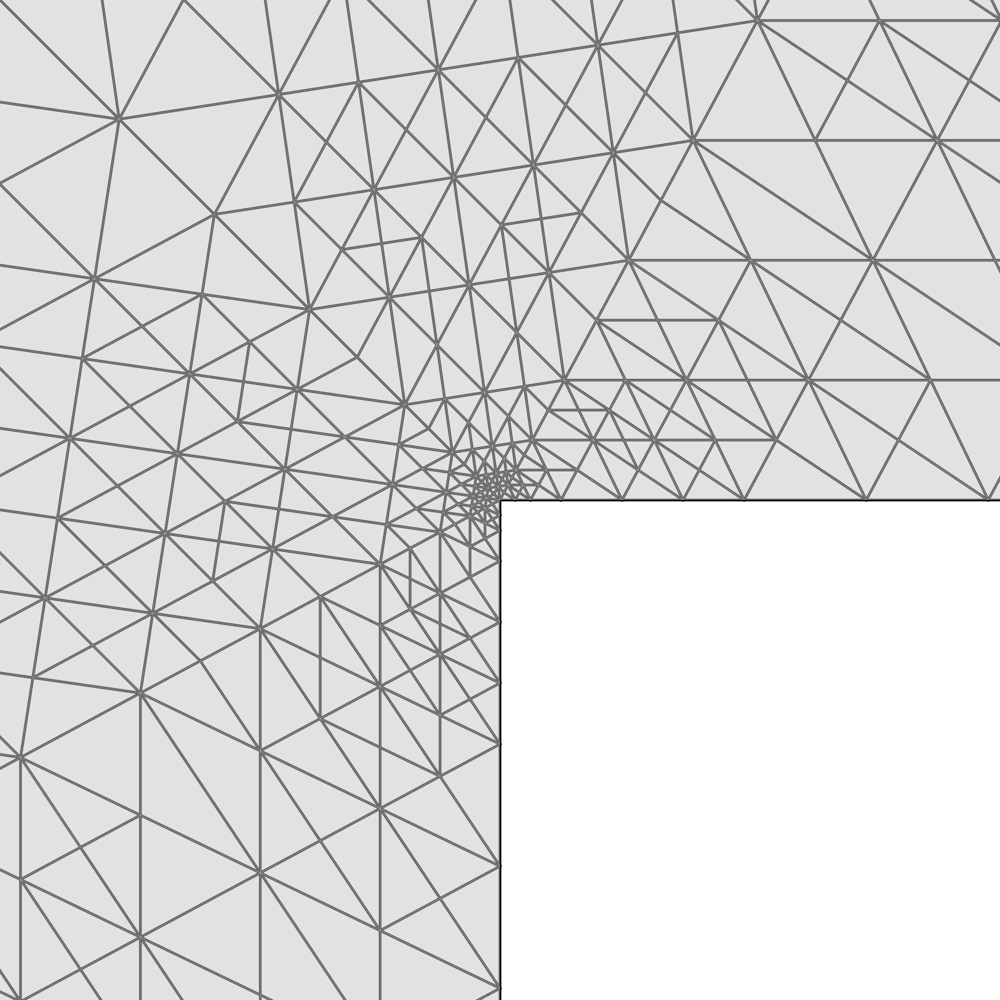

Adaptive eigenvalue problem on an L-shaped domain
=================================================

.. rst-class:: emphasis

    This demo computes the lowest eigenvalue of the Dirichlet Laplacian on an L-shaped domain to within a guaranteed
    error tolerance using adaptive mesh refinement. The error estimate in the eigenvalue is based on solving the problem
    with two complementary discretisations: a conforming method naturally yields an upper bound, while the
    Crouzeix-Raviart non-conforming method yields a lower bound after postprocessing proposed by Carstensen & Gedicke.
    The demo also demonstrates that adaptive mesh refinement is strictly more efficient than uniform refinement,
    due to the singularity of the eigenfunction at the re-entrant corner.

    The demo was contributed by `Patrick Farrell
    <mailto:patrick.farrell@maths.ox.ac.uk>`__.

We consider the Dirichlet eigenvalue problem for the Poisson equation on an L-shaped domain :math:`\Omega`:

.. math::
   -\Delta u &= \lambda u \quad \text{in } \Omega, \\
           u &= 0         \quad \text{on } \partial \Omega.

We aim to compute the lowest eigenvalue. Since the domain has a re-entrant corner, the eigenfunction has a singularity. Thus, uniform mesh refinement leads to suboptimal convergence. We demonstrate an adaptive strategy driven by a residual-based a posteriori error estimator. To establish rigorous bounds on the true eigenvalue :math:`\lambda`, we use conforming elements (CG) for an upper bound :cite:`Boffi:2010`, and nonconforming elements (CR) with Carstensen-Gedicke postprocessing :cite:`CarstensenGedicke:2014` for a guaranteed lower bound.

We start by importing the necessary libraries: ::

  from firedrake import *
  from netgen.occ import *

We then define the L-shaped domain using Netgen's Open CASCADE technology (OCC) interface, and generate an initial mesh: ::

  rect1 = WorkPlane(Axes((0,0,0), n=Z, h=X)).Rectangle(1,2).Face()
  rect2 = WorkPlane(Axes((0,1,0), n=Z, h=X)).Rectangle(2,1).Face()
  L = rect1 + rect2

  geo = OCCGeometry(L, dim=2)
  ngmesh = geo.GenerateMesh(maxh=0.5)
  mesh = Mesh(ngmesh)

We create a function to solve the eigenvalue problem for both continuous (CG) and nonconforming Crouzeix-Raviart (CR) :cite:`Crouzeix:1973` elements. By the Rayleigh-Ritz principle :cite:`Boffi:2010,Gander:2012`, the CG solution provides an upper bound :math:`\lambda_{\text{ub}}`. The CR solution gives a discrete eigenvalue :math:`\lambda_{\text{CR}}`, which can be postprocessed to yield a guaranteed lower bound:

.. math::
    \lambda_{\text{lb}} = \frac{\lambda_{\text{CR}}}{1 + \kappa_{\text{CR}}^2 h_{\max}^2 \lambda_{\text{CR}}}

where :math:`\kappa_{\text{CR}} \approx 0.1893` is the constant established by Carstensen and Gedicke :cite:`CarstensenGedicke:2014`. A general theory for deriving lower bounds for eigenvalues with nonconforming methods has been developed by Hu et al. :cite:`Hu:2014`. We will use the postprocessed lower bound to terminate the adaptive iteration, while for technical reasons we will plot the Galerkin gap :math:`\lambda_{\text{CG}} - \lambda_{\text{CR}}` to demonstrate optimal convergence.

To efficiently compute the smallest eigenvalue, we configure SLEPc using a solver parameters dictionary. We specify a Krylov-Schur eigensolver (``eps_type``) and a shift-and-invert spectral transformation (``st_type``) with a target of zero (``eps_target``). We also flag the generalized eigenvalue problem as Hermitian (``eps_gen_hermitian``) and request the smallest real eigenvalue (``eps_smallest_real``). ::

  def solve_eigenproblem(mesh):
      h_symbolic = CellDiameter(mesh)
      DG0 = FunctionSpace(mesh, "DG", 0)
      h_cell = Function(DG0).interpolate(h_symbolic)
      with h_cell.dat.vec_ro as hvec:
          h_max = hvec.max()[1]
      eigenfunction = None

      for space in ["CG", "CR"]:
          V = FunctionSpace(mesh, space, 1)

          u = TrialFunction(V)
          v = TestFunction(V)

          a = inner(grad(u), grad(v))*dx
          b = inner(u, v)*dx
          bc = DirichletBC(V, 0, "on_boundary")
          eigenproblem = LinearEigenproblem(a, b, bc)

          sp = {
                "eps_gen_hermitian": None,
                "eps_smallest_real": None,
                "eps_monitor_cancel": None,
                "eps_type": "krylovschur",
                "eps_target": 0,
                "st_type": "sinvert",
                }

          eigensolver = LinearEigensolver(eigenproblem, 1, solver_parameters=sp)
          eigensolver.solve()

          if space == "CR":
              lambda_CR = eigensolver.eigenvalue(0).real
              kappa_CR = 0.1893
              lambda_lb = lambda_CR / (1 + kappa_CR**2 * h_max**2 * lambda_CR)
          if space == "CG":
              lambda_ub = eigensolver.eigenvalue(0).real
              eigenfunction = eigensolver.eigenfunction(0)[0]

      eigenfunction.rename("Eigenfunction")
      return (lambda_lb, lambda_ub, lambda_CR, eigenfunction)

These bounds do not describe where the mesh should be refined so as to reduce the error. For this purpose we employ a standard residual-based a posteriori error estimator :cite:`Duran:2003,Larson:2000`. Note that this assumes there is a single eigenfunction associated with the lowest eigenvalue; if the eigenvalue were of higher multiplicity the estimator would need to consider the entire eigenspace :cite:`Boffi:2014`. ::

  def estimate_error(mesh, uh, lam):
      W = FunctionSpace(mesh, "DG", 0)
      eta_sq = Function(W)
      w = TestFunction(W)
      h = CellDiameter(mesh)
      n = FacetNormal(mesh)
      v = CellVolume(mesh)

      G = (
            inner(eta_sq / v, w)*dx
          - inner(h**2 * (lam*uh + div(grad(uh)))**2, w) * dx
          - inner(h('+')/2 * jump(grad(uh), n)**2, w('+')) * dS
          - inner(h('-')/2 * jump(grad(uh), n)**2, w('-')) * dS
          )

      sp = {"mat_type": "matfree", "ksp_type": "preonly", "pc_type": "jacobi"}
      solve(G == 0, eta_sq, solver_parameters=sp)
      eta = Function(W).interpolate(sqrt(eta_sq))

      with eta.dat.vec_ro as eta_:
          error_est = eta_.norm()
      return (eta, error_est)

We define a function to adapt the mesh by refining elements with large error indicators, using the maximum Dörfler-like marking strategy with :math:`\theta = 0.5`: ::

  def adapt(mesh, eta):
      W = FunctionSpace(mesh, "DG", 0)
      markers = Function(W)

      with eta.dat.vec_ro as eta_:
          eta_max = eta_.max()[1]

      theta = 0.5
      should_refine = conditional(gt(eta, theta*eta_max), 1, 0)
      markers.interpolate(should_refine)

      return mesh.refine_marked_elements(markers)

Finally, we run the adaptive loop until the upper and lower bounds agree to within a tolerance. ::

  max_iterations = 20

  # Setup for faster test execution.
  import os
  if os.getenv("FIREDRAKE_CI") == "1":
      max_iterations = 2

  error_estimators = []
  dofs = []
  err = 1

  for i in range(max_iterations):
      lam_lb, lam_ub, lam_CR, uh = solve_eigenproblem(mesh)
      err = lam_ub - lam_lb
      gap = lam_ub - lam_CR
      error_estimators.append(gap)
      dofs.append(uh.function_space().dim())
      print(f"Level {i}: Upper bound {lam_ub:.5f}, Lower bound {lam_lb:.5f}, Bound gap {err:.5e}, Galerkin gap {gap:.5e}")

      VTKFile(f"l_eigenfunction_{i}.pvd").write(uh)

      if err < 1e-2 or dofs[-1] > 1000000:
          break

      eta, _ = estimate_error(mesh, uh, lam_ub)
      mesh = adapt(mesh, eta)

To demonstrate that adaptivity is necessary to achieve the optimal convergence rate, we can run the same script with :math:`\theta = 0`, which forces uniform refinement (all cells are marked for refinement at every step). We make this optional by guarding it behind the Boolean ``run_uniform``. ::

  run_uniform = True

  if run_uniform:
      mesh_uniform = Mesh(ngmesh)
      uniform_error_estimators = []
      uniform_dofs = []

      def adapt_uniform(mesh, eta):
          markers = Function(FunctionSpace(mesh, "DG", 0)).assign(1.0)
          return mesh.refine_marked_elements(markers)

      for i in range(max_iterations):
          lam_lb, lam_ub, lam_CR, uh = solve_eigenproblem(mesh_uniform)
          err = lam_ub - lam_lb
          gap = lam_ub - lam_CR
          uniform_error_estimators.append(gap)
          uniform_dofs.append(uh.function_space().dim())
          if err < 5e-3 or uniform_dofs[-1] > 1000000:
              break
          eta, _ = estimate_error(mesh_uniform, uh, lam_ub)
          mesh_uniform = adapt_uniform(mesh_uniform, eta)

We can plot the convergence of the Galerkin gap :math:`\lambda_{\text{ub}} - \lambda_{\text{CR}}` against the number of degrees of freedom. With adaptivity, we achieve the optimal :math:`O(N^{-1})` convergence rate. For uniform refinement, the error is initially dominated by the smooth part of the solution (yielding a pre-asymptotic :math:`O(N^{-1})` rate), but as the mesh is refined, the singularity inevitably dominates and limits the asymptotic convergence to the suboptimal rate of :math:`O(N^{-2/3})`. ::

  try:
      import matplotlib.pyplot as plt
      import numpy as np

      plt.grid()
      plt.loglog(dofs, error_estimators, '-ok', label=r"Adaptive refinement ($\theta = 0.5$)")
      scaling = error_estimators[0] / dofs[0]**-1
      plt.loglog(dofs, np.array(dofs)**(-1.0) * scaling, '--', label="Optimal convergence $N^{-1}$")

      if run_uniform:
          plt.loglog(uniform_dofs, uniform_error_estimators, '-or', label=r"Uniform refinement ($\theta = 0$)")
          scaling_uniform = uniform_error_estimators[-1] / uniform_dofs[-1]**(-2.0/3.0)
          plt.loglog(uniform_dofs, np.array(uniform_dofs)**(-2.0/3.0) * scaling_uniform, ':r', label=r"Suboptimal convergence $N^{-2/3}$")
      plt.xlabel("Number of degrees of freedom $N$")
      plt.ylabel(r"Galerkin gap $\lambda_{\text{ub}} - \lambda_{\text{CR}}$")
      plt.legend()
      plt.savefig("adaptive_eigenvalue_convergence.png")
  except ImportError:
      warning("Matplotlib not imported")

   Convergence of the Galerkin gap :math:`\lambda_{\text{ub}} - \lambda_{\text{CR}}`. Note that the adaptive scheme achieves the optimal convergence rate of :math:`O(N^{-1})`, whereas uniform refinement is limited to the suboptimal rate of :math:`O(N^{-2/3})`.

To visualize how the adaptive algorithm resolves the singularity, the sequence of images below shows the mesh (at refinement level 15), zooming into the re-entrant corner at 10x, 100x, and 1000x magnification.

.. rubric:: References

.. bibliography:: demo_references.bib
   :filter: docname in docnames

