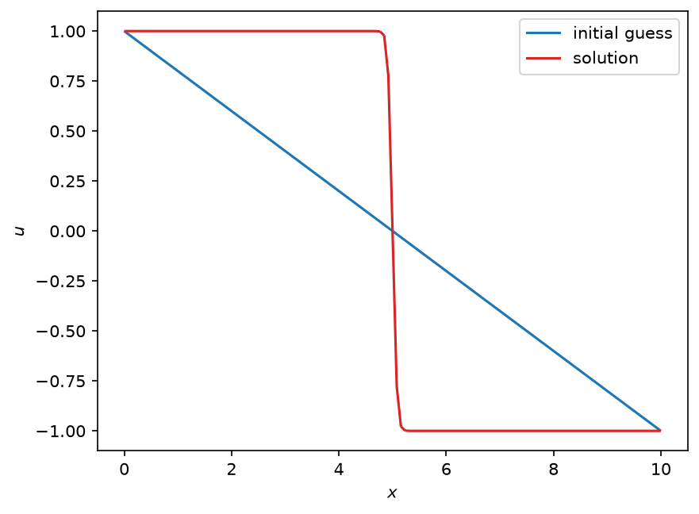

Newton trust-region methods applied to the Allen-Cahn equation
==============================================================

Contributed by `Hussam Al Daas <https://github.com/haldaas>`_.

In the :doc:`nonlinear preconditioning demo <nonlinear_pc_allen_cahn.py>`,
we saw that Newton's method with a line search fails to solve the steady-state
Allen-Cahn equation from a poor initial guess, and that nonlinear
preconditioning can be used to salvage the wreck. In this demo we look at a
different remedy for the same problem: replacing the line search by a
*trust-region* strategy.

Recall that, to solve a nonlinear system

.. math::

  F(u) = 0,

each step of Newton's method first computes a search direction :math:`s` by
solving the linear system

.. math::

  \nabla F(u)s = -F(u),

and then uses a line search to decide how far to move along :math:`s`. The
line search trusts the *direction* :math:`s` completely and only questions
its length. This is a problem if :math:`\nabla F(u)` is indefinite, because then the
Newton direction need not be a descent direction for any sensible merit
function, and no choice of step length will help.

Trust-region methods turn this around. Suppose that :math:`F` is the gradient
of some objective functional :math:`E`, i.e., :math:`F = \nabla E` so that 
solving :math:`F(u) = 0` is the same as finding a critical point of :math:`E`. 
At the current iterate :math:`u_k`, we build a quadratic model of the objective

.. math::

  m_k(s) = E(u_k) + \langle F(u_k), s\rangle + \frac{1}{2}\langle \nabla F(u_k)s, s\rangle,

and we only trust this model within a ball of radius :math:`\delta_k` around
:math:`u_k`. The step is chosen to (approximately) minimise the model inside
the ball,

.. math::

  s_k = \operatorname{arg\,min}_{\|s\| \le \delta_k} m_k(s).

The norm in that constraint is a choice, and the last part of this demo shows
how to make it a norm of the function space rather than of the coefficient
vector. If the Newton step lies inside the ball, and :math:`\nabla F(u_k)` is positive
definite, then this is just the Newton step. Otherwise the constraint will 
be active and somehow we need to bring back the step to the boundary of the
trust region - a variety of techniques are available to do this. Having 
computed a candidate step, we compare the reduction in the objective that 
we actually obtained against the reduction predicted by the model,

.. math::

  \rho_k = \frac{E(u_k) - E(u_k + s_k)}{m_k(0) - m_k(s_k)}.

The step is accepted if :math:`\rho_k > \eta_1`. If the model was a poor
predictor (:math:`\rho_k < \eta_2`) the radius is shrunk by a factor
:math:`t_1`, and if it was a good predictor (:math:`\rho_k > \eta_3`) and the
step reached the boundary of the ball, the radius is enlarged by a factor
:math:`t_2`. A rejected step is simply retried in the smaller region. PETSc
implements this algorithm as the ``newtontr`` SNES type; with defaults that
can be modified through the options ``snes_tr_eta1``, ..., ``snes_tr_delta0``. 
See chapter 4 of :cite:`nocedal2006numerical` for a thorough treatment of 
trust-region methods.

The important point for us is that the whole algorithm is driven by the
objective :math:`E`: it is what decides whether a step is accepted and
whether the region grows or shrinks. In Firedrake, we tell the solver about
the objective through the ``objective`` argument of
:class:`~firedrake.variational_solver.NonlinearVariationalProblem`. We will
see below what happens if we forget.

As in the nonlinear preconditioning demo, our test problem is the
steady-state Allen-Cahn equation

.. math::

  F(u) = -\epsilon\Delta u + u^3 - u = 0

on an interval with Dirichlet boundary conditions :math:`u = +1` on the left
and :math:`u = -1` on the right, adapted from this `Chebfun example`_. The
Jacobian :math:`\nabla F(u) = -\epsilon\Delta + 3u^2 - 1` is indefinite wherever
:math:`|u| < 1/\sqrt{3}`, and our initial guess crosses this region.

.. _Chebfun example: https://www.chebfun.org/examples/ode-nonlin/AllenCahn.html

.. code-block:: python

  from firedrake import *

We use a domain of length 10, a small diffusion coefficient of 0.003, and an
initial guess that ramps linearly from +1 at the left-hand boundary to -1 at
the right.

.. code-block:: python

  nx = 128
  lx = 10.0
  eps = Constant(3e-3)

  mesh = IntervalMesh(nx, lx)
  Q = FunctionSpace(mesh, "CG", 1)

  x, = SpatialCoordinate(mesh)
  u_left = Constant(1)
  u_right = Constant(-1)
  Lx = Constant(lx)
  initial_guess = (1 - x / Lx) * u_left + x / Lx * u_right

  bcs = [DirichletBC(Q, u_left, [1]), DirichletBC(Q, u_right, [2])]

  u = Function(Q)
  u.interpolate(initial_guess)

The Allen-Cahn equation is the Euler-Lagrange equation of the free energy
functional

.. math::

  E(u) = \int_\Omega\left(\frac{\epsilon}{2}|\nabla u|^2 + \frac{1}{4}(1 - u^2)^2\right)dx,

which is the objective that the trust-region method will work with. The
residual is the derivative of the energy with respect to :math:`u`, so we ask
UFL for it with :func:`derivative <ufl.formoperators.derivative>` instead of
writing it out by hand.

.. code-block:: python

  E = (0.5 * eps * inner(grad(u), grad(u)) + 0.25 * (1 - u**2) ** 2) * dx
  F = derivative(E, u)

We will compare four solver configurations on the same initial guess, so
let's write a small helper that resets the solution, builds a solver, and
reports whether it converged.

.. code-block:: python

  def solve_from_initial_guess(problem, solver_parameters):
      u.interpolate(initial_guess)
      solver = NonlinearVariationalSolver(problem, solver_parameters=solver_parameters)
      try:
          solver.solve()
      except ConvergenceError as err:
          print(err)
          print("--------------------------")
          print("Solver failed to converge!")

Our baseline is Newton's method with the *critical point* line search, which
is specially adapted for problems like Allen-Cahn that derive from an energy.
We saw in the nonlinear preconditioning demo that this fails. To begin with,
we do not pass an objective to the problem, since the line search does not
need one.

.. code-block:: python

  problem = NonlinearVariationalProblem(F, u, bcs)

  linesearch_parameters = {
      "snes_type": "newtonls",
      "snes_monitor": "::ascii_info_detail", # will print update norm and objective if available
      "snes_converged_reason": None,
      "snes_linesearch_type": "cp",
      "snes_linesearch_max_it": 10,
  }
  solve_from_initial_guess(problem, linesearch_parameters)

The residual decreases for a while, stagnates, and eventually blows up:

.. code-block:: console

    $ python trust_region_allen_cahn.py
      0 SNES Function norm 2.439229081145e-01, Update norm 0.000000000000e+00
      1 SNES Function norm 5.663027251974e+01, Update norm 3.529369452331e+01
      2 SNES Function norm 1.667065795962e+01, Update norm 1.176574164754e+01
      3 SNES Function norm 4.864679262673e+00, Update norm 7.726248724551e+00
       ...
     25 SNES Function norm 5.282073156207e-02, Update norm 5.009282164808e+00
     26 SNES Function norm 5.280237868254e-02, Update norm 5.006938407243e+00
     27 SNES Function norm 1.098413882568e+00, Update norm 5.004329322429e+00
     28 SNES Function norm 1.082944223669e+00, Update norm 1.953946154641e+01
     29 SNES Function norm 6.520280040842e+03, Update norm 1.139806960158e+02
      Nonlinear firedrake_0_ solve did not converge due to DIVERGED_DTOL iterations 29

The most naive thing we can do is swap ``newtonls`` for ``newtontr`` and
leave everything else alone. We choose a fairly large initial trust-region
radius, since the initial guess is far from the solution, and cap the number
of iterations.

.. code-block:: python

  trust_region_parameters = {
      "snes_type": "newtontr",
      "snes_monitor": "::ascii_info_detail", # will print update norm and objective if available
      "snes_converged_reason": None,
      "snes_tr_delta0": 10,
      "snes_tr_eta1": 1e-4,
      "snes_tr_eta2": 0.25,
      "snes_tr_eta3": 0.75,
      "snes_tr_t1": 0.25,
      "snes_tr_t2": 2.0,
      "snes_rtol": 1e-10,
      "snes_max_it": 50,
  }
  solve_from_initial_guess(problem, trust_region_parameters)

This no longer blows up, but it doesn't converge either. After about twenty
iterations the residual norm gets stuck around :math:`6 \times 10^{-2}`:

.. code-block:: console

      0 SNES Function norm 2.439229081145e-01, Update norm 0.000000000000e+00
      1 SNES Function norm 2.347755546386e-01, Update norm 6.250000000000e-01
      2 SNES Function norm 2.215759128369e-01, Update norm 6.250000000000e-01
      3 SNES Function norm 2.002076026776e-01, Update norm 6.250000000000e-01
       ...
     17 SNES Function norm 5.996729819388e-02, Update norm 6.250000000000e-01
     18 SNES Function norm 5.996668429797e-02, Update norm 3.906250000000e-02
     19 SNES Function norm 5.994135807406e-02, Update norm 3.906250000000e-02
     20 SNES Function norm 5.994120407289e-02, Update norm 9.765625000000e-03
       ...
     49 SNES Function norm 5.992582496968e-02, Update norm 2.441406250000e-03
     50 SNES Function norm 5.992574233797e-02, Update norm 2.441406250000e-03
      Nonlinear firedrake_1_ solve did not converge due to DIVERGED_MAX_IT iterations 50

What went wrong? We never told the solver what :math:`E` is. When no
objective is available, PETSc falls back to the least-squares merit function
:math:`\tfrac{1}{2}\|F(u)\|^2`, whose gradient is not :math:`F(u)`, but rather
:math:`(\nabla F(u))^\top F(u)` and
whose quadratic model uses :math:`(\nabla F(u)^\top) (\nabla F(u))` as the Hessian. That is a
perfectly reasonable thing to do for a generic nonlinear system, but it
changes the landscape completely. The model Hessian :math:`(\nabla F^\top) (\nabla F)` is
always positive semi-definite. This is known as the Gauss-Newton model which is
not the exact Hessian of :math:`\tfrac{1}{2}\|F(u)\|^2`. The solver never sees the 
negative curvature of :math:`E` nor that of :math:`\tfrac{1}{2}\|F(u)\|^2` and never 
takes the steepest-descent escape route that an energy-based model would take in the 
indefinite region. Instead it wanders onto a plateau of the least-squares merit function: 
at the point where it gets stuck, the residual is far from zero, but its gradient
:math:`(\nabla F^T) F` is an order of magnitude smaller, the Jacobian still has
plenty of negative eigenvalues, and the free energy has barely moved from its
initial value (1.20 against 1.33). The update norms show the trust-region
radius collapsing from 0.625 to :math:`2.4 \times 10^{-3}` as one step
after another fails to deliver the predicted decrease.

The fix is to supply the free energy as the objective. This is a property of
the problem, not the solver, so we rebuild the
:class:`~firedrake.variational_solver.NonlinearVariationalProblem` with the
``objective`` keyword. Firedrake then registers :math:`E` with PETSc through
``SNESSetObjective``, and ``newtontr`` uses it for the acceptance test and
the radius update. The monitor now also reports the value of the objective.

.. code-block:: python

  problem = NonlinearVariationalProblem(F, u, bcs, objective=E)
  solve_from_initial_guess(problem, trust_region_parameters)

Now we converge, and rather quickly too:

.. code-block:: console

      0 SNES Function norm 2.439229081145e-01, Update norm 0.000000000000e+00, Objective 1.333933333333e+00
      1 SNES Function norm 2.382132969742e-01, Update norm 5.482355781536e-01, Objective 1.208794686316e+00
      2 SNES Function norm 2.219127373855e-01, Update norm 1.250000000000e+00, Objective 9.225324535376e-01
      3 SNES Function norm 1.661746113932e-01, Update norm 2.500000000000e+00, Objective 4.890122012033e-01
      4 SNES Function norm 1.559644768835e-01, Update norm 3.107956052052e-01, Objective 4.400596569585e-01
      5 SNES Function norm 1.402257704390e-01, Update norm 6.250000000000e-01, Objective 3.481717339665e-01
      6 SNES Function norm 1.042190144548e-01, Update norm 1.250000000000e+00, Objective 2.040516118435e-01
      7 SNES Function norm 1.008351969669e-01, Update norm 1.468028045456e-01, Objective 1.890746737589e-01
      8 SNES Function norm 9.290802153950e-02, Update norm 3.125000000000e-01, Objective 1.588509552087e-01
      9 SNES Function norm 7.156190333031e-02, Update norm 6.250000000000e-01, Objective 1.083420506877e-01
     10 SNES Function norm 8.025942302287e-02, Update norm 1.250000000000e+00, Objective 7.278316762349e-02
     11 SNES Function norm 1.596066953836e-02, Update norm 5.834392932045e-01, Objective 5.440037354320e-02
     12 SNES Function norm 9.414487930991e-04, Update norm 1.245139054084e-01, Objective 5.338137747864e-02
     13 SNES Function norm 5.469381033393e-06, Update norm 9.069899380893e-03, Objective 5.337711690817e-02
     14 SNES Function norm 2.021560354754e-10, Update norm 5.428626753018e-05, Objective 5.337711676007e-02
     15 SNES Function norm 1.107993449979e-16, Update norm 2.004309562588e-09, Objective 5.337711676007e-02
      Nonlinear firedrake_2_ solve converged due to CONVERGED_FNORM_RELATIVE iterations 15

There is a lot to read off this output. The objective decreases
monotonically, which is what a trust-region method guarantees: a step that
increases :math:`E` is never accepted. The residual norm, on the other hand,
is *not* monotone (look at iteration 10), which is fine, since the residual
is not what we are minimising. The update norms tell the story of the
trust-region radius. The first step is a full Newton step, well inside the
initial radius of 10 (``snes_tr_delta0``). The following ones are steps on the 
boundary of a region that has been shrunk by rejected steps (which the monitor 
does not print) and then re-expanded, hence the sequence
:math:`0.3125, 0.625, 1.25, 2.5` of radii that differ by the factors
:math:`t_1 = 1/4` and :math:`t_2 = 2`. Finally, once we get close enough to
the solution, the Newton step falls inside the region, the ordinary Newton
iteration takes over, and we see the superlinear convergence in the last four
iterations. The initial radius is not critical: with PETSc's default of
:math:`\delta_0 = 0.2` the solver takes 16 iterations instead of 15.

Up to here the solver has measured the step with the Euclidean norm of its
coefficient vector. That number says little about the function that the
coefficients represent: it changes with the mesh and with the element family,
and it gives the same weight to every degree of freedom. A radius of 10
therefore means something different on every mesh that we run on.

A norm of the function space itself avoids this. The free energy tells us
which one suits the problem, because the weighted :math:`H^1` norm

.. math::

  \|s\|_M^2 = \int_\Omega\left(\epsilon|\nabla s|^2 + s^2\right)dx

controls both terms of :math:`E`. The matrix :math:`M` of that inner product
is the Riesz map of the space, and a Krylov method can measure its iterate
in :math:`\|\cdot\|_M` once we give it :math:`M` as the preconditioner.
Firedrake assembles a preconditioning operator from any bilinear form that we
pass as the ``Jp`` argument of the problem, so we write the inner product as a
form and hand it over.

.. code-block:: python

  v = TestFunction(Q)
  w = TrialFunction(Q)
  riesz = (eps * inner(grad(w), grad(v)) + inner(w, v)) * dx

  problem = NonlinearVariationalProblem(F, u, bcs, Jp=riesz, objective=E)

Three Krylov methods in PETSc accept a trust-region radius from ``newtontr``
and let us select the norm in which they measure the step: ``nash``, ``stcg`` and
``gltr``. They are conjugate gradient methods, so they need a symmetric
positive definite preconditioner. The Jacobian cannot supply one here, because
it is indefinite wherever :math:`|u| < 1/\sqrt{3}`, while the Riesz map is
positive definite everywhere. The option
``ksp_cg_dtype: preconditioned`` makes them measure the length of their
iterate in :math:`\|\cdot\|_M`, and they stop as soon as that length reaches
the boundary of the trust region (``CONVERGED_STEP_LENGTH``), or as soon as
they meet a direction of negative curvature (``CONVERGED_NEG_CURVE``). Either
outcome saves the work of solving a Newton system to a tolerance that the
trust region discards. PETSc passes the radius to the Krylov solver only
while ``snes_tr_fallback_type`` keeps its default value ``newton``, so we
leave that option alone.

.. code-block:: python

  riesz_parameters = {
      **trust_region_parameters,
      "ksp_type": "gltr",
      "ksp_cg_dtype": "preconditioned",
      "ksp_converged_reason": None,
      "pc_type": "cholesky",
  }
  solve_from_initial_guess(problem, riesz_parameters)

The solver converges in 14 iterations:

.. code-block:: console

      0 SNES Function norm 2.439229081145e-01, Update norm 0.000000000000e+00, Objective 1.333933333333e+00
        Linear firedrake_3_ solve converged due to CONVERGED_STEP_LENGTH iterations 1
      1 SNES Function norm 2.384239943166e-01, Update norm 5.518362503885e-01, Objective 1.212941477173e+00
      2 SNES Function norm 2.256022486570e-01, Update norm 1.250000000000e+00, Objective 9.235187057427e-01
      3 SNES Function norm 1.676900806601e-01, Update norm 2.500000000000e+00, Objective 4.780679623930e-01
       ...
     10 SNES Function norm 8.912580515679e-02, Update norm 1.250000000000e+00, Objective 7.343857218231e-02
        Linear firedrake_3_ solve converged due to CONVERGED_RTOL iterations 7
     11 SNES Function norm 1.234054337548e-02, Update norm 4.391846226160e-01, Objective 5.385308934751e-02
        Linear firedrake_3_ solve converged due to CONVERGED_RTOL iterations 7
     12 SNES Function norm 4.361898450791e-04, Update norm 7.657092592890e-02, Objective 5.337773035259e-02
        Linear firedrake_3_ solve converged due to CONVERGED_RTOL iterations 7
     13 SNES Function norm 6.408170999954e-07, Update norm 2.843775961968e-03, Objective 5.337711676137e-02
        Linear firedrake_3_ solve converged due to CONVERGED_RTOL iterations 7
     14 SNES Function norm 2.474784829874e-12, Update norm 4.108920640742e-06, Objective 5.337711676007e-02
      Nonlinear firedrake_3_ solve converged due to CONVERGED_FNORM_RELATIVE iterations 14

While the region is small compared with the Newton step, ``gltr`` reaches the
boundary and reports ``CONVERGED_STEP_LENGTH``. Close to the solution the
Newton step lies inside the region, so the Krylov solver runs to its own
tolerance instead, and seven iterations of it are enough because the Riesz map
is also a good preconditioner for the Jacobian.

We factorise the Riesz map with a direct method, which one dimension permits.
In two or three dimensions, replace ``pc_type: cholesky`` with an algebraic
multigrid method such as ``hypre`` or ``gamg``: the Riesz map is a Laplacian
with a mass term, which is the class of operator that those methods handle
best.

One detail deserves attention. ``newtontr`` measures the accepted step itself
as well, and for that it uses the norm that ``snes_tr_norm_type`` selects, which
offers the 1-, 2- and infinity-norms of the coefficient vector only. It scales
a step that is too long in that norm back to the boundary, and the monitor
prints the same quantity as the update norm. The Riesz norm therefore governs
the Krylov solve, while the 2-norm governs this last safeguard.

To close, let's check the free energy at the starting guess and at the
computed solution, and confirm that we have found the same solution as the
nonlinear preconditioning demo.

.. code-block:: python

  E_initial = assemble(replace(E, {u: initial_guess}))
  E_final = assemble(E)
  print(f"Initial free energy: {E_initial.real:0.04f}")
  print(f"Final:               {E_final.real:0.04f}")

.. code-block:: console

    Initial free energy: 1.3339
    Final:               0.0534

Finally, let's plot the initial guess and the solution.

.. code-block:: python

  import matplotlib.pyplot as plt
  from firedrake.pyplot import plot

  u_0 = Function(Q, name="initial guess").interpolate(initial_guess)
  fig, axes = plt.subplots()
  plot(u_0, axes=axes, edgecolor="tab:blue", label="initial guess")
  plot(u, axes=axes, edgecolor="tab:red", label="solution")
  axes.set_xlabel("$x$")
  axes.set_ylabel("$u$")
  axes.legend()
  plt.show()

The solution consists of two flat regions at :math:`u = \pm 1`, separated
by a sharp transition layer of width :math:`O(\sqrt{\epsilon})`:

A few remarks on other options. When the Newton step falls outside the trust
region, ``newtontr`` scales it back to the boundary by default; the option
``snes_tr_fallback_type`` can instead select the Cauchy point (``cauchy``),
or the dogleg path between the Cauchy point and the Newton step
(``dogleg``). All three work for this problem, but only the default keeps
the trust-region radius available to the Krylov solver, as we saw above.

This demo can be found as a script in :demo:`trust_region_allen_cahn.py <trust_region_allen_cahn.py>`.

.. rubric:: References

.. bibliography:: demo_references.bib
   :filter: docname in docnames
