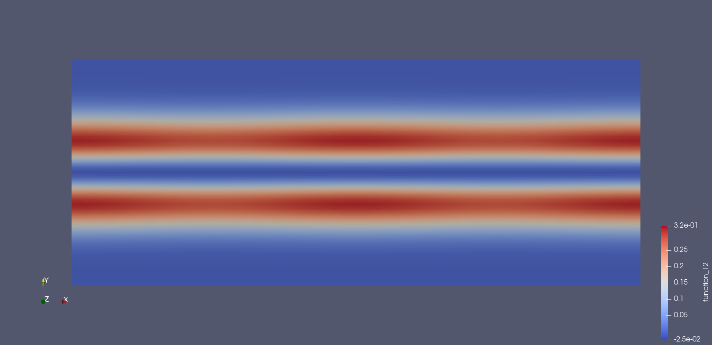
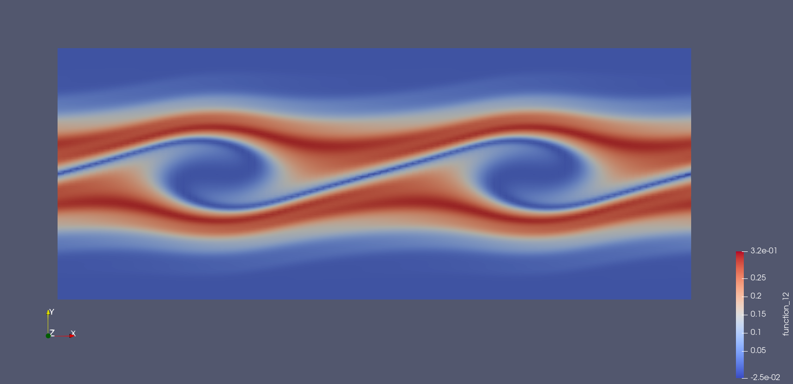

1D Vlasov-Poisson Equation
===========================

This tutorial was contributed by `Colin Cotter
<mailto:colin.cotter@imperial.ac.uk>`__ and Werner Bauer.

A plasma is a continuum of moving particles with nonunique velocity
at each point in space. In :math:`d` dimensions, the plasma is
described by a density :math:`f(x,v,t)` where :math:`x\in \mathbb{R}^d`
are the physical coordinates and :math:`v \in \mathbb{R}^d` are velocity
coordinates. Hence, in :math:`d` dimensions, a :math:`2d`
dimensional mesh is required. To deal with this curse of
dimensionality, particle-in-cell methods are usually used. However,
in 1 dimension, it is tractable to simulate the plasma on a 2
dimensional mesh.

The Vlasov equation models the (collisionless) conservation of plasma
particles, according to 

.. math::
   f_t + \nabla_{\vec{x}} \cdot (\vec{v}f) + \nabla_{\vec{v}} \cdot (\vec{a}f) = 0,

where

.. math::
   \nabla_{\vec{x}} = (\partial_{x_1},\ldots, \partial_{x_d}), \quad
   \nabla_{\vec{v}} = (\partial_{v_1},\ldots, \partial_{v_d}).

To close the system, we need a formula for the acceleration :math:`\vec{a}`.
In the (single species) Vlasov-Poisson model, the acceleration is
determined by the electrostatic force,

.. math::
   \vec{a} = -\frac{1}{m}\nabla\phi,

where :math:`m`
is the mass per plasma particle, and :math:`\phi` is the electrostatic
potential determined by the Poisson equation,

.. math::
   -\nabla^2\phi = q_0\int_{\mathbb{R}^d} f(\vec{x},\vec{v},t)\,\mathrm{d} v,

where :math:`q_0` is the electric charge per plasma particle.

In this demo we specialise to :math:`d=1`, and the equations become

.. math::
   f_t + (fv)_x + (-f\phi_x/m)_v = 0, \quad
   -\phi_{xx} = q_0\int f(x,v,t)\,\mathrm{d} v,

with coordinates :math:`(x,v)\in \mathbb{R}^2`. From now on we will
relabel these coordinates :math:`(x,v)\mapsto (x_1,x_2)`, obtaining
the equivalent form,

.. math::
   f_t + \nabla\cdot(\vec{u}f) = 0, \quad \vec{u} = (v,-\phi_x/m), \quad
   -\phi_{x_1x_1} = q_0\int f(x_1,x_2,t)\,\mathrm{d} x_2,

where :math:`\nabla=(\partial_{x_1},\partial_{x_2})`. From now on we will
choose units such that :math:`q_0,m` are absorbed into the definition of
:math:`f`.

To proceed, we need to develop variational formulations of these
equations.

For the density we will use a discontinuous Galerkin formulation,
and the continuity equation becomes 

.. math::

   \int_\Omega \! q \frac{\partial f}{\partial t} \, \mathrm{d} x
   &= \int_\Omega \! f \nabla \cdot (q \vec{u}) \, \mathrm{d} x\\
   &\quad- \int_{\Gamma_\mathrm{int}} \! \widetilde{f}(q_+ \vec{u} \cdot \vec{n}_+
     + q_- \vec{u} \cdot \vec{n}_-) \, \mathrm{d} S\\
   &\quad- \int_{\Gamma_I} q f_\mathrm{in} \vec{u} \cdot
   \vec{n} \, \mathrm{d} s\\
   &\quad- \int_{\Gamma_O} q f \vec{u} \cdot
   \vec{n} \, \mathrm{d} s
   \qquad \forall q \in V,

where :math:`\Omega` is the computational domain in :math:`(x,v)`
space, :math:`V` is the discontinuous finite element space,
:math:`\Gamma_\mathrm{int}` is the set of interior cell edges,
:math:`\Gamma_I` is the inlet part of
exterior boundary where :math:`\vec{u}\cdot\vec{n}<0`,
:math:`\Gamma_O` is the outlet part of
exterior boundary where :math:`\vec{u}\cdot\vec{n}>0`, :math:`n` is
the normal to each edge, :math:`\tilde{f}` is the upwind value of
:math:`f`, and :math:`f_{\mathrm{in}}` is the inflow boundary value
for :math:`f`. See the Discontinuous Galerkin advection
:doc:`demo<DG_advection.py>` for more details. The unapproximated
problem should have :math:`-\infty < x_2 < \infty`, i.e. unbounded velocities, but we approximate
the problem by solving in the domain :math:`\Omega=I_1\times [-H/2, H/2]`,
where :math:`I` is some chosen interval in the spatial dimension.

For the Poisson equation, we will use a regular Galerkin formulation.
The difficulty in the formulation is the integral over :math:`x_2`. We
deal with this by considering a space :math:`\bar{W}` which is restricted
to functions that are constant in the vertical. Multiplying by a
test function :math:`\psi\in \bar{W}` and integrating by parts gives

.. math::

   \int \psi_{x_1}\phi_{x_1}\, \mathrm{d} x_1
   = \int \int f(x_1,x_2,t) \psi\, \mathrm{d} x_1\,\mathrm{d} x_2, \quad
   \forall \psi \in \bar{W}.

Since the left hand side integrand is independent of :math:`v=x_2`, we
can integrate over :math:`x_2` and divide by :math:`H`, to obtain

.. math::

   \int_\Omega \psi_{x_1}\phi_{x_1}/H\, \mathrm{d} x
   = \int f \psi\, \mathrm{d} x, \quad
   \forall \psi \in \bar{W},

which is now in a form which we can implement easily in Firedrake. One
final issue is that this problem only has a solution up to an additive
constant, so we further restrict :math:`\phi \in \mathring{\bar{W}}`,
where

.. math::
   \mathring{\bar{W}} = \{ w\in \bar{W}: \bar{w}=0\},

where here the bar indicates a spatial average,

.. math::

   \bar{w} = \frac{\int_{\Omega} w\, \mathrm{d} x}{\int_{\Omega} 1 \mathrm{d} x}.
   
Then we seek the solution of 

.. math::

   \int_\Omega \psi_{x_1}\phi_{x_1}\,\mathrm{d} x
   = \int H(f-\bar{f}) \psi\, \mathrm{d} x, \quad
   \forall \psi \in \mathring{\bar{W}}.

To discretise in time, we will use an SSPRK3 time discretisation, similar to the DG advection :doc:`demo<DG_advection.py>`.  At
each Runge-Kutta stage, we must solve for the electrostatic potential,
and then use it to compute :math:`\vec{u}`, in order to compute
:math:`\partial f/\partial t`.
   
As usual, to implement this problem, we start by importing the
Firedrake namespace. ::

  from firedrake import *

We build the mesh by constructing a 1D mesh, which will be extruded in
the vertical. Here we will use periodic boundary conditions in the
:math:`x_1` direction, ::
  
  ncells = 50
  L = 8*pi
  base_mesh = PeriodicIntervalMesh(ncells, L)

The mesh is then extruded upwards in the "velocity" direction. ::
  
  H = 10.0
  nlayers = 50
  mesh = ExtrudedMesh(base_mesh, layers=nlayers, layer_height=H/nlayers)

We want to have :math:`v=0` in the middle of the domain, so that we
can have negative and positive velocities. This requires to edit the
coordinate field. ::
		      
  x, v = SpatialCoordinate(mesh)
  mesh.coordinates.interpolate(as_vector([x, v-H/2]))

Now we build a discontinuous finite element space for the density, ::
  
  V = FunctionSpace(mesh, 'DQ', 1)

and a continuous finite element space for the electostatic potential.
The space is continuous in the horizontal and constant in the vertical,
specified through the ``vfamily``. ::
  
  Wbar = FunctionSpace(mesh, 'CG', 1, vfamily='R', vdegree=0)

We create a :class:`~.Function` to store the solution at the current
time, and then set its initial condition,

.. math::

   f(x,v,0) = \frac{1}{\sqrt{2\pi}}v^2\exp(-v^2/2)(1+ A\cos(kx)),
   \quad A=0.05, \quad k=0.5.

::
  
  fn = Function(V, name="density")
  A = Constant(0.05)
  k = Constant(0.5)
  fn.interpolate(v**2*exp(-v**2/2)*(1 + A*cos(k*x))/(2*pi)**0.5)

We will need the (conserved) average :math:`\bar{f}` for the Poisson
equation. ::

  One = Function(V).assign(1.0)
  fbar = assemble(fn*dx)/assemble(One*dx)

We create a :class:`~.Function` to store the electrostatic potential. ::

  phi = Function(Wbar, name="potential")

The next task is to create the solver for the electrostatic potential, which
will be called every timestep. 
  
We create a :class:`~.Function` to store the intermediate densities at each
Runge-Kutta stage. The right hand side of the Poisson equation will be
evaluated using this :class:`~.Function` to obtain the potential at each
stage. Defining this beforehand will enable us to reuse the solver. ::

  fstar = Function(V)

Now we express the Poisson equation in UFL. ::
  
  psi = TestFunction(Wbar)
  dphi = TrialFunction(Wbar)
  phi_eqn = dphi.dx(0)*psi.dx(0)*dx - H*(fstar-fbar)*psi*dx

To deal mathematically with the null space of the potential, we expressed the
problem in :math:`\mathring{\bar{W}}`. Programmatically we will express the
problem in :math:`\bar{W}` and deal with the null space by defining a basis
for the space of globally constant functions, which we will later pass to PETSc
so the solver can remove it from the solution. ::

  nullspace = VectorSpaceBasis(constant=True, comm=COMM_WORLD)

However, the null space also means that the assembled matrix of the
Poisson problem will be singular, which will prevent us from using a
direct solver. To deal with this, we will precondition the Poisson problem
with a version shifted by :math:`\int_{\Omega}\phi\psi\mathrm{d}x`. The
shifted problem is well-posed on :math:`\bar{W}`, so the assembled matrix
will be non-singular and so solvable with direct methods. ::
  
  shift_eqn = dphi.dx(0)*psi.dx(0)*dx + dphi*psi*dx

We use these to define a :class:`~.LinearVariationalProblem`. ::
  
  phi_problem = LinearVariationalProblem(lhs(phi_eqn), rhs(phi_eqn),
                                         phi, aP=shift_eqn)

Now we build the :class:`~.LinearVariationalSolver`. The problem
is preconditioned by the shifted operator which is solved using a direct
solver, and we pass the nullspace of globally constant functions to
the solver. ::
					 
  params = {
     'ksp_type': 'gmres',
     'pc_type': 'lu',
     'ksp_rtol': 1.0e-8,
     }
  phi_solver = LinearVariationalSolver(phi_problem,
                                       nullspace=nullspace,
				       solver_parameters=params)

Now we move onto the solver to compute :math:`\partial f/\partial t`. We
define a symbolic :math:`\Delta t` which we will update later. ::
  
  dtc = Constant(0)

At each stage, the solver will take in the intermediate solution ``fstar`` and
return the stage increment :math:`\Delta t\partial f/\partial t` in ``df_out``. ::

  df_out = Function(V)

Now we express the equation in UFL, starting with the left hand side
bilinear form ::
  
  q = TestFunction(V)
  u = as_vector([v, -phi.dx(0)])
  n = FacetNormal(mesh)
  un = 0.5*(dot(u, n) + abs(dot(u, n)))
  df = TrialFunction(V)
  df_a = q*df*dx

The problem is defined on an extruded mesh, so the interior facets are
separated into horizontal and vertical ones. ::

  dS = dS_h + dS_v

Now we build the right hand side linear form. A conditional operator
is used to deal with the inflow and outflow parts of the exterior
boundary. Due to the periodic boundary conditions in :math:`x_1`, the only exterior boundary is at the top and bottom of the domain, with measure `ds_tb`. ::
  
  df_L = dtc*(div(u*q)*fstar*dx
     - (q('+') - q('-'))*(un('+')*fstar('+') - un('-')*fstar('-'))*dS
     - conditional(dot(u, n) > 0, q*dot(u, n)*fstar, 0.)*ds_tb
      )

We then use this to build a solver. ::

  df_problem = LinearVariationalProblem(df_a, df_L, df_out)
  df_solver = LinearVariationalSolver(df_problem)

We are getting close to the time loop. We set up some timestepping
parameters. ::
  
  T = 50.0 # maximum timestep
  t = 0. # model time
  ndump = 100 # frequency of file dumps
  dumpn = 0 # dump counter
  nsteps = 5000
  dt = T/nsteps
  dtc.assign(dt)

We set up some :class:`~.Function`\s to store Runge-Kutta stage variables. ::
  
  f1 = Function(V)
  f2 = Function(V)

We set up a ``VTKFile`` object to write output every ``ndump``
timesteps. ::

  outfile = VTKFile("vlasov.pvd")

We want to output the initial condition, so need to solve for the electrostatic
potential that corresponds to the initial density. ::

  fstar.assign(fn)
  phi_solver.solve()
  outfile.write(fn, phi)
  phi.assign(.0)

Now we start the timeloop using a lovely progress bar. Note that
we have 5000 timesteps so this may take a few minutes to run::

  for step in ProgressBar("Timestep").iter(range(nsteps)):

Each Runge-Kutta stage involves solving for :math:`\phi` before solving
for :math:`\partial f/\partial t`. Here is the first stage. ::

  #
      fstar.assign(fn)
      phi_solver.solve()
      df_solver.solve()
      f1.assign(fn + df_out)

The second stage. ::

  #
      fstar.assign(f1)
      phi_solver.solve()
      df_solver.solve()
      f2.assign(3*fn/4 + (f1 + df_out)/4)

The third stage. ::

  #
      fstar.assign(f2)
      phi_solver.solve()
      df_solver.solve()
      fn.assign(fn/3 + 2*(f2 + df_out)/3)
      t += dt

Finally we output to the VTK file if it is time to do that. ::

  #
      dumpn += 1
      if dumpn % ndump == 0:
          dumpn = 0
          outfile.write(fn, phi)

Images of the solution at shown below.

   Solution at :math:`t = 0.`

   Solution at :math:`t = 15.`

We also present solutions at double the resolution, by doubling the number
of horizontal cells and the number of layers, halving the timestep (by doubling the number of steps), and doubling ``nsteps``.

   Solution at :math:`t = 0.`

   Solution at :math:`t = 15.`

   
A Python script version of this demo can be found :demo:`here <vp1d.py>`.
