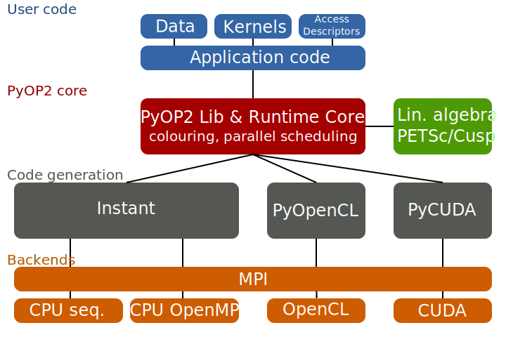

.. _architecture:

PyOP2 Architecture
==================

As described in :ref:`concepts`, the PyOP2 API allows users to declare the
topology of unstructured meshes in the form of :class:`Sets <pyop2.Set>` and
:class:`Maps <pyop2.Map>` and data in the form of :class:`Dats <pyop2.Dat>`,
:class:`Mats <pyop2.Mat>`, :class:`Globals <pyop2.Global>` and :class:`Consts
<pyop2.Const>`. Any computations on this data happen in :class:`Kernels
<pyop2.Kernel>` described in :ref:`kernels` executed via :func:`parallel loops
<pyop2.par_loop>`. A schematic overview of the PyOP2 architecture is given
below:

  Schematic overview of the PyOP2 architecture
