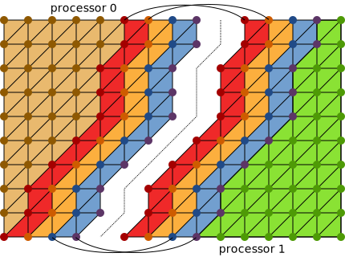

.. _mpi:

MPI
===

Distributed parallel computations with MPI in PyOP2 require the mesh to be
partitioned among the processors. To be able to compute over entities on their
boundaries, partitions need to access data owned by neighboring processors.
This region, called the *halo*, needs to be kept up to date and is therefore
exchanged between the processors as required.

Local Numbering
---------------

Each processor owns a partition of each :class:`~pyop2.Set`, which is again
divided into the following four sections:

* **Core**: Entities owned by this processor which can be processed without
  accessing halo data.
* **Owned**: Entities owned by this processor which access halo data when
  processed.
* **Exec halo**: Off-processor entities which are redundantly executed over
  because they touch owned entities.
* **Non-exec halo**: Off-processor entities which are not processed, but read
  when computing the exec halo.

These four sections are contiguous and local :class:`~pyop2.Set` entities
must therefore be numbered such that core entities are first, followed by
owned, exec halo and non-exec halo in that order. A good partitioning
maximises the size of the core section and minimises the halo regions. We can
therefore assume that the vast majority of local :class:`~pyop2.Set` entities
are in the core section. The following diagram illustrates the four sections
for a mesh distributed among two processors:

  A mesh distributed among two processors with the entities of each mesh
  partition divided into *core*, *owned*, *exec halo* and *non-exec halo*.
  Matching halo sections are highlighted in matching colours. The owned
  section of process 0 correspondonds to the non-exec section of process 1.

Computation-communication Overlap
---------------------------------

Entities that do not access any halo data can be processed immediately, before
the exchange of halos has completed. Computation on those entities can
therefore overlap communication of the halo data.

The ordering of :class:`~pyop2.Set` entities into four sections allow for a
very efficient overlap of computation and communication. Core entities can be
processed entirely without access to halo data immediately after the halo
exchange is initiated. Execution over the owned and exec halo regions requires
up to date halo data and can only start once the halo exchange is completed.
The entire process is given below: ::

  halo_exchange_begin()                      # Initiate halo exchange
  maybe_set_dat_dirty()                      # Mark Dats as modified
  compute_if_not_empty(itset.core_part)      # Compute core region
  halo_exchange_end()                        # Wait for halo exchange
  compute_if_not_empty(itset.owned_part)     # Compute owned region
  reduction_begin()                          # Initiate reductions
  if needs_exec_halo:                        # Any indirect Dat not READ?
      compute_if_not_empty(itset.exec_part)  # Compute exec halo region
  reduction_end()                            # Wait for reductions
  maybe_set_halo_update_needed()             # Mark halos as out of date
  assemble()                                 # Finalise matrix assembly

Any reductions depend on data from the core and owned sections and are
initiated as soon as the owned section has been processed and execute
concurrently with computation on the exec halo. If the :func:`~pyop2.par_loop`
assembles a :class:`~pyop2.Mat`, the matrix assembly is finalised at the end.

By dividing entities into sections according to their relation to the halo,
there is no need to check whether or not a given entity touches the halo or
not during computations on each section. This avoids branching in kernels or
wrapper code and allows launching separate kernels for GPU execution of each
section. The :func:`~pyop2.par_loop` execution above therefore applies to all
backends.

Halo exchange
-------------

Exchanging halo data is only required if the halo data is actually read, which
is the case for :class:`~pyop2.Dat` arguments to a :func:`~pyop2.par_loop`
used in :data:`pyop2.READ` or :data:`pyop2.RW` mode.  PyOP2 keeps track
whether or not the halo region may have been modified. This is the case for
:class:`Dats <pyop2.Dat>` used in :data:`pyop2.INC`, :data:`pyop2.WRITE` or
:data:`pyop2.RW` mode or when a :class:`~pyop2.Solver` or a user requests
access to the data. A halo exchange is triggered only for halos marked as out
of date.

Distributed Assembly
--------------------

For an MPI distributed matrix or vector, assembling owned entities at the
boundary can contribute to off-process degrees of freedom and vice versa.

There are different ways of accounting for these off-process contributions.
PETSc_ supports insertion and subsequent communication of off-process matrix
and vector entries, however its implementation is not thread safe. Concurrent
insertion into PETSc_ MPI matrices *is* thread safe if off-process insertions
are not cached and concurrent writes to rows are avoided, which is done
through colouring as described in :ref:`colouring`.

PyOP2 therefore disables PETSc_'s off-process insertion feature and instead
redundantly computes over all off process entities that touch local dofs,
which is the *exec halo* section described above. The price for this is
maintaining a larger halo, since we also need halo data, the *non-exec halo*
section, to perform the redundant computation. Halos grow by about a factor
two, however in practice this is still small compared to the interior region
of a partition and the main cost of halo exchange is the latency, which is
independent of the exchanged data volume.

.. _PETSc: http://www.mcs.anl.gov/petsc/
