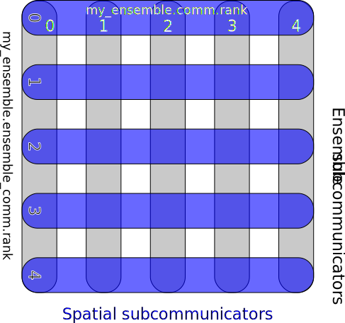

.. only:: html

   .. contents::

====================
Ensemble parallelism
====================

Ensemble parallelism means solving simultaneous copies of a model
with different coefficients, right hand sides, or initial data, in
situations that require communication between the copies. Use cases
include ensemble data assimilation, uncertainty quantification, and
time parallelism. This manual section assumes some familiarity with
parallel programming with MPI.

The Ensemble communicator
=========================

In ensemble parallelism, we split the MPI communicator into a number
of spatial subcommunicators, each of which we refer to as an
ensemble member (shown in blue in the figure below). Within each
ensemble member, existing Firedrake functionality allows us to specify
the finite element problems which use spatial parallelism across the spatial
subcommunicator in the usual way. Another set of
subcommunicators - the ensemble subcommunicators - then allow
communication between ensemble members (shown in grey in the figure
below). Together, the spatial and ensemble subcommunicators form a
Cartesian product over the original global communicator.

  Spatial and ensemble parallelism for an ensemble with 5 members,
  each of which is executed in parallel over 5 processors.

The additional functionality required to support ensemble parallelism
is the ability to send instances of :class:`~.Function` from one
ensemble to another.  This is handled by the :class:`~.Ensemble` class.

Each ensemble member must have the same spatial parallel domain decomposition, so
instantiating an :class:`~.Ensemble` requires a communicator to split
(usually, but not necessarily, ``MPI_COMM_WORLD``) plus the number of
MPI processes to be used in each member of the ensemble (5 in the
figure above, and 2 in the example code below). The number of ensemble
members is implicitly calculated by dividing the size of the original
communicator by the number processes in each ensemble member. The
total number of processes launched by ``mpiexec`` must therefore be
equal to the product of the number of ensemble members with the number of
processes to be used for each ensemble member, and an exception will be
raised if this is not the case.

.. literalinclude:: ../../tests/firedrake/ensemble/test_ensemble_manual.py
   :language: python3
   :dedent:
   :start-after: [test_ensemble_manual_example 1 >]
   :end-before: [test_ensemble_manual_example 1 <]

Then, the spatial sub-communicator ``Ensemble.comm`` must be passed
to :func:`~.mesh.Mesh` (possibly via inbuilt mesh generators in
:mod:`~.utility_meshes`), so that it will then be used by any
:func:`~.FunctionSpace` and :class:`~.Function` derived from the mesh.

.. literalinclude:: ../../tests/firedrake/ensemble/test_ensemble_manual.py
   :language: python3
   :dedent:
   :start-after: [test_ensemble_manual_example 2 >]
   :end-before: [test_ensemble_manual_example 2 <]

The ensemble sub-communicator is then available through the attribute
``Ensemble.ensemble_comm``.

.. literalinclude:: ../../tests/firedrake/ensemble/test_ensemble_manual.py
   :language: python3
   :dedent:
   :start-after: [test_ensemble_manual_example 3 >]
   :end-before: [test_ensemble_manual_example 3 <]

MPI communications across the spatial sub-communicator (i.e., within
an ensemble member) are handled automatically by Firedrake, whilst MPI
communications across the ensemble sub-communicator (i.e., between ensemble
members) are handled through methods of :class:`~.Ensemble`. Currently
send/recv, reductions and broadcasts are supported, as well as their
non-blocking variants.
The rank of the the ensemble member (``my_ensemble.ensemble_comm.rank``)
and the number of ensemble members (``my_ensemble.ensemble_comm.rank``)
can be accessed via the ``ensemble_rank`` and ``ensemble_size`` attributes.

.. literalinclude:: ../../tests/firedrake/ensemble/test_ensemble_manual.py
   :language: python3
   :dedent:
   :start-after: [test_ensemble_manual_example 4 >]
   :end-before: [test_ensemble_manual_example 4 <]

.. warning::

   In the ``Ensemble`` communication methods, each rank sends data
   only across the ``ensemble_comm`` that it is a part of. This
   assumes not only that the total mesh is identical on each ensemble
   member, but also that the ``ensemble_comm`` connects identical
   parts of the mesh on each ensemble member. Because of this, the
   spatial partitioning of the mesh on each ``Ensemble.comm`` must be
   identical.

EnsembleFunction and EnsembleFunctionSpace
==========================================

A :class:`~.Function` is logically collective over a single spatial
communicator ``Ensemble.comm``. However, for some applications we want
to treat multiple :class:`~.Function` instances on different ensemble
members as a single collective object over the entire global
communicator ``Ensemble.global_comm``. For example, in time-parallel
methods we may have a :class:`~.Function` for each timestep in a
timeseries, and each timestep may live on a separate ensemble member.
In this case we want to treat the entire timeseries as a single
object.

Firedrake implements this using :class:`~.EnsembleFunctionSpace`
and :class:`~.EnsembleFunction` (along with the dual objects
:class:`~.EnsembleDualSpace` and :class:`~.EnsembleCofunction`).
The :class:`~.EnsembleFunctionSpace` can be thought of as a mixed
function space which is parallelised across the `components`, as
opposed to just being parallelised in `space`, as would usually be the
case with :func:`~.FunctionSpace`.  Each component of an
:class:`~.EnsembleFunctionSpace` is a Firedrake :func:`~.FunctionSpace`
on a single spatial communicator.

To create an :class:`~.EnsembleFunctionSpace` you must provide an
:class:`~.Ensemble` and, on each spatial communicator, a list of
:func:`~.FunctionSpace` instances for the components on the local
``Ensemble.comm``. There can be a different number of local
:func:`~.FunctionSpace` on each ``Ensemble.comm``. In the example
below we create an :class:`~.EnsembleFunctionSpace` with two
components on the first ensemble member, and three components on
every other ensemble member.  Note that, unlike a
:func:`~.FunctionSpace`, a component of an
:class:`~.EnsembleFunctionSpace` may itself be a
:func:`~.MixedFunctionSpace`.

.. literalinclude:: ../../tests/firedrake/ensemble/test_ensemble_manual.py
   :language: python3
   :dedent:
   :start-after: [test_ensemble_manual_example 5 >]
   :end-before: [test_ensemble_manual_example 5 <]

Analogously to accessing the components of a :func:`~.MixedFunctionSpace`
using ``subspaces``, the :func:`~.FunctionSpace` for each local component
of an :class:`~.EnsembleFunctionSpace` can be accessed via
``EnsembleFunctionSpace.local_spaces``.  Various other methods and
properties such as ``dual`` (to create an :class:`~.EnsembleDualSpace`)
and ``nglobal_spaces`` (total number of components across all ranks)
are also available.

An :class:`~.EnsembleFunction` and :class:`~.EnsembleCofunction` can be
created from the :class:`~.EnsembleFunctionSpace`. These have a ``subfunctions``
property that can be used to access the components on the local ensemble
member. Each element in ``EnsembleFunction.subfunctions`` is itself just a
normal Firedrake :class:`~.Function`. If a component of the
``EnsembleFunctionSpace`` is a ``MixedFunctionSpace``, then the corresponding
component in ``EnsembleFunction.subfunctions`` will be a mixed ``Function`` in
that ``MixedFunctionSpace``.

.. literalinclude:: ../../tests/firedrake/ensemble/test_ensemble_manual.py
   :language: python3
   :dedent:
   :start-after: [test_ensemble_manual_example 6 >]
   :end-before: [test_ensemble_manual_example 6 <]

:class:`~.EnsembleFunction` and :class:`~.EnsembleCofunction` have
a range of methods equivalent to those of :class:`~.Function` and
:class:`~.Cofunction`, such as ``assign``, ``zero``,
``riesz_representation``, arithmetic operators e.g. ``+``, ``+=``,
etc. These act component-wise on each local component.

Because the components in ``EnsembleFunction.subfunctions``
(``EnsembleCofunction.subfunctions``) are just :class:`~.Function`
(:class:`~.Cofunction`) instances, they can be used directly
with variational forms and solvers. In the example code below,
We create a :class:`~.LinearVariationalSolver` where the right
hand side is a component of an :class:`~.EnsembleCofunction`,
and the solution is written into a component of an
:class:`~.EnsembleFunction`. Using the ``subfunctions``
directly like this can simplify ensemble code and reduce
unnecessary copies.
Note that the ``options_prefix`` is set using both the local ensemble
rank and the index of the local space, which means that separate
PETSc parameters can be passed from the command line to the solver
on each ensemble member.

.. literalinclude:: ../../tests/firedrake/ensemble/test_ensemble_manual.py
   :language: python3
   :dedent:
   :start-after: [test_ensemble_manual_example 7 >]
   :end-before: [test_ensemble_manual_example 7 <]

.. warning::

   Although the ``Function`` (``Cofunction``) instances in
   ``EnsembleFunction.subfunctions`` (``EnsembleCofunction.subfunctions``)
   can be used in UFL expressions, ``EnsembleFunction`` and
   ``EnsembleCofunction`` themselves do not carry any symbolic
   information so cannot be used in UFL expressions.

Internally, the :class:`~.EnsembleFunction` creates a ``PETSc.Vec``
on the ``Ensemble.global_comm`` which contains the data for all
local components on all ensemble members. This ``Vec`` can be accessed
with a context manager, similarly to the ``Function.vec`` context
managers used to access :class:`~.Function` data. There are also
analogous ``vec_ro`` and ``vec_wo`` context managers for read/write
only accesses. However note that, unlike the ``Function.vec``
context managers, the ``EnsembleFunction.vec`` context managers
need braces i.e. ``vec()`` not ``vec``.

.. literalinclude:: ../../tests/firedrake/ensemble/test_ensemble_manual.py
   :language: python3
   :dedent:
   :start-after: [test_ensemble_manual_example 8 >]
   :end-before: [test_ensemble_manual_example 8 <]
