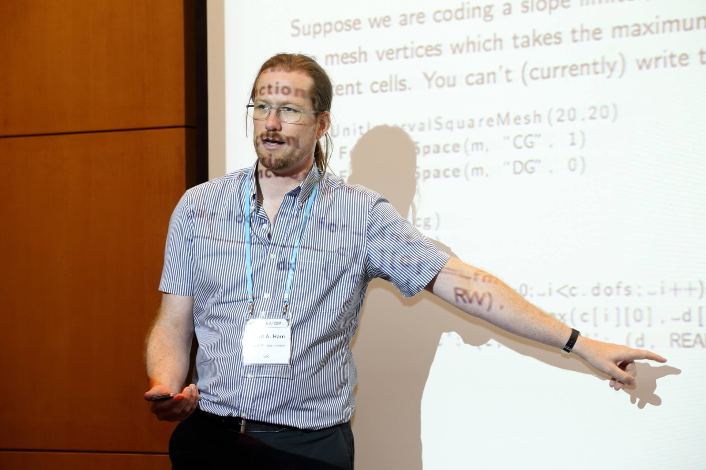

:orphan: true

Firedrake events
----------------

Firedrake '24
~~~~~~~~~~~~~

The eighth Firedrake user and developer workshop will be held
between 16-18 September 2024 at the University of Oxford. For more
information see :doc:`the workshop page <firedrake_24>`.

Algorithms for Exascale Computing
~~~~~~~~~~~~~~~~~~~~~~~~~~~~~~~~~

A summer school, aimed at Research Software Engineers and postgraduate
students, will be a mix of expert lectures, hands-on workshops and
informal discussion and networking sessions. This will include a
Firedrake workshop on during the Wednesday morning session. `More
information about the summer school
<https://sites.google.com/view/algorithmsforexascale/home>`__.

Firedrake '23
~~~~~~~~~~~~~

The seventh Firedrake user and developer workshop was held
between 13-15 September 2023 at Missenden Abbey. For more
information see :doc:`the workshop page <firedrake_23>`.

RSECon23
~~~~~~~~

A Firedrake workshop was run during the Wednesday morning session of
`RSECon23 <https://rsecon23.society-rse.org/>`__.

PETSc4py documentation sprint
~~~~~~~~~~~~~~~~~~~~~~~~~~~~~

Firedrakers and collaborators met to finally document PETSc4py in
Faversham, Kent from 27-31 March 2023.

Firedrake '22
~~~~~~~~~~~~~

The slightly inaccurately named Firedrake '22 was held from 4-6 January
2023 at Dartington Hall near Totnes. For more information see :doc:`the
workshop page <firedrake_22>`.

Firedrake tutorial at Imperial College London May 30 2022
~~~~~~~~~~~~~~~~~~~~~~~~~~~~~~~~~~~~~~~~~~~~~~~~~~~~~~~~~

We held a hands-on 'Introduction to Firedrake' tutorial at the
Royal School of Mines on 30 May 2022. For more information see
:doc:`the tutorial page <tutorial_may_22>`.

G-Adopt Firedrake workshop April 28-29 2022
~~~~~~~~~~~~~~~~~~~~~~~~~~~~~~~~~~~~~~~~~~~

The `G-ADOPT <https://g-adopt.github.io/index.html>`__ programme held a
workshop on automating finite element methods for geodynamics via firedrake
at the Australian National University in Canberra.

Firedrake '21
~~~~~~~~~~~~~

The fifth Firedrake user and developer workshop was held
online between 15-17 September 2021. For more information see
:doc:`the workshop page <firedrake_21>`.

Firedrake USA '20
~~~~~~~~~~~~~~~~~

We held a Firedrake user and developer workshop for the first
time in North America at the University of Washingon on 10 and 11
February 2020. For more information, see the
:doc:`the workshop page <firedrake_usa_20>`.

Firedrake '19
~~~~~~~~~~~~~

The third Firedrake user and developer workshop was held at Durham
University on 26 and 27 September 2019. For more information see
:doc:`the workshop page <firedrake_19>`.

Firedrake tutorial at RWTH Aachen University Jun 18 2019
~~~~~~~~~~~~~~~~~~~~~~~~~~~~~~~~~~~~~~~~~~~~~~~~~~~~~~~~

There was a hands-on Firedrake tutorial at the Aachen Institute
for Advanced Study in Computational Engineering Science (AICES) on 18
June 2019. For more details see `their website <https://www.aices.rwth-aachen.de/en/media-and-seminars/events>`_.

Firedrake tutorial at CSE 19
~~~~~~~~~~~~~~~~~~~~~~~~~~~~

The Firedrake team presented a live cloud tutorial at the SIAM
Conference on Computational Science and Engineering in Spokane
Washington on 1 March 2019. See `the conference page <https://www.siam.org/Conferences/CM/Program/Minitutorials/cse19-minitutorials>`_.

Firedrake tutorial Jan 11 2019
~~~~~~~~~~~~~~~~~~~~~~~~~~~~~~

The Firedrake team hosted an introductory tutorial at Imperial
College London on 11 January. For details and links to the material, see :doc:`the
tutorial page <tutorial_jan_19>`.

Firedrake '18
~~~~~~~~~~~~~

The second Firedrake user and developer workshop was held at
Imperial College London on 7 and 8 June 2018.  For more information
see :doc:`the workshop page <firedrake_18>`.

PETSc '18
~~~~~~~~~

The Firedrake team hosted PETSc '18 at Imperial College London from
4-6 Junr 2018. For more information, see `the meeting page <http://www.mcs.anl.gov/petsc/meetings/2018/index.html>`_.

Firedrake tutorial Jan 12 2018
~~~~~~~~~~~~~~~~~~~~~~~~~~~~~~

The Firedrake team hosted an introductory tutorial at Imperial
College London on 12 January. For details and links to the material, see :doc:`the
tutorial page <tutorial_jan_18>`.

Firedrake '17
~~~~~~~~~~~~~

The first Firedrake user and developer workshop was held at
Imperial College London on 27 and 28 March 2017. For more information,
see :doc:`the workshop page <firedrake_17>`.

Firedrake tutorial at CNRS
~~~~~~~~~~~~~~~~~~~~~~~~~~

The Firedrake team presented a Firedrake tutorial at CNRS in
Paris. See `this web page
<https://calcul.math.cnrs.fr/spip.php?article274>`_.  The tutorial
materials are accessible as part of the :doc:`firedrake documentation
<documentation>`.

FEniCS '15
~~~~~~~~~~

The Firedrake team hosted the FEniCS '15 workshop. For more
information see :doc:`the workshop page <fenics_15>`.
