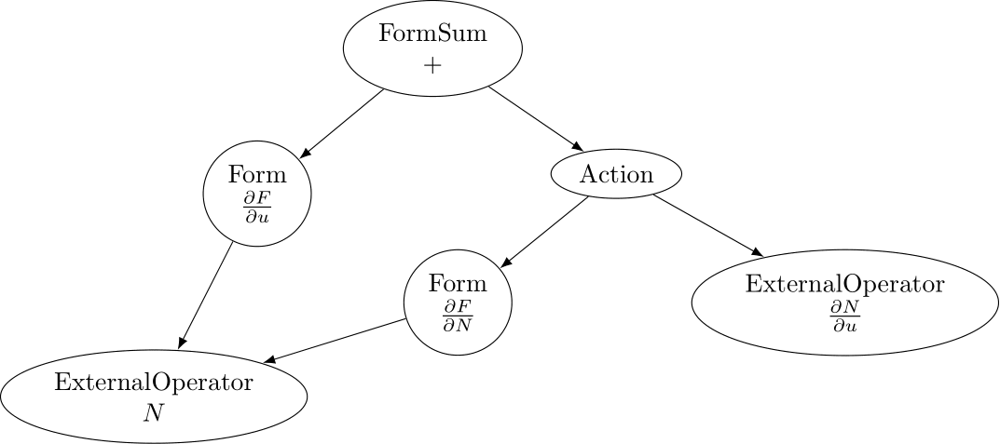

.. default-role:: math

.. only:: html

   .. contents::

External operators
==================

Firedrake provides an interface to incorporate arbitrary operators within PDE systems with automated 
assembly and differentiation capabilities, which allows for embedding complex operators, such as 
machine learning models, into PDE or PDE-constrained optimisation problems. We refer to these operators 
as *external operators*, as their implementation is left to the user, i.e "external" with respect to 
Firedrake.

External operators are represented by the :class:`~.AbstractExternalOperator` base class, 
which can be subclassed for defining specific external operators. While the base class documentation 
provides the syntax, this document introduces the external operator abstraction in more detail and 
explains what you need to do if you want to define your own external operator.

Mathematical background
-----------------------

An external operator is an operator that maps operands defined on finite element spaces to an output 
in another finite element space. Let's consider the case of an external operator :math:`N` with a single operand, 
i.e. we have:

.. math::
  
    N: V \rightarrow V
  
where `V` is a finite element space. Because the spaces we are interested in are reflexive, 
we can express the operator `N` as a linear form `L_{N}`, defined as:

.. math::
  
    L_{N}: V \times V^{*} \rightarrow \mathbb{R}

where `V^{*}` is the dual space of `V`, and where the following equivalence holds:

.. math::

  L_{N}(u; v^{*}) = N(u) \quad \forall v^{*} \in V^{*}

for `u \in V`. For sake of simplicity, we will denote the linear form `L_{N}` as `N` in the following. 
Expressing external operators as linear forms facilitates their composition with variational forms of PDEs. 
Note that while `N` is linear with respect to `v^{*}`, its *argument*, it can be nonlinear with respect 
to `u`, its *operand*. In Firedrake, `u` would be a :class:`~.Function` object, and `v^{*}` would be a 
:class:`~.Coargument` object.

Differentiation
~~~~~~~~~~~~~~~

An essential aspect of the external operator abstraction is differentiation, not least because solving a PDE 
or a PDE-constrained optimisation problem involving an external operator may require differentiating through it. 
In order to illustrate how differentiation works, let's consider the case of a variational form containing the 
previously defined external operator `N(u; v^{*})`. We have:

.. math::

  F(u, N; v) = 0 \quad \forall v\in V.

In order to solve this variational problem, we need to compute the Jacobian of `F` with respect to `u` 
, see :ref:`solving variational problems <solve_var_problem>`, which involves differentiating `N` 
with respect to `u`, as a consequence of the chain rule. More specifically, the Jacobian of `F` can 
be written as:

.. math::

  \frac{dF(u, N; \hat{u}, v)}{du} = \frac{\partial F(u, N; \hat{u}, v)}{\partial u} + \operatorname{action}\left(\frac{\partial F(u, N; \hat{u}, v)}{\partial N}, \frac{dN(u; \hat{u}, v^{*})}{du}\right) \quad \forall v\in V.

where `\hat{u} \in V` is the Gâteaux direction, i.e. a trial function on `V`. 
The Jacobian of `N`, `\frac{dN(u; \hat{u}, v^{*})}{du}`, is also an external operator with operand `u` 
and whose arguments are `\hat{u} \in V` and `v^{*} \in V^{*}`. Note that the Jacobian of `N` is a 2-form, 
i.e. a linear form with 2 (unknown) arguments.

.. _action_adjoint:

Action/Adjoint
~~~~~~~~~~~~~~

The external operator interface doesn't only provide differentiation capabilities, but also 
allows for performing symbolic operations on external operators. There are two main symbolic 
operations that often arise when solving PDE systems, namely `(i)` taking the action of a 
linear form on a given input, e.g. to represent the Jacobian-vector product of `N`, and 
`(ii)` taking the adjoint of a linear 2-form, e.g. to represent the Hermitian transpose 
of the Jacobian of `N`. In Firedrake, these operations are represented by the `action` and 
`adjoint` functions.

It turns out that those symbolic operations simply translate into updating the arguments of the 
linear form considered. For example, let's consider the Jacobian of the external operator `N`, we have:

.. math::

  \operatorname{action}\left(\frac{dN(u; \hat{u}, v^{*})}{du}, w\right) = \frac{dN(u; w, v^{*})}{du} \quad \forall w \in V

where the external operator `\frac{dN(u; w, v^{*})}{du}` is the Jacobian action of `N` on `w`. 
Hence, for a given :class:`~.Function` `w` in `V`, the external operator `\frac{dN(u; w, v^{*})}{du}` 
has two arguments, namely `w`, which is a known function in `V`, and `v^{*}`, which is an unknown 
function in `V^{*}`, i.e. a :class:`~.Coargument` in `V^{*}`. Therefore, `\frac{dN(u; w, v^{*})}{du}` 
is a 1-form, i.e. it is a linear form with respect to one unknown argument.

Similarly, the adjoint of the Jacobian of `N` can be written as:

.. math::

  \operatorname{adjoint}\left(\frac{dN(u; \hat{u}, v^{*})}{du}, w\right) = \frac{dN(u; v^{*}, \hat{u})}{du} \quad \forall w \in V

where the external operator `\frac{dN(u; v^{*}, \hat{u})}{du}` is the adjoint of the Jacobian of `N`, 
which is still a 2-form as it is linear with respect to two unknown arguments, namely `v^{*} \in V^{*}` 
and `\hat{u} \in V`.

Hence, the action of an external operator consumes the last argument, while the adjoint of an 
external operator with 2 arguments swap them.

Assembly
~~~~~~~~

The last ingredient needed for external operators to work is assembly. The external operator 
interface composes seamlessly with the Firedrake assembly system, and one can assemble external 
operators as well as variational forms and expressions containing external operators. Firedrake 
assembles expressions or variational forms containing external operators by representing the assembled 
object as a directed acyclic graph (DAG). The assembly works by traversing this DAG and evaluating 
each node on the fly. In this DAG representation, external operators are considered as distinct nodes.

|Jacobian_DAG|

External operators are, by definition, operators whose implementation is left to be specified by the 
user. Consequently, in order to evaluate the expression or variational form of interest, the assembly 
of the external operator nodes in the DAG must call the implementation specified by the user.

The :class:`~.AbstractExternalOperator` base class orchestrates the *external operator assembly*, 
which bridges the evaluation of the DAG nodes associated with external operators and the user-defined 
implementation. Depending on the specific use case considered, one may need to specify one or more 
evaluation implementations for a particular external operator. For instance, if the PDE system 
considered only requires to evaluate the external operator, the user implementation only needs 
to specify the implementation for evaluating `N(u; v^{*})`. On the other hand, if the PDE system
considered also requires evaluating the Jacobian of `N`, the user implementation also needs to specify 
the implementation of the Jacobian `\frac{dN(u; \hat{u}, v^{*})}{du}` as well. The external operator 
might also be further equipped with the implementation of the action of the Jacobian adjointof `N`, 
`\frac{dN(u; w^{*}, \hat{u})}{du}`, with `w^{*} \in V^{*}`, e.g. when solving a PDE-constrained 
optimisation problem, where the cost function derivative is computed using the adjoint method.

The main task of the external operator assembly is to call the implementation corresponding to 
the external operator being assembled, e.g. `N` or `\frac{dN(u; w^{*}, \hat{u})}{du}`. The key idea is 
that the assembly of external operators is fully determined by: 
`(i)` the derivative multi-index of the external operator, and `(ii)` the arguments of the 
external operator, which indicates if the action and/or adjoint of the external operator have 
been applied, see :ref:`previous section <action_adjoint>`.

TODO

Build your own external operator
--------------------------------

While :class:`~.AbstractExternalOperator` objects are symbolical can be differentiated and 
evaluated, the actual implementation to evaluate them needs to be specified by the external operator 
specified by the user...

TODO
