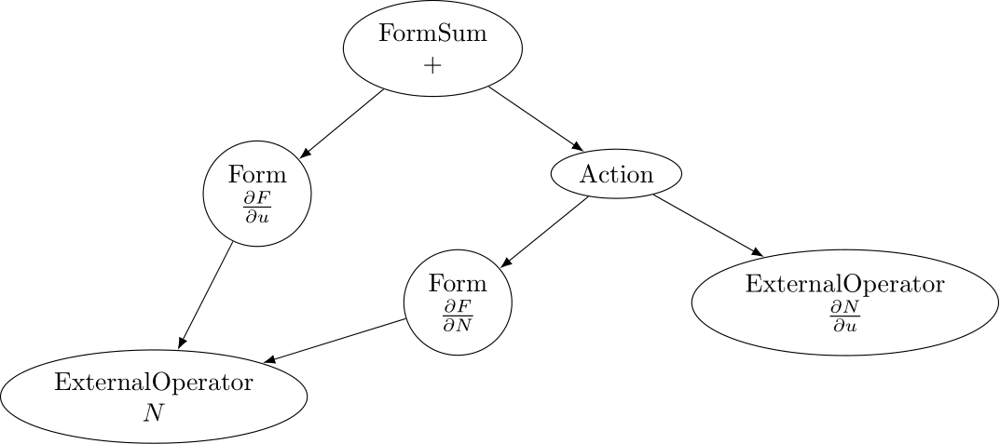
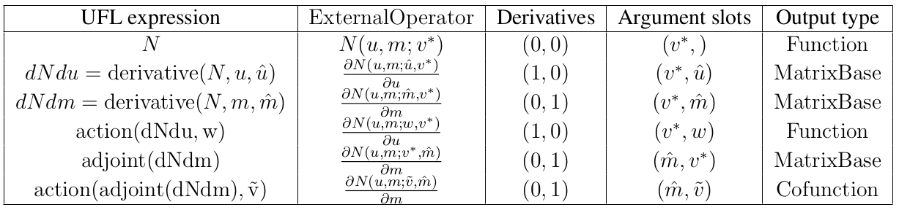
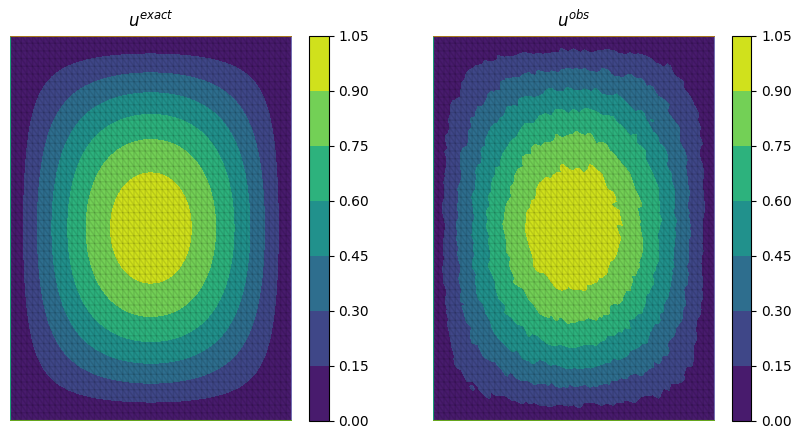
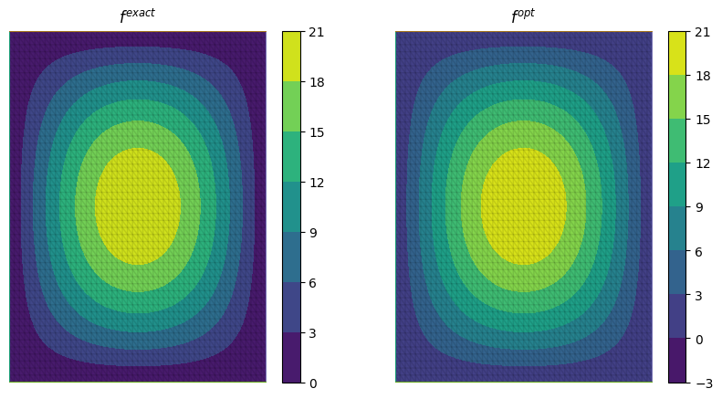

.. default-role:: math

.. only:: html

   .. contents::

External operators
==================

Firedrake provides a seamless and easy-to-use interface to incorporate arbitrary operators within PDE 
systems with automated assembly and differentiation capabilities. This allows for embedding complex 
operators, such as machine learning models, into PDE or PDE-constrained optimisation problems. 
We refer to these operators as *external operators*, as their implementation is left to be specified by 
the user, i.e "external" with respect to Firedrake.

External operators are represented by the :class:`~.AbstractExternalOperator` base class, 
which can be subclassed for defining specific operators. While the base class documentation 
provides the syntax, this document introduces the external operator abstraction in more detail and 
explains what you need to do if you want to define your own external operator. The external operator 
framework is discussed in more detail in :cite:`Bouziani2021` and :cite:`Bouziani2024`.

.. _math_background:

Background
----------

An external operator is an operator that maps operands defined on finite element spaces to an output 
in another finite element space. Let's consider the case of an external operator :math:`N` with a single 
operand, i.e. we have:

.. math::
  
    N: V \rightarrow V
  
where `V` is a finite element space. Because the spaces we are interested in are reflexive, 
we can express the operator `N` as a linear form `L_{N}`, defined as:

.. math::
  
    L_{N}: V \times V^{*} \rightarrow \mathbb{R}

where `V^{*}` is the dual space of `V`, and where the following equivalence holds:

.. math::

  L_{N}(u; v^{*}) = v^{*}(N(u)) \quad \forall v^{*} \in V^{*}

for `u \in V`. For sake of simplicity, in what follows, we use `N` to denote both the linear form `L_{N}` 
and the operator `N`. Expressing external operators as linear forms facilitates their 
composition with variational forms of PDEs. Note that while `N` is linear with respect to `v^{*}`, 
its *argument*, it can be nonlinear with respect to `u`, its *operand*. In Firedrake, `u` would 
be a :class:`~.Function` object, and `v^{*}` a :class:`~.Coargument` object.

Arbitrary UFL expressions defined on arbitrary finite element spaces, i.e. other than `V`, can also 
be passed as operands to the external operator using the symbolic :class:`~.Interpolate` operator. 

.. _differentiation:

Differentiation
~~~~~~~~~~~~~~~

An essential aspect of the external operator abstraction is differentiation, not least because solving a PDE 
or a PDE-constrained optimisation problem involving an external operator may require differentiating through it. 
In order to illustrate how differentiation works, let's consider the case of a variational form containing the 
previously defined external operator `N(u; v^{*})`. We want to find `u \in V` such that:

.. math::

  F(u, N; v) = 0 \quad \forall v\in V.

In order to solve this variational problem, we need to compute the Jacobian of `F` with respect to `u` 
, see :ref:`solving variational problems <solve_var_problem>`, which involves differentiating `N` 
with respect to `u`, as a consequence of the chain rule. More specifically, the Jacobian of `F` can 
be written as:

.. math::

  \frac{dF(u, N; \hat{u}, v)}{du} = \frac{\partial F(u, N; \hat{u}, v)}{\partial u} + \operatorname{action}\left(\frac{\partial F(u, N; \hat{u}, v)}{\partial N}, \frac{dN(u; \hat{u}, v^{*})}{du}\right) \quad \forall v\in V.

where `\hat{u} \in V` is the Gâteaux direction, i.e. a trial function on `V`. 
The Jacobian of `N`, `\frac{dN(u; \hat{u}, v^{*})}{du}`, is also an external operator with operand `u` 
and whose arguments are `\hat{u} \in V` and `v^{*} \in V^{*}`. Note that the Jacobian of `N` is a 2-form, 
i.e. a linear form with 2 (unknown) arguments.

.. _action_adjoint:

Action/Adjoint
~~~~~~~~~~~~~~

The external operator interface doesn't only provide differentiation capabilities, but also 
allows for performing symbolic operations on external operators. There are two main symbolic 
operations that often arise when solving PDE systems, namely `(i)` taking the action of a 
linear form on a given input, e.g. to represent the Jacobian-vector product of `N`, and 
`(ii)` taking the adjoint of a linear 2-form, e.g. to represent the Hermitian transpose 
of the Jacobian of `N`. In Firedrake, these operations are represented by the `\operatorname{action}` and 
`\operatorname{adjoint}` functions.

It turns out that those two symbolic operations simply translate into updating the arguments of the 
linear form on which they are applied. For example, let's consider the Jacobian of the external operator 
`N`, we have:

.. math::

  \operatorname{action}\left(\frac{dN(u; \hat{u}, v^{*})}{du}, w\right) = \frac{dN(u; w, v^{*})}{du} \quad \forall w \in V

where the external operator `\frac{dN(u; w, v^{*})}{du}` is the Jacobian action of `N` on `w`. 
Hence, for a given :class:`~.Function` `w` in `V`, the external operator `\frac{dN(u; w, v^{*})}{du}` 
is linear with respect to `w`, which is a known function in `V`, and `v^{*}`, which is an unknown 
function in `V^{*}`, i.e. a :class:`~.Coargument` in `V^{*}`. Therefore, `\frac{dN(u; w, v^{*})}{du}` 
is a 1-form, i.e. it is a linear form with respect to one unknown argument.

Similarly, the adjoint of the Jacobian of `N` can be written as:

.. math::

  \operatorname{adjoint}\left(\frac{dN(u; \hat{u}, v^{*})}{du}\right) = \frac{dN(u; v^{*}, \hat{u})}{du}

where the external operator `\frac{dN(u; v^{*}, \hat{u})}{du}` is the adjoint of the Jacobian of `N`, 
which is still a 2-form as it is linear with respect to two unknown arguments, namely the coargument 
`v^{*} \in V^{*}` and the trial function `\hat{u} \in V`.

Put simply, taking the action of an external operator consumes its last argument, while taking the adjoint 
of a 2-form external operator swaps its two arguments. Given that linear form's arguments in Firedrake 
are numbered, we can also say that the action results in consuming the highest-numbered argument, 
while the adjoint simply swaps the arguments' numbers.

Assembly
~~~~~~~~

The last ingredient needed for external operators to work is their coupling with the finite element assembly. 
The external operator interface composes seamlessly with the Firedrake assembly system, and one can assemble external 
operators as well as variational forms and expressions containing external operators. Firedrake 
assembles expressions or variational forms containing external operators by representing the assembled 
object as a directed acyclic graph (DAG). For example, assembling the Jacobian of `F`, see 
:ref:`differentiation section <differentiation>`, would result in the following DAG:

   Assembly DAG associated with the Jacobian of the residual form F

The assembly is achieved by traversing this DAG and evaluating each node on the fly. 
In this DAG representation, external operators are considered as distinct nodes, whose 
implementation is, by definition, left to be specified by the user. Consequently, 
in order to evaluate the expression of interest, we need a mechanism to map the assembly of the 
external operator nodes in the DAG to the corresponding implementation specified by the user. This stage is 
referred to as the *external operator assembly*. This is achieved by the :class:`~.AbstractExternalOperator` 
base class, whose main role is to orchestrate the external operator assembly.

Depending on the specific use case considered, one may need to specify one or more 
evaluation implementations for a particular external operator. For instance, if the PDE system 
considered only requires to evaluate the external operator, the user-defined implementation only needs 
to specify the implementation for evaluating that operator `N(u; v^{*})`. On the other hand, if the 
PDE system considered also requires evaluating the Jacobian of `N`, e.g. when solving a PDE whose 
residual contains an external operator that has the solution `u` as operand, the user implementation 
needs to specify the implementation for evaluating the Jacobian `\frac{dN(u; \hat{u}, v^{*})}{du}` as well. 
The external operator might also be further equipped with the implementation for evaluating the 
action of the Jacobian adjoint of `N`, i.e. `\frac{dN(u; w^{*}, \hat{u})}{du}` with `w^{*} \in V^{*}`, 
e.g. when solving a PDE-constrained optimisation problem, where the cost function derivative is computed 
using the adjoint method.

The external operator assembly is facilitated by the fact that for a given operator `N(u; v^{*})`, 
the type of external operators being assembled (e.g. `N`, its Jacobian, etc.) is fully determined by: 
`(i)` the derivative multi-index and `(ii)` and the external operator arguments. More specifically, the 
derivatives multi-index of an external operator indicates the derivative(s) taken with respect to the 
operand(s). On the other hand, the arguments indicate whether the highest-numbered argument was replaced, 
i.e. if the action was taken, or if the arguments' numbers were swapped, i.e. if the adjoint was taken, 
see :ref:`previous section <action_adjoint>`.

Finally, the number of arguments of an external operator also determines the type of its output after 
being assembled. For instance, given that an external operator with one argument is a 1-form, its assembly 
would result in a :class:`~.Function` or a :class:`~.Cofunction`. Similarly, an external operator 
with two arguments, i.e. a 2-form, would produce a :class:`~.MatrixBase` object. The following table 
illustrates an external operator `N` with two operands, 
`N \colon V \times V \times V^{*} \rightarrow \mathbb{R}`, along with the external operators 
resulting from different symbolic operations on it, such as differentiation or action/adjoint. 
Additionally, the table includes the derivative multi-index, argument slots, and assembly type 
of each external operator:

   Example of external operators arising from `N(u, m; v^{*})`, with `u, m \in V`, along with their 
   argument slots, derivative multi-index, and their corresponding assembly type.

Build your own external operator
--------------------------------

External operators can be used to incorporate arbitrary operators within Firedrake. Some external 
operators are already implemented, such as the :class:`~.MLOperator` for embedding machine learning 
models within Firedrake, whose implementation is explained in more detail in :cite:`Bouziani2021` and :cite:`Bouziani2024`.
However, you may want to build your own external operator for your specific problem. 
In this section, we discuss how new external operators can be defined.

To define a new external operator, one first needs to subclass the :class:`~.AbstractExternalOperator` 
class. Then, the external operator subclass needs to be equipped with methods specifying how the 
different types of external operator arising in the PDE system considered can be evaluated, such as the 
Jacobian of the operator. Note that you only need to specify the evaluation methods required for your 
problem of interest.

We have previously seen the different external operators you can get as a result of symbolic operations 
such as differentiation, action or adjoint, can all be understood as changes in the derivative multi-index 
and/or the arguments of the external operator. The external operator interface uses this logic to allow 
users specifying which external operator implementation each method correspond to. More specifically, 
each evaluation method of the subclass needs to be decorated with the *assemble_method* decorator. This 
decorator takes in two arguments: `(i)` the derivative multi-index, and `(ii)` and a tuple containing the 
arguments' numbers, wherein arguments that are not of type :class:`~.Argument` or :class:`~.Coargument` 
are denoted with `None`.

For instance, the Jacobian of the previously introduced external operator `N(u, m; v^{*})` with 
respect to `u \in V`, i.e. `\frac{\partial N(u, m; \hat{u}, v^{*})}{\partial u}`, has two arguments: 
`v^{*}` and `\hat{u}`. Linear forms' arguments are numbered incrementally, starting from 0, as new 
arguments are added to the linear form as a result of differentiation. Hence, the second entry of the 
*assemble_method* decorator for this Jacobian would be *(0, 1)*. As for the derivative multi-index, it 
is *(1, 0)* as we differentiated with respect to the first operand, i.e. `u`. Therefore, the 
decorator for the evaluation of the Jacobian would be:

.. code-block:: python3

  @assemble_method((1, 0), (0, 1))

If we now take the adjoint of that Jacobian, i.e. its Hermitian transpose, we would still have the same 
derivative multi-index, but the arguments would be swapped. Hence, the specified decorator should be:

.. code-block:: python3

  @assemble_method((1, 0), (1, 0))

Likewise, if we take the action of the Hermitian transpose of the Jacobian matrix on a given 
:class:`~.Cofunction`, the highest-numbered argument will be replaced by this cofunction. This implies that 
the highest number in the second tuple of the decorator will be replaced by *None* as cofunctions are 
not :class:`~.Argument` or :class:`~.Coargument`, which results in:

.. code-block:: python3

  @assemble_method((1, 0), (None, 0))

The following example illustrates how to define a new external operator, named *MyExternalOperator*, 
and sketch out a few evaluation methods:

.. code-block:: python3

  class MyExternalOperator(AbstractExternalOperator):
    def __init__(self, *args, **kwargs):
      ...

    @assemble_method((0, 0), (0,))
    # or @assemble_method(0, (0,))
    def N(self, *args, *kwargs):
      """Evaluate the external operator N"""
      ...

    @assemble_method((1, 0), (0, 1))
    def dNdu(self, *args, **kwargs):
      """Evaluate the Jacobian dNdu"""
      ...

    @assemble_method((1, 0), (0, None))
    def dNdu_action(self, *args, **kwargs):
      """Evaluate the action of the Jacobian dNdu"""
      ...

    @assemble_method((0, 1), (1, 0))
    def dNdm_adjoint(self, *args, **kwargs):
      """Evaluate the Hermitian transpose of the Jacobian dNdm"""
      ...

    @assemble_method((0, 1), (None, 0))
    def dNdm_adjoint_action(self, *args, **kwargs):
      """Evaluate the action of the Hermitian transpose of the Jacobian dNdm"""
      ...

    ...

While the above template addresses the case of an external operator with two operands, there are no 
restrictions on the number of operands an external operator can have. Additionally, not all the above 
methods need to be implemented; only those required for the problem of interest should be included.

A simple example: the translation operator
------------------------------------------

In this section, we showcase the external operator interface on a very simple example, namely the 
translation operator `N \colon V \times V \times V^{*} \rightarrow \mathbb{R}`, or equivalently 
`N \colon V \times V \rightarrow V`, defined as:

.. math::

  N(u, f) = u - f

Note that building an external operator for the above operation is, in practice, not necessary as this 
can already be readily implemented using Firedrake's built-in functionalities. Also, because this 
translation operation is fully defined in Firedrake, the evaluation methods of the external operator we will 
build rely on Firedrake code. However, the external operator evaluation methods can contain any Python 
code as long as they return compatible objects, e.g. :class:`~.Function` or :class:`~.MatrixBase` objects.

`N` takes in two operands `f, u \in V` and one argument `v^{*} \in V^{*}`. When assembled, 
this external operator returns a :class:`~.Function` in `V` since the linear form `N` can also 
be seen as an operator mapping to `V`, as :ref:`previously discussed <math_background>`. To construct `N`, 
we need to subclass the :class:`~.AbstractExternalOperator` class and specify how `N` can be assembled. 
Given that `N` has `(0,)` as derivative multi-index and that it only has one argument, 
the translation operator subclass can be defined as:

.. code-block:: python3

  class TranslationOperator(AbstractExternalOperator):

      def __init__(self, *operands, function_space, operator_data, **kwargs):
          AbstractExternalOperator.__init__(self, *operands,
                                            function_space=function_space,
                                            operator_data=operator_data,
                                            **kwargs)

      @assemble_method(0, (0,))
      def assemble_N(self, *args, **kwargs):
          """Evaluate the translation operator N"""
          u, f = self.ufl_operands
          N = assemble(u - f)
          return N

  N = TranslationOperator(u, f, function_space=V)

Note that the above subclass takes in an *operator_data* argument. This keyword argument allows 
users to attach data specfic to their operator. The data stashed in *operator_data* are accessible to all 
the external operators induced by the original operator. For instance, the Jacobian of an external 
operator `N`, which is an external operator, will also have access to the content of *operator_data*.

Now that we have specified the implementation for evaluating `N`, we can assemble it:

.. code-block:: python3

  assembled_N = assemble(N)
  assert np.allclose(assembled_N.dat.data_ro, u.dat.data_ro[:] - f.dat.data_ro[:])

Assembling an external operator is often not enough, in particular as the external operator of interest 
can be used in a variational form, which may require providing an implementation for its Jacobian as well. 
For example, let's consider the following variational problem for `u \in H^{1}(\Omega)`

.. math::

  \begin{aligned}
    - \Delta u + u &= f &\textrm{in}\ \Omega\\
    u &= 0 &\textrm{on}\ \partial \Omega\\
  \end{aligned}

Using `N`, we can derive the following variational form

.. math::

  \begin{aligned}
    \int_{\Omega} \nabla u \cdot \nabla v + N v &= 0 \quad \forall v \in H^{1}_{0}(\Omega)
  \end{aligned}

Solving this variational problem necessitates calculating the Jacobian of the above residual form, which in 
turn requires computing the Jacobian `\frac{\partial N(u, f; \hat{u}, v^{*})}{\partial u}`, which in this 
case is the identity matrix. Hence, we now need to add an implementation specifying how the Jacobian 
of `N` can be assembled:

.. code-block:: python3

  class TranslationOperator(AbstractExternalOperator):

    def __init__(self, *operands, function_space, **kwargs):
        AbstractExternalOperator.__init__(self, *operands, function_space=function_space, **kwargs)

    @assemble_method(0, (0,))
    def assemble_N(self, *args, **kwargs):
        """Evaluate N"""
        u, f = self.ufl_operands
        N = assemble(u - f)
        return N

    @assemble_method((1, 0), (0, 1))
    def assemble_Jacobian(self, *args, **kwargs):
        """Evaluate the Jacobian of N"""
        dNdu = Function(self.function_space()).assign(1)

        # Construct the Jacobian matrix
        integral_types = set(['cell'])
        assembly_opts = kwargs.get('assembly_opts')
        J = self._matrix_builder((), assembly_opts, integral_types)
        with dNdu.dat.vec as vec:
            J.petscmat.setDiagonal(vec)
        return J

Note that the above implementation first constructs the Jacobian matrix `J` before populating its diagonal. 
This can be achieved using the *_matrix_builder* external operator's helper function. The variational 
problem can now be solved

.. code-block:: python3

  u = Function(V)
  v = TestFunction(V)

  bcs = DirichletBC(V, 0, "on_boundary")

  N = TranslationOperator(u, f, function_space=V)
  F = (inner(grad(u), grad(v)) + inner(N, v)) * dx
  solve(F == 0, u, bcs=bcs)

Matrix-free
~~~~~~~~~~~

In many cases, computing the Jacobian of the residual form is not appropriate, or even not possible. 
Instead, one may want to use matrix-free methods to solve the PDE problem of interest. In that case, 
the Jacobian of `F` won't be assembled. Instead, only the action of the Jacobian will be used. As a 
consequence, our external operator subclass will need to be equipped with an implementation stating how 
the action of the Jacobian of `N` on a given :class:`~.Function` `w` can be assembled, i.e. how to 
compute `\frac{\partial N(u, f; w, v^{*})}{\partial u}`. In this case, this implementation should simply 
return `w` as the Jacobian is the identity matrix.

.. code-block:: python3

  class TranslationOperator(AbstractExternalOperator):

    def __init__(self, *operands, function_space, **kwargs):
        AbstractExternalOperator.__init__(self, *operands, function_space=function_space, **kwargs)

    @assemble_method(0, (0,))
    def assemble_N(self, *args, **kwargs):
        """Evaluate N"""
        u, f = self.ufl_operands
        N = assemble(u - f)
        return N

    @assemble_method((1, 0), (0, None))
    def assemble_Jacobian_action(self, *args, **kwargs):
        """Evaluate the action of the Jacobian"""
        w = self.argument_slots()[-1]
        return w

The arguments of an external operator can be obtained via *.argument_slots()*. This will return 
all the arguments of the external operator, independently of whether they are 
:class:`~.Argument`/ :class:`~.Coargument` or :class:`~.Function`/ :class:`~.Cofunction`. If you only want 
the unknown arguments, for example to determine the arity of the external operator, 
you can instead use *.arguments()*. We can now solve the variational problem using any matrix-free method:

.. code-block:: python3

  u = Function(V)
  N = TranslationOperator(u, f, function_space=V)
  F = (inner(grad(u), grad(v)) + inner(N, v)) * dx

  solve(F == 0, u, bcs=bcs, solver_parameters={"mat_type": "matfree",
                                               "ksp_type": "cg",
                                               "pc_type": "none"})

Inverse problems
~~~~~~~~~~~~~~~~

External operators can also be embedded in PDE-constrained optimisation problems. For instance, let's 
consider the following inverse problem driven by the elliptic PDE previously introduced:

.. math::

  \min_{f \in V}\ \ \frac{1}{2}\|{u(f) - u^{obs}}\|_{L^{2}}^{2} + 
  \frac{1}{2}\|\mathcal{R}\left(f, f_{0}\right)\|_{L^{2}}^{2}

subject to

.. math::

  \begin{aligned}
    - \Delta u + u &= f &\textrm{in}\ \Omega\\
    u &= 0  &\textrm{on}\ \partial \Omega\\
  \end{aligned}

where `u(\cdot)` is the solution operator, `u^{obs}` refers to some observables, `\mathcal{R}` is a 
regularisation term, and `f_{0}` is a guess. In our case, we consider a general Tikhonov regularization, 
that is:

.. math::

  \mathcal{R}(f, f_{0}) = f - f_{0}

The above regulariser can be used to incorporate prior knowledge into the problem via some guess `f_{0}`. 
The regulariser `\mathcal{R}` can also be defined with the *TranslationOperator* we introduced in the 
previous section, but this time with the operands `f` and `f_{0}`.

We use the *firedrake.adjoint* package to automatically compute the gradient of the cost function `J` 
for the optimisation. Evaluating the functional `J` requires evaluating the external operator 
`\mathcal{R}(f, f_{0}; v^{*})`. On the other hand, computing the gradient of `J` using the adjoint 
method involves evaluating the action of the Jacobian adjoint of the external operator, i.e. 
`\frac{\partial \mathcal{R}(f, f_{0}; y, \hat{f})}{\partial f}` for a given `y \in V^{*}` and 
`\forall \hat{f} \in V`. We already implemented the evaluation method for the *TranslationOperator*. 
We now need to add the method for `\frac{\partial \mathcal{R}(f, f_{0}; y, \hat{f})}{\partial f}`, which in 
this case is trivial as the Jacobian is the identity matrix

.. code-block:: python3

  class TranslationOperator(AbstractExternalOperator):

    def __init__(self, *operands, function_space, **kwargs):
        AbstractExternalOperator.__init__(self, *operands, function_space=function_space, **kwargs)

    @assemble_method(0, (0,))
    def assemble_R(self, *args, **kwargs):
        """Evaluate the regulariser R"""
        f, f0 = self.ufl_operands
        N = assemble(f - f0)
        return N

    @assemble_method((1, 0), (None, 0))
    def assemble_Jacobian_adjoint_action(self, *args, **kwargs):
        """Evaluate the action of the Hermitian transpose of the Jacobian of R"""
        y, _ = self.argument_slots()
        return y

We define the observables by adding noise to the exact solution of the PDE associated with a given rhs 
`f_{exact}`:

We can now solve the PDE-constrained optimisation problem using the *firedrake.adjoint* package. 
For this, we employ the *BFGS* algorithm:

.. code-block:: python3

  R = partial(TranslationOperator, function_space=V)

  def J(f):
    F = (inner(grad(u), grad(v)) + inner(u, v) - inner(f, v)) * dx
    solve(F == 0, u, bcs=bcs)
    return assemble(0.5 * (u - u_obs) ** 2 * dx + 0.5 * alpha * R(f, f_0) ** 2 * dx)

  c = Control(f)
  Jhat = ReducedFunctional(J(f), c)

  f_opt = minimize(Jhat, method= "BFGS")

The above code will execute the optimisation and call the external operator subclass every time 
the functional `J` or its gradient is evaluated.

PDE systems implemented in Firedrake can be specified with one or more external operators. 
External operators can also be embedded with each other as long as the function spaces match. 
In the above example, we only used the *TranslationOperator* to define the regulariser. However, we 
could also have used it inside the PDE as we did it in the previous section. In that case, we would 
end up with two *TranslationOperator* s, one in the cost function with operands `f` and `f_{0}`, and 
one in the PDE with operands `u` and `f`. The external operator subclass would then need to be equipped with 
the methods to evaluate `J`, which implies solving the PDE, and computing its derivative, which involves 
solving the adjoint equation.
