.. only:: html

   .. contents::

Extruded Meshes in Firedrake
============================

Introduction
------------

Firedrake provides several utility functions for the creation of
semi-structured meshes from an unstructured base mesh. Firedrake also
provides a wide range of finite element spaces, both simple and sophisticated,
for use with such meshes.

These meshes may be particularly appropriate when carrying out simulations
on high aspect ratio domains. More mundanely, they allow a two-dimensional
mesh to be built from square or rectangular cells.

The partial structure can be exploited to give performance advantages when
iterating over the mesh, relative to a fully unstructured traversal of the
same mesh. Firedrake exploits these benefits when extruded meshes are used.

Structured, Unstructured and Semi-Structured Meshes
~~~~~~~~~~~~~~~~~~~~~~~~~~~~~~~~~~~~~~~~~~~~~~~~~~~

Structured and unstructured meshes differ in the way the topology of the mesh
is specified.

In a *fully structured* mesh, the array indices of mesh entities can be
computed directly. For example, given the index of the current cell, the
indices of the cell's vertices can be computed using a simple mathematical
expression. This means that data can be directly addressed, using expressions
of the form A[i].

In a *fully unstructured* mesh, there is no simple relation between the
indices of different mesh entities. Instead, the relationships have to be
explicitly stored. For example, given the index of the current cell, the
indices of the cell's vertices can only be found by looking up the information
in a separate array. It follows that data must be indirectly addressed, using
expressions of the form A[B[i]].

Memory access latency makes indirect addressing more expensive than direct
addressing: it is usually more efficient to compute the array index directly
than to look it up from memory.

The characteristics of a *semi-structured* or *extruded* mesh lie somewhere
between the two extremes above. An extruded mesh has an unstructured *base*
mesh. Each cell of the base mesh corresponds to a *column* of cells in the
extruded mesh. Visiting the first cell in each column requires indirect
addressing. However, visiting subsequent cells in the column can be done
using direct addressing. As the number of cells in the column increases,
the performance should approach that of a fully structured mesh.

Generating Extruded Meshes in Firedrake
---------------------------------------

Extruded meshes are built using the :py:class:`~.ExtrudedMesh` class. There
are several built-in extrusion types that generate commonly-used extruded
meshes. To create a more complicated extruded mesh, one can either pass a
hand-written kernel into the :py:class:`~.ExtrudedMesh` constructor, or one
can use a built-in extrusion type and modify the coordinate field afterwards.

The following information may be passed in to the constructor:

- a :py:class:`~.Mesh` object, which will be used as the base mesh.
- the desired number of cell layers in the extruded mesh.
- the ``extrusion_type``, which can be one of the built-in "uniform",
  "radial" or "radial_hedgehog" -- these are described below -- or "custom".
  If this argument is omitted, the "uniform" extrusion type will be used.
- the ``layer_height``, which is needed for the built-in extrusion types.
- a ``kernel``, only if the custom extrusion type is used
- the appropriate ``gdim``, describing the geometric dimension of the mesh,
  only if the custom extrusion type is used.

Uniform Extrusion
~~~~~~~~~~~~~~~~~

Uniform extrusion adds another spatial dimension to the mesh. For example, a
2D base mesh becomes a 3D extruded mesh. The coordinates of the extruded mesh
are computed on the assumption that the layers are evenly spaced (hence the
word 'uniform').

Let ``m`` be a standard :py:class:`~.UnitSquareMesh`. The following code
produces the extruded mesh, whose base mesh is ``m``, with 5 mesh layers and
a layer thickness of 0.2:

.. code-block:: python

	m = UnitSquareMesh(4, 4)
	mesh = ExtrudedMesh(m, 5, layer_height=0.2, extrusion_type='uniform')

This can be simplified slightly. The extrusion_type defaults to 'uniform', so
this can be omitted. Furthermore, the layer_height, if omitted, defaults to
the reciprocal of the number of layers. The following code therefore has the
same effect:

.. code-block:: python

	m = UnitSquareMesh(4, 4)
	mesh = ExtrudedMesh(m, 5)

The base mesh and extruded mesh are shown below.

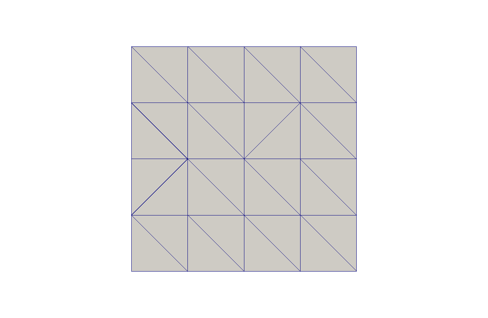

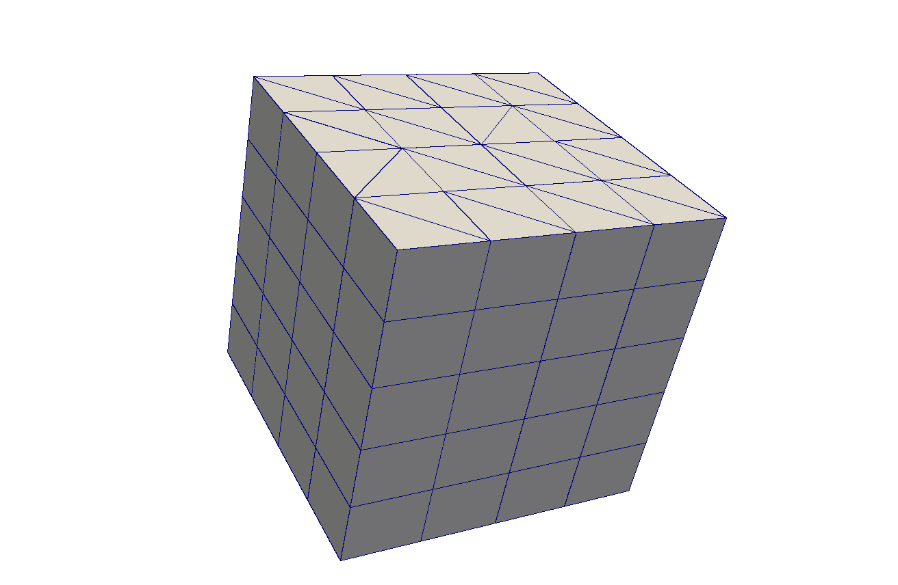

Radial Extrusion
~~~~~~~~~~~~~~~~

Radial extrusion extrudes cells radially outwards from the origin, without
increasing the number of spatial dimensions. An example in 2 dimensions, in
which a circle is extruded into an annulus, is:

.. code-block:: python

    m = CircleManifoldMesh(20, radius=2)
    mesh = ExtrudedMesh(m, 5, extrusion_type='radial')

The base mesh and extruded mesh are shown below.

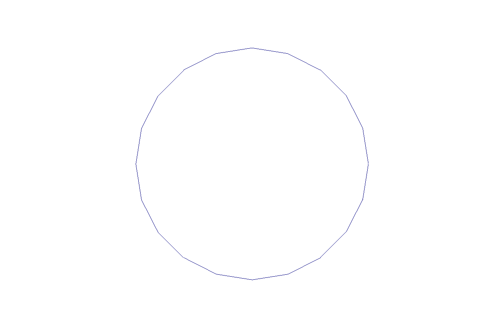

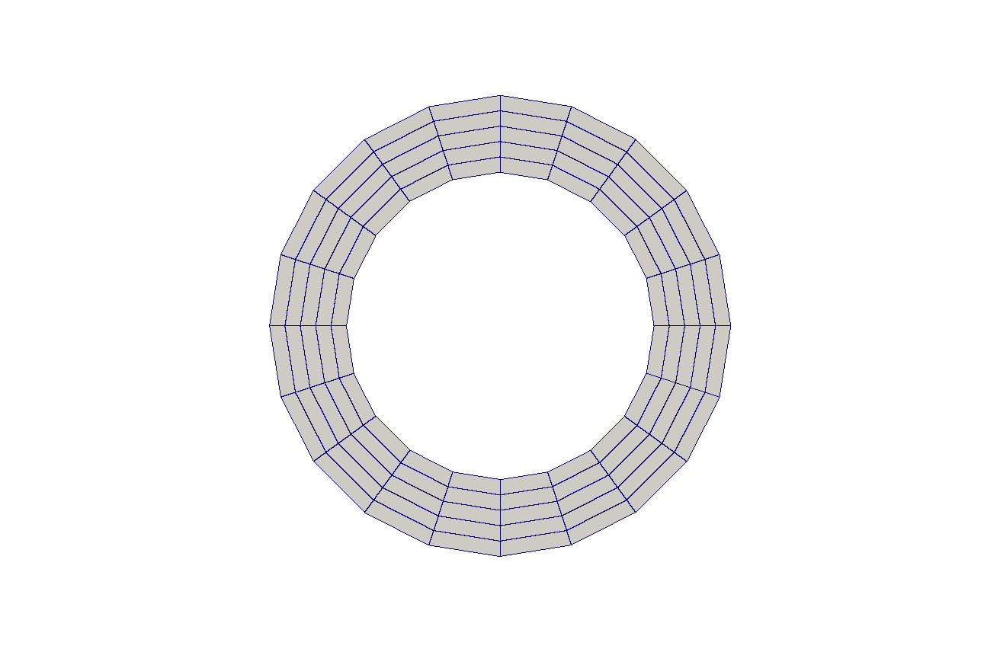

An example in 3 dimensions, in which a sphere is extruded into a spherical
annulus, is:

.. code-block:: python

    m = IcosahedralSphereMesh(radius=3, refinement_level=3)
    mesh = ExtrudedMesh(m, 5, layer_height=0.1, extrusion_type='radial')

The base mesh and part of the extruded mesh are shown below.

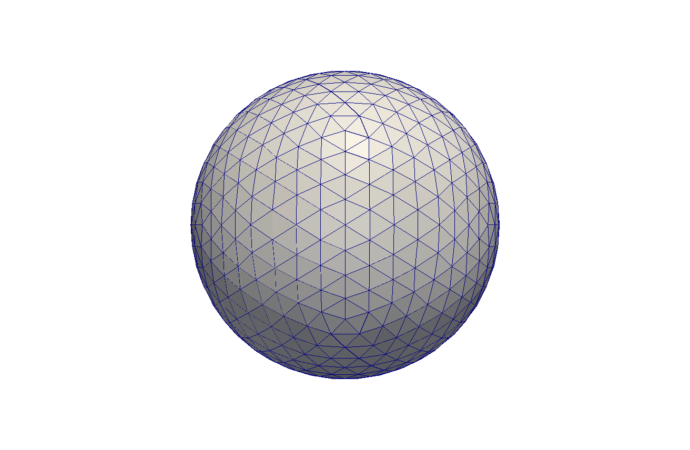

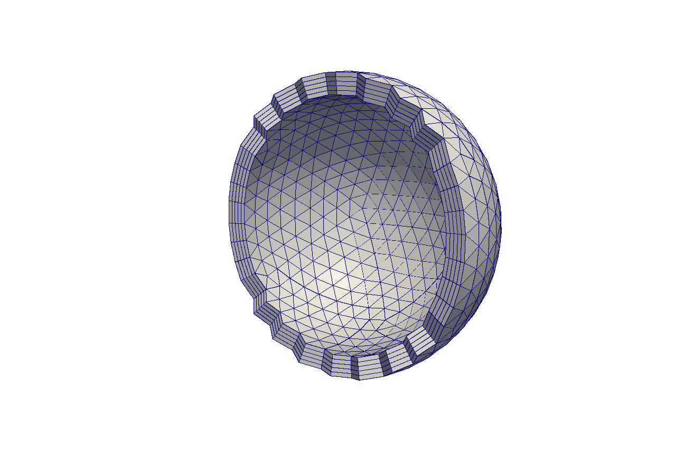

Hedgehog Extrusion
~~~~~~~~~~~~~~~~~~

Hedgehog extrusion is similar to radial extrusion, but the cells are extruded
outwards in a direction normal to the base cell. This produces a discontinuous
coordinate field.

.. code-block:: python

    m = CircleManifoldMesh(20, radius=2)
    mesh = ExtrudedMesh(m, 5, extrusion_type='radial_hedgehog')

An example in 3 dimensions, in which a sphere is extruded into a spherical
annulus, is:

.. code-block:: python

    m = UnitIcosahedralSphereMesh(refinement_level=2)
    mesh = ExtrudedMesh(m, 5, layer_height=0.1, extrusion_type='radial_hedgehog')

The 2D and 3D hedgehog-extruded meshes are shown below.

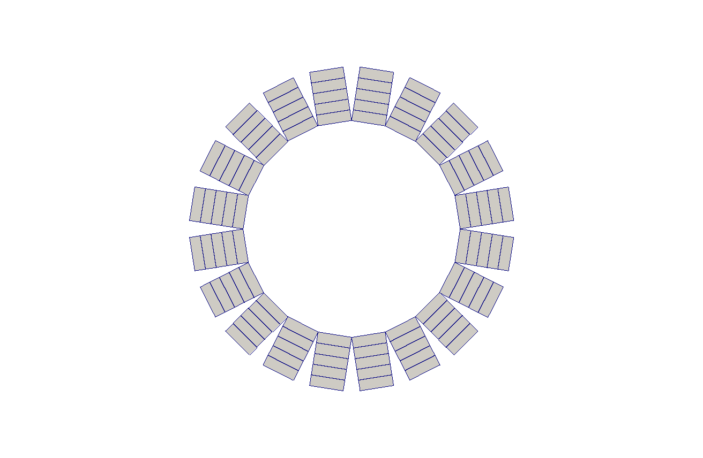

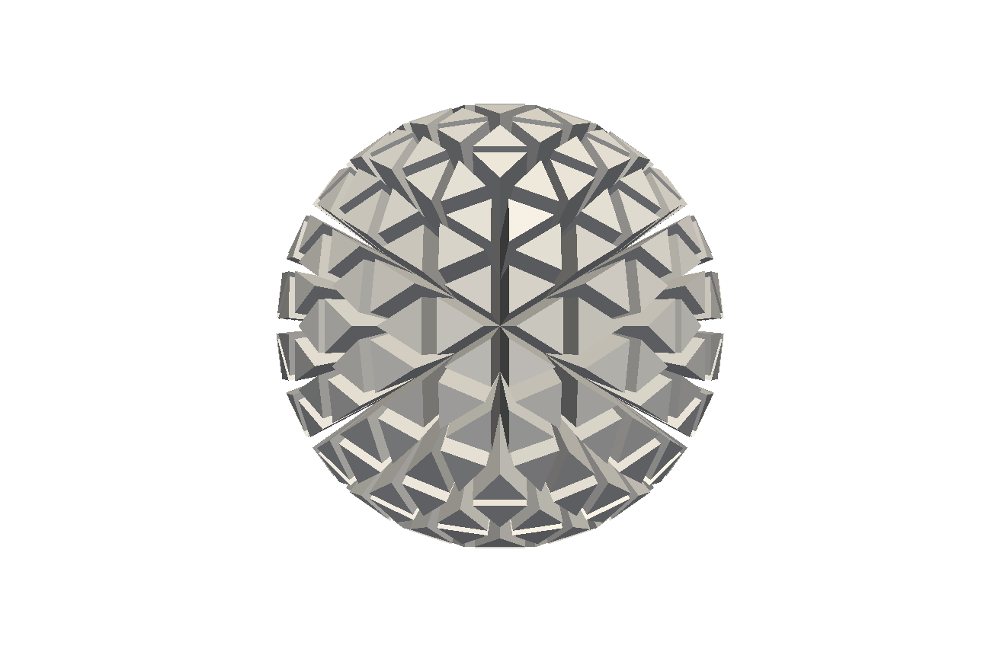

Custom Extrusion
~~~~~~~~~~~~~~~~

For a more complicated extruded mesh, a custom *kernel* can be given by the
user. Since this is a mesh-wide operation, a PyOP2 parallel loop is
constructed by Firedrake.

.. code-block:: python

    m = UnitSquareMesh(5, 5)
    kernel = op2.Kernel("""
        void extrusion_kernel(double **base_coords, double **ext_coords,
                              int **layer, double *layer_height) {
            ext_coords[0][0] = base_coords[0][0]; // X
            ext_coords[0][1] = base_coords[0][1]; // Y
            ext_coords[0][2] = 0.1 * layer[0][0] + base_coords[0][1]; // Z
        }
    """, "extrusion_kernel")
    mesh = ExtrudedMesh(m, 5, extrusion_type='custom', kernel=kernel, gdim=3)

Function Spaces on Extruded Meshes
----------------------------------

The syntax for building a :py:class:`~.FunctionSpace` on an extruded mesh is
an extension of the existing syntax used with normal meshes. On a
non-extruded mesh, the following syntax is used:

.. code-block:: python

    mesh = UnitSquareMesh(4, 4)
    V = FunctionSpace(mesh, "RT", 1)

To allow maximal flexibility in constructing function spaces, Firedrake
supports a more general syntax:

.. code-block:: python

    V = FunctionSpace(mesh, element)

where ``element`` is a UFL :py:class:`~ufl.finiteelement.finiteelement.FiniteElement` object. This
requires generation and manipulation of FiniteElement objects.

Geometrically, an extruded mesh cell is the *product* of a base, "horizontal",
cell with a "vertical" interval. The construction of function spaces on
extruded meshes makes use of this. Firedrake supports all function spaces
whose local element can be expressed as the product of an element defined on
the base cell with an element defined on an interval.

We will now introduce the new operators which act on FiniteElement objects.

The OuterProductElement operator
~~~~~~~~~~~~~~~~~~~~~~~~~~~~~~~~

To create an Element compatible with an extruded mesh, one should use
the :py:class:`~ufl.finiteelement.outerproductelement.OuterProductElement`
operator. For example,

.. code-block:: python

    horiz_elt = FiniteElement("CG", triangle, 1)
    vert_elt = FiniteElement("CG", interval, 1)
    elt = OuterProductElement(horiz_elt, vert_elt)
    V = FunctionSpace(mesh, elt)

will give a continuous, scalar-valued function space. The resulting space
contains functions which vary linearly in the horizontal direction and
linearly in the vertical direction.

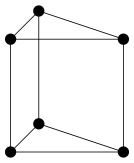

  The product of a CG1 triangle element with a CG1 interval element

The degree and continuity may differ; for example

.. code-block:: python

    horiz_elt = FiniteElement("DG", triangle, 0)
    vert_elt = FiniteElement("CG", interval, 2)
    elt = OuterProductElement(horiz_elt, vert_elt)
    V = FunctionSpace(mesh, elt)

will give a function space which is continuous between cells in a column,
but discontinuous between horizontally-neighbouring cells. In addition,
the function may vary piecewise-quadratically in the vertical direction,
but is piecewise constant horizontally.

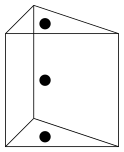

  The product of a DG0 triangle element with a CG2 interval element

A more complicated element, like a Mini horizontal element with linear
variation in the vertical direction, may be built using the
:py:class:`~ufl.finiteelement.enrichedelement.EnrichedElement` functionality
in either of the following ways:

.. code-block:: python

    mini_horiz_1 = FiniteElement("CG", triangle, 1)
    mini_horiz_2 = FiniteElement("B", triangle, 3)
    mini_horiz = mini_horiz_1 + mini_horiz_2  # Enriched element
    mini_vert = FiniteElement("CG", interval, 1)
    mini_elt = OuterProductElement(mini_horiz, mini_vert)
    V = FunctionSpace(mesh, mini_elt)

or

.. code-block:: python

    mini_horiz_1 = FiniteElement("CG", triangle, 1)
    mini_horiz_2 = FiniteElement("B", triangle, 3)
    mini_vert = FiniteElement("CG", interval, 1)
    mini_elt_1 = OuterProductElement(mini_horiz_1, mini_vert)
    mini_elt_2 = OuterProductElement(mini_horiz_2, mini_vert)
    mini_elt = mini_elt_1 + mini_elt_2  # Enriched element
    V = FunctionSpace(mesh, mini_elt)

  The product of a Mini triangle element with a CG1 interval element

The HDiv and HCurl operators
~~~~~~~~~~~~~~~~~~~~~~~~~~~~~~~~~~~~~~~~~~~~~~

For moderately complicated vector-valued elements,
:py:class:`~ufl.finiteelement.outerproductelement.OuterProductElement`
does not give enough information to unambiguously produce the desired
space. As an example, consider the lowest-order *Raviart-Thomas* element on a
quadrilateral. The degrees of freedom live on the facets, and consist of
a single evaluation of the component of the vector field normal to each facet.

The following element is closely related to the desired Raviart-Thomas element:

.. code-block:: python

    CG_1 = FiniteElement("CG", interval, 1)
    DG_0 = FiniteElement("DG", interval, 0)
    P1P0 = OuterProductElement(CG_1, DG_0)
    P0P1 = OuterProductElement(DG_0, CG_1)
    elt = P1P0 + P0P1

.. figure:: images/rt_quad_pre.svg
  :align: center

  The element created above

However, this is only scalar-valued. There are two natural vector-valued
elements that can be generated from this: one of them preserves tangential
continuity between elements, and the other preserves normal continuity
between elements. To obtain the Raviart-Thomas element, we must use the
:py:class:`~ufl.finiteelement.hdivcurl.HDiv` operator:

.. code-block:: python

    CG_1 = FiniteElement("CG", interval, 1)
    DG_0 = FiniteElement("DG", interval, 0)
    P1P0 = OuterProductElement(CG_1, DG_0)
    RT_horiz = HDiv(P1P0)
    P0P1 = OuterProductElement(DG_0, CG_1)
    RT_vert = HDiv(P0P1)
    elt = RT_horiz + RT_vert

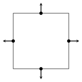

  The RT quadrilateral element, requiring the use
  of :py:class:`~ufl.finiteelement.hdivcurl.HDiv`

Another reason to use these operators is when expanding a vector into a
higher dimensional space. Consider the lowest-order Nedelec element of the
2nd kind on a triangle:

.. code-block:: python

    N2_1 = FiniteElement("N2curl", triangle, 1)

This is naturally vector-valued, and has two components. Suppose we form
the product of this with a continuous element on an interval:

.. code-block:: python

    CG_2 = FiniteElement("CG", interval, 2)
    N2CG = OuterProductElement(N2_1, CG_2)

This element still only has two components. To expand this into a
three-dimensional curl-conforming element, we must use the
:py:class:`~ufl.finiteelement.hdivcurl.HCurl` operator; the syntax is:

.. code-block:: python

    Ned_horiz = HCurl(N2CG)

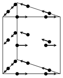

This gives the horizontal part of a Nedelec edge element on a triangular
prism. The full element can be built as follows:

.. code-block:: python

    N2_1 = FiniteElement("N2curl", triangle, 1)
    CG_2 = FiniteElement("CG", interval, 2)
    N2CG = OuterProductElement(N2_1, CG_2)
    Ned_horiz = HCurl(N2CG)
    P2tr = FiniteElement("CG", triangle, 2)
    P1dg = FiniteElement("DG", interval, 1)
    P2P1 = OuterProductElement(P2tr, P1dg)
    Ned_vert = HCurl(P2P1)
    Ned_wedge = Ned_horiz + Ned_vert
    V = FunctionSpace(mesh, Ned_wedge)

Shortcuts for simple spaces
~~~~~~~~~~~~~~~~~~~~~~~~~~~

Simple scalar-valued spaces can be created using a variation on the existing
syntax, if the ``HDiv``, ``HCurl`` and enrichment operations
are not required. To create a function space of degree 2 in the horizontal
direction, degree 1 in the vertical direction and possibly discontinuous
between layers, the short syntax is

.. code-block:: python

	fspace = FunctionSpace(mesh, "CG", 2, vfamily="DG", vdegree=1)

If the horizontal and vertical parts have the same ``family`` and ``degree``,
the ``vfamily`` and ``vdegree`` arguments may be omitted. If ``mesh`` is an
:py:class:`~.ExtrudedMesh` object then the following are equivalent:

.. code-block:: python

	fspace = FunctionSpace(mesh, "Lagrange", 1)

and

.. code-block:: python

	fspace = FunctionSpace(mesh, "Lagrange", 1, vfamily="Lagrange", vdegree=1)

Solving Equations on Extruded Meshes
------------------------------------

Once the mesh and function spaces have been declared, extruded meshes behave
almost identically to normal meshes. However, there are some small differences,
which are listed below.

1. Surface integrals are no longer denoted by ``ds``. Since extruded meshes have
   multiple types of surfaces, the following notation is used:

   * ``ds_v`` is used to denote an integral over *side* facets of the mesh.
     This can be combined with boundary markers from the base mesh, such as
     ``ds_v(1)``.
   * ``ds_t`` is used to denote an integral over the *top* surface of the mesh.
   * ``ds_b`` is used to denote an integral over the *bottom* surface of the mesh.
   * ``ds_tb`` is used to denote an integral over both the *top* and *bottom*
     surfaces of the mesh.

2. Interior facet integrals are no longer denoted by ``dS``. The *horizontal*
   and *vertical* interior facets may require different numerical treatment.
   To facilitate this, the following notation is used:

   * ``dS_h`` is used to denote an integral over *horizontal* interior facets
     (between cells that are vertically-adjacent).
   * ``dS_v`` is used to denote an integral over *vertical* interior facets
     (between cells that are horizontally-adjacent).

3. When setting strong boundary conditions, the boundary markers from the base
   mesh can be used to set boundary conditions on the relevant side of the
   extruded mesh. To set boundary conditions on the top or bottom, the label
   is replaced by:

   * ``top``, to set a boundary condition on the top surface.
   * ``bottom``, to set a boundary condition on the bottom surface.
