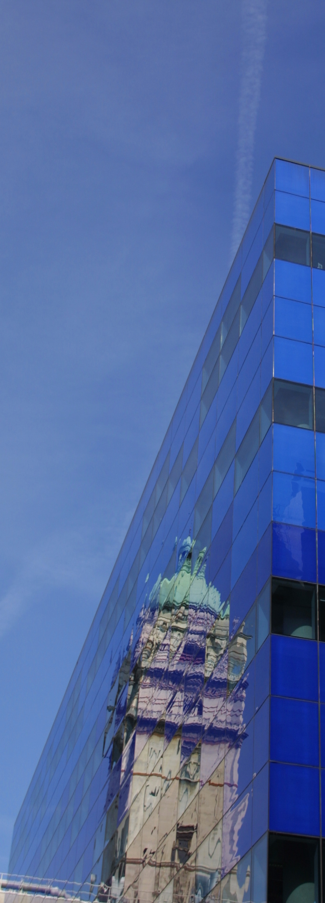
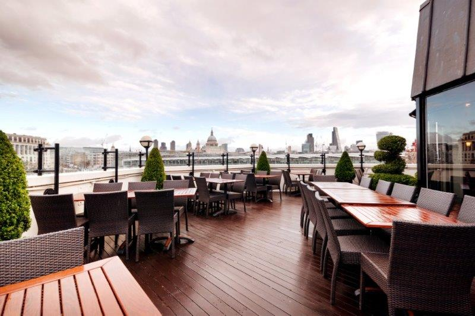

:orphan: true

.. title:: FEniCS '15

The :doc:`Firedrake project <index>` is proud to host the 2015 FEniCS
Workshop. The workshop is an opportunity for all those interested the
`FEniCS Project <https://fenicsproject.org>`_, and related projects such
as `dolfin-adjoint <http://www.dolfin-adjoint.org>`_ and :doc:`Firedrake
<index>`, to exchange ideas, communicate their results and network with
the automated finite element community.

The workshop welcomes existing and potential developers and users of
automated simulation systems, as well as mathematicians interested in
a high productivity computational environment for finite element problems.

Programme
---------

`The schedule is now online <https://easychair.org/smart-program/FEniCS'15/index.html>`_.

* **Keynote lecture:** Dr Jennifer Ryan, University of East Anglia.
* **Public lecture:** `Prof. Anders Logg <http://www.math.chalmers.se/~logg/>`_, Chalmers University.
* **Featured talks:**
   * Dr Jack Hale University of Luxembourg.
   * `Dr Marie Rognes <http://www.simula.no/people/meg>`_ Simula Research Laboratory.
   * `Dr Lawrence Mitchell <http://www.imperial.ac.uk/people/lawrence.mitchell>`_ Imperial College London.

Videos of the talks are available `on the Firedrake youtube channel
<https://www.youtube.com/playlist?list=PLz9uieREhSLN4XJAXR6OcQKRRQavWqKZL>`_.

Workshop dinner
~~~~~~~~~~~~~~~

The workshop dinner will be a terrace barbeque at ``Doggett's Coat and
Badge``
featuring views across the Thames to St Paul's Cathedral and a fine
selection of English real ales and other delights. For information on
getting to Doggett's, see :ref:`the directions <to-doggetts>`.

Location and travel
~~~~~~~~~~~~~~~~~~~

The workshop will be held in the Huxley Building on Imperial College's
main South Kensington campus. The street address is 180 Queen's Gate,
London SW7 2RH. For information on getting to the venue, including
Transport for London tickets, see :doc:`the directions page
<fenics_15_directions>`.

Registration
------------

Registration is now open `on the Imperial College website <https://wwwa.imperial.ac.uk/pls/apex/f?p=120:2:36560903269220::NO:2:P2_TRT_TYPE,P2_DEPARTMENT,P2_COURSE:SHORTCOR,3324,7793>`_

Registration **before 31 May** will be £150. This will include lunch on
Tuesday and Wednesday, the conference dinner, and refreshments in all
the breaks during the workshop. Additional dinner tickets (for
partners etc.) will be available for £40. After 31 May, registration
will rise to £200. Registration will close on **19 June**.

Accommodation
-------------

For those looking for affordable accommodation right on campus, `Imperial College's
halls of residence <http://www.imperial.ac.uk/visit/summer-accommodation/>`_
are available to summer visitors starting on 29 June. Alternatively,
you can make use of `Imperial's rates at nearby hotels <http://www.imperial.ac.uk/visitors-accommodation/>`_.

Scientific committee
--------------------

* `David Ham <http://www.imperial.ac.uk/people/david.ham>`_ (Imperial College London)
* Martin Alnæs (Simula)
* Jan Blechta (Charles University)

Local organising committee
--------------------------

* `David Ham <http://www.imperial.ac.uk/people/david.ham>`_
* `Colin Cotter <http://www.imperial.ac.uk/people/colin.cotter>`_
* `Lawrence Mitchell <http://www.imperial.ac.uk/people/lawrence.mitchell>`_

Sponsors
--------

FEniCS '15 is supported by:

 |Imperial College London|  |EPSRC|  |NERC|

.. |NERC| image:: /images/nerc.*
  :height: 60px
  :target: https://www.ukri.org/councils/nerc/

.. |EPSRC| image:: /images/epsrc.*
  :height: 60px
  :target: https://www.ukri.org/councils/epsrc/

.. |Imperial College London| image:: /images/imperial.*
  :height: 60px
  :target: http://www.imperial.ac.uk
