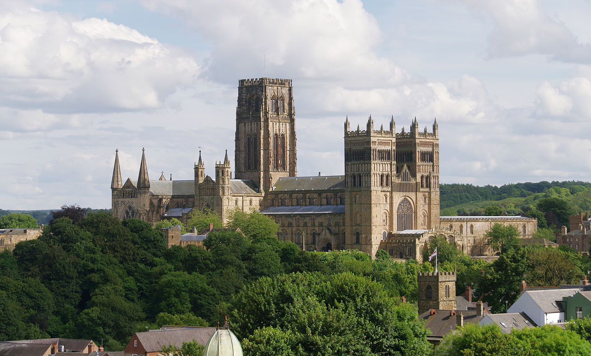

:orphan: true

.. title:: Firedrake '19

Firedrake '19
-------------

We are very happy to announce that the third Firedrake user and
developer workshop will be held on 26 and 27 September 2019 at `Durham
University <https://www.durham.ac.uk/>`_.

The workshop will provide the opportunity for Firedrake users and
developers to engage with each other to communicate the ways that
Firedrake can be used in simulation science, the latest developments
in the project, and the future developments anticipated. The event
will provide Firedrake users with the opportunity to spend face to
face time with developers and other users.

Tutorial
~~~~~~~~

The workshop will start with a half day Firedrake tutorial for
interested new users and the main science programme will start at
lunchtime on 26 September. See the programme for detailed timings.

Key Dates
---------

* Early registration deadline: 17 August 2019
* Registration deadline: 6 September 2019 (via Durham event
  registration).
* Abstract submission deadline: 17 August 2019.
* Workshop: 26-27 September 2019

Programme
---------

The workshop programme is `available on Easychair
<https://easychair.org/smart-program/Firedrake'19/>`_.

Talk slides
-----------

Slides from the talks have kindly been provided by some of the
presenters.

* David Acreman: `REXI: breaking the time step constraint
  <_static/firedrake19-slides/acreman.pdf>`__
* Mariana Clare: `Where has all my sand gone? Hydro-morphodynamics
  2D modelling using a discontinuous Galerkin discretisation
  <_static/firedrake19-slides/clare.pdf>`__
* Colin Cotter: `Time (integrator) parallel exponential integration
  and phase-averaging for geophysical fluid dynamics
  <_static/firedrake19-slides/cotter.pdf>`__
* Matt Knepley: `Understanding multivariate computation using the
  Kolmogorov superposition theorem <https://cse.buffalo.edu/~knepley/presentations/PresFiredrake2019.pdf>`_
* Lawrence Mitchell: `PCPATCH: topological construction of multigrid
  relaxation methods <_static/firedrake19-slides/mitchell.pdf>`__
* Joe Wallwork: `Anisotropic goal-oriented mesh adaptation in
  Firedrake <_static/firedrake19-slides/wallwork.pdf>`__

Workshop dinner
~~~~~~~~~~~~~~~

There will be a workshop dinner in the evening of 26 September at `ASK
Italian <https://www.askitalian.co.uk/restaurant/durham/>`_ on
Durham's Millenium Square (easily accessible by foot from the
conference location and town centre).

Location
~~~~~~~~

The workshop will be held in room E102 of the Christopherson building
in the `Department of Computer Science
<https://www.durham.ac.uk/departments/academic/computer-science/>`_ at Durham University.

Registration
------------

Early bird registration is now closed. Registration (before 6th
September) costs £80. Please register via Event Durham.
Registration for the tutorial only is free.

Further details
---------------

For any queries, please contact  `Lawrence Mitchell
<mailto:lawrence.mitchell@durham.ac.uk>`_.
