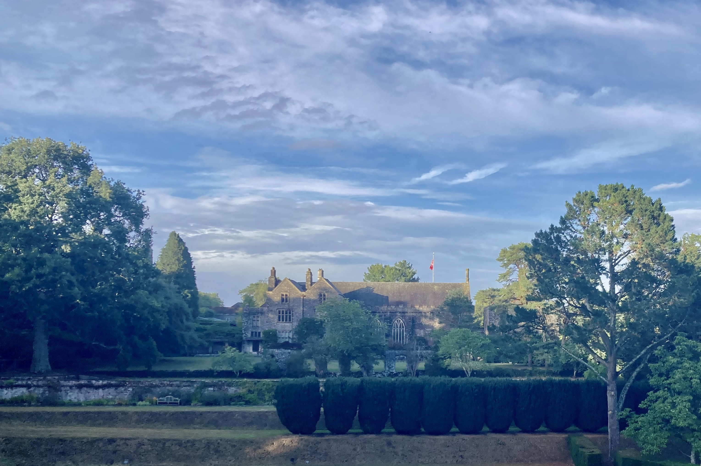

:orphan: true

.. title:: Firedrake '22

Firedrake '22
-------------
               
The slightly inaccurately named Firedrake '22 user and developer workshop will
be held at Dartington Hall in Totnes from 4-6 January 2023. The event is
cohosted by the University of Exeter and Imperial College London.

The workshop is an opportunity for Firedrake users and
developers to engage with each other to communicate the ways that
Firedrake can be used in simulation science, the latest developments
in the project, and the future developments anticipated. The event
provides Firedrake users with the opportunity to interact directly
with developers and other users.

Key Dates
---------

* 18/11/2022 Abstract submission
* 02/12/2022 Registration
* 4-6/1/2023 Workshop

The workshop will run from 1400 on 4 January to 1400 on 6 January (after lunch
on Wednesday until after lunch on Friday). This will hopefully allow most UK
participants to travel to and from the event on those days.

Programme
---------

Click here for `the programme
<https://easychair.org/smart-program/Firedrake'22/>`__

Travel
------

UK rail strikes have been announced for 3, 4, 6, and 7 January. We are in the
process of organising a coach from London via Reading, Swindon (for Oxford) and
Exeter. More details will appear soon.

Organising committee
--------------------

* `David Ham <https://www.imperial.ac.uk/people/david.ham>`__, Imperial College London
* `Nell Hartney <https://mathematics.exeter.ac.uk/staff/nh491?sm=nh491>`__, University of Exeter
* `Jemma Shipton <https://mathematics.exeter.ac.uk/staff/js1075?sm=js1075>`__, University of Exeter

Further details
---------------

For any queries, please contact `David Ham <mailto:david.ham@imperial.ac.uk>`_.
