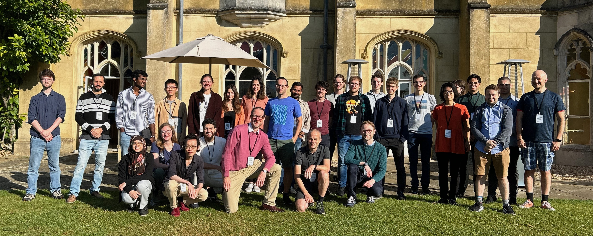

:orphan: true

.. title:: Firedrake '23

Firedrake '23
-------------
               
The seventh Firedrake user and developer workshop was
held at `Missenden Abbey <https://missendenabbey.co.uk>`__ from 13-15
September 2023. The event was hosted by Imperial College London.

The workshop was an opportunity for Firedrake users and
developers to engage with each other to communicate the ways that
Firedrake can be used in simulation science, the latest developments
in the project, and the future developments anticipated. The event
provided Firedrake users with the opportunity to interact directly
with developers and other users.

Programme
---------

Click here for `the programme
<https://easychair.org/smart-program/Firedrake'23/>`__

Talk videos
-----------

Most of the talks presented at Firedrake '23 are now available `on YouTube <https://www.youtube.com/playlist?list=PLz9uieREhSLPlPUMuCvwm3JmemyFrV9vT>`__.

Organising committee
--------------------

* `David Ham <https://www.imperial.ac.uk/people/david.ham>`__, Imperial College London
* `Daiane I. Dolci <https://www.imperial.ac.uk/people/d.dolci>`__, Imperial College London
* `Koki Sagiyama <https://www.imperial.ac.uk/people/k.sagiyama>`__, Imperial College London

Further details
---------------

For any queries, please contact `David Ham <mailto:david.ham@imperial.ac.uk>`_.
