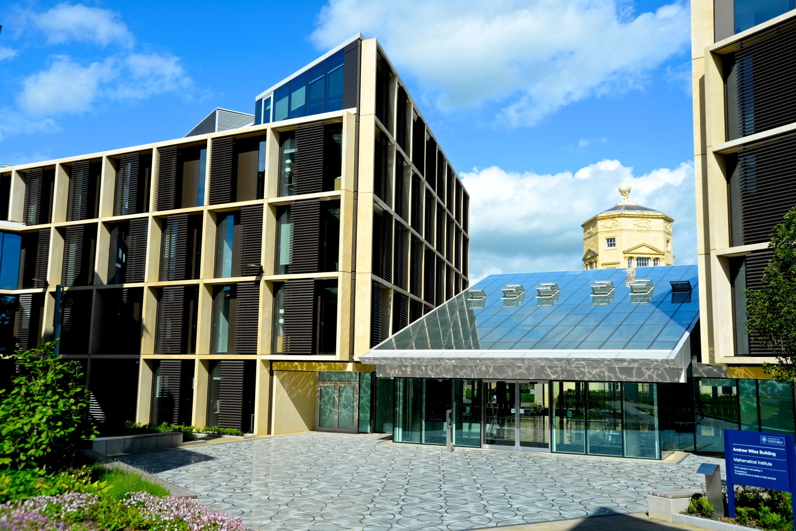
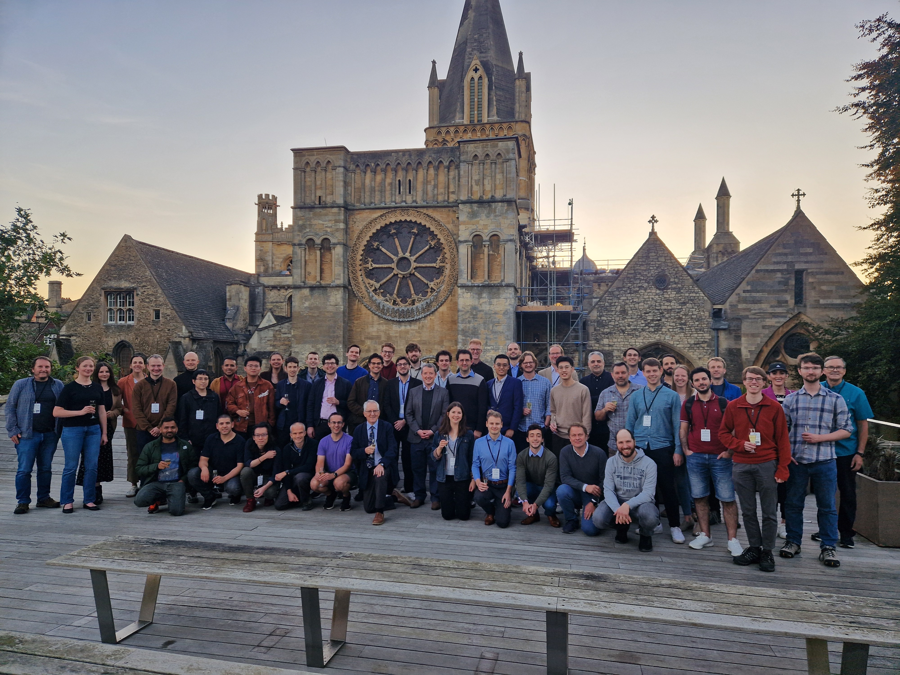
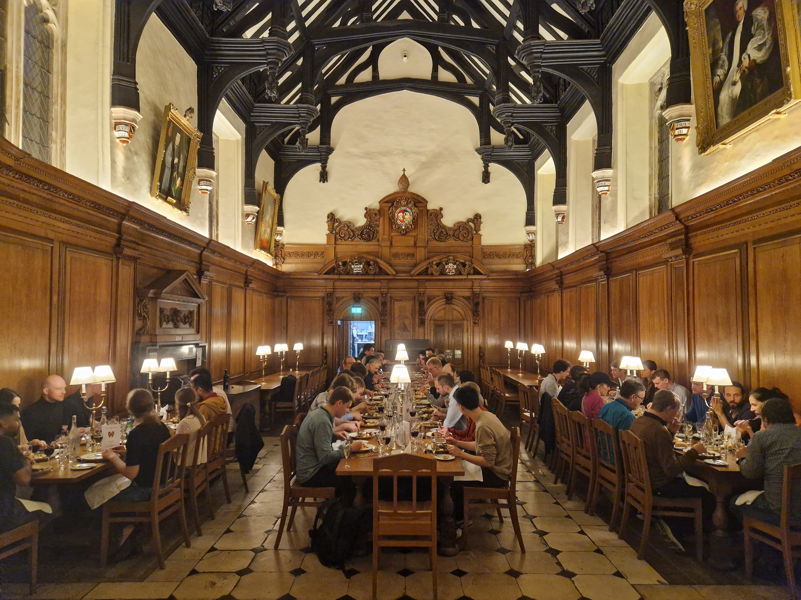

:orphan: true

.. title:: Firedrake '24

Firedrake '24
-------------
               
The eighth Firedrake user and developer workshop will be held at the
`Mathematical Institute, University of Oxford
<https://www.maths.ox.ac.uk>`__ from 16-18 September 2024.

The workshop will be an opportunity for Firedrake users and developers
to discuss the latest developments in the
project, anticipated future developments, and how Firedrake can be used
in the numerical solution of partial differential equations. The event
will provide Firedrake users with the opportunity to interact directly
with developers and with other users.

The conference will begin around lunchtime on 16 September and end on the
evening of 18 September. The `program can be found here <https://easychair.org/smart-program/Firedrake'24/>`__.

Programme
---------

`The programme is now available
<https://easychair.org/smart-program/Firedrake'24/>`__.

Conference venue
----------------

The conference will take place in the Andrew Wiles Building. Its main entrance
is located on Woodstock Road (`see here for the precise location
<https://what3words.com/policy.rises.bets>`__). Take some care in navigation, as
Google Maps sometimes directs people to the old mathematics building on St.
Giles.

Accommodation
-------------

We have arranged a number of single en-suite rooms at `Oriel college, Oxford
<https://www.oriel.ox.ac.uk>`__, for the nights of Monday 16 September and Tuesday
17 September. The fee includes breakfast on the following days. Oriel College,
founded in 1326, is one of the constituent colleges of the university of Oxford.
The accommodation is approximately fifteen minutes walk from the Andrew Wiles
Building.

Conference dinner
-----------------

Registration includes a drinks reception and three-course dinner at `Corpus
Christi college, Oxford <https://www.ccc.ox.ac.uk>`__, founded in 1517. The dinner will take place on the
evening of 17 September. Corpus Christi college is right next to Oriel, about
fifteen minutes walk from the Andrew Wiles building. There is no dress code for the dinner, come as you are.

It is possible during registration to purchase additional tickets for the
dinner, to bring non-registered companions.

.. image:: images/corpusdininghall.jpg
   :width: 100%
   :alt: Corpus Christi dining hall
   :align: center

Registration
------------

Registration is now closed. The deadline was **25th August 2024**.

The registration fees were as follows:

.. list-table::
   :widths: 25 25 50
   :header-rows: 0

   * -
     - Without accommodation
     - With accommodation
   * - Student
     - £25
     - £200
   * - Non-student
     - £115
     - £350

Abstract submission
-------------------

Abstract submission is now closed. Thank you to everyone who has submitted an abstract.

The deadline for abstract submission was **18th August 2024**.

Support
-------

The conference has been kindly supported by `EPSRC grant EP/W026163/1
<https://gow.epsrc.ukri.org/NGBOViewGrant.aspx?GrantRef=EP/W026163/1>`__ and
`EPSRC grant EP/W026066/1
<https://gow.epsrc.ukri.org/NGBOViewGrant.aspx?GrantRef=EP/W026066/1>`__.

..
    Talk videos
    -----------

    Most of the talks presented at Firedrake '23 are now available `on YouTube <https://www.youtube.com/playlist?list=PLz9uieREhSLPlPUMuCvwm3JmemyFrV9vT>`__.

Travel to Oxford
----------------

(This advice is an adaptation of `Mike Giles' advice <https://people.maths.ox.ac.uk/~gilesm/travel.html>`__.)

Coming to Oxford from abroad, the best options are:

* Flying to Heathrow

   This is usually the best option for those flying long distance. There is an excellent `direct bus service to Oxford <https://www.theairlineoxford.co.uk/oxford-to-heathrow-bus/>`__ (when you approach the bus the driver will ask which stop in Oxford you want; tell the driver you want to go to Gloucester Green bus station -- "Gloucester" is pronounced "gloster") with 2-3 buses per hour taking 80-90 minutes from the Heathrow Central Bus Station (Terminals 1-3) and Terminal 5. Those flying into Terminal 4 must first take either an underground train to the Central Bus Station, or a local bus 482 or 490 to Terminal 5 -- the bus is usually slightly faster.

* Flying to Birmingham

   This is a good option for European flights; Birmingham is a much smaller airport than Heathrow and is more convenient. There is a `regular train service to Oxford from the adjacent Birmingham International station <https://www.crosscountrytrains.co.uk/>`__. There is usually one train per hour, and they take about an hour.

Other, less convenient options are:

* Flying to Gatwick: the direct bus service is less frequent and takes up to 2.5 hours.
* Flying to Luton or Stansted: two more airports near London but neither has convenient public transport links to Oxford.
* Eurostar train to St Pancras station in London: onward travel to Oxford requires a 30-minute underground train journey to Paddington station, then an hour's train journey to Oxford.

Organising committee
--------------------

* `Patrick Farrell <https://pefarrell.org>`__, University of Oxford
* `India Marsden <https://www.maths.ox.ac.uk/people/india.marsden>`__, University of Oxford
* `Pablo Brubeck <https://www.maths.ox.ac.uk/people/pablo.brubeckmartinez>`__, University of Oxford

Conference photos
-----------------

|

