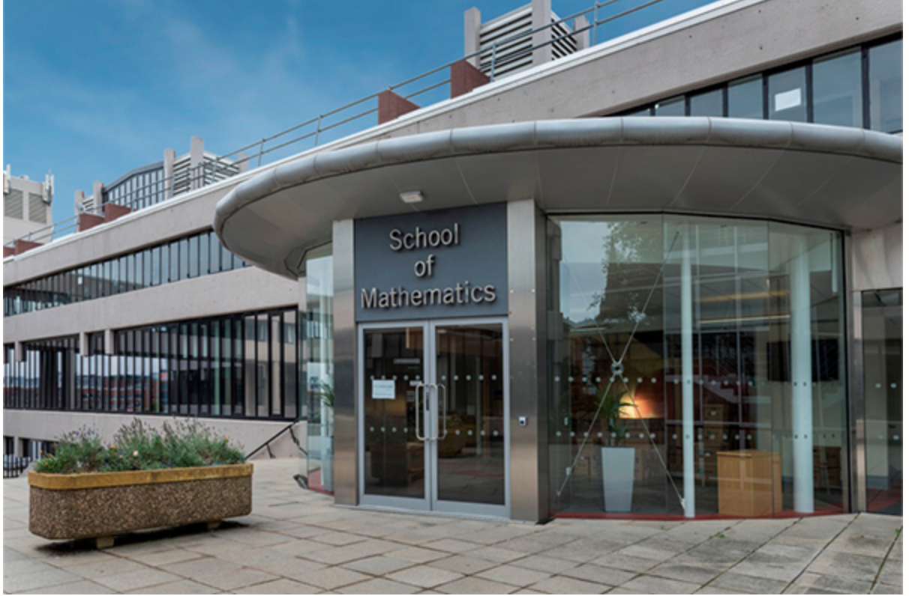
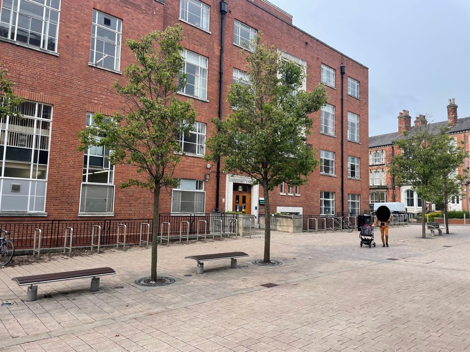

:orphan: true

.. title:: Firedrake '25

Firedrake '25
-------------

The tenth Firedrake user and developer workshop will be held at the
`School of Mathematics <https://eps.leeds.ac.uk/maths>`__ together
with
`Leeds Institute of Fluid Dynamics <https://fluids.leeds.ac.uk/>`__,
University of Leeds, from 15-17 September 2025.

The workshop will be an opportunity for Firedrake users and developers
to discuss the latest developments in the project, anticipated future
developments, and how Firedrake can be used in the numerical solution
of partial differential equations. The event will provide Firedrake
users with the opportunity to interact directly with developers and
with other users.

The conference will begin around lunchtime on 15 September and end on the
evening of 17 September.

Conference venue
----------------

The conference will take place in the School of Mathematics, the MALL and
the Reading Room (Room 9.31). Its main entrance (building 84 on the
`campus map <https://eps.leeds.ac.uk/maths/doc/contact-us-6>`__) is located
next to the Edward Boyle library (building 83 on the
campus map).

Accommodation
-------------

Accommodation is to be arranged by the participants themselves. We recommend
the following hotels, in particular the ibis Leeds Centre Marlborough Street,
which is a ten-minute walk to the School of Mathematics.

* `ibis Leeds Centre Marlborough Street <https://all.accor.com/hotel/3652/index.en.shtml>`__
* `The Queens Hotel <https://www.thequeensleeds.co.uk/>`__
* `Radisson Blu Leeds <https://www.radissonhotels.com/en-us/hotels/radisson-blu-leeds>`__
* `The Marriott Leeds <https://www.marriott.com/en-gb/hotels/lbadt-leeds-marriott-hotel/overview/>`__
* `Park Plaza Leeds <https://www.radissonhotels.com/en-us/hotels/park-plaza-leeds>`__
* `Hilton Leeds City <https://www.hilton.com/en/hotels/leehnhn-hilton-leeds-city/>`__
* `Novotel Leeds Centre <https://all.accor.com/hotel/3270/index.en.shtml>`__
* `ibis Styles Leeds City Centre Arena <https://all.accor.com/hotel/9687/index.en.shtml>`__
* `Kspace apartments, Waterloo Court, Leeds <https://www.kspace.uk/>`__

Conference dinner
-----------------

Registration includes a drinks reception and three-course dinner at University House, University of Leeds. The dinner will take place on the evening of 16 September. 

It is possible during registration to purchase additional tickets for the dinner to bring non-registered companions.

Registration
------------

`Registration
<https://app.onlinesurveys.jisc.ac.uk/s/leeds/firedrake-2025-registration>`__
is now open.

The registration fees will be as follows:

.. list-table::
   :widths: 25 25

   * - Student
     - £25
   * - Non-student
     - £115

Abstract submission
-------------------

We welcome presentations about any aspect of Firedrake development or
application. Please submit your abstract `here
<https://easychair.org/conferences/directory?a=34999462>`__.

Support
-------

The conference has been kindly supported by EPSRC grant EP/W026163/1 and EPSRC
grant EP/W026066/1 with support by the School of Mathematics and Leeds
Institute of Fluid Dynamics.

Travel to Leeds
----------------

Coming to Leeds from abroad, the best options are:

* Fly to Heathrow or Gatwick

  This is usually the best option for those flying long distance. Subsequently,
  one can take the train to Leeds.

* Fly to Leeds-Bradford (LBA)

  This is a good option for European flights; Leeds-Bradford is a much smaller
  airport than Heathrow and is more convenient. There is a bus service to the
  centre of Leeds. Alternatively, one can take a taxi.

If coming from the UK it is simplest to take the train to Leeds station.

Organising committee
--------------------

* Onno Bokhove o.bokhove@leeds.ac.uk, School of Mathematics, University of Leeds
* Claire Savy and Deborah Clarke fluids-institute@leeds.ac.uk, Leeds Institute of
  Fluid Dynamics, University of Leeds
