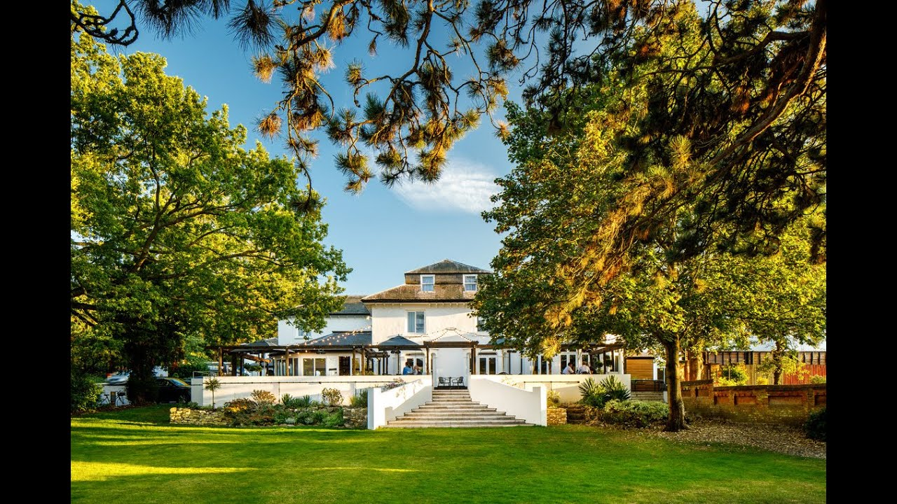

:orphan: true

.. title:: PETSc annual user meeting and Firedrake '26

PETSc annual user meeting and Firedrake '26
-------------------------------------------

The eleventh Firedrake user and developer workshop will be held jointly
with the `PETSc annual user meeting <https://petsc.org/release/community/meetings/meeting/#upcoming-meetings>`__
in Oxford between 1-5 June 2026.

The meetings will be an opportunity for users and developers of each project to
discuss the latest developments, anticipated future developments, and present
novel applications and theoretical developments. The event will provide
Firedrake users with the opportunity to interact directly with developers and
with other users.

The PETSc meeting will run from 1-3 June, and the Firedrake meeting from 3-5
June, with overlapping sessions of common interest on Wednesday 3 June.
Participants may register for either part of the week, but we hope that many
will take the opportunity to learn more about these two related projects by
staying for the whole week. 

Organising committee
--------------------

* `David Ham <https://www.imperial.ac.uk/people/david.ham>`__, Imperial College London
* `Connor Ward <https://www.imperial.ac.uk/people/c.ward20>`__, Imperial College London
* Matthew Knepley, University at Buffalo
* Jemma Shipton, University of Exeter
* Hussam Al Daas, STFC
* Pablo Brubeck, University of Oxford

Further details
---------------

For any queries, please contact `Connor Ward <mailto:c.ward20@imperial.ac.uk>`_.
