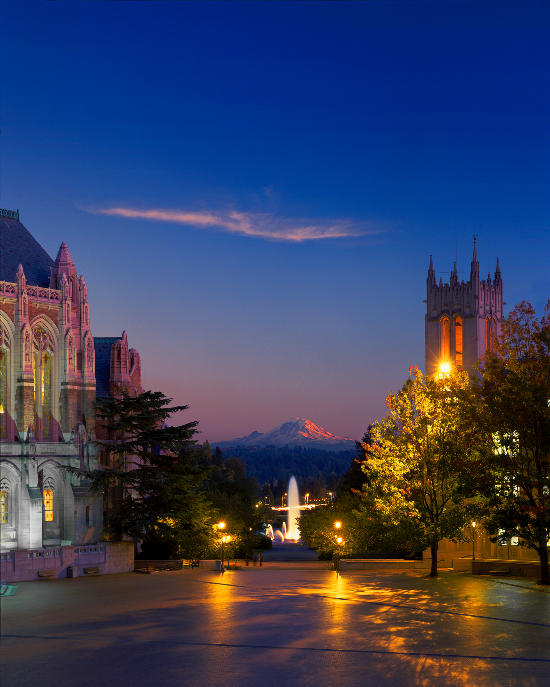

:orphan: true

.. title:: Firedrake USA

Firedrake USA '20
-----------------

For the very first time we'll be holding a Firedrake workshop in North
America. Firedrake USA '20 will be held on 10 and 11 February 2020 at
`the University of Washington <https://www.washington.edu>`_. That's
on the two days before `SIAM PP20
<https://www.siam.org/conferences/cm/conference/pp20>`_, which will
also be in Seattle.

The workshop will provide the opportunity for Firedrake users and
developers to engage with each other to communicate the ways that
Firedrake can be used in simulation science, the latest developments
in the project, and the future developments anticipated. The event
will provide Firedrake users with the opportunity to spend face to
face time with developers and other users.

Programme
~~~~~~~~~

The programme is now online `here <https://easychair.org/smart-program/FiredrakeUSA20/>`_.

Tutorial
~~~~~~~~

The workshop will start with a half day Firedrake tutorial for
interested new users and the main science programme will start at
lunchtime on 10 February. See the programme for detailed timings.

Key Dates
---------

* Early registration deadline: 15 January 2020
* Registration deadline: 31 January 2020
* Abstract submission deadline: 15 January 2020
* Workshop: 10-11 February 2020

Location
~~~~~~~~

The workshop was held in the `Data Science Studio
<https://escience.washington.edu/wrf-data-science-studio/>`_ on the
6th floor of the UW Physics and Astronomy Building.

Organising Committee
--------------------

* Daniel Shapero,
  University of Washington.
* `David Ham <https://www.imperial.ac.uk/people/david.ham>`_, Imperial
  College London.
* `Lawrence Mitchell
  <https://www.dur.ac.uk/computer.science/staff/profile/?id=17243>`_,
  Durham University.

Further details
---------------

For any queries, please contact  `Daniel Shapero
<mailto:shapero@uw.edu>`__.
