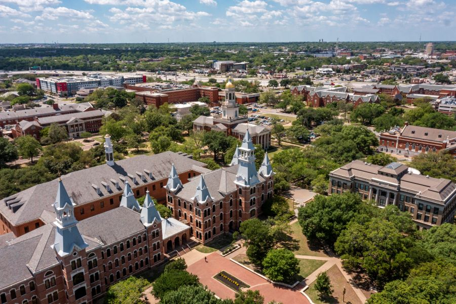

:orphan: true

.. title:: Firedrake USA '25

Firedrake USA'25
----------------
               
The ninth Firedrake user and developer workshop will be held at 
`Baylor University 
<https://math.artsandsciences.baylor.edu>`__ from 28 February-1 March 2025.

The workshop will be an opportunity for Firedrake users and developers
to discuss the latest developments in the
project, anticipated future developments, and how Firedrake can be used
in the numerical solution of partial differential equations. The event
will provide Firedrake users with the opportunity to interact directly
with developers and with other users.

The conference will begin with a tutorial session on the morning of 28 February and end on the evening of 1 March. 

Conference venue
----------------

The conference will take place in the Bill Daniel Student Center in Room 202 in the heart of the Baylor campus.  A `campus map <https://map.baylor.edu/>`__ is available online, and both Apple Maps and Google Maps accurately locate the Bill Daniel Student Center.  

Accommodation
-------------

We have reserved a block of hotel rooms at SpringHill Suites Waco, about a 15 minute walk from the Bill Daniel Student Center.  Follow `this link <https://www.marriott.com/event-reservations/reservation-link.mi?id=1734040121673&key=GRP&guestreslink2=true&app=resvlink/>`__ to hold your room.  The group rate is only available until 20 January 2025.

Conference dinner
-----------------

The conference dinner will be held Friday night at the Baylor Club in McLane Stadium.  The dinner is included with the registration fee.

Registration
------------

Register for the conference at
`this link <https://pay.baylor.edu/C20024_ustores/web/product_detail.jsp?PRODUCTID=1097>`__.  

The registration fees are as follows:

.. list-table::
   :widths: 25 50
   :header-rows: 0

   * - Student:
     - $50
   * - Non-student:
     - $200

Registration deadline is 13 February 2025.

The `SIAM Texas-Louisiana Section <https://www.siam.org/get-involved/connect-with-a-community/sections/siam-texas-louisiana-section/>`__ is providing some support for students currently attending universities in Texas or Louisiana to attend.
Students may submit an application to be considered for funding `here <https://docs.google.com/forms/d/e/1FAIpQLSdXKsGE3D18BhvRpfcGD_gSdDmmXGRQ4l47k4Aj4SKJ2c6DZg/viewform?usp=sharing>`__.

Abstract submission
-------------------

Abstracts can be submitted `via EasyChair <https://easychair.org/conferences/?conf=firedrakeusa25>`__.

The deadline for abstract submission is 17 February 2025.

Support
-------

The conference has been kindly supported by the SIAM TX-LA Section and EPSRC.

Travel to Waco
--------------

* By air:  Waco has a small airport.  There is daily service between Waco and Dallas/Fort Worth International Airport via American Airlines.  

* By ground:  We are less than two hours by car from the Dallas and Austin airports, and just under three hours from Bush Intercontinental Airport in Houston.  Additionally, Waco is reachable by bus services such as Greyhound and FlixBus.

* Parking on campus:  Baylor has plenty of visitor parking for your personal or rental vehicle, but consult `these instructions <https://dps.web.baylor.edu/parking-transportation/visitors>`__ and make sure to `register your vehicle <https://dps.web.baylor.edu/parking-transportation/visitors/visitor-parking-permit>`__.

Organising committee
--------------------

* `Robert Kirby <https://sites.baylor.edu/robert_kirby/>`__, Baylor University
* `David Ham <https://profiles.imperial.ac.uk/david.ham>`__, Imperial College London

