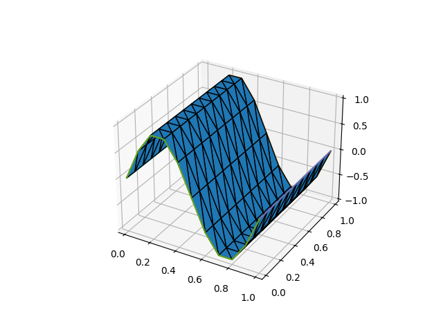

.. only:: html

  .. contents::

Changing mesh coordinates
=========================

Users may want to change the coordinates of an existing mesh object
for certain reasons. The coordinates can be accessed as a
:py:class:`~.Function` through ``mesh.coordinates`` where ``mesh`` is
a mesh object. For example,

.. code-block:: python3

   mesh.coordinates.dat.data[:, 1] *= 2.0

streches the mesh in the *y*-direction. Another possibility is to use
:meth:`~.Function.assign`:

.. code-block:: python3

   Vc = mesh.coordinates.function_space()
   x, y = SpatialCoordinate(mesh)
   f = Function(Vc).interpolate(as_vector([x, y*2.0]))
   mesh.coordinates.assign(f)

This can also be used if `f` is a solution to a PDE.

.. warning::

   Features which rely on the coordinates field of a mesh's PETSc ``DM``
   (usually a ``DMPlex``) such as :func:`~.mesh.VertexOnlyMesh` and
   :func:`~.mg.mesh.MeshHierarchy` will not work as expected if the
   ``mesh.coordinates`` field has been modified: at present, the this
   does not correspondingly update the coordinates field of the ``DM``.
   This will be fixed in a future Firedrake update.

.. _changing_coordinate_fs:

Changing the coordinate function space
--------------------------------------

For more complicated situations, one might wish to replace the mesh
coordinates with a field which lives on a different
:py:class:`~.FunctionSpace` (e.g. higher-order meshes).

.. note::

   Re-assigning the ``coordinates`` property of a mesh used to be an
   undocumented feature. However, this no longer works:

   .. code-block:: python3

      mesh.coordinates = f  # Raises an exception

Instead of re-assigning the coordinates of a mesh, one can create new
mesh object from a field `f`:

.. code-block:: python3

   new_mesh = Mesh(f)

``new_mesh`` has the same mesh topology as the original mesh, but its
coordinate values and coordinate function space are from `f`. The
coordinate function space must be a rank-1
:py:class:`~.FunctionSpace`, constructed either with
:py:func:`~.VectorFunctionSpace`, or by providing a
:py:class:`~ufl.classes.VectorElement` to :py:func:`~.FunctionSpace`.  For
efficiency, the new mesh object shares data with `f`. That is,
changing the values of `f` will change the coordinate values of the
mesh, and *vice versa*.  If this behaviour is undesired, one should
explicitly copy:

.. code-block:: python3

   g = Function(f)  # creates a copy of f
   new_mesh = Mesh(g)

Or simply:

.. code-block:: python3

   new_mesh = Mesh(Function(f))

Immersing a mesh in higher dimensional space
--------------------------------------------

A useful special case of creating a mesh on modified coordinates is to immerse
a lower dimensional mesh in a higher dimension, for example to create a mesh of
a two-dimensional manifold immersed in 3D.

This is accomplished by setting the value dimension of the new
:py:func:`~.VectorFunctionSpace` to that of the space in which it should be
immersed. For example, a mesh of square bent into a sine wave using
linear (flat) elements can be created with:

.. literalinclude:: ../../tests/firedrake/regression/test_mesh_generation.py
   :language: python3
   :dedent:
   :start-after: start_immerse
   :end-before: end_immerse

  A sine-wave shaped triangle mesh immersed in three-dimensional space.

Replacing the mesh geometry of an existing function
---------------------------------------------------

Creating a new mesh geometry object, as described above, leaves any
existing :py:class:`~.Function`\s untouched -- they continue to live
on their original mesh geometries.  One may wish to move these
functions over to the new mesh.  To move `f` over to ``mesh``, use:

.. code-block:: python3

   g = Function(functionspaceimpl.WithGeometry.create(f.function_space(), mesh),
                val=f.topological)

This creates a :py:class:`~.Function` `g` which shares data with `f`,
but its mesh geometry is ``mesh``.

.. warning::

   The example above uses Firedrake internal APIs, which might change in the future.
