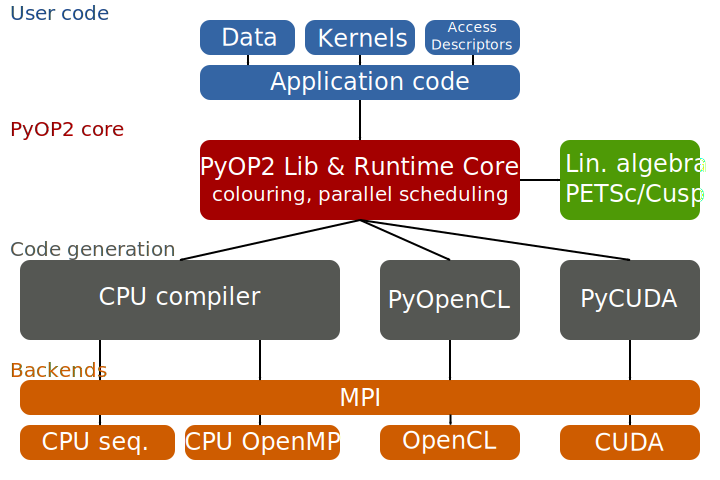

.. _architecture:

PyOP2 Architecture
==================

As described in :ref:`concepts`, PyOP2 exposes an API that allows users to
declare the topology of unstructured meshes in the form of :class:`Sets
<pyop2.Set>` and :class:`Maps <pyop2.Map>` and data in the form of
:class:`Dats <pyop2.Dat>`, :class:`Mats <pyop2.Mat>`, :class:`Globals
<pyop2.Global>` and :class:`Consts <pyop2.Const>`. Computations on this data
are described by :class:`Kernels <pyop2.Kernel>` described in :ref:`kernels`
and executed by :func:`parallel loops <pyop2.par_loop>`.

The API is the frontend to the PyOP2 runtime compilation architecture, which
supports the generation and just-in-time (JIT) compilation of low-level code
for a range of backends described in :doc:`backends` and the efficient
scheduling of parallel computations. A schematic overview of the PyOP2
architecture is given below:

  Schematic overview of the PyOP2 architecture

From an outside perspective, PyOP2 is a conventional Python library, with
performance critical library functions implemented in Cython_. A user's
application code makes calls to the PyOP2 API, most of which are conventional
library calls.  The exception are :func:`~pyop2.par_loop` calls, which
encapsulate PyOP2's runtime core functionality performing backend-specific
code generation.  Executing a parallel loop comprises the following steps:

1. Compute a parallel execution plan, including information for efficient
   staging of data and partitioning and colouring of the iteration set for
   conflict-free parallel execution.  This process is described in :doc:`plan`
   and does not apply to the sequential backend.
2. Generate backend-specific code for executing the computation for a given
   set of :func:`~pyop2.par_loop` arguments as detailed in :doc:`backends`
   according to the execution plan computed in the previous step.
3. Pass the generated code to a backend-specific toolchain for just-in-time
   compilation, producing a shared library callable as a Python module which
   is dynamically loaded. This module is cached on disk to save recompilation
   when the same :func:`~pyop2.par_loop` is called again for the same backend.
4. Build the backend-specific list of arguments to be passed to the generated
   code, which may initiate host to device data transfer for the CUDA and
   OpenCL backends.
5. Call into the generated module to perform the actual computation. For
   distributed parallel computations this involves separate calls for the
   regions owned by the current processor and the halo as described in
   :doc:`mpi`.
6. Perform any necessary reductions for :class:`Globals <pyop2.Global>`.
7. Call the backend-specific matrix assembly procedure on any
   :class:`~pyop2.Mat` arguments.

.. _backend-support:

Multiple Backend Support
------------------------

The backend is selected by passing the keyword argument ``backend`` to the
:func:`~pyop2.init` function.  If omitted, the ``sequential`` backend is
selected by default. This choice can be overridden by exporting the
environment variable ``PYOP2_BACKEND``, which allows switching backends
without having to touch the code. Once chosen, the backend cannot be changed
for the duration of the running Python interpreter session.

PyOP2 provides a single API to the user, regardless of which backend the
computations are running on. All classes and functions that form the public
API defined in :mod:`pyop2.op2` are interfaces, whose concrete implementations
are initialised according to the chosen backend. A metaclass takes care of
instantiating a backend-specific version of the requested class and setting
the corresponding docstrings such that this process is entirely transparent to
the user. The implementation of the PyOP2 backends is completely orthogonal to
the backend selection process and free to use established practices of
object-oriented design.

.. _Cython: http://cython.org
